# NeuroFlow AI — Agent Runtime Architecture Specification

**Document Version:** 1.0.0 (Approved Architecture Specification)  
**Status:** Approved Architecture Specification  
**Target Audience:** Lead Architects, Principal Engineers, AI Engineers, Domain Plugin Authors  
**Classification:** Core Platform Capability Architecture  

---

## 1. Why Agent Runtime is Required

NeuroFlow AI is a production-grade modular AI platform. Its domain plugins — Telecom Intelligence, Cybersecurity, Healthcare, Finance, Cloud Infrastructure, Enterprise AI, Research Assistants, and Autonomous AI Agents — each require not merely multi-step orchestration, but **autonomous intelligence**: the capacity to reason about a situation, dynamically select which capabilities to invoke, construct plans under uncertainty, adapt those plans as new information arrives, and take consequential actions in the world.

The Workflow Engine, already established in this platform, coordinates **declared execution flows** — workflows that a human or plugin author has explicitly designed in advance. The Agent Runtime solves a fundamentally different problem: **undeclared, emergent execution flows** where the sequence of actions cannot be fully specified at design time because it depends on the content of intermediate reasoning.

Without an Agent Runtime, the platform faces:

- **No autonomous reasoning** — every operation requires a pre-declared workflow. Open-ended tasks requiring judgment are impossible.
- **No dynamic tool selection** — tools are hard-coded into workflow steps. The platform cannot decide which tool is appropriate given the current context.
- **No multi-hop reasoning** — a single LLM call with static context cannot traverse multi-step inference chains that depend on prior intermediate results.
- **No reflective adaptation** — the platform cannot recognize that an action produced an unexpected result and adjust its approach accordingly.
- **No multi-agent collaboration** — there is no mechanism for one reasoning agent to delegate sub-tasks to specialized agents and synthesize their results.
- **No memory-grounded continuity** — agents cannot recall prior sessions, prior learnings, or prior operator corrections to improve future reasoning.
- **No long-horizon task execution** — complex enterprise tasks spanning hours or days cannot be managed as a coherent, goal-directed reasoning session.
- **Fragmented safety** — each plugin must implement its own guardrails, output validation, permission enforcement, and human approval integration.

The **Agent Runtime** is NeuroFlow AI's intelligence orchestration engine. It manages the complete lifecycle of every AI agent on the platform — from initialization through planning, context assembly, reasoning, tool execution, reflection, memory interaction, multi-agent collaboration, and graceful termination. Everything inside NeuroFlow AI that requires autonomous reasoning ultimately executes through the Agent Runtime.

### Core Capabilities Unlocked by the Agent Runtime

| Capability | Without Agent Runtime | With Agent Runtime |
| :--- | :--- | :--- |
| **Autonomous reasoning** | Not possible; all logic must be pre-declared. | Goal-directed multi-step reasoning with adaptive plan revision. |
| **Dynamic tool selection** | Hard-coded tool sequences in workflow definitions. | Runtime semantic tool matching against the goal and current context. |
| **Multi-hop inference** | Single LLM call with static prompt. | Iterative Observe→Think→Act→Reflect cycles building on prior outputs. |
| **Memory continuity** | Each invocation is stateless. | Episodic, semantic, procedural, and working memory integration. |
| **Multi-agent delegation** | Single-agent only; no collaboration model. | First-class orchestrator/sub-agent delegation with result synthesis. |
| **Safety enforcement** | Ad-hoc per-plugin guardrails. | Unified Safety & Guardrail Pipeline applied to every agent action. |
| **Human-in-the-loop** | Manual workflow step insertion. | First-class approval pause with context presentation and escalation. |
| **Cost governance** | No tracking. | Per-session token budget enforcement with hard stop on breach. |
| **Observability** | Scattered plugin logs. | Full distributed traces across every reasoning step, tool call, and agent hop. |

---

## 2. Distinction Between Related Platform Concepts

Precise concept boundaries are essential to prevent architectural confusion across all teams building on NeuroFlow AI.

| Concept | Nature | Scope | Primary Role |
| :--- | :--- | :--- | :--- |
| **Agent** | An autonomous reasoning entity with a defined goal, capability set, and identity. | Per-session, per-tenant. | Executes a goal through iterative reasoning cycles using tools, memory, and knowledge. |
| **Agent Runtime** *(This Layer)* | The intelligence orchestration engine that manages all agents. | Platform-level, domain-agnostic. | Governs agent lifecycle, reasoning loops, context assembly, tool execution, memory access, safety, and multi-agent collaboration. |
| **Workflow** | A declarative, pre-specified multi-step execution plan authored in the Workflow DSL. | Per-business-process. | Coordinates known sequences of platform operations. The Agent Runtime is invoked as one task within a Workflow (`AGENT_EXECUTION`). |
| **Tool** | A discrete, typed capability that an agent can invoke at runtime to act upon the world or retrieve information. | Per-invocation. | Exposes a named function (e.g., `graph_search`, `run_sql_query`, `send_alert`) with a defined input/output schema to the agent's tool-selection engine. |
| **LLM** | A large language model serving as the cognitive reasoning substrate. | Per-inference-call. | Generates text, plans, tool calls, and reflections in response to an assembled prompt. It is a stateless transformer; the Agent Runtime provides all state management around it. |
| **Plugin** | A domain-specific module (Telecom, Cybersecurity, Healthcare, etc.) that registers agents, tools, workflows, and ontologies with the platform. | Domain-scoped. | Contributes domain intelligence without touching platform runtime internals. |

### The Critical Distinctions

```
+-----------------------------------------------------------------------------------+
|  AGENT RUNTIME                          WORKFLOW ENGINE                           |
|  - Autonomous reasoning loop.           - Declarative orchestration.              |
|  - Decides WHAT to do next.             - Executes WHAT was declared.             |
|  - Goal-directed, emergent plans.       - Task-graph driven, pre-specified.       |
|  - Dynamic tool selection.              - Static task-type assignment.            |
|  - Single agent reasoning session.      - Multi-step business process instance.   |
|  - Invoked BY the Workflow Engine.      - Invokes the Agent Runtime as a task.    |
+-----------------------------------------------------------------------------------+

+-----------------------------------------------------------------------------------+
|  AGENT                                  AGENT RUNTIME                             |
|  - A reasoning entity with a goal.      - The engine that runs the agent.         |
|  - Has an identity, a domain, tools.    - Provides lifecycle, state, safety.      |
|  - Like a "process" in an OS.           - Like the "OS kernel" that manages it.   |
+-----------------------------------------------------------------------------------+

+-----------------------------------------------------------------------------------+
|  LLM                                    AGENT RUNTIME                             |
|  - Stateless language model.            - Stateful orchestration engine.          |
|  - Accepts a prompt, returns text.      - Assembles prompts, parses results.      |
|  - No memory, no tools, no goals.       - Manages memory, tools, and goals.       |
|  - One call = one inference.            - One session = many LLM calls.           |
+-----------------------------------------------------------------------------------+

+-----------------------------------------------------------------------------------+
|  TOOL                                   AGENT RUNTIME                             |
|  - A callable capability.               - The engine that selects & calls tools.  |
|  - Input/output schema defined.         - Enforces permissions, retries, safety.  |
|  - Knows nothing about reasoning.       - Orchestrates all tool lifecycle.        |
+-----------------------------------------------------------------------------------+
```

---

## 3. High-Level Agent Runtime Architecture

The Agent Runtime operates as a fifteen-subsystem platform capability within **Platform Runtime (Layer 3)**, co-located with the Workflow Engine, Knowledge Base, Knowledge Graph, and Memory Layer:

```
+-----------------------------------------------------------------------------------+
|                       AGENT RUNTIME ARCHITECTURE OVERVIEW                         |
+-----------------------------------------------------------------------------------+
|                                                                                   |
|  Input: AgentExecutionRequest (goal, inputs, agent_id, session_id, context)       |
|              |                                                                    |
|              v                                                                    |
|  +---------------------------+                                                    |
|  |  1. AGENT REGISTRY        |   Agent Definition Catalog + Capability Manifest  |
|  +-----------+---------------+                                                    |
|              |                                                                    |
|              v                                                                    |
|  +---------------------------+                                                    |
|  |  2. SESSION MANAGER       |   Session Lifecycle + Long-Running Persistence     |
|  +-----------+---------------+                                                    |
|              |                                                                    |
|              v                                                                    |
|  +---------------------------+                                                    |
|  |  3. CONTEXT ASSEMBLER     |   Memory + KB + KG + Conversation + Token Budget  |
|  +-----------+---------------+                                                    |
|              |                                                                    |
|              v                                                                    |
|  +---------------------------+                                                    |
|  |  4. PROMPT ASSEMBLER      |   System Prompt + Context + Tool Schemas + Goal   |
|  +-----------+---------------+                                                    |
|              |                                                                    |
|              v                                                                    |
|  +---------------------------+                                                    |
|  |  5. PLANNING ENGINE       |   Goal Decomposition + Plan Generation + ReACT    |
|  +-----------+---------------+                                                    |
|              |                                                                    |
|              v                                                                    |
|  +---------------------------+                                                    |
|  |  6. REASONING LOOP        |   Observe --> Think --> Act --> Reflect Cycles     |
|  +-----------+---------------+                                                    |
|              |                                                                    |
|              v                                                                    |
|  +---------------------------+                                                    |
|  |  7. TOOL EXECUTION ENGINE |   Tool Selection + Permission + Retry + Sandbox   |
|  +-----------+---------------+                                                    |
|              |                                                                    |
|              v                                                                    |
|  +---------------------------+                                                    |
|  |  8. REFLECTION ENGINE     |   Output Evaluation + Plan Revision + Learning    |
|  +-----------+---------------+                                                    |
|              |                                                                    |
|              v                                                                    |
|  +---------------------------+                                                    |
|  |  9. MEMORY INTEGRATOR     |   Read / Write Episodic, Semantic, Procedural     |
|  +-----------+---------------+                                                    |
|              |                                                                    |
|              v                                                                    |
|  +---------------------------+                                                    |
|  | 10. MULTI-AGENT BROKER    |   Delegation + Collaboration + Result Synthesis   |
|  +-----------+---------------+                                                    |
|              |                                                                    |
|              v                                                                    |
|  +---------------------------+                                                    |
|  | 11. SAFETY PIPELINE       |   Pre-Action + Post-Output Guardrails + HITL      |
|  +-----------+---------------+                                                    |
|              |                                                                    |
|              v                                                                    |
|  +---------------------------+                                                    |
|  | 12. COST CONTROLLER       |   Token Budget + LLM Cost + Per-Session Limits    |
|  +-----------+---------------+                                                    |
|              |                                                                    |
|              v                                                                    |
|  +---------------------------+                                                    |
|  | 13. STREAMING EMITTER     |   SSE / WebSocket Progressive Output Streaming    |
|  +-----------+---------------+                                                    |
|              |                                                                    |
|              v                                                                    |
|  +---------------------------+                                                    |
|  | 14. EVENT BUS INTEGRATOR  |   Lifecycle Events + Trigger Subscriptions        |
|  +-----------+---------------+                                                    |
|              |                                                                    |
|              v                                                                    |
|  +---------------------------+                                                    |
|  | 15. OBSERVABILITY ENGINE  |   Traces + Metrics + Structured Logs              |
|  +---------------------------+                                                    |
|                                                                                   |
|  Output: AgentExecutionResult (final_answer, artifacts, memory_writes, trace_id) |
+-----------------------------------------------------------------------------------+
```

---

## 4. Agent Lifecycle

Every agent instance on NeuroFlow AI progresses through a deterministic lifecycle from registration through termination:

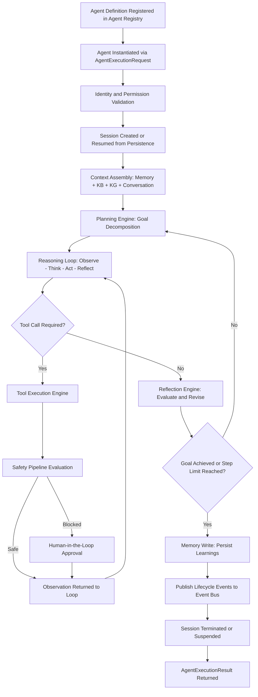

### Lifecycle Stage Definitions

| Stage | Description |
| :--- | :--- |
| **Registered** | An agent definition (goal template, tool manifest, memory config, LLM binding) is stored in the Agent Registry. No execution yet. |
| **Instantiated** | An `AgentExecutionRequest` creates an in-memory agent instance bound to a specific session and tenant. |
| **Authorized** | The agent's identity and capability manifest are validated against the Permission & Capability Model. |
| **Session Active** | A session record is created (new) or restored from persistence (resume). Working memory is initialized. |
| **Context Assembly** | The Context Assembler retrieves episodic memory, semantic memory, KB chunks, KG subgraph, and conversation history into an assembled context payload. |
| **Planning** | The Planning Engine decomposes the goal into an initial plan — a prioritized sequence of reasoning steps and anticipated tool invocations. |
| **Reasoning Loop** | The agent iterates through Observe → Think → Act → Reflect cycles, calling tools and updating its internal understanding. |
| **Suspended** | For long-running sessions, the agent state is checkpointed and execution pauses without consuming compute resources. |
| **Terminated** | Execution is complete (goal achieved, step budget exhausted, unrecoverable error, or explicit cancellation). Learnings are written to memory. |

---

## 5. Agent State Machine

The Agent State Machine governs all valid state transitions at the agent session level:

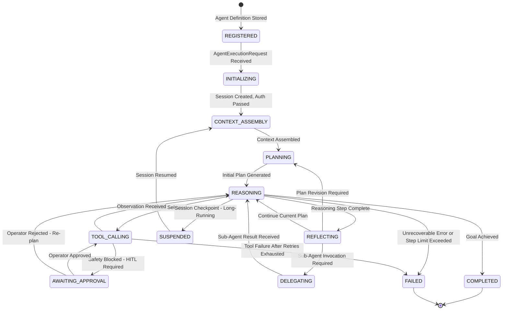

### Invalid Transition Rules

- `COMPLETED → REASONING`: Forbidden. Completed sessions are immutable; a new session must be created.
- `FAILED → REASONING`: Forbidden. Failed sessions cannot be resumed; diagnostics must be reviewed before a new invocation.
- `SUSPENDED → PLANNING`: Forbidden. Resumed sessions always re-enter `CONTEXT_ASSEMBLY` to refresh stale context.
- `DELEGATING → TOOL_CALLING`: Forbidden. Sub-agent delegation is resolved before the orchestrating agent may take further actions.

---

## 6. Agent Execution Pipeline

The end-to-end agent execution pipeline integrates all fifteen subsystems in a defined processing sequence:

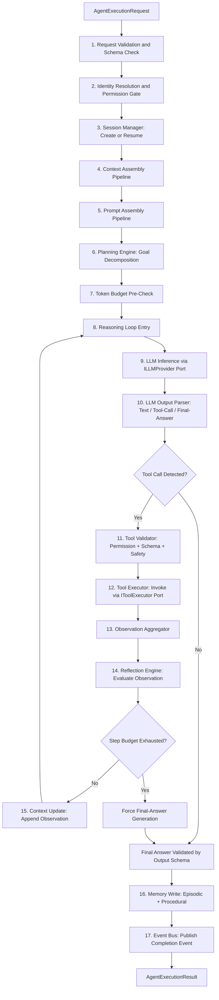

---

## 7. Planning Engine

The Planning Engine is responsible for decomposing an agent's goal into a structured, executable plan before the reasoning loop begins, and for revising that plan when reflection reveals the current approach is insufficient.

```
+-----------------------------------------------------------------------------------+
|                         PLANNING ENGINE ARCHITECTURE                              |
+-----------------------------------------------------------------------------------+
|                                                                                   |
|  Input: Goal statement + Assembled context + Available tool manifest              |
|              |                                                                    |
|              v                                                                    |
|  +---------------------------+                                                    |
|  |  1. GOAL ANALYZER         |   Parse goal intent, constraints, success criteria|
|  +-----------+---------------+                                                    |
|              |                                                                    |
|              v                                                                    |
|  +---------------------------+                                                    |
|  |  2. SUB-GOAL DECOMPOSER   |   Break goal into ordered sub-goal sequence       |
|  +-----------+---------------+                                                    |
|              |                                                                    |
|              v                                                                    |
|  +---------------------------+                                                    |
|  |  3. TOOL ANTICIPATOR      |   Predict likely tool needs per sub-goal          |
|  +-----------+---------------+                                                    |
|              |                                                                    |
|              v                                                                    |
|  +---------------------------+                                                    |
|  |  4. PLAN VALIDATOR        |   Check tool availability + permission scope      |
|  +-----------+---------------+                                                    |
|              |                                                                    |
|              v                                                                    |
|  +---------------------------+                                                    |
|  |  5. STEP BUDGET ESTIMATOR |   Estimate reasoning steps + token cost estimate  |
|  +-----------+---------------+                                                    |
|              |                                                                    |
|              v                                                                    |
|  AgentPlan { steps[], estimated_steps, tool_budget, revision_count }             |
+-----------------------------------------------------------------------------------+
```

### Planning Strategies

| Strategy | Description | When Applied |
| :--- | :--- | :--- |
| **ReACT** (Reasoning + Acting) | Interleaved reasoning traces and action calls; the plan is implicit in each reasoning step. | Default strategy for open-ended tasks. |
| **Plan-and-Execute** | Explicit multi-step plan generated upfront; each step executed sequentially with plan revision between steps. | Tasks with well-defined sequential sub-goals. |
| **Chain-of-Thought** | Extended reasoning traces before each action; no intermediate tool validation between reasoning steps. | Analytical tasks with low tool dependency. |
| **Multi-Agent Delegation** | Goal is decomposed into sub-goals; each sub-goal is delegated to a specialized agent; results are synthesized by the orchestrating agent. | Complex, multi-domain tasks exceeding a single agent's tool scope. |
| **Tree-of-Thought** | Multiple candidate plans are explored in parallel; the most promising branch is selected by scoring. | High-stakes tasks where plan quality is critical and compute budget allows exploration. |

### Plan Revision Triggers

- Reflection Engine determines that the current plan sub-goal is blocked (tool failed, information unavailable).
- Observation received from a tool contradicts a planning assumption.
- Safety Pipeline blocks a planned tool invocation and an alternative approach must be found.
- Step budget is approaching the limit and remaining sub-goals must be prioritized.

---

## 8. Reasoning Loop

The Reasoning Loop is the core iterative engine of every agent session. It drives the agent through successive cognitive cycles until the goal is achieved or the session is terminated.

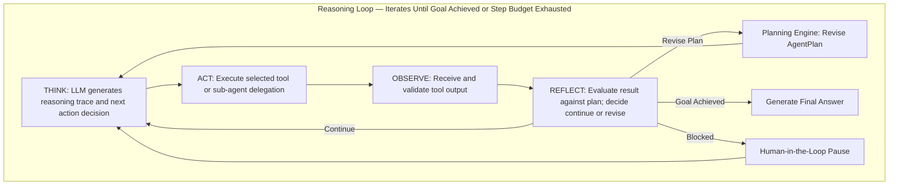

### Reasoning Loop Properties

| Property | Description |
| :--- | :--- |
| `max_reasoning_steps` | Hard ceiling on total loop iterations per session. Prevents infinite loops. |
| `max_consecutive_tool_failures` | Maximum consecutive tool failures before automatic escalation or termination. |
| `step_timeout_seconds` | Maximum wall-clock time allowed for a single THINK + ACT cycle. |
| `loop_trace_id` | OpenTelemetry span ID for the full reasoning loop, enabling per-step trace attribution. |

---

## 9. Observation Cycle (Observe → Think → Act → Reflect)

The four-phase Observation Cycle is the cognitive unit of the Agent Runtime. Each iteration of the reasoning loop executes exactly one complete Observation Cycle.

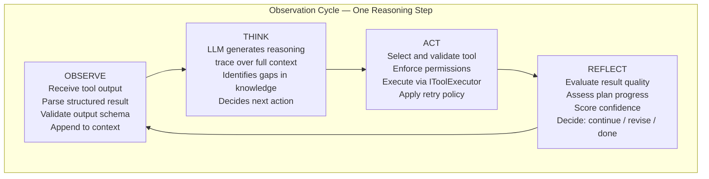

### Phase Responsibilities

**OBSERVE:**
- Parse and validate the structured output of the previous tool call (or the initial task inputs on cycle 1).
- Normalize the observation into the Observation Schema (`observation_id`, `tool_id`, `content`, `confidence`, `timestamp`).
- Append the observation to the rolling Context Window with source attribution.
- Detect and flag anomalous observations (e.g., empty results, error payloads, schema mismatches).

**THINK:**
- The assembled context — system prompt, plan, conversation history, all prior observations, memory retrievals, and current tool manifest — is forwarded to the LLM via `ILLMProvider`.
- The LLM generates a structured reasoning trace: a chain-of-thought paragraph followed by either a `tool_call` action directive or a `final_answer` directive.
- The reasoning trace is parsed, validated, and structured into an `AgentThought` object.

**ACT:**
- The `tool_call` directive is routed to the Tool Execution Engine.
- The selected tool is validated against the agent's permission scope and the Tool Registry.
- Input arguments are validated against the tool's `InputSchema`.
- The Safety Pipeline performs pre-action evaluation before the tool is invoked.
- The tool is executed via the `IToolExecutor` port with retry logic applied on transient failure.

**REFLECT:**
- The reflection engine evaluates the observation quality: Does it advance the plan? Does it resolve the current sub-goal? Does it contradict a prior assumption?
- A `ReflectionScore` (0.0–1.0) is computed based on relevance, completeness, and alignment with the current sub-goal.
- If the score falls below `PLAN_REVISION_THRESHOLD` (default: 0.4), the Planning Engine is invoked to revise the current plan.
- If the score meets `GOAL_ACHIEVED_THRESHOLD` (default: 0.9) and no open sub-goals remain, the loop exits with a `final_answer` directive.
- All reflection metadata is appended to the session trace for observability.

---

## 10. Reflection Engine

The Reflection Engine is the quality assurance and self-correction mechanism of the Agent Runtime. It evaluates every observation against the current plan, scores progress toward the goal, and triggers plan revision when the current approach is failing.

```
+-----------------------------------------------------------------------------------+
|                         REFLECTION ENGINE ARCHITECTURE                            |
+-----------------------------------------------------------------------------------+
|                                                                                   |
|  Input: Observation + Current AgentPlan + Full Context + Goal                    |
|              |                                                                    |
|              v                                                                    |
|  +---------------------------+                                                    |
|  |  1. RELEVANCE SCORER      |   Is this observation relevant to the current     |
|  |                           |   sub-goal? (semantic similarity + plan alignment)|
|  +-----------+---------------+                                                    |
|              |                                                                    |
|              v                                                                    |
|  +---------------------------+                                                    |
|  |  2. CONTRADICTION DETECTOR|   Does this observation contradict any prior      |
|  |                           |   observation or stated assumption in the plan?   |
|  +-----------+---------------+                                                    |
|              |                                                                    |
|              v                                                                    |
|  +---------------------------+                                                    |
|  |  3. COMPLETENESS ASSESSOR |   Is the current sub-goal sufficiently addressed  |
|  |                           |   or is additional information required?          |
|  +-----------+---------------+                                                    |
|              |                                                                    |
|              v                                                                    |
|  +---------------------------+                                                    |
|  |  4. CONFIDENCE INTEGRATOR |   Accumulate confidence score across all          |
|  |                           |   observations related to this sub-goal           |
|  +-----------+---------------+                                                    |
|              |                                                                    |
|              v                                                                    |
|  +---------------------------+                                                    |
|  |  5. DECISION CLASSIFIER   |   Output: CONTINUE / REVISE / ACHIEVE / ESCALATE |
|  +-----------+---------------+                                                    |
|              |                                                                    |
|              v                                                                    |
|  ReflectionResult { decision, score, reasoning_trace, revision_directive }       |
+-----------------------------------------------------------------------------------+
```

### Reflection Decision Taxonomy

| Decision | Condition | Consequence |
| :--- | :--- | :--- |
| `CONTINUE` | Observation advances current sub-goal; confidence score above threshold. | Reasoning loop continues with next cycle. |
| `REVISE` | Observation fails to advance sub-goal; score below `PLAN_REVISION_THRESHOLD`. | Planning Engine invoked to revise or replace current plan. |
| `ACHIEVE` | All sub-goals resolved; overall confidence meets `GOAL_ACHIEVED_THRESHOLD`. | Reasoning loop exits; final answer generation begins. |
| `ESCALATE` | Multiple consecutive `REVISE` decisions; plan revision has not unlocked progress. | Human-in-the-Loop pause or agent failure with diagnostic trace. |
| `DELEGATE` | Current sub-goal requires capabilities outside this agent's tool manifest. | Multi-Agent Broker invoked to delegate to a specialized sub-agent. |

### Retrospective Learning

After each session, the Reflection Engine generates a `RetrospectiveSummary`:
- Which plan strategies succeeded.
- Which tool calls produced high-value observations.
- Which sub-goals were hardest to satisfy.
- Suggested improvements for future invocations.

The `RetrospectiveSummary` is written to Procedural Memory, enabling the agent to improve its planning strategy over subsequent sessions without requiring model retraining.

---

## 11. Context Assembly Pipeline

The Context Assembly Pipeline constructs the complete reasoning context that will be passed to the Prompt Assembler before each LLM inference call. It integrates all sources of relevant knowledge — memory, knowledge base, knowledge graph, and conversation history — while respecting the active Token Budget.

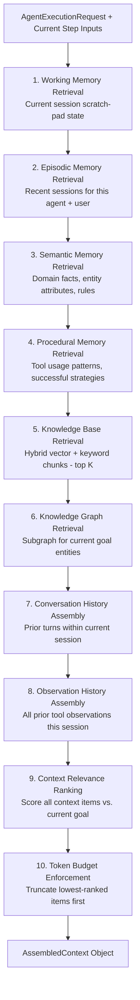

### Context Component Priority (Highest to Lowest)

| Priority | Context Component | Rationale |
| :--- | :--- | :--- |
| 1 | System prompt + agent identity | Foundational instruction; never truncated. |
| 2 | Current goal + active sub-goal | The agent must always know what it is trying to achieve. |
| 3 | Working memory (current session state) | Most immediately relevant reasoning state. |
| 4 | Recent observations (last 3 cycles) | Critical for ReACT-style continuity. |
| 5 | Conversation history (last N turns) | User intent and operator corrections. |
| 6 | Procedural memory (relevant strategies) | Informs tool selection and approach. |
| 7 | Knowledge Base chunks (top K ranked) | Domain knowledge grounding. |
| 8 | Knowledge Graph subgraph | Structural entity relationships. |
| 9 | Episodic memory (past sessions) | Longer-term experiential context. |
| 10 | Semantic memory (general domain facts) | Background domain knowledge; lowest priority. |

---

## 12. Prompt Assembly Pipeline

The Prompt Assembly Pipeline transforms the `AssembledContext` into a fully formed, LLM-ready prompt. It is the final stage between context retrieval and LLM inference.

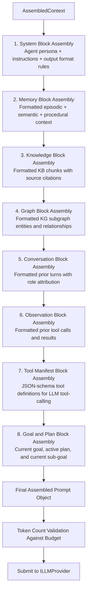

### Prompt Block Specifications

| Block | Contents | Max Tokens (Default) |
| :--- | :--- | :--- |
| **System Block** | Role definition, output format constraints, safety rules, response language. | 512 |
| **Memory Block** | Formatted episodic and semantic memory retrievals. | 1,024 |
| **Knowledge Block** | Ranked KB chunks with `[Source: doc_id, chunk_id]` citations. | 2,048 |
| **Graph Block** | Serialized KG subgraph: `(EntityA) --[RELATION]--> (EntityB)` triples with confidence. | 1,024 |
| **Conversation Block** | Prior conversation turns, formatted as `[ROLE]: content`. | 2,048 |
| **Observation Block** | Prior tool calls and results: `[TOOL: tool_name] Input: ... Result: ...`. | 2,048 |
| **Tool Manifest Block** | JSON Schema definitions for all permitted tools. | 2,048 |
| **Goal & Plan Block** | Goal statement, plan step list, active sub-goal, revision count. | 512 |

---

## 13. Conversation Context Management

The Conversation Context Manager maintains the full history of interactions within a single agent session, enabling coherent multi-turn reasoning and operator correction integration.

```
+-----------------------------------------------------------------------------------+
|                    CONVERSATION CONTEXT MANAGEMENT                                |
+-----------------------------------------------------------------------------------+
|                                                                                   |
|  CONVERSATION TURN SCHEMA:                                                        |
|  {                                                                                |
|    "turn_id":      UUID,                                                          |
|    "session_id":   UUID,                                                          |
|    "role":         "USER" | "AGENT" | "TOOL" | "OPERATOR" | "SYSTEM",            |
|    "content":      string,                                                        |
|    "timestamp":    ISO8601,                                                        |
|    "tokens":       integer,                                                        |
|    "metadata":     { tool_id?, tool_result_status?, operator_action? }           |
|  }                                                                                |
|                                                                                   |
|  MANAGEMENT STRATEGIES:                                                           |
|  1. SLIDING WINDOW: Retain the most recent N tokens of conversation history.     |
|     Oldest turns are evicted first when the window budget is exceeded.           |
|                                                                                   |
|  2. SUMMARIZATION COMPRESSION: Before evicting old turns, the Conversation       |
|     Manager invokes a summarization LLM call to compress the oldest turn         |
|     block into a compact summary turn. The summary preserves key decisions,      |
|     corrections, and tool outcomes without the full verbatim content.            |
|                                                                                   |
|  3. PINNED TURNS: Certain turns are pinned and never evicted:                    |
|     - The original goal statement (turn 1).                                       |
|     - All operator corrections (role = "OPERATOR").                              |
|     - The most recent plan revision (role = "SYSTEM" with plan payload).         |
|                                                                                   |
|  4. CROSS-SESSION CONTINUITY: When a session is resumed after suspension,       |
|     the Conversation Manager reconstructs the conversation from the Session      |
|     Persistence store, applying the full sliding window budget.                  |
+-----------------------------------------------------------------------------------+
```

---

## 14. Token Budget Management

Every agent session operates under a strict **Token Budget** — the maximum number of tokens that may be consumed across all LLM calls within the session.

```
+-----------------------------------------------------------------------------------+
|                         TOKEN BUDGET MANAGEMENT                                   |
+-----------------------------------------------------------------------------------+
|                                                                                   |
|  SESSION TOKEN BUDGET STRUCTURE:                                                  |
|  {                                                                                |
|    "session_token_budget":    integer,    // Total tokens for the full session   |
|    "per_step_token_budget":   integer,    // Max tokens per single reasoning step|
|    "context_token_budget":    integer,    // Max tokens for assembled context    |
|    "tool_call_token_budget":  integer,    // Max tokens for tool input + output  |
|    "tokens_consumed":         integer,    // Running total consumed this session |
|    "tokens_remaining":        integer,    // Budget remaining                    |
|    "budget_source": "AGENT_DEFINITION" | "WORKFLOW_OVERRIDE" | "TENANT_QUOTA"   |
|  }                                                                                |
|                                                                                   |
|  TOKEN BUDGET ENFORCEMENT STAGES:                                                 |
|  1. PRE-SESSION GATE: Validate that session_token_budget <= tenant_token_quota.  |
|  2. PRE-STEP GATE: Validate that tokens_remaining >= min_step_reserve.           |
|  3. CONTEXT ASSEMBLY GATE: Enforce context_token_budget during assembly.         |
|     Truncate lowest-priority context items first (see Section 11 priority order).|
|  4. PROMPT GATE: Validate final assembled prompt token count before submission.  |
|  5. POST-CALL ACCOUNTING: Record actual tokens consumed (prompt + completion).   |
|  6. BUDGET BREACH HANDLING:                                                       |
|     - SOFT LIMIT (80%): Warn in session trace; begin aggressive context pruning. |
|     - HARD LIMIT (100%): Force final-answer generation with current context;     |
|       do not submit further LLM calls.                                           |
+-----------------------------------------------------------------------------------+
```

---

## 15. Context Window Optimization

Context window optimization ensures the highest-quality reasoning context is presented to the LLM within the available token budget.

### Optimization Techniques

| Technique | Description | When Applied |
| :--- | :--- | :--- |
| **Relevance-Ranked Truncation** | Score all context items against the current sub-goal using embedding similarity; drop lowest-scoring items when budget is tight. | Every context assembly cycle. |
| **Observation Summarization** | Compress prior tool observations older than 3 cycles into a single summary block. | When observation history exceeds 512 tokens. |
| **Conversation Compression** | Summarize conversation turns older than the last 5 into a compact narrative block. | When conversation exceeds 2,048 tokens. |
| **KG Subgraph Pruning** | Extract only the minimum spanning subgraph for entities directly relevant to the current sub-goal. | When KG subgraph exceeds 1,024 tokens. |
| **KB Chunk Re-Ranking** | Re-run KB retrieval using the current sub-goal (not the original goal) as the query; replace initial chunks with sub-goal-specific chunks. | On each plan revision. |
| **Procedural Memory Filtering** | Include only procedural memory items related to tools listed in the current plan's anticipated tool set. | Always. |
| **Dead Context Eviction** | Remove context items from sub-goals that have been fully resolved (marked `ACHIEVED` in the plan). | After each reflection cycle. |

---

## 16. Memory Layer Integration

The Agent Runtime integrates with the Memory Layer across all four memory tiers throughout the agent session lifecycle.

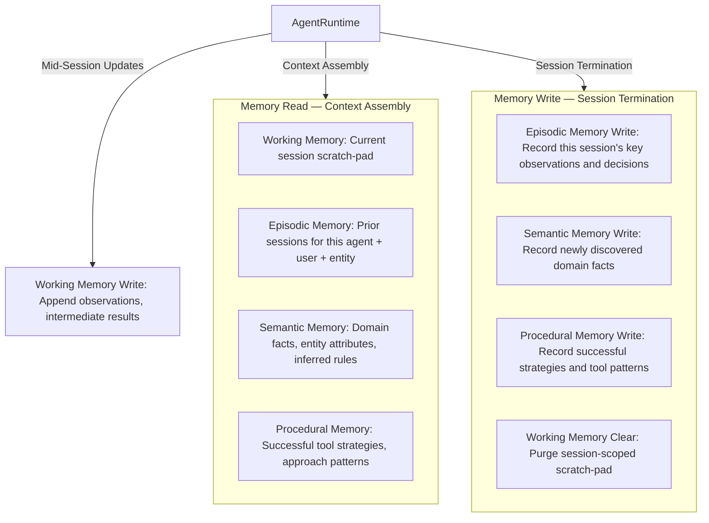

### Memory Access Patterns

| Access Pattern | Trigger | Memory Tier | Operation |
| :--- | :--- | :--- | :--- |
| **Goal-Grounded Retrieval** | Context assembly at session start. | Episodic + Semantic + Procedural | Read: retrieve top-K relevant memories by embedding similarity to goal. |
| **Entity-Anchored Retrieval** | Context assembly when KG entities are extracted. | Semantic | Read: retrieve entity-specific facts for all entities in current plan. |
| **Strategy Recall** | Planning phase; tool anticipation step. | Procedural | Read: retrieve prior successful strategies for similar goals. |
| **Scratchpad Write** | After each OBSERVE phase. | Working | Write: append observation and intermediate conclusions. |
| **Session Recording** | Session termination. | Episodic | Write: persist the full session summary, key decisions, final answer, and outcome. |
| **Fact Consolidation** | Post-reflection; when new factual claims are verified with high confidence. | Semantic | Write: store newly discovered and verified domain facts. |
| **Strategy Learning** | Post-session retrospective. | Procedural | Write: persist successful tool strategies and planning approaches. |

---

## 17. Knowledge Base Integration

The Agent Runtime integrates with the Knowledge Base as a primary grounding source during Context Assembly and as a live retrieval target during reasoning.

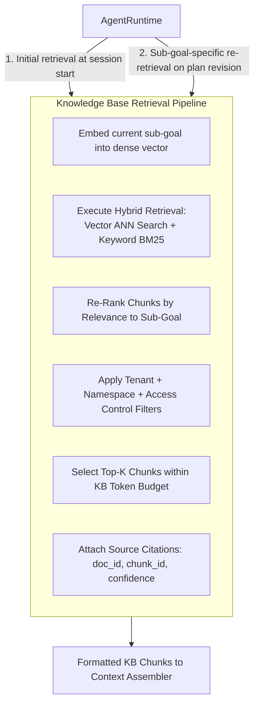

### Dynamic KB Re-Retrieval

Unlike the Workflow Engine — which performs a single `KB_RETRIEVAL` task at a defined point — the Agent Runtime supports **dynamic re-retrieval** during the reasoning loop:

- When the Planning Engine generates a plan revision, the KB is re-queried using the **revised sub-goal** as the query vector, ensuring the context reflects the updated reasoning direction.
- When a tool observation reveals a new entity or concept, a targeted KB retrieval is triggered for that entity to ground subsequent reasoning.

---

## 18. Knowledge Graph Integration

The Agent Runtime integrates with the Knowledge Graph to provide structural, relational, and explainable context that is unavailable in the Knowledge Base's document-chunk representation.

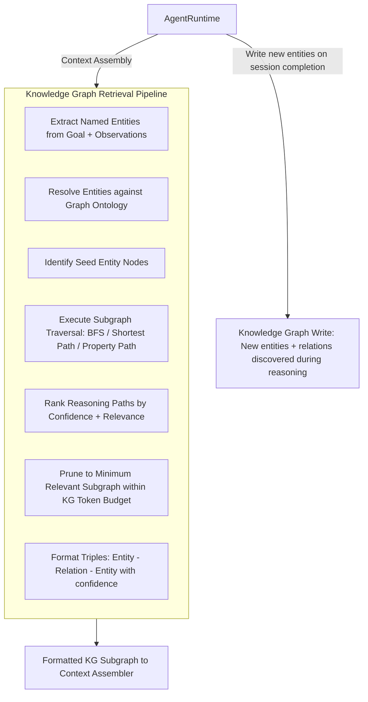

---

## 19. Graph-RAG Integration

Graph-RAG (Graph-Augmented Retrieval) is the advanced retrieval mode where Knowledge Graph structural context and Knowledge Base document chunks are jointly assembled into a unified reasoning context, enabling the LLM to reason over both document content and entity relationships simultaneously.

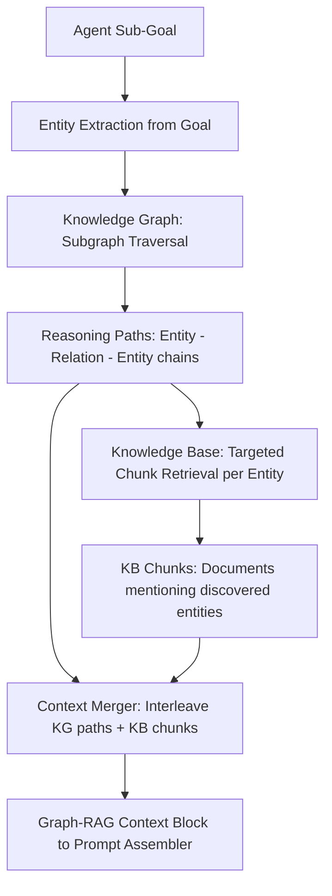

### Graph-RAG Advantages for Agent Reasoning

| Capability | Standard RAG (KB Only) | Graph-RAG (KB + KG) |
| :--- | :--- | :--- |
| **Entity relationship reasoning** | Impossible — chunks are unlinked fragments. | Full multi-hop entity traversal. |
| **Provenance tracing** | Document citation only. | Entity-level lineage with reasoning path. |
| **Cross-document synthesis** | Requires semantic similarity only. | Structural graph paths bridge disparate documents. |
| **Explainability** | LLM "black box." | Reasoning path is auditable as a graph traversal. |

---

## 20. Workflow Engine Integration

The Agent Runtime is invoked **by** the Workflow Engine (as an `AGENT_EXECUTION` task) and may itself invoke the Workflow Engine (to trigger multi-step workflows as a consequence of reasoning).

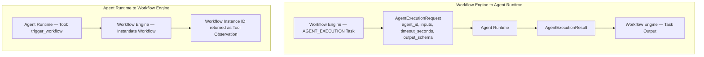

### Integration Contract

| Direction | Contract |
| :--- | :--- |
| **Workflow → Agent** | The Workflow Engine submits an `AgentExecutionRequest` via the `IAgentExecutor` port. The Agent Runtime executes asynchronously and returns an `AgentExecutionResult` to the task executor. |
| **Agent → Workflow** | The Agent Runtime invokes the `trigger_workflow` tool (registered in the Tool Registry), which calls `IWorkflowExecutor.trigger()` via the tool adapter. The workflow runs independently of the agent session. |

---

## 21. Tool Execution Integration

The Tool Execution Engine is the component responsible for managing the entire lifecycle of every tool call within an agent session: selection, permission enforcement, input validation, safety evaluation, invocation, retry, and result normalization.

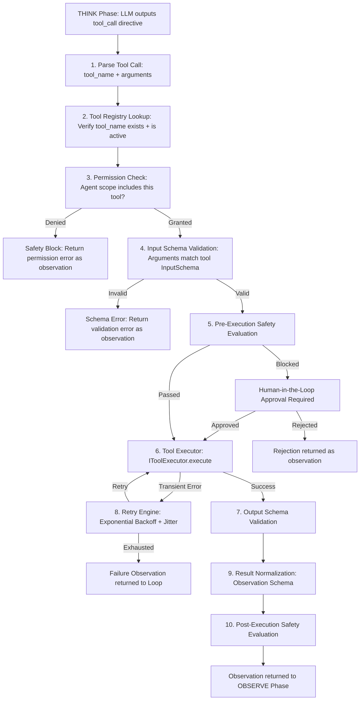

---

## 22. Tool Selection Strategy

The Tool Selection Strategy governs how the agent identifies and selects the most appropriate tool for a given reasoning step. This is not a random or brute-force enumeration — it is a structured semantic matching process.

```
+-----------------------------------------------------------------------------------+
|                       TOOL SELECTION STRATEGY                                     |
+-----------------------------------------------------------------------------------+
|                                                                                   |
|  PHASE 1: TOOL MANIFEST CONSTRUCTION                                              |
|  - At session initialization, the Tool Registry compiles the agent's permitted   |
|    tools into a Tool Manifest: the subset of all registered tools that this       |
|    agent is authorized to invoke, formatted as JSON Schema for LLM tool-calling. |
|                                                                                   |
|  PHASE 2: LLM-NATIVE TOOL CALLING                                                 |
|  - The assembled prompt includes the Tool Manifest in the tools/functions block. |
|  - The LLM generates a structured tool_call directive: tool name + typed args.   |
|  - The Agent Runtime does NOT require the LLM to select from a RAG-searched list.|
|  - The LLM has full visibility into all permitted tool schemas in-context.        |
|                                                                                   |
|  PHASE 3: TOOL PRIORITIZATION HINTS                                               |
|  - The Planning Engine annotates the current sub-goal with a list of anticipated |
|    tools. These hints are embedded in the Goal & Plan prompt block.              |
|  - This guides the LLM toward the most likely effective tools without forcing    |
|    a specific selection.                                                          |
|                                                                                   |
|  PHASE 4: TOOL FALLBACK CHAIN                                                     |
|  - Each tool in the registry may optionally declare a fallback_tool_id.          |
|  - If a tool fails after exhausting retries, the Tool Execution Engine            |
|    automatically invokes the fallback tool (if declared and permitted).           |
|                                                                                   |
|  PHASE 5: TOOL USAGE LEARNING                                                     |
|  - After each session, the Reflection Engine writes tool usage effectiveness     |
|    data to Procedural Memory. Future sessions retrieve this data and embed it    |
|    as a tool performance hint in the Tool Manifest block.                        |
+-----------------------------------------------------------------------------------+
```

---

## 23. Tool Registry

The Tool Registry is the authoritative catalog of all tools available on the NeuroFlow AI platform. It is a platform-level capability, not owned by any individual agent or plugin.

```
+-----------------------------------------------------------------------------------+
|                          TOOL REGISTRY ARCHITECTURE                               |
+-----------------------------------------------------------------------------------+
|                                                                                   |
|  TOOL DEFINITION SCHEMA:                                                          |
|  {                                                                                |
|    "tool_id":          string,       // Globally unique tool identifier           |
|    "name":             string,       // Human-readable name used in LLM manifest  |
|    "description":      string,       // Precise description for LLM selection     |
|    "namespace":        string,       // Platform or plugin namespace              |
|    "version":          SemVer,       // Tool implementation version               |
|    "category":         enum,         // KB | GRAPH | MEMORY | WORKFLOW | EXTERNAL |
|                                     // | COMPUTATION | COMMUNICATION | PLUGIN    |
|    "input_schema":     JSON Schema,  // Typed input argument specification        |
|    "output_schema":    JSON Schema,  // Typed output result specification         |
|    "required_scopes":  [string],     // Permission scopes required to invoke      |
|    "timeout_seconds":  integer,      // Execution timeout                         |
|    "retry_config":     RetryConfig,  // Tool-level retry policy                   |
|    "fallback_tool_id": string?,      // Optional fallback tool on failure         |
|    "safety_level":     enum,         // LOW | MEDIUM | HIGH | CRITICAL            |
|    "is_idempotent":    boolean,      // Whether repeated invocation is safe        |
|    "cost_per_call":    decimal?,     // Estimated cost for cost budgeting         |
|    "is_active":        boolean,      // Whether this tool is currently available   |
|    "executor_class":   string        // IToolExecutor implementation reference    |
|  }                                                                                |
|                                                                                   |
|  REGISTRY OPERATIONS:                                                             |
|  - register_tool(definition)                                                      |
|  - deactivate_tool(tool_id)                                                       |
|  - get_tool_manifest(agent_scope)                                                 |
|  - get_tool_by_id(tool_id)                                                        |
|  - list_tools_by_category(category)                                               |
|  - list_tools_by_namespace(namespace)                                             |
+-----------------------------------------------------------------------------------+
```

### Platform Built-in Tool Categories

| Category | Example Tools |
| :--- | :--- |
| **KB** | `kb_search`, `kb_retrieve_document`, `kb_list_namespaces` |
| **GRAPH** | `graph_entity_search`, `graph_subgraph_extract`, `graph_shortest_path` |
| **MEMORY** | `memory_read_episodic`, `memory_read_semantic`, `memory_write_episodic` |
| **WORKFLOW** | `workflow_trigger`, `workflow_get_status`, `workflow_cancel` |
| **COMPUTATION** | `run_python_expression`, `calculate_statistics`, `parse_json` |
| **COMMUNICATION** | `send_notification`, `send_email`, `post_webhook` |
| **EXTERNAL** | `http_get`, `http_post`, `query_database` |
| **PLUGIN** | Domain-registered tools: `telecom_alarm_lookup`, `cyber_threat_scan`, etc. |

---

## 24. Plugin Tool Architecture

Domain plugins extend the Tool Registry by registering plugin-specific tools during plugin initialization. The Agent Runtime never imports plugin code directly — all plugin tool invocations are dispatched through the `IToolExecutor` port.

```
+-----------------------------------------------------------------------------------+
|                        PLUGIN TOOL ARCHITECTURE                                   |
+-----------------------------------------------------------------------------------+
|                                                                                   |
|  PLUGIN TOOL REGISTRATION (at plugin load time):                                  |
|  context.agent_runtime.register_tool(                                             |
|    tool_id          = "telecom.alarm_severity_lookup",                            |
|    name             = "alarm_severity_lookup",                                    |
|    description      = "Retrieve severity classification for a network alarm",    |
|    namespace        = "telecom",                                                   |
|    input_schema     = AlarmSeverityInput,                                         |
|    output_schema    = AlarmSeverityOutput,                                        |
|    required_scopes  = ["TELECOM_READ"],                                           |
|    executor_class   = TelecomAlarmSeverityExecutor, // implements IToolExecutor  |
|    safety_level     = "MEDIUM"                                                    |
|  )                                                                                |
|                                                                                   |
|  PLUGIN TOOL INVOCATION FLOW:                                                     |
|  AgentRuntime --> IToolExecutor.execute(tool_id, args, context)                  |
|                   |                                                               |
|  [Tool Registry resolves executor_class]                                          |
|                   |                                                               |
|  TelecomAlarmSeverityExecutor.execute(args, context)                              |
|                   |                                                               |
|  Returns: ToolExecutionResult { output, status, latency_ms, cost }               |
|                                                                                   |
|  ISOLATION GUARANTEES:                                                            |
|  - Plugin tool executors receive only the scoped tenant context they need.       |
|  - Plugin tool executors cannot access another tenant's data.                    |
|  - Plugin tool executors cannot directly modify agent session state.             |
|  - Plugin tool executors are executed in sandboxed execution contexts.           |
+-----------------------------------------------------------------------------------+
```

---

## 25. Multi-Agent Collaboration

The Multi-Agent Broker enables complex reasoning tasks to be decomposed across multiple specialized agents that collaborate to produce a synthesized result.

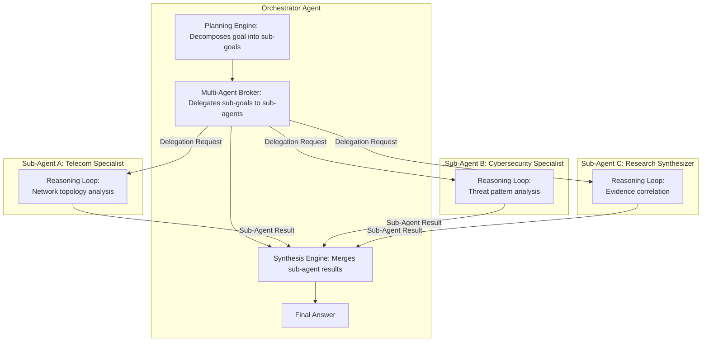

### Multi-Agent Collaboration Patterns

| Pattern | Description | Use Case |
| :--- | :--- | :--- |
| **Sequential Delegation** | Orchestrator delegates sub-goal A; receives result; delegates sub-goal B with result A as input. | Dependent analysis chains where each step builds on prior results. |
| **Parallel Delegation** | Orchestrator delegates multiple sub-goals concurrently; awaits all results; synthesizes. | Independent specialized analyses that can proceed simultaneously. |
| **Hierarchical Orchestration** | Orchestrator delegates to a sub-orchestrator that itself manages further sub-agents. | Deeply complex enterprise tasks requiring multi-tier decomposition. |
| **Peer Collaboration** | Two peer agents share observations via a shared working memory scope. | Joint analysis tasks where two domain specialists need to exchange findings. |

---

## 26. Agent-to-Agent Communication

Agent-to-Agent (A2A) Communication is the structured protocol by which agents exchange delegation requests and results.

```
+-----------------------------------------------------------------------------------+
|                    AGENT-TO-AGENT COMMUNICATION PROTOCOL                          |
+-----------------------------------------------------------------------------------+
|                                                                                   |
|  DELEGATION REQUEST SCHEMA:                                                       |
|  {                                                                                |
|    "delegation_id":     UUID,                                                     |
|    "orchestrator_id":   agent_session_id,                                         |
|    "sub_agent_id":      agent_definition_id,                                      |
|    "sub_goal":          string,              // The specific task to accomplish   |
|    "input_context":     AssembledContext,    // Relevant context from orchestrator|
|    "output_schema":     JSON Schema,         // Expected result schema            |
|    "timeout_seconds":   integer,                                                  |
|    "max_steps":         integer,                                                  |
|    "trace_parent":      SpanContext          // For distributed tracing           |
|  }                                                                                |
|                                                                                   |
|  DELEGATION RESULT SCHEMA:                                                        |
|  {                                                                                |
|    "delegation_id":     UUID,                                                     |
|    "status":            "SUCCEEDED" | "FAILED" | "TIMED_OUT",                    |
|    "result":            object,          // Validated against output_schema       |
|    "reasoning_summary": string,          // Human-readable summary of result      |
|    "observations_used": [ObservationRef],                                         |
|    "tokens_consumed":   integer,                                                  |
|    "duration_ms":       integer                                                   |
|  }                                                                                |
|                                                                                   |
|  COMMUNICATION CHANNEL:                                                           |
|  All A2A communication is mediated by the Multi-Agent Broker. Direct agent-to-   |
|  agent invocation without Broker mediation is forbidden. The Broker enforces:    |
|  - Delegation depth limits (default max_depth = 5)                               |
|  - Circular delegation detection (delegation loop guard)                          |
|  - Per-delegation token budget enforcement                                        |
|  - Full distributed trace propagation across all delegation hops                 |
+-----------------------------------------------------------------------------------+
```

---

## 27. Delegation Architecture

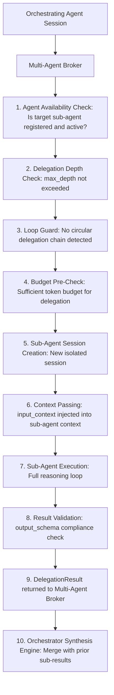

### Delegation Safety Rules

- **Depth Limit**: Maximum delegation depth of 5. Any attempt to exceed this limit returns a `DELEGATION_DEPTH_EXCEEDED` error to the orchestrator.
- **Loop Guard**: The Broker maintains a delegation chain registry per root session. Any delegation request that would create a cycle is rejected.
- **Budget Inheritance**: The orchestrator's remaining session token budget is partitioned between sub-agent delegations. Sub-agents cannot consume more than their allocated share.
- **Isolation**: Each sub-agent session runs in full isolation. Sub-agents cannot access the orchestrator's session memory or working context beyond what is explicitly passed in `input_context`.
- **Tenant Enforcement**: Sub-agents always execute under the same `tenant_id` as the orchestrator. Cross-tenant delegation is architecturally forbidden.

---

## 28. Human-in-the-Loop Integration

Human-in-the-Loop (HITL) is a first-class Agent Runtime capability. It allows agents to pause their execution, present a structured decision context to a human operator, and incorporate the operator's decision into the reasoning loop before proceeding.

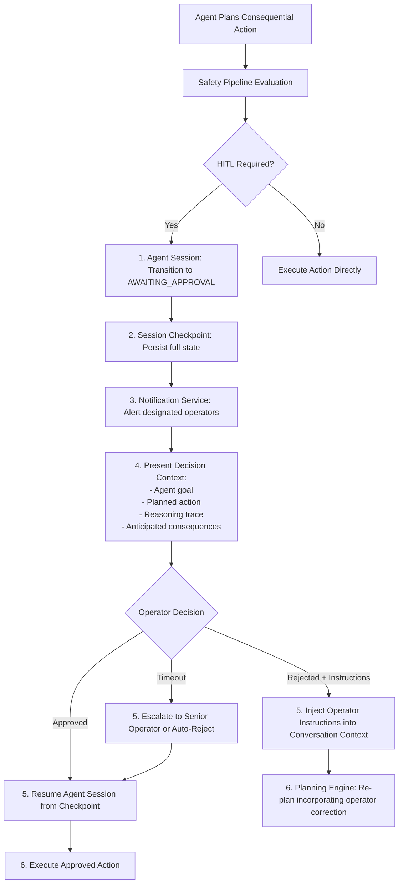

### HITL Triggers

| Trigger Type | Description |
| :--- | :--- |
| **Safety Level CRITICAL** | Tool marked `safety_level = "CRITICAL"` always requires human approval. |
| **Scope Escalation** | Agent attempts to invoke a tool outside its declared capability scope. |
| **High-Consequence Action** | Tool execution would trigger an irreversible real-world action (e.g., `send_email`, `execute_database_change`). |
| **Low Confidence** | Reflection Engine produces a final answer with overall confidence below `HITL_CONFIDENCE_THRESHOLD`. |
| **Operator-Configured** | Domain plugin or workflow configuration explicitly requires HITL for specific tool types. |
| **Anomalous Behavior** | Safety Pipeline detects unusual patterns in the agent's reasoning chain (e.g., prompt injection indicators). |

---

## 29. Safety & Guardrail Pipeline

The Safety & Guardrail Pipeline is a mandatory processing stage applied before every consequential agent action and after every LLM-generated output. It is independent of any domain plugin and enforces platform-wide safety guarantees.

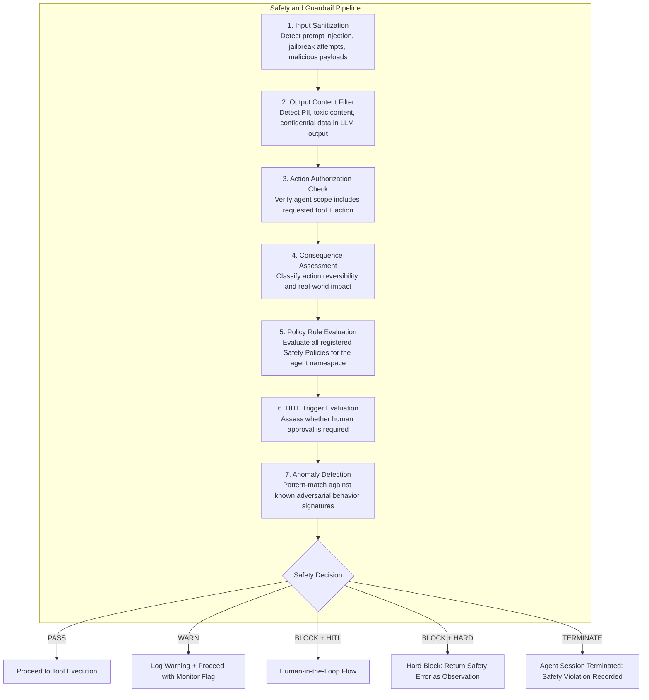

### Safety Policy Registration

Domain plugins and platform administrators register **Safety Policies** — named rule sets that are evaluated by the Safety Pipeline for agents operating within a specific namespace:

```
SafetyPolicy {
  policy_id:         UUID
  name:              string
  namespace:         string
  applies_to_tools:  [tool_id] | "*"
  rules:             [SafetyRule]
  enforcement_level: WARN | BLOCK_HITL | BLOCK_HARD | TERMINATE
}

SafetyRule {
  condition:         expression  // e.g., "output contains PII"
  action:            enforcement_level
  audit_required:    boolean
}
```

---

## 30. Permission & Capability Model

Every agent operates under a **Capability Manifest** — a scoped declaration of the tools, memory tiers, knowledge namespaces, and platform capabilities the agent is authorized to access. The Capability Manifest is validated at session initialization and enforced at every tool invocation.

```
+-----------------------------------------------------------------------------------+
|                      PERMISSION & CAPABILITY MODEL                                |
+-----------------------------------------------------------------------------------+
|                                                                                   |
|  CAPABILITY MANIFEST SCHEMA:                                                      |
|  {                                                                                |
|    "agent_id":            string,                                                 |
|    "tenant_id":           string,                                                 |
|    "tool_scopes":         [string],  // e.g., ["KB_READ", "GRAPH_READ",          |
|                                     //         "MEMORY_WRITE", "TELECOM_READ"]   |
|    "memory_scopes":       [string],  // e.g., ["EPISODIC_READ", "PROC_WRITE"]    |
|    "kb_namespaces":       [string],  // e.g., ["telecom", "shared"]              |
|    "graph_namespaces":    [string],  // e.g., ["telecom", "global"]              |
|    "plugin_scopes":       [string],  // e.g., ["telecom", "cybersecurity"]       |
|    "workflow_scopes":     [string],  // e.g., ["WORKFLOW_READ", "WORKFLOW_TRIGGER"]
|    "delegation_allowed":  boolean,   // Can this agent spawn sub-agents?          |
|    "max_delegation_depth": integer,                                               |
|    "hitl_bypass_allowed": boolean    // Can this agent skip HITL for LOW tools?  |
|  }                                                                                |
|                                                                                   |
|  ENFORCEMENT POINTS:                                                              |
|  1. Session Initialization: Full manifest validation against tenant RBAC store.  |
|  2. Tool Invocation: tool.required_scopes must be a subset of agent.tool_scopes. |
|  3. Memory Access: tier.required_scope must be in agent.memory_scopes.           |
|  4. KB Access: request.namespace must be in agent.kb_namespaces.                 |
|  5. Delegation: agent.delegation_allowed = true required.                        |
+-----------------------------------------------------------------------------------+
```

---

## 31. Cost Budgeting

The Agent Runtime integrates a Cost Budget Controller to govern the financial cost of LLM inference, tool invocations, and platform capability usage within each agent session.

```
+-----------------------------------------------------------------------------------+
|                         COST BUDGET CONTROLLER                                    |
+-----------------------------------------------------------------------------------+
|                                                                                   |
|  COST BUDGET SCHEMA:                                                              |
|  {                                                                                |
|    "session_cost_budget_usd":   decimal,  // Hard ceiling for this session       |
|    "llm_cost_per_1k_tokens":    decimal,  // Current rate for active LLM model   |
|    "tool_cost_per_call":        map,      // Per-tool cost estimate               |
|    "cost_consumed_usd":         decimal,  // Running total                       |
|    "cost_remaining_usd":        decimal,                                          |
|    "soft_limit_threshold":      0.80,     // Warn at 80% consumed                |
|    "hard_limit_action":         enum      // STOP | FORCE_FINAL | ESCALATE       |
|  }                                                                                |
|                                                                                   |
|  COST ACCOUNTING:                                                                 |
|  - LLM inference cost = (prompt_tokens + completion_tokens) x rate_per_1k       |
|  - Tool cost = tool.cost_per_call (from Tool Registry definition)                |
|  - All cost records are written to the session audit log per-call.               |
|                                                                                   |
|  COST BUDGET HIERARCHY (precedence, highest first):                              |
|  1. TENANT QUOTA: Maximum cost per tenant per time period.                       |
|  2. WORKFLOW OVERRIDE: Cost ceiling specified in the AGENT_EXECUTION task.       |
|  3. AGENT DEFINITION DEFAULT: Cost budget specified in the agent definition.     |
|  4. PLATFORM DEFAULT: System-wide default fallback.                              |
+-----------------------------------------------------------------------------------+
```

---

## 32. Retry Strategy

The Retry Strategy governs how the Agent Runtime handles transient failures in tool invocations and LLM inference calls.

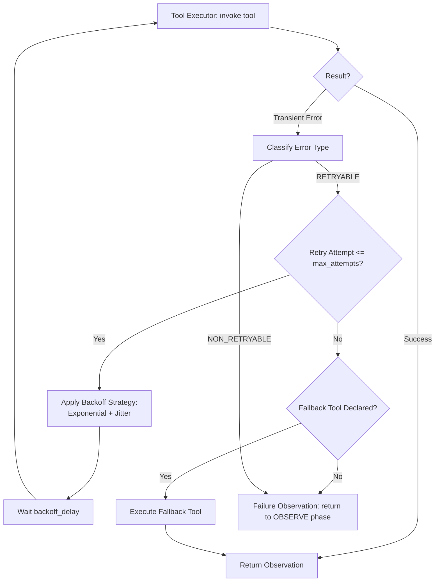

### Retry Configuration

| Property | Description | Default |
| :--- | :--- | :--- |
| `max_attempts` | Maximum total invocation attempts (including first attempt). | 3 |
| `backoff_strategy` | `FIXED` / `EXPONENTIAL` / `EXPONENTIAL_JITTER` | `EXPONENTIAL_JITTER` |
| `initial_delay_seconds` | Delay before first retry. | 1 |
| `max_delay_seconds` | Maximum backoff delay cap. | 30 |
| `retryable_error_types` | Error types eligible for retry. | `[TRANSIENT, TIMEOUT, RATE_LIMIT]` |

### Non-Retryable Failures

The following failure types are classified as **non-retryable** and immediately produce a Failure Observation:
- `SCHEMA_VALIDATION_ERROR` — Tool arguments do not conform to the declared `InputSchema`.
- `AUTHORIZATION_ERROR` — Agent lacks the required scope for this tool.
- `SAFETY_BLOCK_HARD` — Safety Pipeline issued a hard block.
- `TOOL_DISABLED` — Tool has been deactivated in the Tool Registry.
- `BUSINESS_RULE_VIOLATION` — Plugin-defined rule explicitly rejected the invocation.

---

## 33. Failure Recovery

The Agent Runtime employs a layered failure recovery strategy. No single failure should cause an irrecoverable session termination without operator visibility.

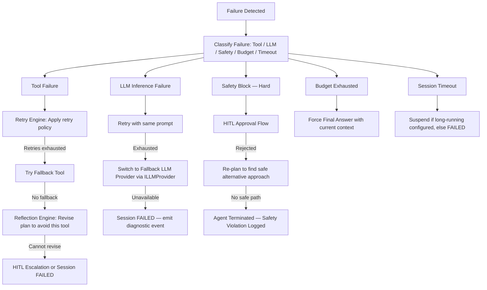

---

## 34. Long-Running Agent Sessions

Long-running agent sessions span extended durations — hours or days — and must survive platform restarts, infrastructure failures, and maintenance windows.

```
+-----------------------------------------------------------------------------------+
|                     LONG-RUNNING AGENT SESSION MODEL                              |
+-----------------------------------------------------------------------------------+
|                                                                                   |
|  1. CHECKPOINT-ON-SUSPEND:                                                        |
|     Before transitioning to SUSPENDED, a complete AgentSessionCheckpoint is      |
|     written to the Session Persistence Store. This includes:                     |
|     - Current AgentPlan state + step index                                       |
|     - Full context assembly (compressed)                                         |
|     - All prior observations (this session)                                      |
|     - Working memory state                                                        |
|     - Token budget consumed                                                       |
|     - Cost consumed                                                               |
|     - Active tool call state (if mid-invocation)                                 |
|                                                                                   |
|  2. DURABLE SUSPENSION:                                                           |
|     A SUSPENDED session consumes no worker threads or compute resources.         |
|     Only its state record in the Session Persistence Store persists.             |
|                                                                                   |
|  3. WAKE-UP TRIGGERS:                                                             |
|     - Human operator provides input or approval decision.                        |
|     - Scheduled timer fires (for time-delayed reasoning steps).                  |
|     - External event arrives via Event Bus subscription.                         |
|     - Tool callback received (for long-running external tool invocations).       |
|                                                                                   |
|  4. STATE RESTORATION:                                                            |
|     On resume, Context Assembly re-runs with the restored checkpoint as the      |
|     base, refreshing memory and KB context to incorporate any changes since      |
|     the session was suspended.                                                   |
|                                                                                   |
|  5. RESTART RESILIENCE:                                                           |
|     If the platform restarts while a session is REASONING, the session is        |
|     treated as SUSPENDED and recovered from the last checkpoint.                 |
+-----------------------------------------------------------------------------------+
```

---

## 35. Session Persistence

Agent session state is persisted across five storage targets to enable durability, resumability, and auditability.

| Storage Target | Contents | Technology Abstraction |
| :--- | :--- | :--- |
| **Session Store** | Active session metadata: `session_id`, `agent_id`, `tenant_id`, `status`, `created_at`, `last_active_at`. | `IAgentSessionStore` (PostgreSQL adapter) |
| **Checkpoint Store** | Full `AgentSessionCheckpoint` for suspended and long-running sessions. | `IAgentCheckpointStore` (Redis / S3 adapter) |
| **Conversation Store** | Full conversation turn history per session. | `IConversationStore` (PostgreSQL adapter) |
| **Observation Store** | All tool observations per session, indexed by session and step. | `IObservationStore` (PostgreSQL adapter) |
| **Audit Log** | Immutable append-only log of all session state transitions, tool invocations, safety events. | `IAgentAuditStore` (append-only event store) |

---

## 36. Streaming Response Architecture

The Agent Runtime supports progressive output streaming, enabling clients to receive reasoning traces and partial results in real-time rather than waiting for session completion.

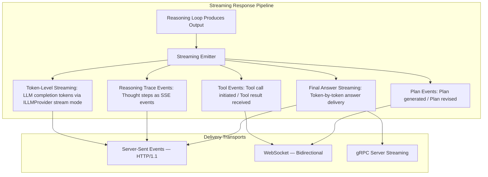

### Streaming Event Schema

```
AgentStreamEvent {
  event_id:       UUID
  session_id:     UUID
  event_type:     "TOKEN" | "THOUGHT" | "TOOL_CALL" | "TOOL_RESULT"
                | "PLAN_GENERATED" | "PLAN_REVISED" | "FINAL_ANSWER"
                | "SESSION_COMPLETE" | "SESSION_FAILED"
  step_index:     integer
  payload:        object   // event_type-specific structured payload
  timestamp:      ISO8601
  trace_id:       string   // OpenTelemetry trace ID
}
```

---

## 37. Event Bus Integration

The Agent Runtime publishes lifecycle events to and subscribes trigger events from the Internal Event Bus.

### Published Events (Outbound)

| Event Name | Trigger |
| :--- | :--- |
| `neuroflow.agent.session_started` | A new agent session is created. |
| `neuroflow.agent.session_suspended` | A long-running session is checkpointed and suspended. |
| `neuroflow.agent.session_resumed` | A suspended session is resumed. |
| `neuroflow.agent.session_completed` | A session reaches the `COMPLETED` terminal state. |
| `neuroflow.agent.session_failed` | A session reaches the `FAILED` terminal state. |
| `neuroflow.agent.tool_invoked` | A tool is invoked within a reasoning session. |
| `neuroflow.agent.tool_failed` | A tool invocation failed after all retries. |
| `neuroflow.agent.hitl_requested` | A Human-in-the-Loop pause is initiated. |
| `neuroflow.agent.hitl_resolved` | A Human-in-the-Loop decision has been received. |
| `neuroflow.agent.safety_block` | The Safety Pipeline blocked an action. |
| `neuroflow.agent.delegation_started` | Sub-agent delegation was initiated. |
| `neuroflow.agent.delegation_completed` | Sub-agent delegation returned a result. |
| `neuroflow.agent.budget_exceeded` | Token or cost budget was breached. |

### Subscribed Events (Inbound)

| Event Pattern | Trigger |
| :--- | :--- |
| `neuroflow.system.started` | Triggers Agent Registry initialization and Tool Registry loading. |
| `neuroflow.plugin.loaded` | Registers plugin-defined agent definitions and tools. |
| `neuroflow.agent.session_resume_requested` | Triggers session restoration from checkpoint. |
| `neuroflow.hitl.decision_submitted` | Injects operator decision into suspended session. |
| Custom event patterns declared by long-running agents | Resumes suspended sessions awaiting external events. |

---

## 38. Scheduler Integration

The Agent Runtime integrates with the Workflow Engine's Scheduler for scheduled agent invocations — enabling autonomous agents to execute on recurring schedules without external triggers.

```
+-----------------------------------------------------------------------------------+
|                     AGENT SCHEDULER INTEGRATION                                   |
+-----------------------------------------------------------------------------------+
|                                                                                   |
|  SCHEDULED AGENT INVOCATION FLOW:                                                 |
|                                                                                   |
|  1. Domain plugin registers a schedule at plugin load time:                       |
|     context.scheduler.register_agent_schedule(                                    |
|       agent_id         = "daily-network-health-agent",                            |
|       cron_expression  = "0 6 * * *",                                             |
|       timezone         = "UTC",                                                   |
|       input_template   = { "scope": "GLOBAL", "time_window_hours": 24 },        |
|       tenant_id        = "tenant-enterprise-01"                                   |
|     )                                                                             |
|                                                                                   |
|  2. Workflow Scheduler fires the cron trigger at 06:00 UTC.                       |
|                                                                                   |
|  3. The Scheduler publishes "neuroflow.scheduler.agent_trigger" event to the     |
|     Event Bus with the agent_id and input_template payload.                       |
|                                                                                   |
|  4. Agent Runtime subscribes to this event and creates a new AgentExecutionRequest|
|     with the provided inputs and default session configuration.                   |
|                                                                                   |
|  5. The agent executes its full reasoning session and publishes completion events.|
+-----------------------------------------------------------------------------------+
```

---

## 39. Observability & Telemetry

The Agent Runtime participates in the NeuroFlow AI distributed observability platform through three pillars: Traces, Metrics, and Logs.

```mermaid
flowchart TD
    subgraph ObservabilityEngine ["Agent Runtime Observability Engine"]
        subgraph Traces ["Distributed Traces — OpenTelemetry"]
            ROOT_SPAN["Root Span: Agent Session"]
            CTX_SPAN["Child Span: Context Assembly"]
            PLAN_SPAN["Child Span: Planning Engine"]
            LOOP_SPAN["Child Span: Reasoning Loop Iteration N"]
            TOOL_SPAN["Child Span: Tool Execution"]
            SAFE_SPAN["Child Span: Safety Pipeline"]
            REFL_SPAN["Child Span: Reflection Engine"]
            ROOT_SPAN --> CTX_SPAN
            ROOT_SPAN --> PLAN_SPAN
            ROOT_SPAN --> LOOP_SPAN
            LOOP_SPAN --> TOOL_SPAN
            LOOP_SPAN --> SAFE_SPAN
            LOOP_SPAN --> REFL_SPAN
        end
    end

    ObservabilityEngine --> OTEL["OpenTelemetry Collector"]
    OTEL --> TEMPO["Tempo / Jaeger: Trace Backend"]
    OTEL --> PROM["Prometheus: Metrics Backend"]
    OTEL --> LOKI["Loki / ELK: Log Backend"]
```

---

## 40. Metrics

The Agent Runtime exports OpenTelemetry-compatible metrics:

| Metric Name | Type | Description |
| :--- | :--- | :--- |
| `neuroflow_agent_sessions_total` | Counter | Total agent sessions created per tenant per agent definition. |
| `neuroflow_agent_session_duration_seconds` | Histogram | End-to-end session execution duration. |
| `neuroflow_agent_reasoning_steps_total` | Counter | Total reasoning loop iterations per session. |
| `neuroflow_agent_tool_invocations_total` | Counter | Total tool invocations per tool per tenant. |
| `neuroflow_agent_tool_latency_seconds` | Histogram | Per-tool execution latency distribution. |
| `neuroflow_agent_tool_failures_total` | Counter | Total tool failures per tool per tenant. |
| `neuroflow_agent_token_consumption_total` | Counter | Total tokens consumed per session per LLM model. |
| `neuroflow_agent_cost_usd_total` | Counter | Total LLM + tool cost per session per tenant. |
| `neuroflow_agent_safety_blocks_total` | Counter | Total Safety Pipeline blocks per block type per tenant. |
| `neuroflow_agent_hitl_requests_total` | Counter | Total HITL approvals requested per tenant. |
| `neuroflow_agent_hitl_resolution_seconds` | Histogram | Time from HITL request to operator decision. |
| `neuroflow_agent_delegation_depth` | Histogram | Distribution of sub-agent delegation chain depths. |
| `neuroflow_agent_reflection_revisions_total` | Counter | Total plan revisions triggered by reflection. |
| `neuroflow_agent_budget_breaches_total` | Counter | Total sessions that hit token or cost hard limits. |
| `neuroflow_agent_sessions_active` | Gauge | Current number of active (non-suspended) agent sessions per tenant. |
| `neuroflow_agent_sessions_suspended` | Gauge | Current number of suspended sessions awaiting resume. |

---

## 41. Logging

The Agent Runtime emits structured JSON log records at every significant processing boundary. All logs are correlated via `trace_id`, `session_id`, and `tenant_id`.

### Log Levels and Events

| Level | Events |
| :--- | :--- |
| `INFO` | Session start, session complete, tool invoked, tool succeeded, plan generated, reasoning step initiated. |
| `WARN` | Token budget soft limit reached (80%), retry attempt, plan revision triggered, context truncation applied. |
| `ERROR` | Tool failure (after retries), safety block, LLM inference failure, budget hard limit breach. |
| `CRITICAL` | Safety termination event, delegation loop guard triggered, unrecoverable session failure. |
| `DEBUG` | Full context assembly payloads, full prompt content, raw LLM response, per-token streaming events. |

### Log Record Schema

```
{
  "timestamp":    ISO8601,
  "level":        string,
  "event":        string,
  "trace_id":     string,
  "session_id":   UUID,
  "agent_id":     string,
  "tenant_id":    string,
  "step_index":   integer?,
  "tool_id":      string?,
  "duration_ms":  integer?,
  "tokens":       integer?,
  "cost_usd":     decimal?,
  "message":      string
}
```

---

## 42. Tracing

Every agent session participates in distributed tracing through OpenTelemetry. The root span is the agent session; all sub-operations are child spans with full context propagation.

### Trace Span Hierarchy

```
[Span] agent.session (session_id, agent_id, tenant_id, goal_summary)
  +-- [Span] agent.context_assembly (tokens_retrieved, sources_count)
  +-- [Span] agent.planning (plan_steps_count, strategy)
  +-- [Span] agent.reasoning_loop (iteration N)
        +-- [Span] agent.llm_inference (model, prompt_tokens, completion_tokens, latency_ms)
        +-- [Span] agent.tool_execution (tool_id, attempt_number, status, latency_ms)
        |     +-- [Span] agent.safety_pipeline (stages_passed, decision)
        +-- [Span] agent.reflection (decision, score, revision_triggered)
```

### Trace Propagation Rules

- The `trace_id` from the invoking Workflow Engine task is propagated into the agent session root span. This creates a unified distributed trace spanning the Workflow Engine `AGENT_EXECUTION` task and the full agent session.
- Sub-agent delegation propagates the orchestrating agent's `trace_id` into the sub-agent's root span via the `DelegationRequest.trace_parent` field. This creates a unified trace hierarchy spanning all delegation hops.

---

## 43. Repository Placement

```
+-----------------------------------------------------------------------------------+
|                        REPOSITORY PLACEMENT STRATEGY                              |
+-----------------------------------------------------------------------------------+
|  Layer 0 — Core Domain Model (backend/core/)                                      |
|    backend/core/ports/agent.py                                                    |
|      - IAgentExecutor: Agent session execution contract.                         |
|      - IAgentRegistry: Agent definition catalog contract.                        |
|      - IToolExecutor: Tool invocation contract.                                   |
|      - IToolRegistry: Tool definition catalog contract.                           |
|      - IAgentSessionStore: Session metadata persistence contract.                |
|      - IAgentCheckpointStore: Session checkpoint persistence contract.           |
|      - IConversationStore: Conversation turn persistence contract.               |
|      - IObservationStore: Tool observation persistence contract.                 |
|      - IAgentAuditStore: Immutable audit log contract.                           |
|      - ILLMProvider: LLM inference abstraction contract.                         |
|      - ISafetyPipeline: Safety evaluation contract.                              |
|      - IMultiAgentBroker: Agent-to-agent delegation contract.                    |
|                                                                                   |
|  Layer 1 — Technical Infrastructure (backend/infrastructure/)                    |
|    backend/infrastructure/agent/                                                  |
|      - postgres_session_store.py: PostgreSQL IAgentSessionStore adapter.         |
|      - redis_checkpoint_store.py: Redis IAgentCheckpointStore adapter.          |
|      - s3_checkpoint_store.py: S3 IAgentCheckpointStore adapter.                |
|      - postgres_conversation_store.py: PostgreSQL IConversationStore adapter.   |
|      - postgres_observation_store.py: PostgreSQL IObservationStore adapter.     |
|    backend/infrastructure/llm/                                                    |
|      - openai_provider.py: OpenAI ILLMProvider adapter.                         |
|      - anthropic_provider.py: Anthropic ILLMProvider adapter.                   |
|      - google_gemini_provider.py: Gemini ILLMProvider adapter.                  |
|      - azure_openai_provider.py: Azure OpenAI ILLMProvider adapter.             |
|                                                                                   |
|  Layer 3 — Platform Runtime (backend/agent_runtime/)                             |
|    backend/agent_runtime/                                                         |
|      - registry/       Agent definition catalog, versioning, capability manifest.|
|      - session/        Session lifecycle manager, state machine, persistence.    |
|      - context/        Context assembly pipeline, token budget, prioritization.  |
|      - prompt/         Prompt assembly pipeline, block formatters.               |
|      - planning/       Planning engine, goal decomposer, strategy selector.      |
|      - reasoning/      Reasoning loop controller, observation cycle manager.     |
|      - reflection/     Reflection engine, confidence scorer, plan revision.      |
|      - tools/          Tool execution engine, tool registry, fallback chain.     |
|      - safety/         Safety pipeline, policy registry, HITL coordinator.      |
|      - memory/         Memory layer integrator: episodic/semantic/procedural.   |
|      - knowledge/      KB + KG + Graph-RAG context retrieval integration.        |
|      - multiagent/     Multi-agent broker, delegation engine, result synthesizer.|
|      - streaming/      Streaming emitter: SSE / WebSocket / gRPC adapters.      |
|      - cost/           Cost budget controller, token accounting, cost ledger.    |
|      - scheduler/      Scheduled agent invocation integration.                   |
|      - events/         Event Bus integration: publisher + subscriber.            |
|      - observability/  OpenTelemetry trace, metric, and log emitters.           |
|      - audit/          Immutable session audit logger.                           |
|      - conversation/   Conversation context manager, sliding window, compressor. |
+-----------------------------------------------------------------------------------+
```

---

## 44. Clean Architecture Dependency Diagram

```mermaid
graph TD
    subgraph Layer5 ["Layer 5: Ingress and Delivery"]
        API[api]
    end

    subgraph Layer4 ["Layer 4: Application Services"]
        SERVICES[services]
    end

    subgraph Layer3 ["Layer 3: Platform Runtime"]
        AR[agent_runtime]
        WE[workflow_engine]
        KG[knowledge_graph]
        KB["rag / knowledge_base"]
        MEMORY[memory]
    end

    subgraph Layer2 ["Layer 2: Extensions and Plugins"]
        PLUGINS[plugins]
    end

    subgraph Layer1 ["Layer 1: Technical Infrastructure"]
        AR_INFRA["infrastructure/agent — Session, Checkpoint, Conversation, Observation Adapters"]
        LLM_INFRA["infrastructure/llm — OpenAI, Anthropic, Gemini, AzureOpenAI Adapters"]
        WE_INFRA["infrastructure/workflow — Queue, State, Checkpoint Adapters"]
        KG_INFRA[infrastructure/graph]
        KB_INFRA[infrastructure/knowledge]
        INFRA[infrastructure]
    end

    subgraph Layer0 ["Layer 0: Core Domain Model"]
        CORE_AR["core/ports/agent — IAgentExecutor, IToolExecutor, ILLMProvider, ISafetyPipeline, IMultiAgentBroker"]
        CORE_WF["core/ports/workflow — IWorkflowRegistry, ITaskExecutor, ITaskQueue"]
        CORE_KG["core/ports/graph — IGraphStore, IGraphQuery"]
        CORE_KB["core/ports/knowledge — IKnowledgeBase, IVectorStore"]
        CORE_MEM["core/ports/memory — IMemoryStore, IMemoryRetriever"]
    end

    API --> SERVICES
    SERVICES --> AR
    SERVICES --> WE
    SERVICES --> CORE_AR
    AR --> KB
    AR --> KG
    AR --> MEMORY
    AR --> WE
    AR --> AR_INFRA
    AR --> LLM_INFRA
    AR --> CORE_AR
    WE --> AR
    WE --> KB
    WE --> KG
    WE --> MEMORY
    WE --> WE_INFRA
    WE --> CORE_WF
    PLUGINS --> CORE_AR
    PLUGINS --> CORE_WF
    PLUGINS --> CORE_KB
    PLUGINS --> CORE_KG
    PLUGINS --> CORE_MEM
    AR_INFRA --> CORE_AR
    LLM_INFRA --> CORE_AR
    WE_INFRA --> CORE_WF
    KG_INFRA --> CORE_KG
    KB_INFRA --> CORE_KB
    INFRA --> CORE_AR
```

**Key Dependency Rules:**
- `agent_runtime` **depends on** `core/ports/agent` (never the reverse).
- `agent_runtime` **depends on** `knowledge_base`, `knowledge_graph`, `memory` via their respective Core ports — never directly importing their implementation modules.
- `workflow_engine` **depends on** `agent_runtime` via `IAgentExecutor` port — not directly on any agent session class.
- `plugins` **may only import** Layer 0 core ports. Plugins never import Layer 3 implementation classes.

---

## 45. Platform Ecosystem Diagram

```mermaid
graph TD
    subgraph Triggers ["Agent Invocation Triggers"]
        WF_TRIG["Workflow Engine — AGENT_EXECUTION Task"]
        API_TRIG["Direct API Invocation"]
        SCHED_TRIG["Scheduler — Cron Trigger"]
        EVT_TRIG["Event Bus — Agent Resume / New Request"]
        HUMAN_TRIG["Operator Console — Manual Invocation"]
    end

    subgraph PlatformRuntime ["Platform Runtime — Layer 3"]
        AR[Agent Runtime]
        WE[Workflow Engine]
        KB[Knowledge Base]
        KG[Knowledge Graph]
        MEMORY[Memory Layer]
    end

    subgraph Plugins ["Domain Plugins"]
        P1[Telecom Intelligence]
        P2[Cybersecurity]
        P3[Healthcare]
        P4[Finance]
        P5[Cloud Infrastructure]
        P6[Enterprise AI]
        P7[Research Assistants]
        P8[Autonomous AI Agents]
    end

    subgraph LLMProviders ["LLM Providers — Infrastructure Layer"]
        LLM1["OpenAI GPT-4o"]
        LLM2["Anthropic Claude"]
        LLM3["Google Gemini"]
        LLM4["Azure OpenAI"]
    end

    subgraph Infrastructure ["Platform Infrastructure"]
        EB[Internal Event Bus]
        SESS_DB["Session Store — PostgreSQL"]
        CKPT_S["Checkpoint Store — Redis / S3"]
        CONV_DB["Conversation Store — PostgreSQL"]
        OBS_DB["Observation Store — PostgreSQL"]
        AUDIT[Agent Audit Store]
        NOTIF[Notification Service]
        STREAM["Streaming Gateway — SSE / WebSocket"]
        OTEL[OpenTelemetry Collector]
    end

    Triggers --> AR
    Plugins -->|"Register Agents + Tools + Safety Policies"| AR
    AR -->|"LLM Inference via ILLMProvider"| LLMProviders
    AR -->|"Hybrid KB Retrieval"| KB
    AR -->|"KG Subgraph Traversal"| KG
    AR -->|"Memory Read + Write"| MEMORY
    AR -->|"Trigger Workflow"| WE
    WE -->|"AGENT_EXECUTION Task"| AR
    AR --> SESS_DB
    AR --> CKPT_S
    AR --> CONV_DB
    AR --> OBS_DB
    AR --> AUDIT
    AR -->|"HITL Notifications"| NOTIF
    AR -->|"Publish Lifecycle Events"| EB
    EB -->|"Resume Triggers"| AR
    AR -->|"Progressive Output"| STREAM
    AR -->|"Traces + Metrics + Logs"| OTEL
```

---

## 46. Repository Impact Assessment

### Physical Repository Structure

| Location | Layer | Contents |
| :--- | :--- | :--- |
| `backend/core/ports/agent.py` | Layer 0 | 12 abstract interface contracts for all agent runtime components. |
| `backend/infrastructure/agent/` | Layer 1 | PostgreSQL, Redis, and S3 storage adapters for session, checkpoint, conversation, and observation stores. |
| `backend/infrastructure/llm/` | Layer 1 | LLM provider adapters: OpenAI, Anthropic, Google Gemini, Azure OpenAI. |
| `backend/agent_runtime/` | Layer 3 | Full Agent Runtime implementation structured into 19 focused sub-modules. |

### Sub-Module Summary

| Module Path | Purpose |
| :--- | :--- |
| `backend/agent_runtime/registry/` | Agent definition catalog, version management, capability manifest compiler. |
| `backend/agent_runtime/session/` | Session lifecycle manager, session state machine, suspension and resumption. |
| `backend/agent_runtime/context/` | Context assembly pipeline, relevance ranking, token budget enforcement. |
| `backend/agent_runtime/prompt/` | Prompt block assemblers, token count validation, block priority enforcement. |
| `backend/agent_runtime/planning/` | Planning engine, goal analyzer, sub-goal decomposer, plan validator, budget estimator. |
| `backend/agent_runtime/reasoning/` | Reasoning loop controller, observation cycle manager, step budget enforcer. |
| `backend/agent_runtime/reflection/` | Reflection engine, confidence scorer, contradiction detector, decision classifier. |
| `backend/agent_runtime/tools/` | Tool execution engine, tool registry, input/output schema validator, fallback chain. |
| `backend/agent_runtime/safety/` | Safety pipeline stages, safety policy registry, HITL coordinator. |
| `backend/agent_runtime/memory/` | Memory layer integrator: read/write episodic, semantic, procedural, working. |
| `backend/agent_runtime/knowledge/` | KB hybrid retrieval integration, KG subgraph integration, Graph-RAG assembler. |
| `backend/agent_runtime/multiagent/` | Multi-agent broker, delegation engine, depth/loop guard, result synthesizer. |
| `backend/agent_runtime/streaming/` | Streaming emitter: SSE, WebSocket, and gRPC server-streaming adapters. |
| `backend/agent_runtime/cost/` | Cost budget controller, token accounting, per-session cost ledger. |
| `backend/agent_runtime/scheduler/` | Scheduled agent invocation trigger integration with Workflow Scheduler. |
| `backend/agent_runtime/events/` | Event Bus publisher and subscriber integration. |
| `backend/agent_runtime/observability/` | OpenTelemetry trace, metric, and structured log emitters. |
| `backend/agent_runtime/audit/` | Immutable session and tool action audit logger. |
| `backend/agent_runtime/conversation/` | Conversation context manager, sliding window, summarization compressor. |

### Files Impacted in Existing Modules

| File / Module | Change Type | Description |
| :--- | :--- | :--- |
| `backend/core/ports/workflow.py` | Modify | Add `IAgentExecutor` reference to `AGENT_EXECUTION` task executor integration. |
| `backend/workflow_engine/tasks/` | Modify | Add `AgentExecutionTaskExecutor` that calls `IAgentExecutor.execute()`. |
| `backend/plugins/*/` | Modify | Existing plugins update to register agent definitions and tools at load time. |
| `backend/core/ports/memory.py` | Reference | Agent Runtime integrates with existing `IMemoryStore` / `IMemoryRetriever` ports. |
| `backend/core/ports/knowledge.py` | Reference | Agent Runtime integrates with existing `IKnowledgeBase` / `IVectorStore` ports. |
| `backend/core/ports/graph.py` | Reference | Agent Runtime integrates with existing `IGraphStore` / `IGraphQuery` ports. |

### New Files (Net New)

| New Location | Count |
| :--- | :--- |
| `backend/core/ports/agent.py` | 1 file (12 interface contracts) |
| `backend/infrastructure/agent/` | 5 adapter files |
| `backend/infrastructure/llm/` | 4 adapter files |
| `backend/agent_runtime/` | 19 sub-modules (approx. 60–80 implementation files) |

---

## 47. ADR Recommendation

This specification establishes **ADR-009: Agent Runtime Architecture** in the project record.

### ADR Summary

- **Title**: ADR-009: Agent Runtime Architecture — Intelligence Orchestration Engine
- **Status**: Approved
- **Deciders**: Principal Software Architect, Lead Architect
- **Key Decision**: Introduce a domain-agnostic Agent Runtime as the platform's authoritative intelligence orchestration engine, co-located within **Platform Runtime (Layer 3)** at `backend/agent_runtime/`, with abstract interface contracts at `backend/core/ports/agent.py` and infrastructure adapters at `backend/infrastructure/agent/` and `backend/infrastructure/llm/`.

The full ADR is maintained at `docs/adr/ADR-009-agent-runtime.md`.

---

**End of Agent Runtime Architecture Specification (v1.0.0)**
