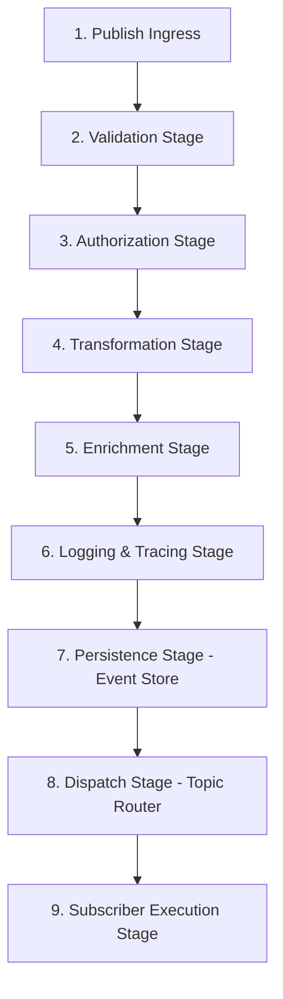
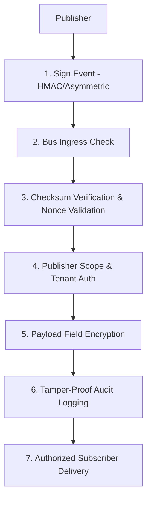
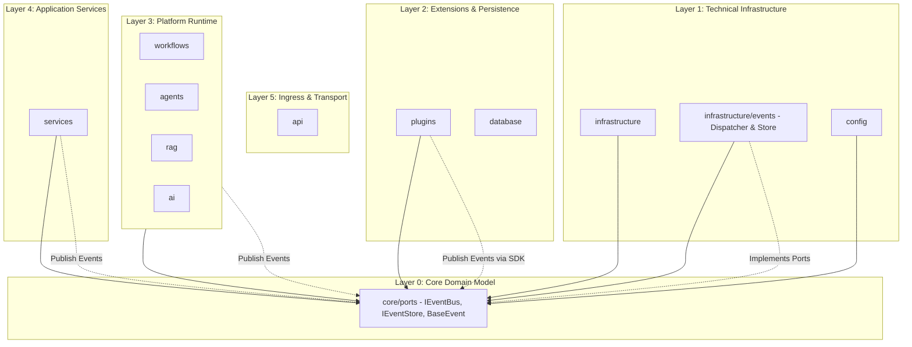

# NeuroFlow AI — Internal Event Bus Architecture Specification

**Document Version:** 4.0.0 (Approved Architecture Specification)  
**Status:** Approved Architecture Specification  
**Target Audience:** Lead Architects, Principal Engineers, Platform Developers, Security Lead  
**Classification:** Core Architecture Documentation  

---

## 1. Executive Summary

As NeuroFlow AI evolves into a production-grade, domain-independent modular AI platform, asynchronous decoupling of system capabilities becomes paramount. Direct, synchronous method invocations between modules create tight runtime coupling, hinder asynchronous processing, obstruct observability, and complicate plugin extensibility.

This specification formalizes the **Internal Event Bus Architecture** as the platform's central communication backbone. 

The Event Bus is designed as a **completely domain-agnostic, publish-subscribe (Pub/Sub) messaging substrate**. The core bus runtime possesses **zero awareness** of AI models, RAG pipelines, agents, workflows, or domain plugins (e.g., Telecom, Cybersecurity, Finance). It operates exclusively on generic abstractions: **Events**, **Topics**, **Contracts**, **Subscribers**, **Schemas**, and **Dispatchers**.

Key architectural pillars of the Event Bus include:
1. **Generic Domain-Agnostic Core Bus**: Complete decoupling from platform domain concepts.
2. **First-Class Event Store**: Append-only event persistence for audit, replay, time-travel debugging, and recovery.
3. **Event Schema Registry**: Rigorous validation, serialization, and backward/forward compatibility enforcement.
4. **Hierarchical Topic Architecture**: Structured dot-notation routing with wildcard subscription support.
5. **Formal Event Taxonomy**: Standardized categorization across 10 system event classes.
6. **Event Middleware Pipeline**: Nine-stage sequential processing pipeline for cross-cutting concerns.
7. **Multi-Mode Event Replay**: Replay mechanisms for state reconstruction, Knowledge Graph rebuilding, and disaster recovery.
8. **Advanced Subscriber Filtering**: Multi-dimensional predicate-based filtering.
9. **Deterministic Priority Scheduling**: Guaranteed invocation ordering, subscriber timeouts, and failure isolation.
10. **Enterprise Security Architecture**: Digital event signatures, tamper detection, replay attack protection, payload encryption, and tenant isolation.

---

## 2. Why an Event Bus Must Exist

### 2.1 The Limits of Direct Module Invocations
In traditional synchronous architectures, when a core engine action completes (e.g., an AI agent finishes a task), the executing component must explicitly invoke downstream listeners directly:

```
+-----------------------------------------------------------------------------------+
|                        TIGHTLY COUPLED DIRECT MODULE CALLS                        |
+-----------------------------------------------------------------------------------+
|  Agent Runtime Engine                                                             |
|    ├──> Direct call to Audit Logger                                                |
|    ├──> Direct call to Metrics Exporter                                           |
|    ├──> Direct call to Knowledge Graph Updater                                    |
|    ├──> Direct call to Telecom Plugin Hook                                        |
|    └──> Direct call to Web Notification Stream                                    |
+-----------------------------------------------------------------------------------+
```

This direct-coupling model suffers from five severe flaws:
1. **High Coupling & Cascade Failures**: If the Knowledge Graph Updater throws an unhandled exception, the primary Agent task fails, even though the core agent execution succeeded.
2. **Poor Extensibility**: Every new plugin or downstream observer requires modifying the Agent Runtime core code to append a new invocation call.
3. **Blocked ASGI Threads**: Executing audit logging, telemetry export, and plugin hooks synchronously inside the main request thread introduces substantial latency penalties.
4. **Testing Complexity**: Unit testing an agent execution requires mocking five unrelated downstream service dependencies.
5. **Microservice Extraction Barriers**: Direct method calls prevent extracting `agents` or `rag` into independent microservices in the future.

### 2.2 The Event Bus Solution

By introducing an **Internal Event Bus**, components publish immutably typed events describing *what happened*. Subscribing components independently listen for events of interest:

```
+-----------------------------------------------------------------------------------+
|                        DECOUPLED EVENT-DRIVEN ARCHITECTURE                        |
+-----------------------------------------------------------------------------------+
|  Agent Runtime Engine  ===> [ PUBLISH: AgentCompleted ] ==> ( Event Bus )         |
|                                                                  |                |
|         +-------------------+-------------------+----------------+----------------+
|         |                   |                   |                |                |
|         v                   v                   v                v                v
|   [ Audit Logger ]  [ Metrics Exporter ]  [ KG Updater ]  [ Telecom Plugin ]  [ Web Notifier ]
+-----------------------------------------------------------------------------------+
```

---

## 3. Direct Module Calls vs. Event-Driven Architecture

The table below contrasts Direct Module Calls against Event-Driven Architecture:

| Feature Dimension | Direct Module Calls | Event-Driven Architecture |
| :--- | :--- | :--- |
| **Coupling** | **Tight**: Publisher must know identity & method signature of subscribers. | **Decoupled**: Publisher emits events without knowing who consumes them. |
| **Execution Flow** | **Synchronous / Blocking**: Caller waits for all receivers to complete. | **Asynchronous / Non-blocking**: Publisher resumes immediately after event dispatch. |
| **Extensibility** | **Low**: Adding new feature listeners requires editing publisher source code. | **High**: New plugins or services subscribe to existing event topics zero code changes to publishers. |
| **Fault Isolation** | **Fragile**: Single downstream receiver failure can fail the primary transaction. | **Resilient**: Subscriber failures are caught in DLQs; primary transaction completes cleanly. |
| **Observability** | Ad-hoc manual logging statements injected at call sites. | Automatic, standardized event tracing, audit logging, and metric emission across all event flows. |
| **Microservice Fit** | Monolith-only (in-memory method calls). | Native fit for distributed microservices (via Kafka/RabbitMQ/Redis Streams). |

---

## 4. Pure Generic Event Bus Architecture

### 4.1 Domain-Agnostic Core Philosophy
The core Event Bus engine is strictly **domain-agnostic**. It possesses zero knowledge of domain entities such as Large Language Models, RAG vector chunking, Autonomous Agents, DAG Workflows, or Telecom PCAP logs. 

To the Event Bus, those components are merely **generic external publishers and subscribers**. The Event Bus operates exclusively on five generic primitives:
1. **Events**: Immutable data envelopes containing topic headers and typed payloads.
2. **Topics**: Hierarchical string keys used for message routing.
3. **Contracts**: Standardized envelope metadata structures.
4. **Subscribers**: Registered callable execution targets with filtering predicates and priority metadata.
5. **Dispatchers**: Execution engines managing synchronous or asynchronous payload delivery.

```
+-----------------------------------------------------------------------------------+
|                        GENERIC DOMAIN-AGNOSTIC EVENT BUS                          |
+-----------------------------------------------------------------------------------+
|  UNAWARE OF: AI, RAG, Agents, Workflows, Telecom, Cybersecurity, Finance          |
|  ONLY UNDERSTANDS: Events, Topics, Contracts, Subscribers, Dispatchers            |
+-----------------------------------------------------------------------------------+
|                                                                                   |
|   Generic Publishers                                       Generic Subscribers    |
|   +------------------+                                     +-------------------+  |
|   | Publisher ID: P1 |                                     | Subscriber ID: S1 |  |
|   +--------+---------+                                     +---------+---------+  |
|            |                                                         ^            |
|            v                                                         |            |
|  +-------------------------------------------------------------------+---------+  |
|  |                           GENERIC EVENT BUS CORE                            |  |
|  |                                                                             |  |
|  |  +---------------------+   +---------------------+   +-------------------+  |  |
|  |  | Event Schema        |   | Event Middleware    |   | Event Store       |  |  |
|  |  | Registry            |   | Pipeline            |   | (Append-Only Log) |  |  |
|  |  +----------+----------+   +----------+----------+   +---------+---------+  |  |
|  |             |                         |                         |           |  |
|  |             +-------------------------+-------------------------+           |  |
|  |                                       |                                     |  |
|  |                                       v                                     |  |
|  |                          +-------------------------+                        |  |
|  |                          | Topic Router &          |                        |  |
|  |                          | Deterministic Dispatcher|                        |  |
|  |                          +-------------------------+                        |  |
|  +-----------------------------------------------------------------------------+  |
+-----------------------------------------------------------------------------------+
```

---

## 5. Event Store: First-Class Architectural Component

The **Event Store** is a dedicated, append-only persistence engine that records every event published on the Event Bus in immutable sequence.

```
+-----------------------------------------------------------------------------------+
|                              EVENT STORE ARCHITECTURE                             |
+-----------------------------------------------------------------------------------+
|  Publisher ==> [ Event Bus Pipeline ] ==> ( Write to Event Store Log )           |
|                                                     |                             |
|         +-------------------+-----------------------+------------------+          |
|         |                   |                       |                  |          |
|         v                   v                       v                  v          |
|  [ Audit Ledger ]   [ Event Replay ]     [ Time-Travel Debug ]  [ State Recovery ] |
+-----------------------------------------------------------------------------------+
```

### 5.1 Responsibilities of the Event Store
- **Immutable Persistence**: Stores every event in an append-only database table/stream indexed by `event_id`, `topic`, `correlation_id`, `tenant_id`, and `timestamp`.
- **System Audit & Compliance**: Provides a tamper-proof historical ledger of all platform state changes for security and regulatory compliance.
- **State Reconstruction & Replay**: Allows replaying past events to rebuild state (e.g., rebuilding a corrupted Knowledge Graph or re-running workflow DAG steps).
- **Time-Travel Debugging**: Enables developers to inspect exact event sequences leading up to a system failure.

### 5.2 Event Store vs. Dead Letter Queue (DLQ)

It is critical to distinguish between the **Event Store** and the **Dead Letter Queue (DLQ)**:

| Attribute | Event Store | Dead Letter Queue (DLQ) |
| :--- | :--- | :--- |
| **Purpose** | Complete, historical append-only record of **all** published events. | Quarantine storage for events that **failed** subscriber processing after retries. |
| **Scope** | Contains 100% of successfully published platform events. | Contains only unprocessable, malformed, or failed events. |
| **Retention** | Long-term or permanent retention based on compliance policies. | Short-term operational storage until investigated or replayed. |
| **Primary Consumer** | Audit engines, Event Replay workers, Analytics, Debuggers. | Operations engineers, SREs, automated DLQ recovery tools. |

---

## 6. Event Schema Registry

The **Event Schema Registry** manages event payload schemas, enforcing data quality, validation rules, and compatibility policies across event versions.

```
+-----------------------------------------------------------------------------------+
|                             EVENT SCHEMA REGISTRY                                 |
+-----------------------------------------------------------------------------------+
|  1. Register Schema (e.g., "neuroflow.workflow.started", v1.0.0)                 |
|  2. Validate Publisher Payload against JSON Schema before dispatch.               |
|  3. Enforce Compatibility Mode (BACKWARD, FORWARD, FULL).                         |
|  4. Provide Serialization / Deserialization helpers.                             |
+-----------------------------------------------------------------------------------+
```

### 6.1 Key Responsibilities
- **Payload Validation**: Validates published event payloads against declared JSON Schema specifications in the pipeline. Invalid payloads are rejected at the ingress stage.
- **Schema Evolution Management**: Enforces backward and forward compatibility rules to prevent publishers from breaking downstream subscribers when updating schemas.
- **Compatibility Modes**:
  - `BACKWARD` (Default): New schema version can read data written by previous schema version.
  - `FORWARD`: Old schema version can read data written by new schema version.
  - `FULL`: Both backward and forward compatible.

---

## 7. Official Topic Hierarchy & Wildcards

NeuroFlow AI enforces a strict hierarchical dot-notation topic structure:

$$\text{Root} . \text{Domain/Category} . \text{Entity/Subsystem} . \text{Action/Event}$$

### 7.1 Topic Structure Specifications

```
neuroflow.system.*     -> System lifecycle & health events (system.started, system.shutdown)
neuroflow.platform.*   -> Internal platform core events
neuroflow.workflow.*   -> DAG workflow execution events (workflow.started, workflow.completed)
neuroflow.agent.*      -> Autonomous agent runtime events (agent.started, agent.failed)
neuroflow.ai.*         -> LLM inference & prompt events (ai.prompt_executed)
neuroflow.rag.*        -> Knowledge retrieval events (rag.document_ingested, rag.embedding_created)
neuroflow.memory.*     -> Context & memory persistence events (memory.stored)
neuroflow.plugin.*     -> Plugin lifecycle events (plugin.loaded, plugin.unloaded)

# Domain Plugin Specific Topics
telecom.*              -> Telecom Intelligence plugin topics (telecom.pcap.analyzed)
cybersecurity.*        -> Cybersecurity plugin topics (cybersecurity.threat.detected)
cloud.*                -> Cloud Intelligence plugin topics
finance.*              -> Finance Intelligence plugin topics
```

### 7.2 Wildcard Subscription Rules
Subscribers register using exact topic matching or wildcard expression patterns:
- **Single-Segment Wildcard (`*`)**: Matches exactly one segment in the topic path.
  - Example: `neuroflow.*.started` matches `neuroflow.system.started` and `neuroflow.workflow.started`.
- **Multi-Segment Wildcard (`#` or `**`)**: Matches zero or more trailing segments in the topic path.
  - Example: `neuroflow.workflow.#` matches all events published under the workflow namespace (`neuroflow.workflow.started`, `neuroflow.workflow.node.executed`, etc.).

---

## 8. Formal Event Taxonomy & Categories

Every event in NeuroFlow AI belongs to one of ten formal event categories:

| Category | Primary Responsibility | Example Event Types |
| :--- | :--- | :--- |
| **Lifecycle Events** | Track platform boot, shutdown, and health status. | `SystemStarted`, `SystemShutdown`, `HealthCheckFailed` |
| **Platform Events** | Core platform state transitions and configuration changes. | `TenantCreated`, `ConfigUpdated` |
| **AI Events** | Model inference, token usage, and prompt executions. | `PromptExecuted`, `ModelFailed`, `TokenQuotaExceeded` |
| **Workflow Events** | DAG workflow execution, node transitions, and graph status. | `WorkflowStarted`, `WorkflowCompleted`, `WorkflowFailed` |
| **Plugin Events** | Plugin discovery, loading, initialization, and teardown. | `PluginLoaded`, `PluginUnloaded`, `PluginSuspended` |
| **Knowledge Events** | Document ingestion, chunking, embedding, memory, and Graph-RAG updates. | `DocumentIngested`, `EmbeddingCreated`, `KnowledgeGraphUpdated`, `MemoryStored` |
| **Infrastructure Events**| Low-level cache, storage, message broker, and network events. | `CacheInvalidated`, `StorageUploaded` |
| **Security Events** | Authentication, authorization failures, and tamper alerts. | `AuthFailed`, `TamperDetected`, `AccessRevoked` |
| **Audit Events** | Immutable record of user and system administrative actions. | `UserActionLogged`, `AdminConfigChanged` |
| **Evaluation Events** | RAG triad metrics, benchmark scoring, and report generation. | `EvaluationCompleted`, `ReportGenerated` |

---

## 9. Event Middleware Pipeline

All events published to the Event Bus pass through a nine-stage sequential **Event Middleware Pipeline** before reaching subscriber execution handlers:



### Pipeline Stage Definitions
1. **Publish Ingress**: Accepts raw published event envelope from publisher.
2. **Validation Stage**: Validates event against Schema Registry specs; rejects malformed payloads.
3. **Authorization Stage**: Verifies publisher authorization scopes and tenant boundaries.
4. **Transformation Stage**: Normalizes fields, converts legacy event versions if necessary.
5. **Enrichment Stage**: Injects trace metadata (`correlation_id`, `timestamp`, `tenant_id`).
6. **Logging & Tracing Stage**: Emits OpenTelemetry span metadata and structured log records.
7. **Persistence Stage**: Writes immutable event record into the **Event Store**.
8. **Dispatch Stage**: Evaluates subscriber topic patterns and advanced filters.
9. **Subscriber Execution Stage**: Hands off event payload to target subscriber dispatchers.

---

## 10. Multi-Mode Event Replay Capability

Event Replay allows re-processing past events from the Event Store without altering original production history.

```
+-----------------------------------------------------------------------------------+
|                            EVENT REPLAY ARCHITECTURE                              |
+-----------------------------------------------------------------------------------+
|  Event Store Log ==> [ Replay Filter ] ==> [ Replay Engine ] ==> Target Subscriber|
|                                                                                   |
|  REPLAY MODES:                                                                    |
|  - By Event ID        : Replays a specific single event.                          |
|  - By Topic           : Replays all events published to a topic (e.g. rag.#).    |
|  - By Time Range      : Replays events between start_time and end_time.          |
|  - By Correlation ID  : Replays an entire multi-step transaction trace.           |
|                                                                                   |
|  PRIMARY USE CASES:                                                               |
|  - Time-Travel Debugging       - Rebuilding Corrupted Knowledge Graphs           |
|  - Evaluation & Benchmarking   - Disaster Recovery & State Reconstruction         |
+-----------------------------------------------------------------------------------+
```

---

## 11. Advanced Subscriber Filtering Engine

Subscribers can declare fine-grained, predicate-based filter criteria to receive only relevant subset events:

```
+-----------------------------------------------------------------------------------+
|                            ADVANCED FILTERING DIMENSIONS                          |
+-----------------------------------------------------------------------------------+
|  1. Topic Filter        : Matches hierarchical dot-notation topic pattern.        |
|  2. Tenant Filter       : Restricts events to specific `tenant_id`.               |
|  3. Plugin Filter       : Filters events originating from specific `plugin_id`.     |
|  4. Correlation Filter  : Matches specific distributed trace `correlation_id`.    |
|  5. Priority Filter     : Restricts execution to events above priority threshold.  |
|  6. Predicate Expression: Boolean evaluation on payload (e.g. `payload.tokens > 500`)|
+-----------------------------------------------------------------------------------+
```

---

## 12. Deterministic Priority Scheduling & Execution

Subscribers register with an explicit **Priority Level** (`Priority 0` to `Priority N`) dictating execution order:

```
+-----------------------------------------------------------------------------------+
|                      DETERMINISTIC PRIORITY EXECUTION PIPELINE                    |
+-----------------------------------------------------------------------------------+
|  Priority 0: Security & Audit Subscribers  (Executes First - Synchronous/Blocking)|
|  Priority 1: Telemetry & Tracing           (Executes Second)                      |
|  Priority 2: Platform Core State Engines   (Executes Third)                       |
|  Priority 3: Domain Plugins                (Executes Fourth)                      |
+-----------------------------------------------------------------------------------+
```

### Deterministic Scheduling Rules
1. **Priority Ordering**: Higher priority levels (`Priority 0`) MUST complete before lower priority levels (`Priority 3`) are invoked.
2. **Same-Priority Scheduling**: Subscribers registered at the same priority level execute in deterministic registration order or in parallel under isolated execution frames.
3. **Subscriber Timeouts**: Every subscriber execution is bound by a strict timeout (default: 3000ms). If a subscriber exceeds its timeout, execution is canceled, an exception is logged, and the pipeline continues to the next subscriber.
4. **Failure Isolation**: A subscriber failure NEVER affects other subscribers executing at the same or lower priority levels.

---

## 13. Enterprise Event Security Architecture

Security is built into every stage of the Event Bus pipeline:



### Security Capabilities
- **Trusted Publishers & Signed Events**: Events published by core engines or plugins are cryptographically signed using asymmetric keys or HMAC tokens.
- **Checksum Verification & Tamper Detection**: Payload hashes are verified at ingress; mutated or corrupted events are immediately rejected.
- **Replay Attack Protection**: Event headers include unique nonces and ISO-8601 timestamps; duplicate or stale signatures are blocked.
- **Payload Field Encryption**: Sensitive event payload fields (PII, customer credentials) are encrypted at rest using tenant-specific keys before being written to the Event Store or DLQ.
- **Tenant & Plugin Isolation**: Strict security policy gates ensure subscribers only receive events scoped to their authorized `tenant_id` and declared manifest permissions.

---

## 14. Event Contract Envelope Specification

Every event published on the Event Bus MUST adhere to this standardized JSON-compatible envelope structure:

```json
{
  "header": {
    "event_id": "c4a8b938-8add-4806-950c-17082d6da110",
    "event_type": "neuroflow.workflow.started",
    "version": "1.0.0",
    "timestamp": "2026-08-01T17:45:00.000Z",
    "correlation_id": "corr-9876-4321-1234",
    "causation_id": "event-1122-3344-5566",
    "tenant_id": "tenant-enterprise-01",
    "publisher_id": "com.neuroflow.engine.workflows",
    "signature": "sha256:e3b0c44298fc1c149afbf4c8996fb92427ae41e4649b934ca495991b7852b855"
  },
  "payload": {
    "workflow_id": "wf-telecom-diag-009",
    "execution_id": "exec-7788-9900",
    "node_count": 5
  }
}
```

---

## 15. Clean Architecture Dependency Diagram

The Mermaid diagram below shows where Event Bus abstractions and implementations reside across the Clean Architecture layers:



---

## 16. Repository Impact Assessment

### Physical Repository Structure Strategy
- **Core Interfaces (Layer 0)**: Abstract interfaces (`IEventBus`, `IEventStore`, `ISchemaRegistry`, `BaseEvent`) reside in `backend/core/ports/`.
- **Infrastructure Implementation (Layer 1)**: Concrete event bus dispatchers, middleware pipelines, schema validators, and event store database adapters reside in `backend/infrastructure/events/`.
- **No Top-Level Directory Sprawl**: Creating a new top-level directory `backend/event_bus/` is explicitly **rejected**, as technical messaging infrastructure cleanly belongs inside `infrastructure/events/`.

---

## 17. ADR Impact Assessment

This specification establishes **ADR-004: Formalization of Internal Event Bus Architecture** in the project record.

### ADR Summary
- **Title**: ADR-004: Internal Event Bus Architecture
- **Status**: Approved
- **Deciders**: Principal Software Architect, Lead Architect, Security Lead
- **Key Decision**: Adopt a generic, domain-agnostic Event Bus with first-class Event Store and Schema Registry in `infrastructure/events/`, exposing abstract interfaces via `core/ports/`.

---

**End of Internal Event Bus Architecture Specification**
