# NeuroFlow AI — Integration Runtime Architecture Specification

**Document Version:** 1.0.0 (Approved Architecture Specification)  
**Status:** Approved Architecture Specification  
**Target Audience:** Lead Architects, Principal Engineers, Platform Engineers, Integration Engineers, Domain Plugin Authors  
**Classification:** Core Platform Capability Architecture  

---

## 1. Why an Integration Runtime is Required

NeuroFlow AI is a production-grade modular AI Operating Platform. Its domain plugins — Telecom Intelligence, Cybersecurity, Healthcare, Finance, Cloud Infrastructure, Enterprise AI, Research Assistants, and Autonomous AI Agents — must continuously ingest data, issue commands, query databases, subscribe to message streams, sync file artifacts, invoke external web services, and interoperate with enterprise ecosystems.

Before the introduction of the Integration Runtime, external system connections were handled in an ad-hoc, fragmented manner across plugins and runtime modules. Tool executors wrote direct HTTP requests or raw client library calls; Knowledge Base ingestors embedded custom connectors; Event Bus handlers managed raw socket connections.

This decentralized approach introduced critical architectural liabilities across the platform:

- **Protocol Fragmentation**: Each module re-implemented connection handling for REST, gRPC, GraphQL, SQL, or WebSocket protocols, creating divergent connection pooling, serialization, and error handling semantics.
- **Unmanaged External Dependencies**: The platform lacked central visibility into active external endpoints, health statuses, network topologies, and connection pools.
- **Security Vulnerabilities & Secret Exposure**: Credentials, API tokens, connection strings, and certificates were stored, passed, and rotated inconsistently across plugin code boundaries, breaching Zero Trust security principles.
- **Missing Enterprise Governance & Multi-Tenancy**: External outbound calls could not reliably enforce tenant-scoped rate limits, network egress sandboxing, or per-tenant identity propagation.
- **Protocol Coupling**: High-level cognitive layers (Agent Runtime, Tool Runtime, Workflow Engine) became directly coupled to wire protocols (HTTP/1.1, gRPC, AMQP, MCP), making protocol upgrades or fallback mechanisms impossible without rewriting business logic.
- **Observability Dead Spots**: Outbound calls were missing unified distributed tracing, standardized metrics, and immutable security audit logs, making debugging across enterprise boundaries difficult.

The **Integration Runtime** is NeuroFlow AI's production-grade, domain-agnostic enterprise integration subsystem. Co-located in **Platform Runtime (Layer 3)**, it serves as the single authoritative abstraction layer governing all communications between NeuroFlow AI and external systems, databases, cloud services, messaging fabrics, and legacy enterprise software.

### Core Capabilities Unlocked by the Integration Runtime

| Capability | Without Integration Runtime | With Integration Runtime |
| :--- | :--- | :--- |
| **Protocol Neutrality** | Caller must know wire format, SDK, and transport details. | Unified `IIntegrationRuntime` port abstracts all protocols behind declarative interfaces. |
| **Enterprise Auth & Secrets** | Credentials scattered; manual or inconsistent token refresh. | Automated secret resolution, automated token rotation, and Zero Trust identity injection. |
| **Resilience & Fault Tolerance** | Ad-hoc per-call try/catch; inconsistent retries. | Standardized circuit breakers, exponential backoff jitter retries, and fallback routing. |
| **Connection Pooling** | Unmanaged client creation causing socket/connection exhaustion. | High-performance managed connection pools with health checks and idle eviction. |
| **Multi-Tenant Egress Isolation**| Egress traffic mixed; tenant data leakage risk. | Tenant-scoped network isolation, tenant egress quotas, and per-tenant proxy routing. |
| **Protocol Support** | Hard-coded REST or specific SDK clients. | Extensible Protocol Abstraction Layer supporting REST, GraphQL, gRPC, WebSocket, MCP, SQL, NoSQL, Streams, and File systems. |
| **Enterprise Observability** | Fragmented logs; untracked external calls. | End-to-end OpenTelemetry distributed traces, 24 exported metrics, and immutable audit logs. |

---

## 2. Distinction Between Related Platform Concepts

To prevent architectural ambiguity across engineering teams, clear conceptual boundaries are established:

```
+-----------------------------------------------------------------------------------+
|  INTEGRATION RUNTIME                    CONNECTOR                                 |
|  - Platform Runtime subsystem (Layer 3).  - Declarative definition of an external |
|  - Governs lifecycle, security, pooling,  endpoint, schema, auth, and transport.  |
|    resilience, caching, & observability.  - Registered catalog item in Registry.  |
+-----------------------------------------------------------------------------------+

+-----------------------------------------------------------------------------------+
|  ADAPTER                                PROVIDER                                  |
|  - Protocol implementation layer.       - Specific external platform binding      |
|  - Translates abstract requests into    (e.g., Salesforce, ServiceNow, S3).     |
|    wire-protocol framing (gRPC, REST).  - Combines connectors, schemas, & auth.   |
+-----------------------------------------------------------------------------------+

+-----------------------------------------------------------------------------------+
|  TRANSPORT                              PROTOCOL                                  |
|  - Low-level physical wire delivery     - Wire format specification & messaging   |
|    mechanism (TCP, TLS, HTTP/2, IPC).     semantics (REST/JSON, gRPC/Protobuf).   |
+-----------------------------------------------------------------------------------+

+-----------------------------------------------------------------------------------+
|  SDK                                    TOOL                                      |
|  - External client library or internal  - Atomic capability exposed to Agents/    |
|    developer kit for connector creation.  Workflows. Tools call Integration       |
|  - Never invoked directly by agents.      Runtime to execute external actions.    |
+-----------------------------------------------------------------------------------+
```

### Detailed Taxonomy Matrix

| Concept | Layer / Placement | Primary Responsibility | Example |
| :--- | :--- | :--- | :--- |
| **Integration Runtime** | Platform Runtime (Layer 3) | Subsystem governing all external integration lifecycles, execution, pooling, auth, and fault tolerance. | `backend/integration_runtime/` |
| **Connector** | Platform & Plugin Metadata | Declarative manifest describing an integration target (endpoint, protocol, schemas, security level). | `telecom.servicenow.incident_v2` |
| **Adapter** | Infrastructure / Runtime Adapter | Code module translating normalized runtime calls into specific protocol communications. | `RestProtocolAdapter`, `McpProtocolAdapter` |
| **Provider** | External Binding Package | Logical grouping of related connectors and authentication mechanisms for a target enterprise system. | `AWS_Cloud_Provider`, `Salesforce_Provider` |
| **Transport** | Low-Level Infrastructure | Physical communication layer providing byte-level data transfer over networks or buses. | `HTTP2_Transport`, `TLS_Socket_Transport`, `IPC_Transport` |
| **Protocol** | Protocol Layer | Formal rules and message formatting governing interaction between systems. | `gRPC`, `REST/HTTP`, `GraphQL`, `MCP`, `AMQP` |
| **SDK** | Developer Tooling | Software library providing programmatic constructs to build or consume connectors. | `NeuroFlow Connector SDK` |
| **Tool** | Tool Runtime (Layer 3) | Higher-level capability exposed to Agent/Workflow runtimes. Uses Integration Runtime for execution. | `http_get`, `servicenow_create_ticket` |

---

## 3. High-Level Integration Runtime Architecture

The Integration Runtime operates as a twenty-subsystem platform capability within **Platform Runtime (Layer 3)** of NeuroFlow AI, fully decoupled from domain plugins and higher-level cognitive orchestrators.

```
+-----------------------------------------------------------------------------------+
|                  INTEGRATION RUNTIME ARCHITECTURE OVERVIEW                        |
+-----------------------------------------------------------------------------------+
|                                                                                   |
|  Callers: Tool Runtime | Agent Runtime | Workflow Engine | KB / KG | Event Bus    |
|              |                                                                    |
|              v                                                                    |
|  +---------------------------+                                                    |
|  |  1. CONNECTOR REGISTRY    |   Catalog, Versioning, Metadata, Schema Storage   |
|  +-----------+---------------+                                                    |
|              |                                                                    |
|              v                                                                    |
|  +---------------------------+                                                    |
|  |  2. CONNECTOR DISCOVERY   |   Capability Match, Health Filtering, Category Search |
|  +-----------+---------------+                                                    |
|              |                                                                    |
|              v                                                                    |
|  +---------------------------+                                                    |
|  |  3. AUTH & SECRETS MGR    |   Zero Trust Identity, OAuth, Vault, Cert Rotation|
|  +-----------+---------------+                                                    |
|              |                                                                    |
|              v                                                                    |
|  +---------------------------+                                                    |
|  |  4. REQ/RESP VALIDATOR    |   JSON/Protobuf Schema Gate, Threat Sanitization  |
|  +-----------+---------------+                                                    |
|              |                                                                    |
|              v                                                                    |
|  +---------------------------+                                                    |
|  |  5. DATA TRANSFORMER      |   Field Mapping, Serialization/Deserialization     |
|  +-----------+---------------+                                                    |
|              |                                                                    |
|              v                                                                    |
|  +---------------------------+                                                    |
|  |  6. RATE & QUOTA LIMITER  |   Per-Tenant Rate Limits, Egress Quotas, Throttle|
|  +-----------+---------------+                                                    |
|              |                                                                    |
|              v                                                                    |
|  +---------------------------+                                                    |
|  |  7. CIRCUIT BREAKER       |   State Machine (Closed, Open, Half-Open)          |
|  +-----------+---------------+                                                    |
|              |                                                                    |
|              v                                                                    |
|  +---------------------------+                                                    |
|  |  8. CONNECTION POOL MGR   |   Multiplexing, Pool Sizing, Idle Eviction, Keepalive|
|  +-----------+---------------+                                                    |
|              |                                                                    |
|              v                                                                    |
|  +---------------------------+                                                    |
|  |  9. PROTOCOL ABSTRACTION  |   Adapter Router & Normalization Engine            |
|  +-----------+---------------+                                                    |
|              |                                                                    |
|              +-------------------+--------------------+                           |
|              |                   |                    |                           |
|              v                   v                    v                           |
|      +---------------+   +---------------+    +---------------+                   |
|      | 10. ADAPTERS  |   | 11. STREAMING |    | 12. RETRY ENGINE|                   |
|      | REST/gRPC/MCP |   | SSE/gRPC/WS   |    | Backoff/Jitter|                   |
|      +-------+-------+   +-------+-------+    +-------+-------+                   |
|              |                   |                    |                           |
|              +-------------------+--------------------+                           |
|                                  |                                                |
|                                  v                                                |
|                      +-----------------------+                                    |
|                      | 13. CACHE ENGINE      |   Redis Result & Meta Caching      |
|                      +-----------+-----------+                                    |
|                                  |                                                |
|                                  v                                                |
|                      +-----------------------+                                    |
|                      | 14. HEALTH MONITOR    |   Active & Passive Probing         |
|                      +-----------+-----------+                                    |
|                                  |                                                |
|                                  v                                                |
|                      +-----------------------+                                    |
|                      | 15. AUDIT & OBSERVE   |   OTel Traces, Metrics, Audit Log  |
|                      +-----------------------+                                    |
|                                  |                                                |
|                                  v                                                |
|                    Outbound Target / External System                              |
+-----------------------------------------------------------------------------------+
```

---

## 4. Integration Lifecycle

Connectors managed by the Integration Runtime follow a strict, governed lifecycle from definition registration through full retirement.

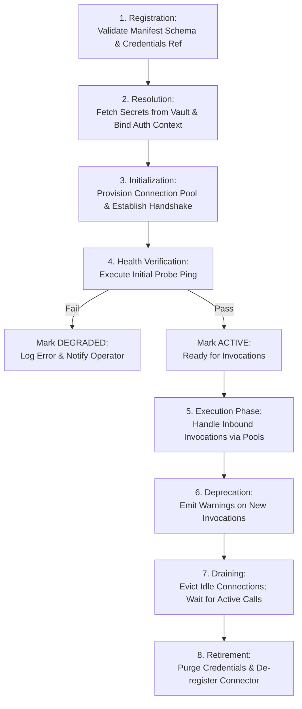

---

## 5. Integration State Machine

The runtime tracks individual connection pool instances and connector definitions using a deterministic state machine:

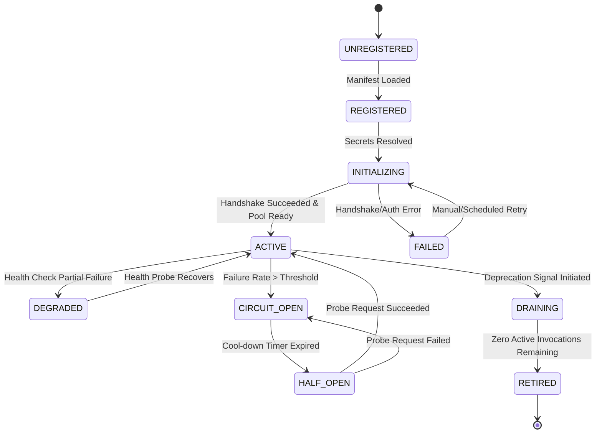

---

## 6. Connector Definition Model

A **Connector Definition** is an immutable, declarative manifest describing an external system integration.

```
+-----------------------------------------------------------------------------------+
|                      CONNECTOR DEFINITION MODEL                                   |
+-----------------------------------------------------------------------------------+
|                                                                                   |
|  IDENTITY & METADATA                                                              |
|  {                                                                                |
|    "connector_id":     string,       // Globally unique: "telecom.servicenow"     |
|    "name":             string,       // Human-readable identifier                |
|    "version":          SemVer,       // Connector specification version          |
|    "namespace":        string,       // Domain scope ("platform" | "telecom")     |
|    "category":         CategoryEnum, // REST | GRAPHQL | GRPCS | MCP | SQL | etc  |
|    "provider_id":      string,       // Associated Integration Provider           |
|    "description":      string                                                     |
|  }                                                                                |
|                                                                                   |
|  ENDPOINT & PROTOCOL CONFIGURATION                                                |
|  {                                                                                |
|    "protocol":         ProtocolEnum, // REST, GRAPHQL, GRPC, WEBSOCKET, MCP, SQL  |
|    "base_url":         string,       // Resolved endpoint (supports template vars)|
|    "port":             integer?,                                                  |
|    "transport":        TransportEnum,// HTTP_1_1, HTTP_2, TCP_TLS, WEBSOCKET, IPC |
|    "options":          map<string, any> // Protocol-specific parameters           |
|  }                                                                                |
|                                                                                   |
|  SECURITY & AUTHENTICATION SPECIFICATION                                          |
|  {                                                                                |
|    "auth_type":        AuthTypeEnum, // OAUTH2, API_KEY, MTLS, BASIC, AWS_SIGV4  |
|    "secret_ref":       string,       // Key in Secrets Engine                     |
|    "required_scopes":   [string],     // Platform scopes required to invoke       |
|    "allow_egress_cidrs": [string]    // Network policy rules for isolation        |
|  }                                                                                |
|                                                                                   |
|  SCHEMA & CAPABILITIES                                                            |
|  {                                                                                |
|    "request_schema":   JSONSchema,   // Expected payload structure                |
|    "response_schema":  JSONSchema,   // Guaranteed return structure               |
|    "supports_streaming": boolean,     // Handles SSE / gRPC streams               |
|    "supports_events":    boolean      // Produces inbound event triggers          |
|  }                                                                                |
+-----------------------------------------------------------------------------------+
```

---

## 7. Connector Metadata

Connector Metadata represents runtime operational metrics and dynamic status aggregated continuously by the Integration Runtime:

```
+-----------------------------------------------------------------------------------+
|                        CONNECTOR METADATA MODEL                                   |
+-----------------------------------------------------------------------------------+
|                                                                                   |
|  DYNAMIC HEALTH & STATUS                                                          |
|  {                                                                                |
|    "current_state":       StateEnum,   // ACTIVE | DEGRADED | CIRCUIT_OPEN | etc  |
|    "health_score":        float,       // 0.0 to 1.0 based on availability & SLA  |
|    "last_health_check":   ISO8601,     // Timestamp of last probe                  |
|    "circuit_breaker":     CircuitEnum  // CLOSED | OPEN | HALF_OPEN                |
|  }                                                                                |
|                                                                                   |
|  POOL & PERFORMANCE METRICS                                                       |
|  {                                                                                |
|    "active_connections":  integer,     // Currently leased connections             |
|    "idle_connections":    integer,     // Available pool connections               |
|    "p95_latency_ms":      float,       // 95th percentile latency                 |
|    "error_rate_5m":       float,       // Rolling 5-minute error percentage       |
|    "total_invocations":   int64                                                    |
|  }                                                                                |
+-----------------------------------------------------------------------------------+
```

---

## 8. Connector Registry

The **Connector Registry** is the central catalog storing, versioning, and managing Connector Definitions and their active instances.

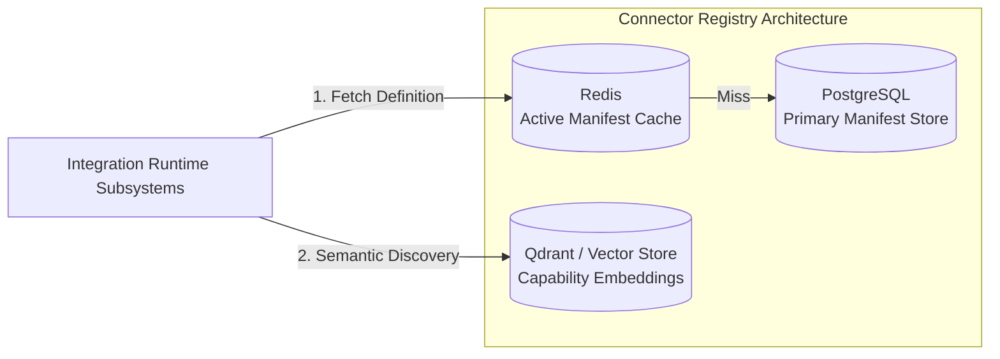

### Registry Operations Contract
- `register_connector(definition: ConnectorDefinition) -> RegistrationResult`
- `update_connector(connector_id: string, definition: ConnectorDefinition) -> void`
- `deregister_connector(connector_id: string) -> void`
- `get_connector(connector_id: string, version?: string) -> ConnectorDefinition`
- `list_connectors(namespace?: string, category?: CategoryEnum) -> List<ConnectorDefinition>`

---

## 9. Connector Discovery

Connector Discovery enables dynamic runtime lookup of integration targets based on semantic intent, capabilities, or category filters.

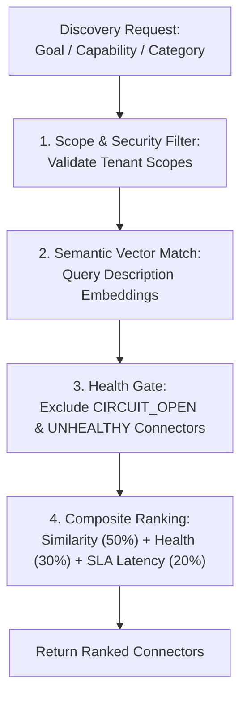

---

## 10. Connector Categories

Connectors are grouped into eleven primary functional categories:

| Category | Primary Target | Typical Protocols | Example Systems |
| :--- | :--- | :--- | :--- |
| **REST_API** | Web APIs & Microservices | HTTP/1.1, HTTP/2, OpenAPI | Stripe, Jira, GitHub |
| **GRAPHQL_API** | Graph APIs | HTTP/2, WebSocket | Shopify API, Hasura, GitHub GraphQL |
| **GRPC_SERVICE** | High-Performance RPCs | HTTP/2, Protobuf | Internal Microservices, Envoy, Kubernetes API |
| **MCP_SERVER** | Model Context Protocol | JSON-RPC over Stdio / SSE | Local AI Tools, Desktop Assist Tools |
| **DATABASE_SQL** | Relational Databases | Native Wire Protocols (TDS, PostgreSQL wire) | PostgreSQL, MySQL, Oracle, Snowflake |
| **DATABASE_NOSQL**| Document & Key-Value Stores | Native Binary / HTTP | MongoDB, Redis, Cassandra, DynamoDB |
| **FILE_SYSTEM** | Distributed & Local Files | POSIX, SFTP, NFS, SMB | Local NVMe, Enterprise SFTP, NFS Shares |
| **CLOUD_STORAGE** | Object Stores | REST / S3 API | AWS S3, Google Cloud Storage, Azure Blob |
| **MESSAGE_BROKER**| Event Streams & Queues | AMQP, MQTT, Kafka Wire, NATS | Apache Kafka, RabbitMQ, NATS, AWS SQS |
| **EMAIL_COMM** | Enterprise Messaging | SMTP, IMAP, POP3, Graph API | MS Exchange, SendGrid, Gmail API |
| **LEGACY_ENTERPRISE**| Mainframe & ERPs | ASMX, SOAP, Fixed-width TCP | SAP R/3, Mainframe CICS, AS400 |

---

## 11. Protocol Abstraction Layer

The Protocol Abstraction Layer provides a unified contract (`IProtocolAdapter`) hiding wire-level details from the rest of the platform.

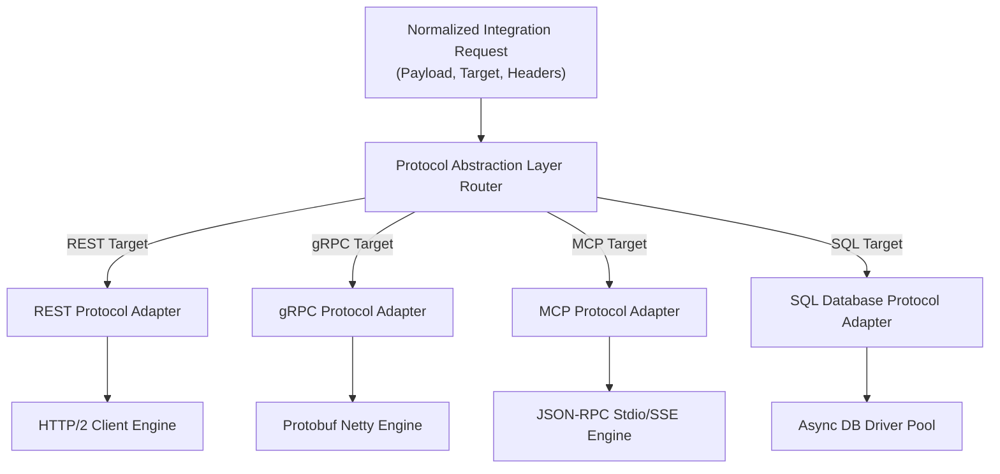

---

## 12. Adapter Architecture

Adapters implement the translation between NeuroFlow AI's internal normalized data formats and specific wire protocols.

```
+-----------------------------------------------------------------------------------+
|                        PROTOCOL ADAPTER ARCHITECTURE                              |
+-----------------------------------------------------------------------------------+
|                                                                                   |
|  IProtocolAdapter Interface Contract                                              |
|  {                                                                                |
|    + execute(request: NormalizedRequest, context: ExecutionContext): Task<Response> |
|    + execute_stream(request: NormalizedRequest): AsyncEnumerable<StreamChunk>     |
|    + test_connection(config: ConnectionConfig): Task<HealthStatus>                |
|    + validate_config(config: ConnectionConfig): ValidationResult                  |
|  }                                                                                |
|                                                                                   |
|  Concrete Adapter Responsibilities:                                               |
|  1. Frame Construction: Build wire-level packet (JSON-RPC, Protobuf frame).       |
|  2. Header/Metadata Injection: Attach auth tokens, trace IDs, tenant headers.     |
|  3. Transport Dispatch: Push payload over physical connection.                    |
|  4. Response Parsing: Unpack wire bytes into NormalizedResponse object.           |
+-----------------------------------------------------------------------------------+
```

---

## 13. Provider Architecture

An **Integration Provider** packages related connectors, authentication handlers, and specialized transformation templates into a cohesive domain bundle (e.g., `SalesforceProvider`, `AWSProvider`).

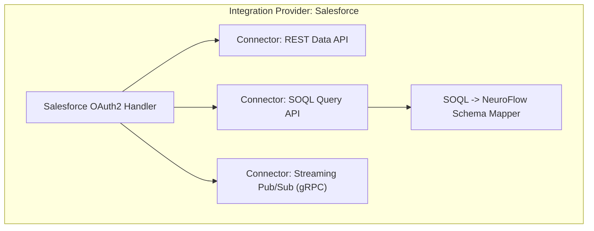

---

## 14. Supported Integration Types

### Comprehensive Protocol & Target Coverage

```
+-----------------------------------------------------------------------------------+
|                         SUPPORTED INTEGRATION TARGETS                             |
+-----------------------------------------------------------------------------------+
|  1. HTTP / REST: OpenAPI 3.0/3.1, JSON, XML, Multipart, OAuth2, HMAC, Bearer       |
|  2. GraphQL: Queries, Mutations, Subscriptions, Schema Introspection               |
|  3. gRPC: Unary, Server Streaming, Client Streaming, Bidirectional gRPC          |
|  4. WebSocket: Persistent Framing, Reconnection Logic, Ping/Pong Keepalive         |
|  5. MCP (Model Context Protocol): Stdio, SSE Transports, Tool & Resource Prompts  |
|  6. SQL DBs: PostgreSQL, MySQL, SQL Server, Oracle, Snowflake, CockroachDB       |
|  7. NoSQL DBs: MongoDB, Redis, Cassandra, DynamoDB, Elasticsearch                 |
|  8. File Systems: Local POSIX, NFS, SMB/CIFS, SFTP                                |
|  9. Cloud Storage: S3, Google Cloud Storage, Azure Blob Storage                   |
| 10. Message Brokers: Apache Kafka, RabbitMQ (AMQP), NATS, AWS SQS/SNS              |
| 11. Email & Comms: SMTP, IMAP, POP3, MS Exchange Graph API, Slack Webhooks        |
| 12. Extensible Plug-In Protocol Engines for Future Protocols                       |
+-----------------------------------------------------------------------------------+
```

---

## 15. Authentication Architecture

The Authentication Subsystem abstracts credential injection, token procurement, and handshake handshakes away from application logic.

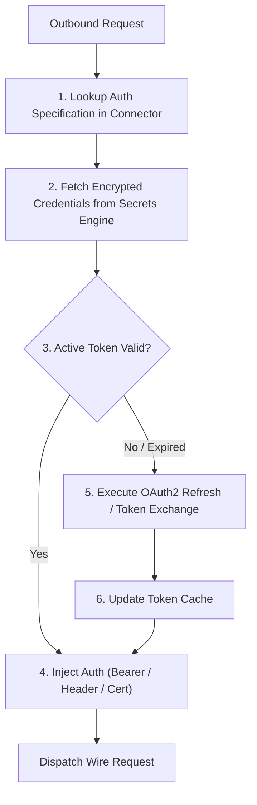

---

## 16. Authorization Model

The Integration Runtime enforces a dual-boundary Authorization model:

1. **Inbound Privilege Check**: Verifies that the platform caller (Agent, Workflow, Tool) holds required platform permission scopes (e.g., `INTEGRATION_EXECUTE`, `SCOPE_FINANCE_WRITE`).
2. **Outbound Scope Restriction**: Ensures the resolved connection only exercises pre-approved target scopes granted to the active tenant.

---

## 17. Secrets Management

All integration credentials (passwords, private keys, API tokens) are strictly managed via a dedicated Secrets Engine abstraction (`ISecretsStore`).

```
+-----------------------------------------------------------------------------------+
|                           SECRETS MANAGEMENT PIPELINE                             |
+-----------------------------------------------------------------------------------+
|  - Zero Hardcoded Credentials: Manifests only contain secret references.          |
|  - Envelope Encryption: Secrets encrypted at rest using AES-256-GCM keys.         |
|  - Plugable Backends: Vault, AWS Secrets Manager, GCP Secret Manager, Azure Key.  |
|  - In-Memory Protection: Credentials stored in memory buffers zeroed after use.   |
+-----------------------------------------------------------------------------------+
```

---

## 18. Credential Rotation

Credential Rotation runs asynchronously to refresh expiring tokens, certificates, and API keys without dropping active connections.

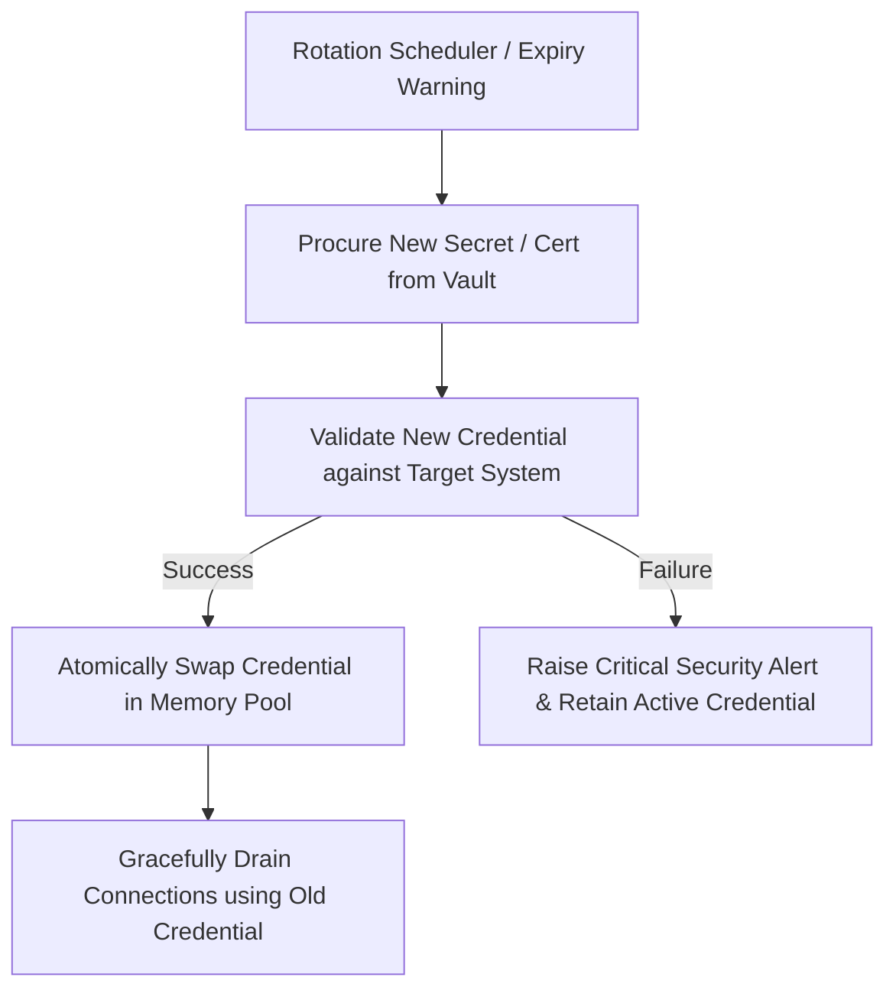

---

## 19. Connection Pooling

The Connection Pool Manager prevents socket exhaustion and optimizes throughput by maintaining managed pools of persistent wire connections.

```
+-----------------------------------------------------------------------------------+
|                     CONNECTION POOL ARCHITECTURE                                  |
+-----------------------------------------------------------------------------------+
|  Configuration Parameters:                                                        |
|  - min_pool_size:         Minimum idle connections maintained (default: 5).      |
|  - max_pool_size:         Maximum concurrent connections allowed (default: 50).   |
|  - max_idle_time_ms:      Idle connection eviction threshold (default: 30000ms). |
|  - max_lifetime_ms:       Hard connection lifespan limit (default: 3600000ms).   |
|  - connection_timeout_ms: Max wait time for free connection (default: 5000ms).    |
|                                                                                   |
|  Health Features:                                                                 |
|  - Background Keepalive: Periodic ping framing over idle connections.             |
|  - Pre-lease Health Check: Validation of connection state before leasing.         |
+-----------------------------------------------------------------------------------+
```

---

## 20. Connection Lifecycle

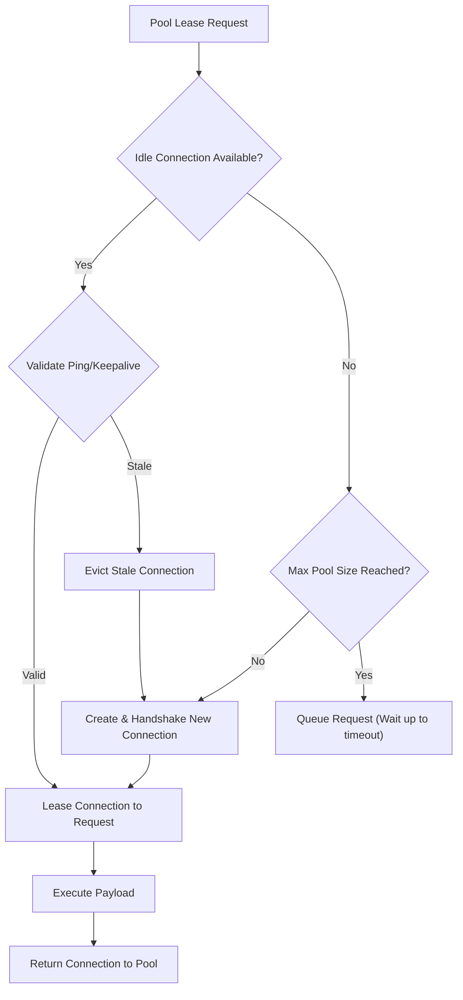

---

## 21. Session Management

For stateful protocols (WebSocket, gRPC Streams, Database Transactions, MCP Stdio), the Integration Runtime manages persistent sessions bound to a specific session token or transaction ID.

```
Session Record:
{
  "session_id":        UUID,
  "connector_id":      string,
  "tenant_id":         string,
  "state":             "CONNECTED" | "SUSPENDED" | "TERMINATED",
  "last_activity_at":  ISO8601,
  "heartbeat_seconds": integer
}
```

---

## 22. Retry Policies

The Retry Engine handles transient network or server errors using exponential backoff with full jitter to avoid thundering herd conditions.

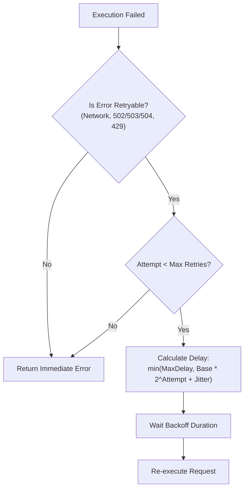

---

## 23. Circuit Breaker Pattern

Each connector maintains a dedicated Circuit Breaker protecting external systems and internal resource queues.

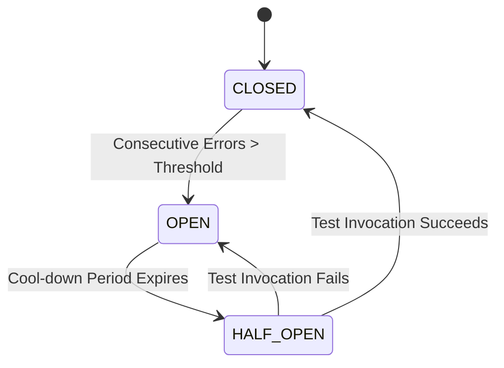

---

## 24. Timeout Strategy

Timeouts are strictly enforced at three distinct layers:

1. **Connect Timeout**: Maximum duration allowed to establish physical socket/TLS handshake (default: 5s).
2. **Request / Read Timeout**: Maximum wait duration for server bytes after request transmission (default: 30s).
3. **Total Operation Timeout**: Hard deadline encompassing all retries and authentication steps (default: 60s).

---

## 25. Health Monitoring

Health monitoring operates via dual mechanisms:

- **Active Probing**: Periodic background ping queries sent to connector endpoints.
- **Passive Inspection**: Real-time sliding window analysis of execution error rates and latencies.

```
Health Score Formula:
HealthScore = (1.0 - ErrorRate_5m) * 0.7 + (1.0 - NormalizedLatencyRatio) * 0.3
```

---

## 26. Streaming Architecture

The Integration Runtime natively supports high-performance bi-directional streaming for telemetry, SSE responses, and large file transfers.

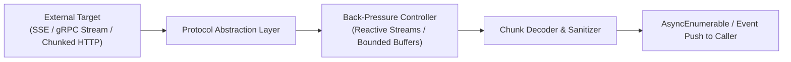

---

## 27. Event Integration

Outbound events generated by external message brokers (Kafka, RabbitMQ) or Webhooks are ingested via the Integration Runtime and published directly to the **Internal Event Bus**.

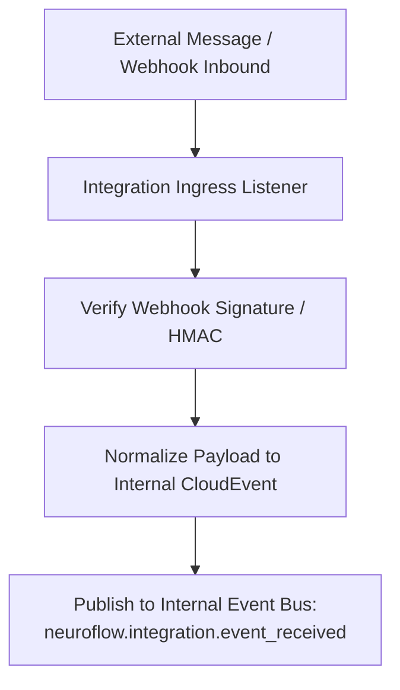

---

## 28. Integration Caching

To reduce external traffic and costs, read-only idempotent integration calls are cached in an isolated Redis cache store (`IIntegrationCache`).

```
Cache Key = SHA256(connector_id + ":" + tenant_id + ":" + normalized_request_payload)
TTL = Connector Defined (Default: 300 seconds for GET operations)
```

---

## 29. Data Transformation Layer

The Data Transformation Layer converts platform payloads into external formats and vice versa using declarative field mapping schemas.

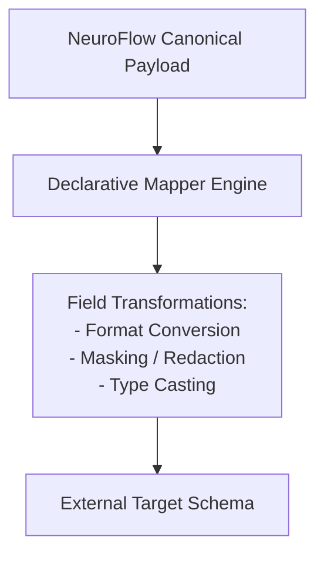

---

## 30. Serialization & Deserialization

The runtime encapsulates format codecs supporting high-throughput encoding and decoding:

- **JSON / JSON-LD**: High-performance zero-allocation parser.
- **Protocol Buffers**: Binary gRPC message encoding.
- **XML / SOAP**: Schema-validated XML processing with XXE prevention.
- **Avro / Parquet**: Columnar & streaming binary formats.
- **Raw Binary / Octet-Stream**: Direct byte streaming for files and blobs.

---

## 31. Request Validation

Before dispatching an integration request, the Request Validation Engine enforces:

1. **Schema Integrity**: Structural conformance against target JSON Schema / Protobuf definition.
2. **Payload Size Guard**: Enforces max request body sizes (default: 10MB).
3. **Security Sanitization**: Scans string parameters for injection patterns (SQLi, Command Injection).

---

## 32. Response Validation

Incoming responses from external systems are gated before returning to callers:

1. **Schema Conformance**: Validates response structure matches expected connector response definition.
2. **Secret & PII Detection**: Redacts detected credentials, keys, or sensitive PII from response bodies.
3. **Size Boundaries**: Prevents memory exhaustion from oversized external responses.

---

## 33. Error Classification

Errors are classified into a normalized error taxonomy:

| Internal Error Code | Category | Action Taken |
| :--- | :--- | :--- |
| `ERR_AUTH_FAILURE` | Security / Credentials | Triggers Credential Refresh; non-retryable without new token. |
| `ERR_CONNECT_TIMEOUT` | Network / Transport | Retryable under Retry Policy. |
| `ERR_CIRCUIT_OPEN` | Resilience | Rejected immediately without hitting network. |
| `ERR_RATE_LIMITED` | Governance | Backoff hint extracted; delayed retry queued. |
| `ERR_SCHEMA_MISMATCH` | Validation | Non-retryable; marked as Integration Contract Error. |
| `ERR_TARGET_5XX` | External Server | Retryable with exponential backoff. |

---

## 34. Failure Recovery

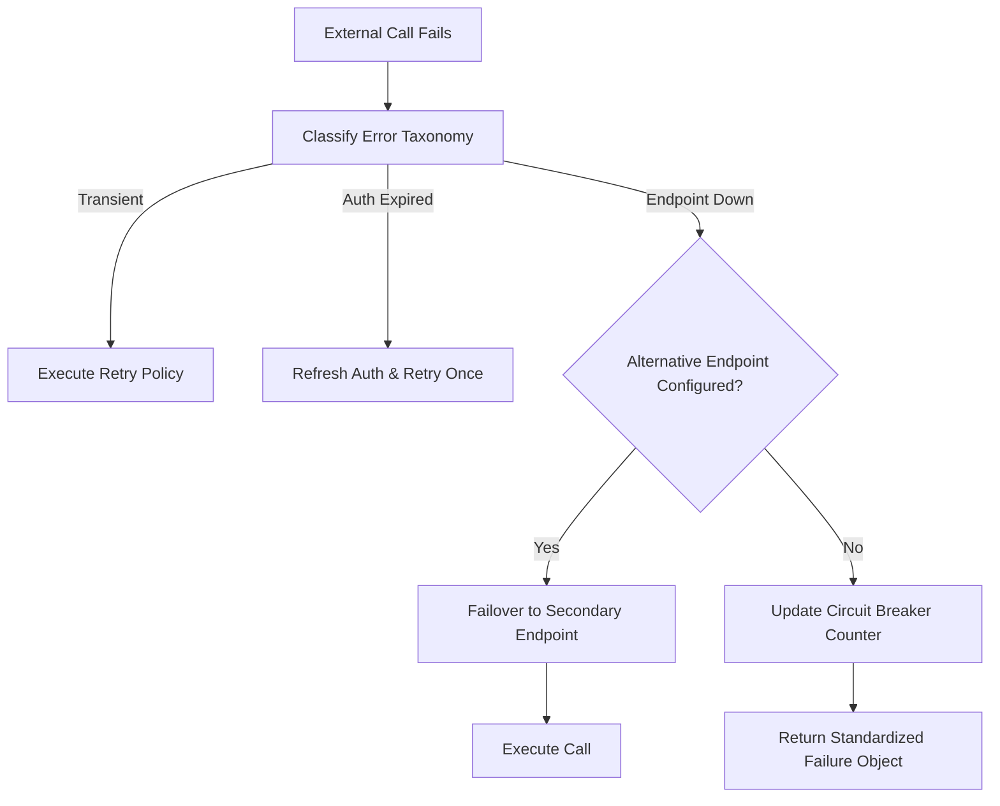

---

## 35. Multi-Tenant Isolation

Multi-tenant isolation is strictly maintained across network, memory, and data boundaries:

- **Network Egress Isolation**: Per-tenant proxy routing and CIDR egress allowlists.
- **Tenant Context Propagation**: Headers and context carry `tenant_id` on all outbound frames.
- **Pool Segmentation**: Connection pools are segregated by `tenant_id` to prevent cross-tenant noisy-neighbor starvation.

---

## 36. Rate Limiting

Rate limiting protects target systems and ensures fair resource distribution:

```
Tenant Rate Bucket (Token Bucket Algorithm):
- Capacity: 500 requests / minute
- Refill Rate: 8.33 tokens / second
- Burst Limit: 50 requests
```

---

## 37. Resource Quotas

Resource Quotas enforce monthly/daily usage boundaries per tenant:

- **Max Daily Outbound API Calls**: e.g., 50,000 requests/day.
- **Max Monthly Egress Volume**: e.g., 500 GB/month.
- **Max Concurrent Open Connections**: e.g., 100 simultaneous connections.

---

## 38. Plugin Integration Model

Domain plugins register custom connectors at load time using the `PluginIntegrationContext`.

```
context.integration_runtime.register_connector(
    definition=TelecomServiceNowConnectorDefinition,
    credentials_ref="vault://telecom/servicenow_creds"
)
```

---

## 39. Agent Runtime Integration

The Agent Runtime accesses external systems exclusively through Tools backed by the Integration Runtime.

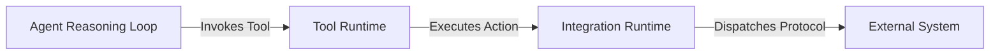

---

## 40. Tool Runtime Integration

Tools representing external API calls or database operations delegate raw wire execution directly to `IIntegrationRuntime.execute()`.

---

## 41. Workflow Engine Integration

Workflow Engine tasks (e.g., `HTTP_TASK`, `DATABASE_TASK`) execute via the Integration Runtime, leveraging its pooling, authentication, and retry mechanisms.

---

## 42. Event Bus Integration

Inbound events received by Integration Runtime listeners are normalized and emitted onto the Internal Event Bus.

---

## 43. Memory Layer Integration

The Memory Layer uses the Integration Runtime to persist episodic and semantic data to external vector stores or managed cloud databases when configured.

---

## 44. Knowledge Base Integration

Knowledge Base document ingestors utilize Integration Runtime File and Cloud Storage connectors (SFTP, S3, SharePoint) to pull external source artifacts.

---

## 45. Knowledge Graph Integration

Knowledge Graph sync tools use Database and GraphQL connectors to extract entity-relationship subgraphs from enterprise systems.

---

## 46. Security Architecture

The Integration Runtime implements a comprehensive security posture:

- **Transport Encryption**: Enforced TLS 1.3 for all outbound network traffic.
- **Mutual TLS (mTLS)**: Hardware or Vault-backed X.509 client certificate authentication.
- **Payload Encryption**: Sensitive fields encrypted before wire transmission.

---

## 47. Zero Trust Principles

- **Never Trust Outbound Targets**: All incoming responses are treated as untrusted and validated against schemas.
- **Least Privilege Access**: Credentials are bound strictly to required scopes for the active operation.
- **Continuous Identity Verification**: Every outbound call explicitly re-verifies tenant identity and authorization context.

---

## 48. Observability

Full integration observability is achieved through structured metrics, distributed tracing, and immutable logging.

---

## 49. Metrics

The Integration Runtime exports 24 OpenTelemetry metrics:

| Metric Name | Type | Description |
| :--- | :--- | :--- |
| `neuroflow_integration_requests_total` | Counter | Total integration requests by connector and status. |
| `neuroflow_integration_latency_seconds` | Histogram | End-to-end integration latency. |
| `neuroflow_integration_active_connections` | Gauge | Currently open leased connections. |
| `neuroflow_integration_pool_idle_connections`| Gauge | Idle connections in pool. |
| `neuroflow_integration_circuit_state` | Gauge | Circuit breaker status (0=Closed, 1=Half-Open, 2=Open). |
| `neuroflow_integration_egress_bytes_total` | Counter | Total egress bandwidth consumed. |
| `neuroflow_integration_ingress_bytes_total` | Counter | Total ingress bandwidth received. |
| `neuroflow_integration_auth_refreshes_total` | Counter | OAuth / Token refresh executions. |

---

## 50. Logging

All logs are formatted as structured JSON containing `trace_id`, `connector_id`, `tenant_id`, and `protocol`.

---

## 51. Distributed Tracing

OpenTelemetry traces contextually link internal Agent/Workflow spans directly to outbound HTTP/gRPC headers using W3C Trace Context (`traceparent`).

---

## 52. Audit Logging

Security-critical integration events (credential rotation, secret access, authorization failures, admin connector changes) are written to an immutable append-only audit log.

---

## 53. Repository Placement

The Integration Runtime is located within **Platform Runtime (Layer 3)**:

```
backend/
├── core/
│   └── ports/
│       └── integration.py           # Layer 0: Core Abstract Interfaces
├── infrastructure/
│   └── integration/                 # Layer 1: Infrastructure Adapters (Vault, Drivers)
└── integration_runtime/             # Layer 3: Platform Integration Runtime Subsystem
    ├── registry/                    # Connector Registry & Manifest Storage
    ├── discovery/                   # Connector Discovery Engine
    ├── auth/                        # Auth & Secrets Manager
    ├── pooling/                     # Connection Pool Manager
    ├── protocol/                    # Protocol Abstraction Layer & Routers
    ├── adapters/                    # REST, gRPC, MCP, SQL, GraphQL Adapters
    ├── resilience/                  # Circuit Breakers & Retry Engine
    ├── validation/                  # Request/Response Validation Engine
    ├── transformation/              # Data Transformation & Codecs
    ├── rate_limiter/                # Rate Limiting & Quotas
    └── observability/               # Metrics, Tracing, Audit Emitter
```

---

## 54. Clean Architecture Dependency Diagram

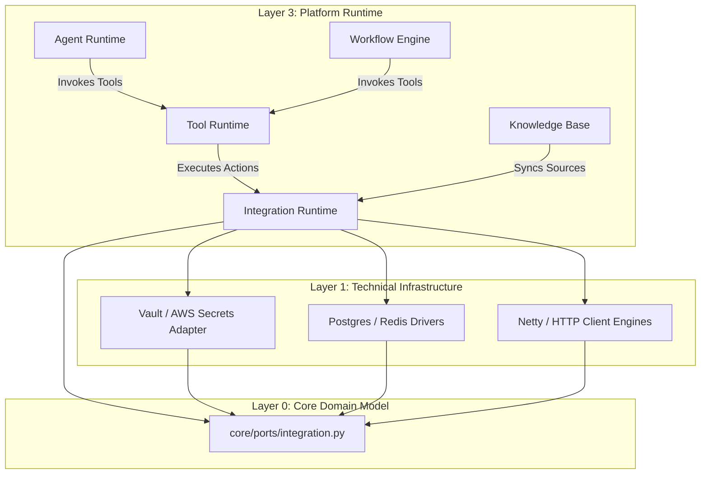

---

## 55. Platform Ecosystem Diagram

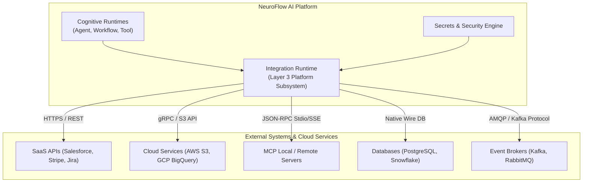

---

## 56. Repository Impact Assessment

### Summary of New Files To Be Created (Implementation Phase)

- `backend/core/ports/integration.py`: Core Layer 0 contracts (`IIntegrationRuntime`, `IConnectorRegistry`, `IProtocolAdapter`, `IConnectionPoolManager`).
- `backend/infrastructure/integration/`: Infrastructure drivers, Vault adapters, and socket managers.
- `backend/integration_runtime/`: 11 functional modules implementing the specification.
- `docs/architecture/integration-runtime.md`: This approved specification.
- `docs/adr/ADR-011-integration-runtime.md`: Accompanying Decision Record.

---

## 57. Future Evolution

The Integration Runtime is designed to support the future evolution of NeuroFlow AI's connector ecosystem:

- **Community Connectors**: Open-source connectors authored by community contributors adhering to the `Connector Definition Model`.
- **Enterprise Connectors**: High-performance, vendor-certified connectors with strict SLAs for enterprise software (SAP, Oracle, Workday).
- **Marketplace Connectors**: Third-party connector packages downloadable and installable at runtime via the Connector Registry.
- **Certified Connectors & Signing**: Cryptographic signature validation ensuring downloaded connector packages have not been tampered with.
- **Connector SDK**: Developer tooling simplifying the authoring, testing, and mocking of new protocol adapters and connectors.
- **Connector Governance**: Automated security scanning and static analysis gating new connector registrations.

---

## 58. ADR Recommendation

It is recommended to adopt **ADR-011: Integration Runtime Architecture**, establishing the Integration Runtime as the frozen, authoritative platform subsystem for external integrations.

### Suggested Commit Message
`docs(architecture): add Integration Runtime architecture specification and ADR-011`

---

**End of Integration Runtime Architecture Specification (v1.0.0)**
