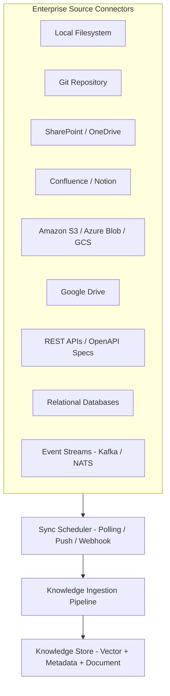
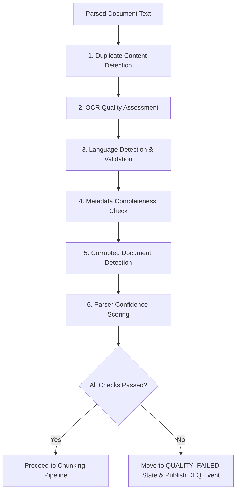
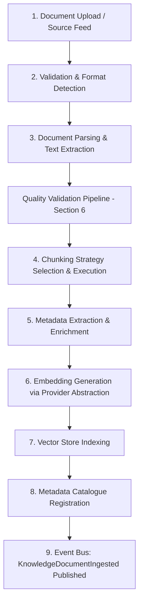
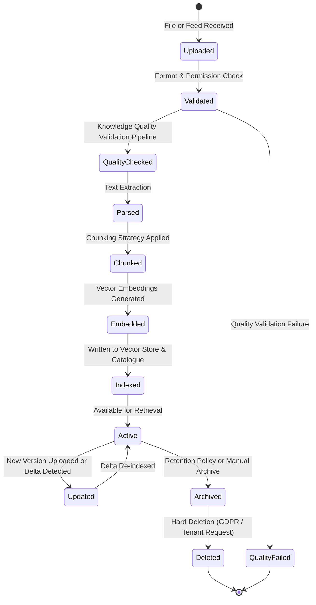
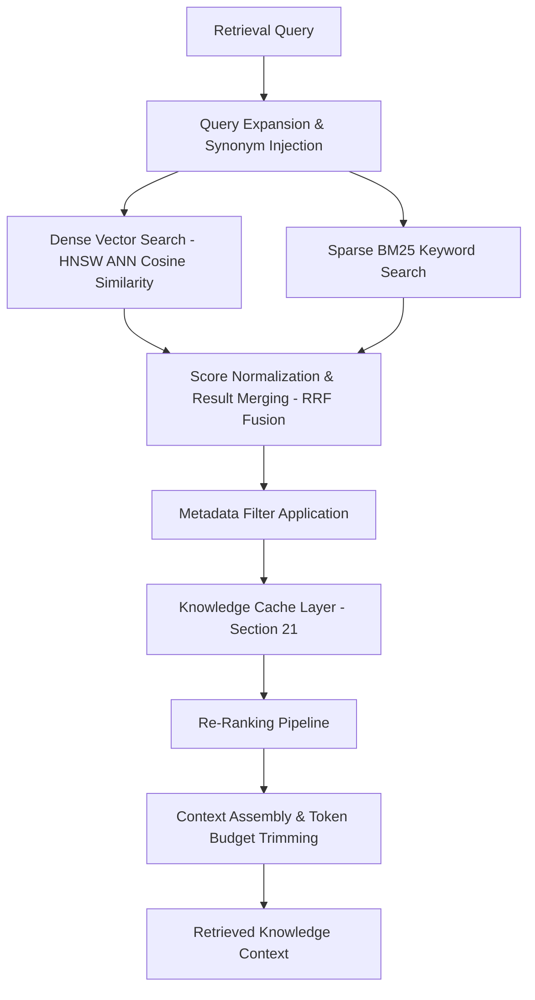
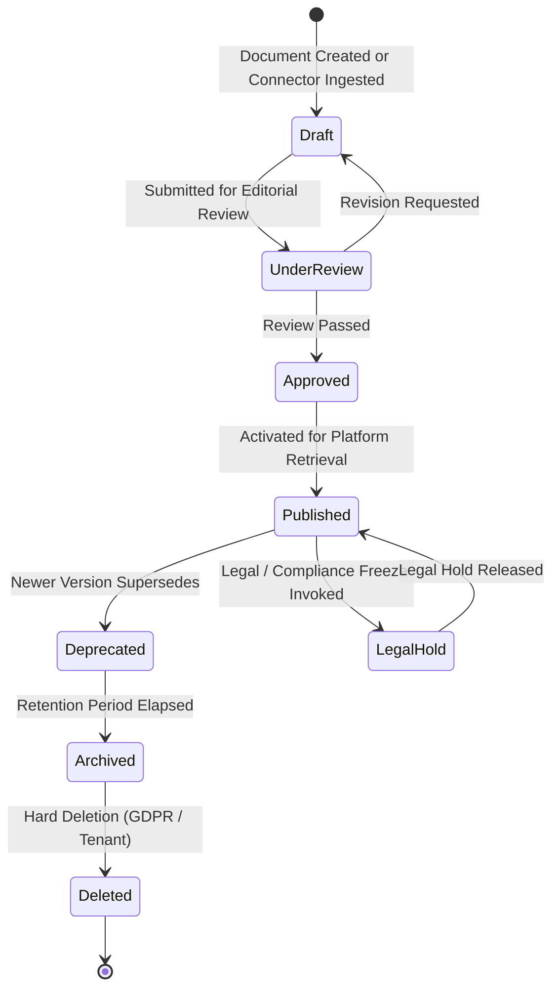
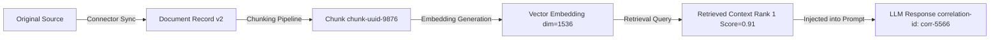
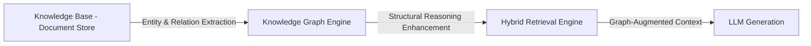
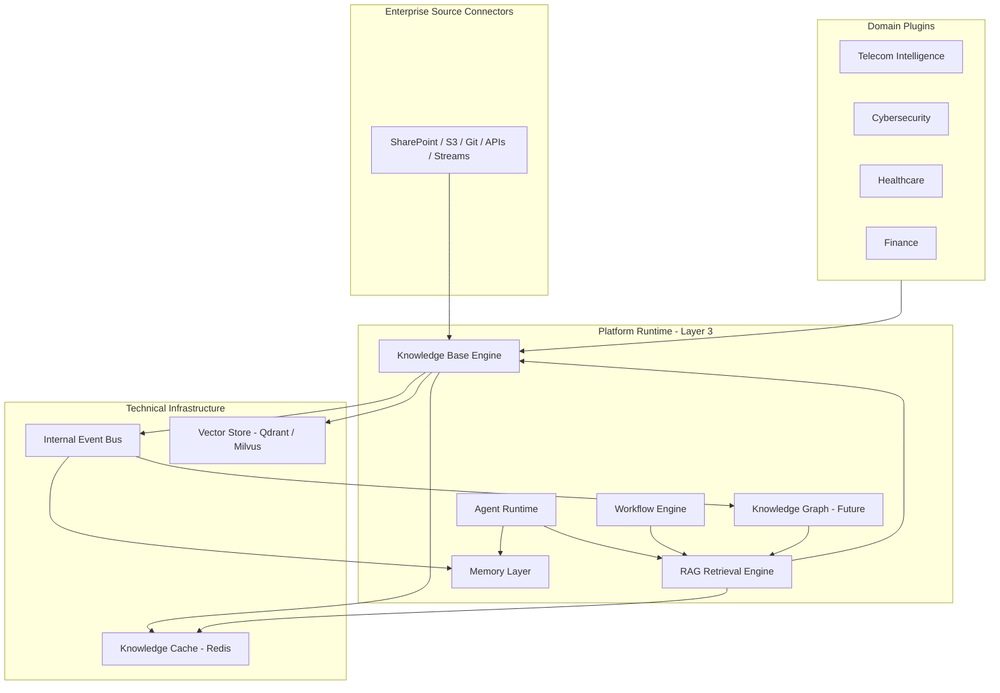
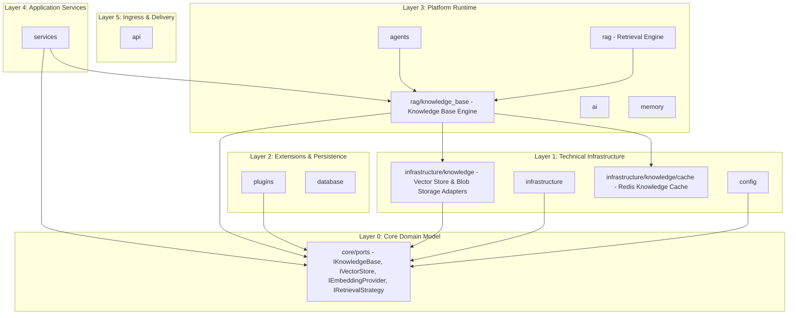

# NeuroFlow AI — Knowledge Base Architecture Specification

**Document Version:** 8.0.0 (Approved Architecture Specification)  
**Status:** Approved Architecture Specification  
**Target Audience:** Lead Architects, Principal Engineers, AI Engineers, Domain Plugin Authors  
**Classification:** Core Platform Capability Architecture  

---

## 1. Executive Summary

As NeuroFlow AI matures into a production-grade enterprise AI platform, domain plugins (Telecom, Cybersecurity, Healthcare, Finance, Cloud, Enterprise Knowledge) require access to rich, structured, and queryable enterprise knowledge. Without a centralized knowledge management subsystem, each plugin would independently implement ad-hoc document loaders, custom vector indices, and private retrieval strategies — creating duplicated logic, security gaps, and zero cross-domain knowledge reuse.

This specification introduces the **NeuroFlow AI Knowledge Base**, the platform's **enterprise knowledge management subsystem**.

> **Critical Clarification**: The Knowledge Base is NOT a Vector Database. It is NOT a RAG implementation. The Knowledge Base is the **complete lifecycle management system for enterprise knowledge**, governing how documents are ingested, parsed, structured, indexed, versioned, retrieved, updated, archived, and deleted.

The underlying Vector Database and RAG retrieval engine are technical subsystems invoked by the Knowledge Base. The Knowledge Base is the authoritative knowledge management layer that sits above them.

---

## 2. Distinction Between Related Platform Concepts

To prevent architectural confusion, the table below defines precise boundaries between related platform concepts:

| Concept | Nature | Scope | Primary Role |
| :--- | :--- | :--- | :--- |
| **Knowledge Base** *(This Layer)* | Enterprise document and knowledge lifecycle management system. | Long-term / Organization-scoped. | Governs document ingestion, parsing, chunking, indexing, versioning, access control, and retrieval coordination. |
| **Memory Layer** | Cognitive experiential learning substrate. | Session-to-permanent / User & Agent-scoped. | Stores and recalls agent experiences, user preferences, and procedural skills acquired at runtime. |
| **RAG (Retrieval-Augmented Generation)** | Retrieval execution pipeline. | On-demand request-time. | Executes hybrid vector + keyword search queries against the Knowledge Base indices to retrieve context for LLM generation. |
| **Knowledge Graph** | Entity-relation structural reasoning engine. | Permanent / Organization-scoped. | Models semantic entity connections and supports multi-hop reasoning queries. |
| **Vector Database** | Low-level vector similarity search engine. | Infrastructure component. | Stores dense vector embeddings and executes ANN similarity searches. A technical dependency OF the Knowledge Base, not the Knowledge Base itself. |

---

## 3. High-Level Knowledge Base Architecture

The Knowledge Base is a five-subsystem platform capability engine operating within **Platform Runtime** (Layer 3):

```
+-----------------------------------------------------------------------------------+
|                       KNOWLEDGE BASE ARCHITECTURE OVERVIEW                        |
+-----------------------------------------------------------------------------------+
|                                                                                   |
|  External Sources:                                                                |
|  [Documents, APIs, Plugin Sources, Feeds, Enterprise Connectors]                  |
|              |                                                                    |
|              v                                                                    |
|  +---------------------------+                                                    |
|  |  1. INGESTION PIPELINE    |   Upload -> Validate -> Parse -> Chunk -> Embed   |
|  +-----------+---------------+                                                    |
|              |                                                                    |
|              v                                                                    |
|  +---------------------------+                                                    |
|  |  2. KNOWLEDGE STORE       |   Vector Index + Metadata DB + Document Store     |
|  +-----------+---------------+                                                    |
|              |                                                                    |
|              v                                                                    |
|  +---------------------------+                                                    |
|  |  3. RETRIEVAL ENGINE      |   Hybrid Search + Re-Ranking + Context Assembly  |
|  +-----------+---------------+                                                    |
|              |                                                                    |
|              v                                                                    |
|  +---------------------------+                                                    |
|  |  4. LIFECYCLE MANAGER     |   Versioning + Freshness + Archival + Deletion   |
|  +-----------+---------------+                                                    |
|              |                                                                    |
|              v                                                                    |
|  +---------------------------+                                                    |
|  |  5. ACCESS CONTROL GATE   |   Tenant Isolation + RBAC + Plugin Sandboxing    |
|  +---------------------------+                                                    |
|                                                                                   |
+-----------------------------------------------------------------------------------+
```

---

## 4. Knowledge Source Connectors

Enterprise knowledge does not arrive exclusively through manual file upload. The Knowledge Base provides a **Source Connector Framework** that enables continuous synchronization from heterogeneous enterprise data sources.



### 4.1 Connector Architecture Responsibilities

| Connector Type | Sync Mechanism | Trigger |
| :--- | :--- | :--- |
| **Local Filesystem** | File-system watcher (inotify / FSEvents). | File create / modify event. |
| **Git Repositories** | Poll latest commit SHA; diff changed files only. | Commit push or scheduled interval. |
| **SharePoint / OneDrive** | Microsoft Graph API delta queries. | Webhook notification or scheduled poll. |
| **Confluence** | Confluence REST API; page version comparison. | Scheduled poll or Webhook. |
| **S3 / Azure Blob / GCS** | Object storage event notifications (S3 EventBridge). | Object PUT/DELETE events. |
| **Google Drive** | Drive API push notifications (Channel + Start Page Token). | File change webhook. |
| **REST APIs** | Periodic API crawl with ETag / Last-Modified comparison. | Scheduled interval. |
| **Relational Databases** | CDC (Change Data Capture) log streaming (Debezium). | Row INSERT / UPDATE events. |
| **Event Streams** | Kafka / NATS consumer subscription. | Message arrival on configured topics. |

### 4.2 Sync Scheduler

The **Sync Scheduler** is a background asynchronous worker (distinct from the request path) responsible for:
- Managing per-connector polling intervals and backoff strategies.
- Detecting source content changes via checksum comparison or version token comparison.
- Delegating changed documents to the Ingestion Pipeline for re-ingestion.
- Recording sync status and last-sync timestamps in the metadata catalogue.

---

## 5. Supported Document Types

The Knowledge Base ingestion pipeline supports the following document types through a modular parser registry:

| Category | Supported Formats |
| :--- | :--- |
| **Text Documents** | `.pdf`, `.docx`, `.doc`, `.txt`, `.rtf`, `.odt` |
| **Structured Data** | `.csv`, `.json`, `.jsonl`, `.xml`, `.yaml` |
| **Markup & Web** | `.html`, `.md`, `.rst` |
| **Presentations** | `.pptx`, `.ppt` |
| **Code & Configs** | `.py`, `.js`, `.ts`, `.sh`, `.toml`, `.ini` |
| **Domain Specific** | Plugin-contributed parsers (e.g., `.pcap` for Telecom, FHIR feeds for Healthcare) |

---

## 6. Knowledge Quality Validation Pipeline

Before any document proceeds to chunking and indexing, it must pass through a dedicated **Knowledge Quality Validation Pipeline**. This pipeline ensures only high-signal content enters the Knowledge Base, preventing garbage-in-garbage-out retrieval degradation.



### 6.1 Validation Stage Definitions

1. **Duplicate Content Detection**: Computes a SHA-256 fingerprint of the parsed document text and checks against existing document checksums in the metadata catalogue. Exact duplicates are rejected; near-duplicates (MinHash similarity > 0.95) are flagged for human review.
2. **OCR Quality Assessment**: For scanned PDFs and image-based documents, evaluates OCR confidence scores per page. Documents with mean confidence below the configured threshold (default: 0.75) are flagged as `LOW_OCR_QUALITY`.
3. **Language Detection & Validation**: Identifies the document language using n-gram frequency analysis. Documents in unsupported languages or with undetectable language profiles are rejected unless a plugin has registered a suitable parser for that language.
4. **Metadata Completeness Check**: Validates mandatory metadata fields (`title`, `domain_namespace`, `source_type`, `tenant_id`). Documents missing required fields are rejected with a structured validation error payload.
5. **Corrupted Document Detection**: Validates binary format headers and structural integrity. Truncated PDFs, malformed JSON, and zero-byte files are rejected immediately.
6. **Parser Confidence Scoring**: Aggregates token-per-page density, extraction completeness ratio, and structured block detection rates into a composite **Parser Confidence Score** ($0.0 - 1.0$). Documents scoring below the configured threshold (default: 0.60) are flagged as `LOW_PARSER_CONFIDENCE` and routed for human review before indexing.

---

## 7. Knowledge Ingestion Pipeline

All knowledge entering the platform traverses a standardized, nine-stage ingestion pipeline (following quality validation in Section 6):



### Stage Definitions
1. **Document Upload / Source Feed**: Accepts binary file uploads, URL crawlers, plugin-contributed knowledge feeds, or event-driven document streams from Source Connectors.
2. **Validation & Format Detection**: Validates file type, MIME header, size quotas, and tenant upload permissions. Rejects malformed or unsupported files cleanly.
3. **Document Parsing & Text Extraction**: Converts binary formats (PDF, DOCX, PPTX, HTML, CSV) into normalized plain text and structured content blocks.
4. **Chunking Strategy Selection & Execution**: Applies the appropriate chunking strategy based on document type and domain configuration.
5. **Metadata Extraction & Enrichment**: Automatically extracts document-level metadata (title, author, source URL, language, creation date, domain namespace, tenant ID).
6. **Embedding Generation**: Invokes the Embedding Provider Abstraction to generate dense vector representations for each chunk.
7. **Vector Store Indexing**: Writes embeddings and metadata payloads into the tenant-scoped vector collection.
8. **Metadata Catalogue Registration**: Persists document-level metadata (version, source, chunk count, ingestion status) into the relational metadata catalogue.
9. **Event Publication**: Publishes `neuroflow.rag.document_ingested` to the Internal Event Bus.

---

## 8. Document Lifecycle State Machine

Every document managed by the Knowledge Base progresses through a deterministic lifecycle:



### Lifecycle Stage Definitions
- **Uploaded**: Binary content received and persisted in raw blob storage.
- **Validated**: File type, size limit, MIME header, and access permissions verified.
- **QualityChecked**: Document passes the six-stage Knowledge Quality Validation Pipeline.
- **Parsed**: Text and structured content extracted from binary format.
- **Chunked**: Text split into retrieval-optimal segments using configured strategy.
- **Embedded**: Dense vector representations computed for all chunks.
- **Indexed**: Embeddings and metadata written into vector store collection and metadata catalogue.
- **Active**: Document fully available for query retrieval.
- **Updated**: New document version or delta change detected, triggering incremental re-indexing.
- **Archived**: Document soft-deleted; excluded from active retrieval but retained for compliance.
- **Deleted**: Permanent hard deletion; all embeddings and chunks removed.

---

## 9. Incremental (Delta) Indexing

Full document re-parsing and re-embedding on every update is computationally wasteful and introduces unnecessary latency. The Knowledge Base supports **Incremental Delta Indexing** to update only the changed portions of a document.

```
+-----------------------------------------------------------------------------------+
|                     INCREMENTAL (DELTA) INDEXING ARCHITECTURE                     |
+-----------------------------------------------------------------------------------+
|  On Document Update Trigger:                                                      |
|                                                                                   |
|  1. DIFF COMPUTATION: Compare new document hash with stored chunk-level hashes.  |
|     Identify Added, Modified, and Deleted chunks.                                |
|                                                                                   |
|  2. SELECTIVE RE-PROCESSING:                                                      |
|     - DELETED chunks: Remove from vector store and metadata catalogue.           |
|     - MODIFIED chunks: Re-parse, re-embed, and replace in vector store.          |
|     - ADDED chunks:    Parse, embed, and insert into vector store.               |
|     - UNCHANGED chunks: No processing. Retain existing embeddings.              |
|                                                                                   |
|  3. VERSION RECORD UPDATE: Increment document version in metadata catalogue.     |
|     Retain all prior chunk-version records for audit trail.                      |
|                                                                                   |
|  RESULT: Embedding cost and indexing latency proportional to change size,        |
|  not total document size.                                                         |
+-----------------------------------------------------------------------------------+
```

---

## 10. Chunking Architecture

Optimal chunk design directly determines RAG retrieval quality. The Knowledge Base implements a five-strategy **Pluggable Chunking Architecture**:

```
+-----------------------------------------------------------------------------------+
|                         CHUNKING STRATEGY REGISTRY                                |
+-----------------------------------------------------------------------------------+
|  1. Fixed-Size Chunking      : Split by token count (e.g., 512 tokens, 128 overlap)|
|  2. Semantic Chunking        : Split at natural sentence/paragraph semantic breaks |
|  3. Hierarchical Chunking    : Parent document + child chunk dual-index strategy   |
|  4. Structure-Aware Chunking : Preserves headers, tables, lists, and code blocks  |
|  5. Plugin-Defined Chunking  : Plugins contribute custom domain-specific parsers   |
+-----------------------------------------------------------------------------------+
```

### 10.1 Fixed-Size Chunking
Splits documents into fixed token windows with configurable overlap. Fastest strategy. Best for homogeneous prose text.

### 10.2 Semantic Chunking
Uses sentence embedding cosine similarity to detect topic boundary shifts. Splits at semantically coherent paragraph boundaries. Best for dense technical documents.

### 10.3 Hierarchical Chunking
Generates two levels of chunks: **Parent Chunks** (large contextual windows, ~2048 tokens) and **Child Chunks** (small precision windows, ~256 tokens). RAG retrieves by Child Chunks but returns Parent Chunk context windows. Balances precision and contextual richness.

### 10.4 Structure-Aware Chunking
Preserves document structure: Markdown headings become chunk boundaries; tables are treated as atomic units; code blocks are preserved as single chunks. Essential for technical manuals, API documentation, and 3GPP specs.

### 10.5 Plugin-Defined Chunking
Domain plugins register custom chunking parsers via `context.knowledge.register_chunker(type_id, parser_fn)`. For example:
- Telecom Plugin: Registers a PCAP log chunker splitting by network conversation flow.
- Healthcare Plugin: Registers a FHIR resource chunker splitting by clinical observation.

---

## 11. Hierarchical Knowledge Collection Model

The Knowledge Base organizes knowledge into a four-level hierarchical structure that supports domain namespacing, multi-tenant isolation, and fine-grained retrieval scoping:

```
+-----------------------------------------------------------------------------------+
|                    HIERARCHICAL KNOWLEDGE COLLECTION MODEL                        |
+-----------------------------------------------------------------------------------+
|                                                                                   |
|  COLLECTION (Tenant-Level Boundary)                                               |
|    └── NAMESPACE (Domain / Plugin Boundary)                                       |
|          └── DOCUMENT (Versioned Document Record)                                  |
|                └── CHUNK (Retrieval-Optimal Text Segment + Embedding)              |
+-----------------------------------------------------------------------------------+
```

### 11.1 Telecom Plugin Example
```
collection: kb_tenant-enterprise-01
  └── namespace: telecom
        ├── document: 3GPP_TS_28.552_v17.pdf (version 2)
        │     ├── chunk_001: "Section 5.1 - Introduction to KPIs" (STRUCTURE_AWARE)
        │     └── chunk_022: "Section 5.3 - Performance Measurement Types" (STRUCTURE_AWARE)
        └── document: PCAP_Anomaly_Report_2026-Q3.pcap (version 1)
              └── chunk_001: "Flow 1: 192.168.1.1 → 10.0.0.2 [TCP SYN flood detected]"
```

### 11.2 Healthcare Plugin Example
```
collection: kb_tenant-healthcare-01
  └── namespace: healthcare
        ├── document: FHIR_R4_Patient_Bundle_2026-08.json (version 1)
        │     ├── chunk_001: "Patient/001 - Observation: Blood Glucose 6.2 mmol/L"
        │     └── chunk_002: "Patient/001 - MedicationRequest: Metformin 500mg"
        └── document: Clinical_Guidelines_Diabetes_Type2_v4.pdf (version 4)
              ├── chunk_001: "Section 3.1 - Diagnostic Criteria (HbA1c ≥ 6.5%)"
              └── chunk_012: "Section 7.4 - Pharmacological Management"
```

---

## 12. Metadata Architecture

Every knowledge chunk is enriched with a multi-layer metadata payload incorporating both technical and enterprise governance metadata:

```json
{
  "document_id": "doc-uuid-1234-5678",
  "chunk_id": "chunk-uuid-9876-4321",
  "tenant_id": "tenant-enterprise-01",
  "domain_namespace": "telecom",
  "source": {
    "file_name": "3GPP_TS_28.552_v17.pdf",
    "source_type": "UPLOAD",
    "source_url": null,
    "ingested_at": "2026-08-01T12:00:00.000Z",
    "checksum_sha256": "e3b0c44298fc1c149afbf4c8996fb92427ae41e4649b934ca495991b7852b855"
  },
  "document_metadata": {
    "title": "3GPP TS 28.552 Management Services",
    "language": "en",
    "version": 2,
    "page_number": 14,
    "section_heading": "5.3 Performance Measurement Types"
  },
  "chunk_metadata": {
    "chunk_index": 22,
    "chunk_strategy": "STRUCTURE_AWARE",
    "token_count": 312,
    "character_count": 1847
  },
  "governance": {
    "owner": "telecom-standards-team",
    "department": "Network Engineering",
    "confidentiality_level": "INTERNAL",
    "compliance_tags": ["3GPP", "GDPR_COMPLIANT", "SOC2"],
    "review_status": "APPROVED",
    "trust_score": 0.95,
    "retention_class": "REGULATORY_7YR",
    "created_by": "user-operator-44",
    "updated_by": "user-operator-44"
  },
  "access_control": {
    "visibility": "ORGANIZATION",
    "allowed_roles": ["analyst", "engineer"]
  }
}
```

### 12.1 Enterprise Governance Metadata Fields

| Field | Type | Description |
| :--- | :--- | :--- |
| `owner` | String | Responsible team or individual accountable for document quality. |
| `department` | String | Organizational department that authored or owns the document. |
| `confidentiality_level` | Enum | `PUBLIC`, `INTERNAL`, `CONFIDENTIAL`, `RESTRICTED`. |
| `compliance_tags` | Array | Applicable regulatory and compliance frameworks (e.g., `GDPR_COMPLIANT`, `HIPAA`, `SOC2`). |
| `review_status` | Enum | `DRAFT`, `UNDER_REVIEW`, `APPROVED`, `DEPRECATED`. |
| `trust_score` | Float | Composite trustworthiness score ($0.0 - 1.0$) influenced by source authority and review status. |
| `retention_class` | String | Retention policy class (e.g., `REGULATORY_7YR`, `OPERATIONAL_1YR`, `INDEFINITE`). |
| `created_by` | String | User or system that created the document record. |
| `updated_by` | String | User or system that last modified the document record. |
| `checksum_sha256` | String | SHA-256 fingerprint of the raw binary source for tamper detection. |

---

## 13. Embedding Provider Abstraction

The Knowledge Base never directly couples to a single embedding vendor SDK. All embedding operations are delegated through the platform's **Embedding Provider Abstraction** port defined in `core/ports/embedding.py`:

```
+-----------------------------------------------------------------------------------+
|                         EMBEDDING PROVIDER ABSTRACTION                            |
+-----------------------------------------------------------------------------------+
|  Knowledge Base Ingestion Pipeline                                                |
|           |                                                                       |
|           v                                                                       |
|  [ IEmbeddingProvider Port ] (core/ports/embedding.py)                            |
|           |                                                                       |
|     +-----+-----+-----+----------+                                                |
|     |           |                |                                                |
|     v           v                v                                                |
|  [OpenAI    [Cohere         [Local HuggingFace                                    |
|   Adapter]   Adapter]        Sentence-Transformer Adapter]                        |
+-----------------------------------------------------------------------------------+
```

This abstraction enables:
- Zero code changes in the ingestion pipeline when switching embedding providers.
- A/B testing different embedding models without reindexing.
- Cost-optimized routing (use local HuggingFace for batch processing, OpenAI for real-time queries).

---

## 14. Vector Store Abstraction

Identical decoupling applies to vector store backends through the `IVectorStore` port:

```
+-----------------------------------------------------------------------------------+
|                         VECTOR STORE ABSTRACTION                                  |
+-----------------------------------------------------------------------------------+
|  Knowledge Base                                                                   |
|      |                                                                            |
|      v                                                                            |
|  [ IVectorStore Port ] (core/ports/vector_store.py)                               |
|      |                                                                            |
|  +---+------+----------+----------+                                               |
|  |          |          |          |                                               |
|  v          v          v          v                                               |
| [Qdrant] [Milvus] [PGVector] [Chroma]                                             |
+-----------------------------------------------------------------------------------+
```

All collection naming follows tenant-scoped conventions:  
`kb_{tenant_id}_{domain_namespace}_{collection_name}`

---

## 15. Hybrid Retrieval Architecture

The Knowledge Base retrieval engine executes **Hybrid Retrieval** combining dense semantic vector search with sparse BM25 keyword search for maximum recall:



### Reciprocal Rank Fusion (RRF)
Dense vector and sparse BM25 results are merged using **Reciprocal Rank Fusion**:

$$\text{RRF}(d) = \sum_{r \in R} \frac{1}{k + r(d)}$$

Where $r(d)$ is the rank of document $d$ in result set $R$, and $k = 60$ is the smoothing constant.

---

## 16. Re-Ranking Pipeline

Retrieved candidate chunks undergo a two-stage re-ranking pipeline before final context assembly:

```
+-----------------------------------------------------------------------------------+
|                        RE-RANKING PIPELINE                                        |
+-----------------------------------------------------------------------------------+
|  Stage 1: Cross-Encoder Re-Ranking                                                |
|  - Applies a cross-encoder model (e.g., ms-marco-MiniLM) scoring query-chunk      |
|    relevance jointly (not independently as in bi-encoder retrieval).              |
|                                                                                   |
|  Stage 2: Confidence & Freshness Score Boost                                      |
|  - Adjusts scores upward for recently updated documents.                          |
|  - Applies domain namespace preference weights if configured by plugin.           |
|  - Applies Trust Score weight from governance metadata.                           |
+-----------------------------------------------------------------------------------+
```

---

## 17. Retrieval Strategy Registry

The Knowledge Base exposes a **Retrieval Strategy Registry**, enabling the platform and plugins to select the most appropriate retrieval strategy for each request type. All strategies implement the `IRetrievalStrategy` port defined in `core/ports/knowledge.py`.

```
+-----------------------------------------------------------------------------------+
|                         RETRIEVAL STRATEGY REGISTRY                               |
+-----------------------------------------------------------------------------------+
|  Strategy ID           | Description                                              |
|  ----------------------+----------------------------------------------------------+
|  HYBRID_RETRIEVAL      | Dense vector + BM25 sparse merged via RRF (Default)      |
|  DENSE_RETRIEVAL       | Semantic ANN vector search only. High recall for concepts.|
|  SPARSE_RETRIEVAL      | BM25 keyword search only. Best for exact term matching.  |
|  METADATA_RETRIEVAL    | Structured filter-only queries (no vector search).       |
|  GRAPH_RETRIEVAL       | Future: Knowledge Graph multi-hop traversal queries.     |
|  PLUGIN_RETRIEVAL      | Plugin-registered custom retrieval strategy.              |
|  FEDERATED_RETRIEVAL   | Future: Query across multiple Knowledge Base instances.  |
+-----------------------------------------------------------------------------------+
```

### Strategy Selection Logic
- Default strategy for all requests: `HYBRID_RETRIEVAL`.
- Plugins may declare a preferred strategy via `context.knowledge.search(query, strategy="SPARSE_RETRIEVAL")`.
- Future: An intelligent **Retrieval Strategy Router** will automatically select the optimal strategy based on query analysis.

---

## 18. Multi-Tenant Isolation

The Knowledge Base enforces hard multi-tenant isolation at three layers:

1. **Storage Isolation**: Every tenant's knowledge is stored in prefixed vector collections and separate relational schema rows. Queries are automatically scoped with `WHERE tenant_id = :current_tenant`.
2. **Access Control Gate**: Every retrieval request passes through an Access Control Gate validating tenant context, document visibility scope, and requester role.
3. **Plugin Namespace Isolation**: Plugins contribute knowledge into domain-namespaced sub-collections (`kb_{tenant_id}_telecom_standards`). A Cybersecurity plugin cannot read Telecom plugin knowledge without explicit tenant permission grants.

---

## 19. Access Control

Document-level access control uses a **Role-Based Access Control (RBAC)** model extended with domain namespace scoping:

| Scope | Description |
| :--- | :--- |
| `PUBLIC_READ` | Readable by all authenticated users within the tenant. |
| `ROLE_RESTRICTED` | Readable only by users with specific role assignments. |
| `PLUGIN_PRIVATE` | Readable only by the plugin that contributed the document. |
| `ADMIN_ONLY` | Readable only by platform administrators. |

---

## 20. Knowledge Governance Lifecycle

Enterprise knowledge assets require formal governance beyond technical document versioning. The Knowledge Base implements a seven-state **Knowledge Governance Lifecycle** governing editorial approval, compliance holds, and structured retirement.



### Governance State Definitions
- **Draft**: Document is undergoing authoring or has been auto-ingested by a Source Connector but has not been formally reviewed.
- **Under Review**: Document is assigned to a reviewer. Retrieval is disabled for this version.
- **Approved**: Document content has been verified. Ready for activation.
- **Published**: Document is fully active and available for all authorized retrieval queries.
- **Deprecated**: A newer document version has superseded this document. Excluded from primary retrieval but still accessible via version history.
- **Archived**: Document has reached the end of its retention lifecycle. Excluded from all retrieval. Retained in cold storage for compliance.
- **Legal Hold**: Document is frozen under a legal compliance instruction. Cannot be archived, deleted, or modified until hold is released.

---

## 21. Knowledge Cache Layer

To minimize repeated vector store queries and reduce LLM context assembly latency, the Knowledge Base introduces a **Knowledge Cache Layer** positioned between the Retrieval Engine and LLM context assembly:

```
+-----------------------------------------------------------------------------------+
|                           KNOWLEDGE CACHE LAYER                                   |
+-----------------------------------------------------------------------------------+
|                                                                                   |
|  Retrieval Engine Result Sets                                                     |
|              |                                                                    |
|              v                                                                    |
|  +-------------------------------+                                                |
|  |  1. Semantic Cache            |                                                |
|  |  - Caches full retrieval      |                                                |
|  |    results keyed by semantic  |                                                |
|  |    query embedding hash.      |                                                |
|  |  - Cache hit if cosine sim    |                                                |
|  |    > 0.98 with a past query.  |                                                |
|  +-------------------------------+                                                |
|              |                                                                    |
|              v                                                                    |
|  +-------------------------------+                                                |
|  |  2. Hot Document Cache        |                                                |
|  |  - Caches raw chunk text for  |                                                |
|  |    the top-K most frequently  |                                                |
|  |    retrieved document chunks. |                                                |
|  |  - Invalidated on document    |                                                |
|  |    update or TTL expiry.      |                                                |
|  +-------------------------------+                                                |
|              |                                                                    |
|              v                                                                    |
|  +-------------------------------+                                                |
|  |  3. Redis-Based Acceleration  |                                                |
|  |  - Both caches backed by      |                                                |
|  |    Redis with per-tenant key  |                                                |
|  |    namespacing.               |                                                |
|  |  - Cache TTL: Configurable    |                                                |
|  |    per namespace (default 1h).|                                                |
|  +-------------------------------+                                                |
|                                                                                   |
+-----------------------------------------------------------------------------------+
```

### Cache Invalidation Policy
- Document updates trigger targeted cache invalidation for all keys associated with the modified document's chunks.
- Governance state transitions (`Published` → `Deprecated`) immediately flush all cache entries for the deprecated document.

---

## 22. Knowledge Freshness & Synchronization

Enterprise knowledge changes frequently. The Knowledge Base implements a **Freshness Management System**:

```
+-----------------------------------------------------------------------------------+
|                       KNOWLEDGE FRESHNESS MANAGEMENT                              |
+-----------------------------------------------------------------------------------+
|  1. DOCUMENT VERSIONING: Every document update creates a new version record.      |
|     Previous versions are retained for archival and rollback.                    |
|                                                                                   |
|  2. TTL (Time-to-Live) POLICIES: Documents can declare optional expiry dates.    |
|     Expired documents are automatically archived.                                |
|                                                                                   |
|  3. SOURCE SYNCHRONIZATION: Enterprise Source Connectors (Section 4) poll or     |
|     receive push notifications from external systems for content updates,         |
|     triggering incremental delta re-indexing (Section 9).                        |
+-----------------------------------------------------------------------------------+
```

---

## 23. Knowledge Lineage & Provenance

Every knowledge artifact in the platform must be traceable from its origin source to the final LLM response it influences. The **Knowledge Lineage System** captures a complete, queryable provenance chain.



### Lineage Record Structure

```json
{
  "lineage": {
    "source_url": "https://sharepoint.enterprise.com/sites/telecom/3GPP_TS_28.552_v17.pdf",
    "document_id": "doc-uuid-1234-5678",
    "document_version": 2,
    "chunk_id": "chunk-uuid-9876-4321",
    "embedding_model": "text-embedding-3-large",
    "retrieval_score": 0.91,
    "retrieval_strategy": "HYBRID_RETRIEVAL",
    "correlation_id": "corr-9876-4321",
    "retrieved_at": "2026-08-01T12:05:00.000Z"
  }
}
```

This lineage data enables:
- **Explainability**: Engineers can trace exactly which source document fragment influenced an LLM response.
- **Debugging**: Failed retrievals or hallucinations can be traced to specific missing or outdated chunks.
- **Compliance**: Regulators can audit which documents were referenced in AI-generated outputs.

---

## 24. Plugin Contribution Model

Domain plugins contribute domain-specific knowledge to the platform Knowledge Base through the `NeuroFlowPluginContext`:

```
+-----------------------------------------------------------------------------------+
|                       PLUGIN KNOWLEDGE CONTRIBUTION MODEL                         |
+-----------------------------------------------------------------------------------+
|  Plugin Registration Capabilities:                                                |
|  - Register Custom Document Parsers: context.knowledge.register_parser(type, fn) |
|  - Register Custom Chunking Strategies: context.knowledge.register_chunker(...)  |
|  - Register Custom Retrieval Strategies: context.knowledge.register_retriever(..) |
|  - Ingest Domain Documents: context.knowledge.ingest(documents, namespace)       |
|  - Query Knowledge Base: context.knowledge.search(query, namespace, filters)     |
+-----------------------------------------------------------------------------------+
```

Plugins operate exclusively within their own domain namespace. Cross-namespace queries require explicit tenant permission grants.

---

## 25. Event Bus Integration

The Knowledge Base publishes and subscribes to the Internal Event Bus for asynchronous coordination:

**Published Events** (outbound):
- `neuroflow.rag.document_ingested`: After successful document indexing.
- `neuroflow.rag.embedding_created`: After embedding generation completes.
- `neuroflow.rag.document_archived`: After a document is archived.
- `neuroflow.rag.document_quality_failed`: When a document fails the Quality Validation Pipeline.

**Subscribed Events** (inbound):
- `neuroflow.plugin.loaded`: Triggers validation of plugin knowledge namespace registration.
- `neuroflow.system.started`: Triggers Sync Scheduler initialization for registered connectors.

---

## 26. Memory Layer Integration

The Memory Layer and Knowledge Base serve distinct but complementary roles:

```
+-----------------------------------------------------------------------------------+
|                      MEMORY & KNOWLEDGE BASE INTEGRATION                          |
+-----------------------------------------------------------------------------------+
|  Knowledge Base               Memory Layer                                        |
|  - Static enterprise docs.    - Dynamic runtime experiences.                      |
|  - Admin-curated knowledge.   - Agent-generated preferences and skills.           |
|                                                                                   |
|  Integration Point:                                                               |
|  - Agent Episodic Memory can REFERENCE a Knowledge Base document                 |
|    (via document_id) for provenance without duplicating content.                 |
|  - Memory Semantic tier stores user preferences about KB query behavior.          |
+-----------------------------------------------------------------------------------+
```

---

## 27. Future Knowledge Graph Integration

The Knowledge Base is designed as the foundational entity extraction source for the future Knowledge Graph engine:



- Knowledge Base documents are the raw text sources from which Knowledge Graph entity nodes and relation edges are extracted.
- Once the Knowledge Graph is active, retrieval results are enriched with multi-hop graph traversals (Graph-RAG pattern).
- The `GRAPH_RETRIEVAL` strategy in the Retrieval Strategy Registry (Section 17) will delegate to the Knowledge Graph engine when available.

---

## 28. Platform Ecosystem Architecture Diagram

The following diagram illustrates how the Knowledge Base integrates within the complete NeuroFlow AI platform ecosystem:



---

## 29. Observability & Operational Metrics

The Knowledge Base exports OpenTelemetry-compatible metrics:

| Metric Name | Type | Description |
| :--- | :--- | :--- |
| `neuroflow_kb_documents_total` | Counter | Total documents indexed per tenant per namespace. |
| `neuroflow_kb_ingestion_duration_seconds` | Histogram | End-to-end ingestion pipeline duration. |
| `neuroflow_kb_quality_failed_total` | Counter | Total documents rejected by Quality Validation Pipeline. |
| `neuroflow_kb_retrieval_hit_ratio` | Gauge | Fraction of retrieval queries returning $\geq 1$ result. |
| `neuroflow_kb_retrieval_latency_ms` | Histogram | Full retrieval + re-ranking duration. |
| `neuroflow_kb_cache_hit_ratio` | Gauge | Fraction of retrieval queries served from Knowledge Cache Layer. |
| `neuroflow_kb_embedding_cost_tokens_total` | Counter | Total tokens consumed for embedding generation. |
| `neuroflow_kb_chunks_total` | Counter | Total active chunks per collection per tenant. |
| `neuroflow_kb_delta_index_ratio` | Gauge | Fraction of update operations handled via Delta Indexing vs full re-index. |

---

## 30. Failure Handling

| Failure Type | Detection | Recovery |
| :--- | :--- | :--- |
| **Parse Failure** | Parser exception caught in pipeline. | Move document to `PARSE_FAILED` state; publish DLQ event; notify administrator. |
| **Quality Validation Failure** | Validation stage threshold breach. | Move to `QUALITY_FAILED` state; publish `neuroflow.rag.document_quality_failed`; route to manual review queue. |
| **Connector Sync Failure** | Connector polling exception or auth failure. | Exponential backoff retry; alert SRE on repeated failures; Sync Scheduler marks connector as `DEGRADED`. |
| **Embedding Provider Error** | API timeout or rate limit response. | Exponential backoff retry (3 attempts); fall back to secondary embedding provider. |
| **Vector Store Write Failure** | DB write exception. | Retry with exponential backoff; persist to staging queue for deferred re-index. |
| **Cache Invalidation Failure** | Redis write failure on document update. | Log warning; allow stale cache TTL expiry as eventual fallback. |
| **Ingestion Timeout** | Background worker exceeds configured timeout. | Mark document as `INGESTION_STALLED`; alert operator; allow manual retry trigger. |

---

## 31. Clean Architecture Dependency Diagram



---

## 32. Repository Impact Assessment

### Physical Repository Structure Strategy
- **Core Ports (Layer 0)**: Abstract interfaces (`IKnowledgeBase`, `IDocumentParser`, `IChunkingStrategy`, `IEmbeddingProvider`, `IVectorStore`, `IRetrievalStrategy`) reside in `backend/core/ports/knowledge.py`.
- **Infrastructure Adapters (Layer 1)**: Concrete vector store adapters (Qdrant, PGVector) and blob storage adapters (S3, local filesystem) reside in `backend/infrastructure/knowledge/`. Redis Knowledge Cache adapter resides in `backend/infrastructure/knowledge/cache/`.
- **Source Connector Framework**: Connector adapters (SharePoint, Git, S3, Confluence) reside in `backend/infrastructure/connectors/`.
- **Platform Engine (Layer 3)**: Knowledge Base ingestion pipeline, chunking registry, retrieval engine, quality validation pipeline, delta indexing logic, re-ranking pipeline, and freshness manager reside inside `backend/rag/`.

---

## 33. ADR Recommendation

This specification establishes **ADR-006: Knowledge Base Architecture** in the project record.

### ADR Summary
- **Title**: ADR-006: Enterprise Knowledge Base Architecture
- **Status**: Approved
- **Deciders**: Principal Software Architect, Lead Architect
- **Key Decision**: Establish a domain-agnostic enterprise Knowledge Base as the complete document lifecycle management system residing in Platform Runtime (`backend/rag/`), exposing abstract interfaces via `core/ports/knowledge.py`, technical adapters via `infrastructure/knowledge/`, and Source Connector adapters via `infrastructure/connectors/`.

---

**End of Knowledge Base Architecture Specification**
