# NeuroFlow AI — Knowledge Graph Architecture Specification

**Document Version:** 10.0.0 (Approved Architecture Specification)  
**Status:** Approved Architecture Specification  
**Target Audience:** Lead Architects, Principal Engineers, AI Engineers, Domain Plugin Authors  
**Classification:** Core Platform Capability Architecture  

---

## 1. Why a Knowledge Graph is Required

NeuroFlow AI's Knowledge Base provides world-class enterprise document management: ingestion, chunking, embedding, versioning, and hybrid retrieval. However, a document store — even one with sophisticated vector retrieval — is fundamentally a **bag of isolated fragments**. It answers the question *"Which chunks are semantically similar to this query?"*, but cannot answer:

- *"What is the relationship between entity A and entity B across multiple documents?"*
- *"Why did the platform conclude that this anomaly is related to this network element?"*
- *"Who depends on this API, and what happens if it goes offline?"*
- *"Trace all clinical observations for this patient cohort from this drug trial."*

These are questions of **semantic structure**, **multi-hop reasoning**, and **explainability** — capabilities that are architecturally impossible with a vector retrieval system alone.

The **Knowledge Graph** is the semantic reasoning layer of NeuroFlow AI. It models **entities**, **relationships**, **domain knowledge**, **provenance**, and **explainable reasoning pathways** across all platform plugins. It transforms unstructured knowledge fragments into a traversable, queryable, and explainable semantic network.

### Core Capabilities Unlocked by the Knowledge Graph

| Capability | Without Knowledge Graph | With Knowledge Graph |
| :--- | :--- | :--- |
| **Multi-hop reasoning** | Impossible — retrieval is single-document. | Traverse entity chains across multiple sources. |
| **Explainability** | LLM "black box" — no reasoning path. | Reasoning paths auditable as graph traversals. |
| **Entity deduplication** | Same entity described in 100 documents = 100 unlinked fragments. | Resolved to a single canonical entity node. |
| **Cross-domain inference** | Each plugin is isolated. | Telecom + Cybersecurity + Cloud entities linked. |
| **Provenance tracking** | Source citation only. | Full entity-level lineage from source to LLM output. |
| **Ontology-driven queries** | Free-text similarity only. | Structured semantic queries over typed entities and relations. |

---

## 2. Distinction Between Related Platform Concepts

Precise concept boundaries are essential to prevent architectural confusion:

| Concept | Nature | Scope | Primary Role |
| :--- | :--- | :--- | :--- |
| **Knowledge Graph** *(This Layer)* | Semantic reasoning and entity-relation model. | Permanent / Organization-scoped. | Models entities, relationships, ontologies, and multi-hop reasoning paths across all platform knowledge. |
| **Knowledge Base** | Enterprise document and knowledge lifecycle management. | Long-term / Organization-scoped. | Governs document ingestion, chunking, embedding, versioning, retrieval coordination, and governance lifecycle. |
| **Memory Layer** | Cognitive experiential learning substrate. | Session-to-permanent / User & Agent-scoped. | Stores and recalls agent experiences, user preferences, and procedural skills acquired at runtime. |
| **RAG (Retrieval-Augmented Generation)** | Retrieval execution pipeline. | On-demand request-time. | Executes hybrid vector + keyword queries against Knowledge Base indices to retrieve context for LLM generation. |
| **Vector Database** | Low-level vector similarity search engine. | Infrastructure component. | Stores dense vector embeddings and executes ANN similarity searches. |

### The Critical Distinction: Knowledge Base vs. Knowledge Graph

```
+-----------------------------------------------------------------------------------+
|  KNOWLEDGE BASE                         KNOWLEDGE GRAPH                           |
|  - Manages document lifecycle.          - Models entities and relations.           |
|  - Answers: "Find chunks about X"       - Answers: "How is A related to B?"       |
|  - Retrieves by semantic similarity.    - Traverses typed relationship edges.      |
|  - Input: Documents, files, feeds.      - Input: Extracted entities from KB docs.  |
|  - Output: Text chunks for LLM prompt.  - Output: Semantic reasoning paths.        |
|  - Store: Vector DB + Metadata DB.      - Store: Graph DB (nodes + edges).         |
+-----------------------------------------------------------------------------------+
```

The Knowledge Graph is the **semantic layer built on top of** the Knowledge Base. Knowledge Base documents are the raw source from which Knowledge Graph entities and relationships are extracted.

---

## 3. High-Level Knowledge Graph Architecture

The Knowledge Graph operates as a six-subsystem platform capability within **Platform Runtime (Layer 3)**:

```
+-----------------------------------------------------------------------------------+
|                     KNOWLEDGE GRAPH ARCHITECTURE OVERVIEW                         |
+-----------------------------------------------------------------------------------+
|                                                                                   |
|  Input: Knowledge Base Documents (Chunks + Metadata)                              |
|              |                                                                    |
|              v                                                                    |
|  +---------------------------+                                                    |
|  |  1. ENTITY EXTRACTION     |   NER + Coreference + Ontology Alignment          |
|  +-----------+---------------+                                                    |
|              |                                                                    |
|              v                                                                    |
|  +---------------------------+                                                    |
|  |  2. RELATION EXTRACTION   |   RE Models + Dependency Parsing + Rules Engine   |
|  +-----------+---------------+                                                    |
|              |                                                                    |
|              v                                                                    |
|  +---------------------------+                                                    |
|  |  3. ENTITY RESOLUTION     |   Deduplication + Canonical Entity Merging        |
|  +-----------+---------------+                                                    |
|              |                                                                    |
|              v                                                                    |
|  +---------------------------+                                                    |
|  |  4. GRAPH STORE           |   Graph DB (IGraphStore Port) + Ontology Registry |
|  +-----------+---------------+                                                    |
|              |                                                                    |
|              v                                                                    |
|  +---------------------------+                                                    |
|  |  5. TRAVERSAL ENGINE      |   Path Finding + Subgraph Extraction + Ranking    |
|  +-----------+---------------+                                                    |
|              |                                                                    |
|              v                                                                    |
|  +---------------------------+                                                    |
|  |  6. REASONING ENGINE      |   Explainable Inference + Graph-RAG Assembly     |
|  +---------------------------+                                                    |
|                                                                                   |
+-----------------------------------------------------------------------------------+
```

---

## 4. Graph Ontology Architecture

The ontology is the **semantic schema** of the Knowledge Graph. It defines which entity types exist, which relationship types are permitted between them, and what constraints govern graph structure.

```mermaid
graph TD
    subgraph CoreOntology [Platform Core Ontology - Domain Agnostic]
        E_ENTITY[Entity]
        E_EVENT[Event]
        E_AGENT[Agent]
        E_LOCATION[Location]
        E_CONCEPT[Concept]
        E_DOCUMENT[Document]
        E_ORGANIZATION[Organization]
    end

    subgraph TelecomOntology [Telecom Domain Ontology Extension]
        T_NE[NetworkElement]
        T_KPI[KPIMetric]
        T_ALARM[NetworkAlarm]
        T_PROTOCOL[Protocol]
    end

    subgraph CybersecOntology [Cybersecurity Domain Ontology Extension]
        C_THREAT[ThreatActor]
        C_CVE[Vulnerability - CVE]
        C_ASSET[DigitalAsset]
        C_IOC[IndicatorOfCompromise]
    end

    subgraph HealthcareOntology [Healthcare Domain Ontology Extension]
        H_PATIENT[PatientCohort]
        H_CONDITION[ClinicalCondition]
        H_DRUG[TherapeuticAgent]
        H_TRIAL[ClinicalTrial]
    end

    E_ENTITY --> T_NE
    E_ENTITY --> C_THREAT
    E_ENTITY --> H_PATIENT
    E_CONCEPT --> T_KPI
    E_CONCEPT --> C_CVE
    E_CONCEPT --> H_CONDITION
    E_EVENT --> T_ALARM
    E_EVENT --> C_IOC
```

### 4.1 Ontology Layers

| Layer | Owner | Scope | Mutability |
| :--- | :--- | :--- | :--- |
| **Core Ontology** | Platform (NeuroFlow AI team) | All plugins, all tenants. | Immutable at runtime. Changes require ADR. |
| **Domain Ontology** | Domain plugin author. | Plugin-specific entity types. | Registered at plugin load time. |
| **Tenant Ontology** | Tenant administrator. | Tenant-specific entity subclasses. | Mutable by tenant admin only. |

---

## 5. Entity Model

Every node in the Knowledge Graph is a typed **Entity** with a canonical identity, attribute payload, and provenance reference.

### 5.1 Core Entity Schema

```json
{
  "entity_id": "entity-uuid-4a2b-11ef",
  "canonical_label": "Nokia 5G Base Station - Site 44",
  "entity_type": "NetworkElement",
  "ontology_namespace": "telecom",
  "tenant_id": "tenant-enterprise-01",
  "attributes": {
    "vendor": "Nokia",
    "model": "AirScale 64T64R",
    "location": "Site-44-Berlin",
    "frequency_band": "n78",
    "status": "ACTIVE"
  },
  "aliases": ["NE-SITE44-NKA", "AirScale-Site44", "BS-44-Berlin"],
  "trust_score": 0.97,
  "confidence": 0.92,
  "version": 3,
  "temporal": {
    "valid_from": "2024-01-01T00:00:00.000Z",
    "valid_until": null
  },
  "governance": {
    "created_by": "entity-extractor-pipeline",
    "reviewed_by": "user-operator-22",
    "status": "APPROVED"
  },
  "provenance": {
    "source_document_ids": ["doc-uuid-1234", "doc-uuid-5678"],
    "chunk_ids": ["chunk-uuid-001", "chunk-uuid-089"],
    "extraction_model": "bert-base-ner-v2",
    "extracted_at": "2026-08-01T12:00:00.000Z"
  }
}
```

### 5.2 Platform Core Entity Types

| Entity Type | Description | Example |
| :--- | :--- | :--- |
| `Entity` | Base class. All typed entities inherit. | — |
| `Organization` | Any structured organization or institution. | "Nokia", "WHO", "AWS" |
| `Agent` | Human or AI actor performing actions. | "network-ops-team", "NeuroFlow Agent" |
| `Location` | Physical or logical location. | "Berlin-DC-01", "subnet-10.0.0.0/24" |
| `Concept` | Abstract domain concept or standard. | "3GPP TS 28.552", "CVE-2024-1234" |
| `Document` | Linked Knowledge Base document. | "3GPP_TS_28.552_v17.pdf" |
| `Event` | Time-bound occurrence. | "Network Alarm 2026-08-01", "Security Incident" |

---

## 6. Relationship Model

Edges in the Knowledge Graph represent typed, directed, weighted relationships between entity nodes.

### 6.1 Core Relationship Schema

```json
{
  "relationship_id": "rel-uuid-7c3d-22af",
  "source_entity_id": "entity-uuid-4a2b-11ef",
  "target_entity_id": "entity-uuid-9f1c-55aa",
  "relationship_type": "GENERATES_ALARM",
  "ontology_namespace": "telecom",
  "tenant_id": "tenant-enterprise-01",
  "attributes": {
    "alarm_severity": "CRITICAL",
    "frequency": 14,
    "first_observed": "2026-07-15T08:00:00.000Z",
    "last_observed": "2026-08-01T11:45:00.000Z"
  },
  "weight": 0.88,
  "confidence": 0.91,
  "version": 2,
  "temporal": {
    "valid_from": "2026-07-15T08:00:00.000Z",
    "valid_until": null
  },
  "provenance": {
    "source_document_ids": ["doc-uuid-1234"],
    "chunk_ids": ["chunk-uuid-023"],
    "extraction_model": "re-bert-v3"
  }
}
```

### 6.2 Platform Core Relationship Types

| Relationship | Direction | Description |
| :--- | :--- | :--- |
| `IS_A` | Entity → EntityType | Ontological classification. |
| `PART_OF` | Entity → Entity | Compositional containment. |
| `DEPENDS_ON` | Entity → Entity | Operational or functional dependency. |
| `GENERATES` | Entity → Event | Entity produces an event. |
| `CAUSES` | Event → Event | Causal chain between events. |
| `LOCATED_AT` | Entity → Location | Physical or logical placement. |
| `OWNED_BY` | Entity → Organization | Ownership attribution. |
| `DOCUMENTED_IN` | Entity → Document | Evidence provenance link. |
| `RELATED_TO` | Entity → Entity | General semantic association. |
| `SUPERSEDES` | Entity → Entity | Version or successor relationship. |
| `SAME_AS` | Entity → Entity | Entity merge alias link. |

---

## 7. Knowledge Ingestion into the Graph

Knowledge Graph ingestion is triggered by the Internal Event Bus, consuming `neuroflow.rag.document_ingested` events published by the Knowledge Base upon successful document indexing.

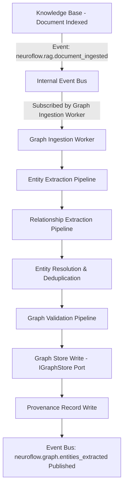

### Ingestion Trigger Events

| Event | Source | Action |
| :--- | :--- | :--- |
| `neuroflow.rag.document_ingested` | Knowledge Base | Full entity + relation extraction from new document. |
| `neuroflow.rag.document_archived` | Knowledge Base | Mark all associated entity nodes as `DEPRECATED`. |
| `neuroflow.plugin.loaded` | Plugin Registry | Register plugin ontology extension into ontology registry. |

---

## 8. Entity Extraction Pipeline

The Entity Extraction Pipeline transforms raw Knowledge Base chunk text into typed, ontology-aligned entity node candidates.

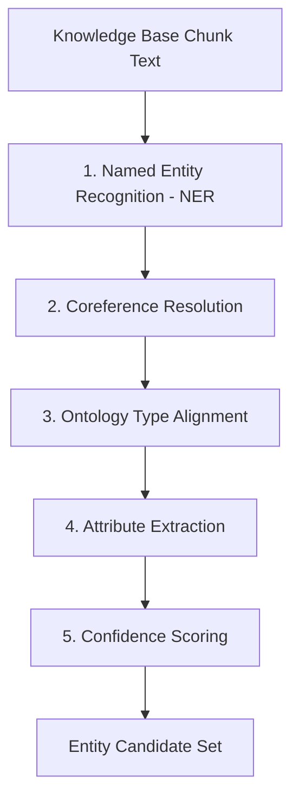

### Stage Definitions

1. **Named Entity Recognition (NER)**: Applies a fine-tuned NER model to extract entity mentions from raw chunk text. The NER model is domain-configurable — plugins may register domain-specific NER models via the `IEntityExtractor` port.
2. **Coreference Resolution**: Resolves pronoun and nominal references (e.g., "it", "this device", "the aforementioned system") to their canonical entity mentions within the document scope.
3. **Ontology Type Alignment**: Maps raw NER labels (e.g., `ORG`, `PRODUCT`, `LOC`) to typed ontology entity classes (e.g., `Organization`, `NetworkElement`, `Location`). Unmapped types are classified as generic `Entity` nodes.
4. **Attribute Extraction**: Extracts attribute key-value pairs for the entity from surrounding context (e.g., "vendor: Nokia", "location: Berlin").
5. **Confidence Scoring**: Assigns an extraction confidence score ($0.0-1.0$) based on model certainty, context richness, and ontology alignment quality.

---

## 9. Relationship Extraction Pipeline

The Relationship Extraction Pipeline identifies semantic relationships between extracted entity candidates.

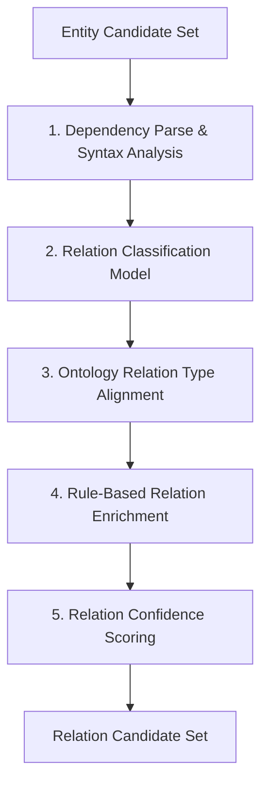

### Stage Definitions

1. **Dependency Parse & Syntax Analysis**: Constructs a dependency parse tree to identify subject-verb-object triples and prepositional phrase attachments between entity candidates.
2. **Relation Classification Model**: Applies a fine-tuned Relation Extraction (RE) model to classify the relationship type between entity pairs extracted from the same sentence or paragraph window.
3. **Ontology Relation Type Alignment**: Maps raw extracted relation labels to typed ontology relationship classes (e.g., raw "manages" → `PART_OF`; raw "triggers" → `GENERATES`).
4. **Rule-Based Relation Enrichment**: Applies deterministic rule templates registered by plugins (e.g., "If `NetworkAlarm` is extracted and `NetworkElement` is in the same context window, assert `GENERATES_ALARM` relation with weight 0.90").
5. **Relation Confidence Scoring**: Assigns a confidence score to each relation candidate based on model confidence, rule certainty, and co-occurrence frequency.

---

## 10. Entity Resolution & Deduplication

The same real-world entity may be mentioned across hundreds of documents under different names, abbreviations, or identifier schemes. Entity Resolution consolidates all references into a single **canonical entity node**.

```
+-----------------------------------------------------------------------------------+
|                       ENTITY RESOLUTION PIPELINE                                  |
+-----------------------------------------------------------------------------------+
|                                                                                   |
|  Stage 1: EXACT MATCH RESOLUTION                                                  |
|  - Hash-match entity label against existing canonical entity labels.              |
|  - Match: Merge mention into existing node, increment reference count.            |
|                                                                                   |
|  Stage 2: ALIAS RESOLUTION                                                        |
|  - Match against known aliases registered in the entity's alias list.            |
|  - Example: "NE-SITE44", "Nokia-S44", "BS44-Berlin" → all resolve to entity-4a2b.|
|                                                                                   |
|  Stage 3: FUZZY STRING MATCH                                                      |
|  - Apply edit-distance similarity (Jaro-Winkler) for near-identical labels.      |
|  - Threshold: similarity > 0.92 triggers merge candidate.                        |
|                                                                                   |
|  Stage 4: SEMANTIC EMBEDDING MATCH                                                |
|  - Compare entity description embedding against existing entity embeddings.       |
|  - Cosine similarity > 0.95: propose merge. Human review required if 0.85-0.95.  |
|                                                                                   |
|  Stage 5: ATTRIBUTE CROSS-VALIDATION                                              |
|  - Validate attribute overlap (vendor, model, location) for merge confirmation.  |
|  - Conflicting attributes: create SUPERSEDES edge, not merge.                    |
|                                                                                   |
|  Stage 6: MANUAL REVIEW QUEUE                                                     |
|  - Ambiguous merge candidates are surfaced in the Entity Review Queue.           |
|  - Publish: neuroflow.graph.entity_merge_candidate                               |
+-----------------------------------------------------------------------------------+
```

---

## 11. Graph Lifecycle

Every entity and relationship in the Knowledge Graph has a deterministic lifecycle:

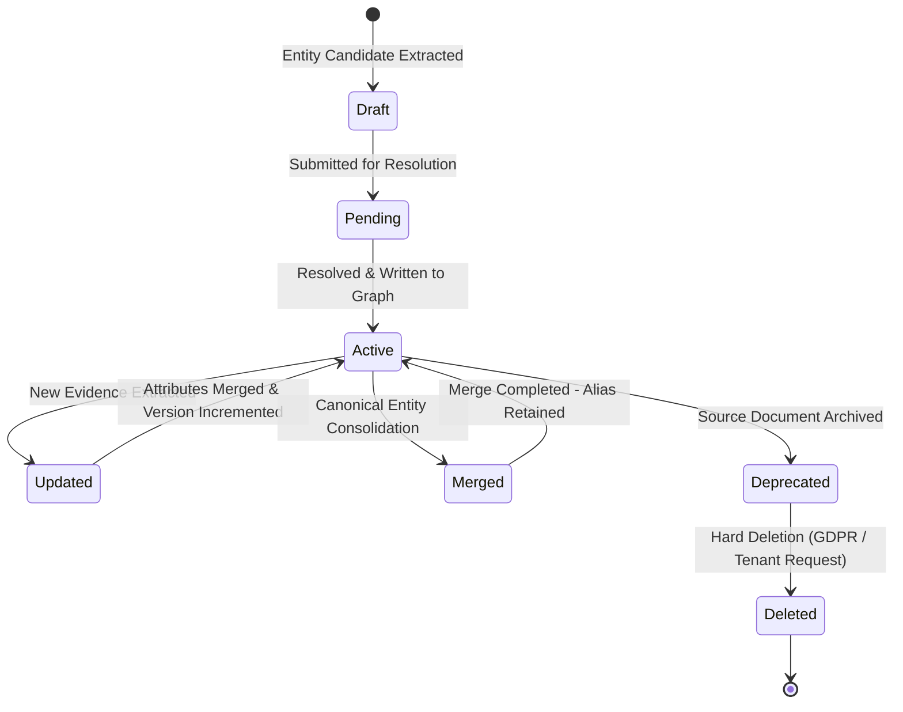

### Lifecycle Stage Definitions

- **Draft**: Entity candidate extracted from chunk text. Not yet written to the graph store.
- **Pending**: Undergoing entity resolution — checking for existing canonical matches.
- **Active**: Entity node written to the graph store and fully available for traversal and reasoning.
- **Updated**: New evidence from a different document has enriched the entity attributes; version incremented.
- **Merged**: Two entity nodes have been consolidated into one canonical node. Original node is retained as an alias with a `SAME_AS` edge.
- **Deprecated**: All source Knowledge Base documents referencing this entity have been archived. Entity retained in graph but excluded from active traversal results.
- **Deleted**: Entity and all its edges permanently removed from graph store. Triggered by GDPR deletion request or tenant explicit deletion.

---

## 12. Provenance Architecture

Every entity and relationship in the Knowledge Graph carries a structured provenance chain. Provenance enables complete traceability from original source through to the LLM response.

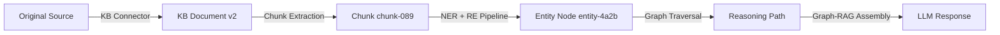

### Provenance Record Schema

```json
{
  "entity_id": "entity-uuid-4a2b-11ef",
  "provenance_chain": [
    {
      "source_url": "https://sharepoint.enterprise.com/3GPP_TS_28.552_v17.pdf",
      "document_id": "doc-uuid-1234",
      "document_version": 2,
      "chunk_id": "chunk-uuid-089",
      "extraction_model": "bert-base-ner-v2",
      "extraction_confidence": 0.92,
      "extracted_at": "2026-08-01T12:00:00.000Z"
    },
    {
      "source_url": "https://sharepoint.enterprise.com/Site44_Commissioning.docx",
      "document_id": "doc-uuid-5678",
      "document_version": 1,
      "chunk_id": "chunk-uuid-023",
      "extraction_model": "bert-base-ner-v2",
      "extraction_confidence": 0.88,
      "extracted_at": "2026-08-01T14:30:00.000Z"
    }
  ]
}
```

---

## 13. Graph Versioning Strategy

Enterprise knowledge graphs accumulate millions of entities and relationships over their operational lifetime. Schema changes, ontology evolutions, and entity attribute updates must be managed through a disciplined **Graph Versioning Strategy** that maintains backward compatibility and supports zero-downtime migrations.

### 13.1 Entity Versioning

Every entity node carries an integer `version` field that is incremented atomically on every attribute mutation. All prior versions are preserved as immutable **version snapshot records** in the metadata catalogue, enabling point-in-time entity inspection without graph store queries.

- **Version 1**: Initial extraction from source document.
- **Version N+1**: New attribute evidence integrated from a subsequent document ingestion.
- **Merge Events**: A canonical merge operation increments the surviving node's version and creates a `SAME_AS` edge to the deprecated alias node.

### 13.2 Relationship Versioning

Relationships carry an integer `version` field incremented when relationship attributes (weight, confidence, temporal bounds) are updated. Relationship version history is retained in the provenance record. Deprecated relationships are never hard-deleted unless a GDPR or tenant deletion request is received — they are marked `DEPRECATED` with a `valid_until` timestamp.

### 13.3 Ontology Versioning

The Ontology Registry tracks all three ontology layers under a semantic version scheme:

| Layer | Version Scheme | Breaking Change Rule |
| :--- | :--- | :--- |
| **Core Ontology** | `MAJOR.MINOR` | Adding new entity/relation types is `MINOR`. Renaming or removing types is `MAJOR` and requires an ADR and migration plan. |
| **Domain Ontology** | `PLUGIN_VERSION.ONTOLOGY_MINOR` | Each plugin version carries its ontology version. Breaking changes require plugin version increment. |
| **Tenant Ontology** | `TENANT_SCHEMA_VERSION` | Tenant admin-controlled. Mutations are audit-logged. |

### 13.4 Schema Evolution & Migration Strategy

When a Core Ontology `MAJOR` version upgrade is required (e.g., renaming entity type `NetworkElement` to `NetworkNode`), the following four-phase migration strategy is applied:

```
+-----------------------------------------------------------------------------------+
|                    ONTOLOGY SCHEMA MIGRATION STRATEGY                             |
+-----------------------------------------------------------------------------------+
|  Phase 1: DUAL-WRITE PERIOD                                                       |
|  - Both old and new type labels are accepted by the ingestion pipeline.           |
|  - All new extractions use the new type label.                                   |
|  - Existing entities retain the old type label.                                  |
|                                                                                   |
|  Phase 2: BATCH MIGRATION                                                         |
|  - Background migration worker iterates all entities with old type label.        |
|  - Rewrites entity type in-place; increments version; records migration event.   |
|  - Migration runs during off-peak hours to avoid traversal latency impact.       |
|                                                                                   |
|  Phase 3: VALIDATION                                                              |
|  - Graph Validation Pipeline runs post-migration to verify zero orphaned edges. |
|  - Scheduled consistency check confirms all entities have valid type labels.     |
|                                                                                   |
|  Phase 4: OLD LABEL RETIREMENT                                                    |
|  - Old type label is removed from the Ontology Registry.                         |
|  - Dual-write period ends. Ingestion pipeline rejects old label.                |
+-----------------------------------------------------------------------------------+
```

### 13.5 Backward Compatibility Policy

- **Read Compatibility**: All traversal queries use type label aliases during the dual-write period; queries against the old type label are transparently resolved to the new label.
- **Write Compatibility**: Plugins that register deprecated entity types receive a deprecation warning event on the Event Bus. Plugin authors have two minor release cycles to update their ontology registrations before the old label is retired.

---

## 14. Ontology Extension Model for Plugins

The platform core ontology defines the canonical entity and relationship types. Domain plugins extend it through a structured **Ontology Extension API** exposed via `NeuroFlowPluginContext`.

```
+-----------------------------------------------------------------------------------+
|                        PLUGIN ONTOLOGY EXTENSION MODEL                            |
+-----------------------------------------------------------------------------------+
|  Plugin Registration Capabilities:                                                |
|                                                                                   |
|  1. Register Entity Type:                                                         |
|     context.graph.register_entity_type(                                           |
|       type_id    = "NetworkElement",                                              |
|       base_type  = "Entity",                                                      |
|       namespace  = "telecom",                                                     |
|       attributes = {"vendor": str, "model": str, "location": str}                |
|     )                                                                             |
|                                                                                   |
|  2. Register Relationship Type:                                                   |
|     context.graph.register_relation_type(                                         |
|       type_id     = "GENERATES_ALARM",                                            |
|       source_type = "NetworkElement",                                             |
|       target_type = "NetworkAlarm",                                              |
|       namespace   = "telecom"                                                     |
|     )                                                                             |
|                                                                                   |
|  3. Register Extraction Rules:                                                    |
|     context.graph.register_extraction_rule(                                       |
|       rule_id    = "alarm-ne-cooccurrence",                                      |
|       conditions = [entity_type("NetworkAlarm"), entity_type("NetworkElement")], |
|       action     = assert_relation("GENERATES_ALARM", weight=0.90)               |
|     )                                                                             |
|                                                                                   |
|  4. Register Domain NER Model:                                                    |
|     context.graph.register_ner_model(                                             |
|       model_id   = "telecom-ner-v2",                                             |
|       namespace  = "telecom",                                                     |
|       model_path = "models/telecom-ner-v2"                                       |
|     )                                                                             |
+-----------------------------------------------------------------------------------+
```

Ontology extensions are:
- **Namespaced** — Extensions from the Telecom plugin cannot conflict with the Healthcare plugin.
- **Versioned** — Breaking ontology changes require version increment and migration strategy (Section 13).
- **Sandboxed** — Plugin entities are only queryable by the owning plugin unless cross-namespace access is explicitly granted.

---

## 15. Graph Traversal Architecture

The Traversal Engine provides the query surface for all reasoning operations over the Knowledge Graph.

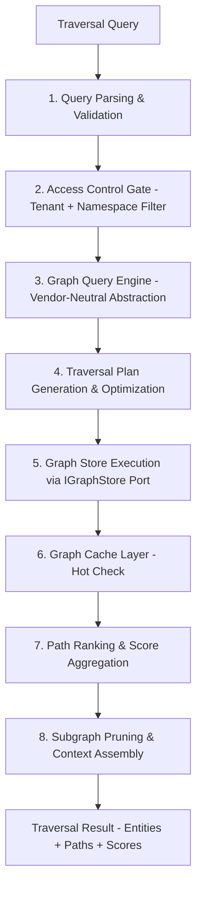

### Traversal Strategy Types

| Strategy | Description | Use Case |
| :--- | :--- | :--- |
| **BFS (Breadth-First)** | Explore all nodes at increasing hop depth. | Discover all entities within N hops of a seed. |
| **DFS (Depth-First)** | Traverse deep along specific relation chains. | Follow causal chains or dependency trees. |
| **Shortest Path** | Find minimum-hop path between two entity nodes. | Explain the connection between A and B. |
| **Subgraph Extraction** | Extract the ego-network around a target entity. | Build contextual neighbourhood for LLM prompt. |
| **Property Path** | Filter traversal by relationship type and attribute constraints. | "Find all `NetworkElement` nodes that `GENERATE` `CRITICAL` alarms." |
| **Time-Aware Traversal** | Filter traversal by `valid_from` / `valid_until` temporal bounds. | Historical and point-in-time reasoning (Section 22). |

---

## 16. Graph Query Engine

The Knowledge Graph platform must never be coupled to a specific graph query language or vendor syntax. The **Graph Query Engine** provides a vendor-neutral query abstraction layer, insulating all platform components from the underlying graph database's native query dialect.

```
+-----------------------------------------------------------------------------------+
|                         GRAPH QUERY ENGINE ARCHITECTURE                           |
+-----------------------------------------------------------------------------------+
|                                                                                   |
|  Platform Knowledge Graph Engine                                                  |
|              |                                                                    |
|              v                                                                    |
|  [ IGraphQuery Port ] (core/ports/graph.py)                                       |
|  - Vendor-neutral query interface                                                 |
|  - Accepts: GraphQuerySpec (typed Python DSL)                                     |
|              |                                                                    |
|  +---------- Query Transpilation Layer ----------+                                |
|  |           |                  |               |                                |
|  v           v                  v               v                                |
| [Cypher     [Gremlin       [SPARQL         [GQL                                  |
|  Adapter]    Adapter]       Adapter]        Adapter - Future]                    |
|  (Neo4j)    (Neptune /      (RDF-based)     (ISO GQL Standard)                   |
|              CosmosDB)                                                            |
+-----------------------------------------------------------------------------------+
```

### 16.1 Vendor-Neutral Query Abstraction

All graph queries within the platform are expressed as **`GraphQuerySpec`** — a typed, platform-native query descriptor defined in `core/ports/graph.py`. The `IGraphQuery` port transpiles `GraphQuerySpec` into the appropriate vendor-specific query syntax at the infrastructure adapter layer.

```
GraphQuerySpec:
  entity_types: ["NetworkElement", "NetworkAlarm"]
  start_entity_id: "entity-uuid-4a2b"
  relation_types: ["GENERATES_ALARM", "CAUSES"]
  max_depth: 3
  direction: OUTBOUND
  filters:
    - attribute: "alarm_severity", operator: EQ, value: "CRITICAL"
  strategy: BFS
  limit: 50
```

This `GraphQuerySpec` is transpiled to:
- **Cypher** (Neo4j): `MATCH (e:NetworkElement)-[:GENERATES_ALARM]->(a:NetworkAlarm) WHERE a.alarm_severity = 'CRITICAL' RETURN e, a LIMIT 50`
- **Gremlin** (Neptune): `g.V('entity-uuid-4a2b').out('GENERATES_ALARM').hasLabel('NetworkAlarm').has('alarm_severity', 'CRITICAL').limit(50)`

### 16.2 Query Optimization Layer

The Query Optimization Layer applies query planning heuristics before transpilation and execution:

| Optimization | Description |
| :--- | :--- |
| **Index Push-Down** | Filter predicates on indexed properties are pushed into the graph DB index scan, not post-retrieval. |
| **Depth Pruning** | Traversal depth is bounded by `max_depth` + tenant-configured traversal limits to prevent runaway queries. |
| **Selectivity Estimation** | High-selectivity filter predicates (exact attribute matches) are evaluated first to reduce intermediate result set size. |
| **Subgraph Caching** | Results of expensive subgraph extractions are cached in the Graph Cache Layer (Section 21). |

### 16.3 Query Execution Pipeline

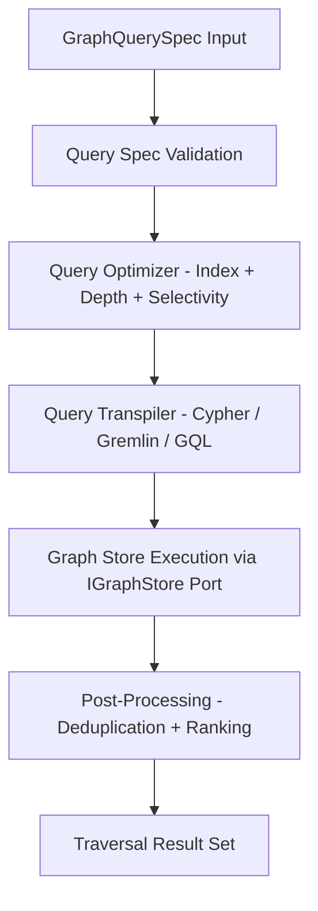

### 16.4 Future GQL Support

The ISO **GQL (Graph Query Language)** standard (ISO/IEC 39075) represents the emerging unified graph query standard. The `IGraphQuery` port is designed with a `GQL Adapter` slot reserved for future implementation. When GQL becomes broadly supported by graph database vendors, the platform will add the GQL adapter without any changes to the `GraphQuerySpec` definition or upstream platform components.

---

## 17. Explainable AI Reasoning over the Graph

The Reasoning Engine transforms graph traversal results into **auditable, human-readable reasoning chains** that can be injected into LLM prompts or returned directly as structured explanations.

```
+-----------------------------------------------------------------------------------+
|                         EXPLAINABLE AI REASONING ENGINE                           |
+-----------------------------------------------------------------------------------+
|                                                                                   |
|  Input: Traversal Result (Entities + Paths + Edge Types)                          |
|              |                                                                    |
|              v                                                                    |
|  Stage 1: REASONING PATH SERIALIZATION                                            |
|  - Convert graph path to natural language chain-of-thought:                      |
|    "Site44-NE [GENERATES_ALARM] → Alarm-2026-08 [CAUSES] → Service Degradation"  |
|              |                                                                    |
|              v                                                                    |
|  Stage 2: CONFIDENCE PROPAGATION (see Section 17.1)                               |
|  - Aggregate weighted edge and node confidence across the path.                  |
|  - Apply confidence decay for multi-hop traversal depth.                        |
|              |                                                                    |
|              v                                                                    |
|  Stage 3: EVIDENCE CITATION                                                       |
|  - Attach provenance citations for every entity and relation in the path.        |
|  - Each citation includes: source document, chunk ID, page number.               |
|              |                                                                    |
|              v                                                                    |
|  Stage 4: GRAPH-RAG CONTEXT ASSEMBLY                                              |
|  - Compose serialized reasoning path + evidence citations into an                |
|    LLM-consumable context block for Graph-RAG generation.                        |
|              |                                                                    |
|              v                                                                    |
|  Output: Explainable Reasoning Block (Path + Confidence + Citations)              |
+-----------------------------------------------------------------------------------+
```

### 17.1 Confidence Propagation Architecture

Confidence propagation is the mechanism by which the Knowledge Graph computes an **overall path confidence score** that reflects the cumulative reliability of a multi-hop reasoning chain. A reasoning path involving low-confidence edges must yield a lower overall confidence than one composed of high-confidence edges, regardless of the number of hops.

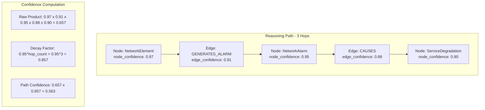

#### Confidence Propagation Rules

| Component | Confidence Source | Description |
| :--- | :--- | :--- |
| **Node Confidence** | Entity `confidence` field at extraction time. | Reflects NER model certainty and ontology alignment quality. |
| **Edge Confidence** | Relation `confidence` field at extraction time. | Reflects RE model certainty and rule engine weight. |
| **Raw Path Confidence** | Product of all node and edge confidences along the path. | $C_{\text{raw}} = \prod_{i} C_{\text{node}_i} \times \prod_{j} C_{\text{edge}_j}$ |
| **Hop Decay Factor** | $\delta^{n}$ where $\delta = 0.95$ and $n$ = hop count. | Penalizes longer reasoning paths to reflect increased inference uncertainty. |
| **Final Path Confidence** | $C_{\text{path}} = C_{\text{raw}} \times \delta^{n}$ | Combined metric used for reasoning block ranking and LLM prompt selection. |
| **Minimum Confidence Threshold** | Configurable per tenant (default: 0.40). | Reasoning paths below threshold are excluded from LLM context assembly. |

### 17.2 Example Reasoning Block Output

```json
{
  "reasoning_path": [
    {"entity": "Nokia 5G Base Station - Site 44", "type": "NetworkElement", "node_confidence": 0.97},
    {"relation": "GENERATES_ALARM", "edge_confidence": 0.91},
    {"entity": "Alarm-2026-08-CriticalPower", "type": "NetworkAlarm", "node_confidence": 0.95},
    {"relation": "CAUSES", "edge_confidence": 0.88},
    {"entity": "Voice Service Degradation - Region Berlin", "type": "Event", "node_confidence": 0.90}
  ],
  "raw_confidence": 0.657,
  "decay_factor": 0.857,
  "path_confidence": 0.563,
  "minimum_threshold": 0.40,
  "threshold_passed": true,
  "citations": [
    {"document_id": "doc-uuid-1234", "chunk_id": "chunk-uuid-089", "page": 14},
    {"document_id": "doc-uuid-9987", "chunk_id": "chunk-uuid-102", "page": 3}
  ],
  "natural_language_explanation": "Nokia 5G Base Station at Site 44 generated a critical power alarm on 2026-08-01, which caused Voice Service Degradation across the Berlin region."
}
```

---

## 18. Knowledge Graph + Knowledge Base Integration

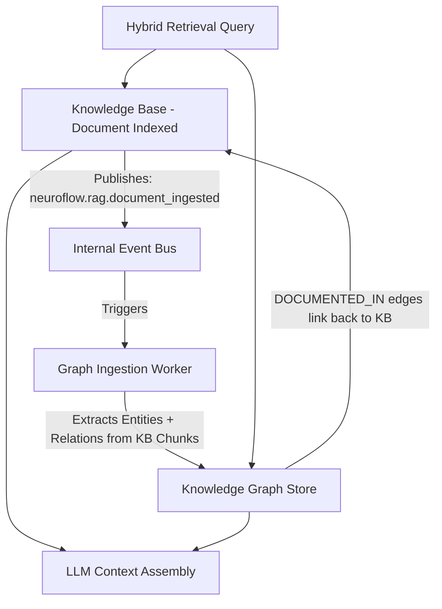

- The Knowledge Base is the **primary content substrate**. The Knowledge Graph is the **semantic index** built on top of it.
- Every entity node maintains `DOCUMENTED_IN` edges referencing the exact Knowledge Base document(s) and chunk(s) that sourced the entity.
- Retrieval queries may combine vector similarity results from the Knowledge Base with graph traversal results from the Knowledge Graph (Graph-RAG pattern).
- Knowledge Base document archival triggers entity `DEPRECATED` transitions in the Knowledge Graph.

---

## 19. Knowledge Graph + Memory Layer Integration

```
+-----------------------------------------------------------------------------------+
|             KNOWLEDGE GRAPH & MEMORY LAYER INTEGRATION                            |
+-----------------------------------------------------------------------------------+
|  Memory Layer                         Knowledge Graph                             |
|  - Dynamic runtime experiences.       - Static semantic entity structure.         |
|  - Agent-generated episodes/skills.   - Organization-scoped entity model.         |
|                                                                                   |
|  Integration Points:                                                              |
|  1. EPISODIC ENRICHMENT: Agent episodic memories referencing specific entities   |
|     are linked to the canonical entity node via entity_id reference.              |
|  2. PREFERENCE LEARNING: Memory Semantic tier records agent preferences about    |
|     which entity traversal strategies yield the best reasoning results.           |
|  3. SKILL GROUNDING: Procedural skills stored in Memory Reference Graph entities |
|     to provide semantic grounding for skill preconditions and outcomes.           |
+-----------------------------------------------------------------------------------+
```

---

## 20. Knowledge Graph + RAG Integration (Graph-RAG)

The Knowledge Graph enables a **Graph-RAG** pattern that enriches standard vector retrieval with structured semantic context:

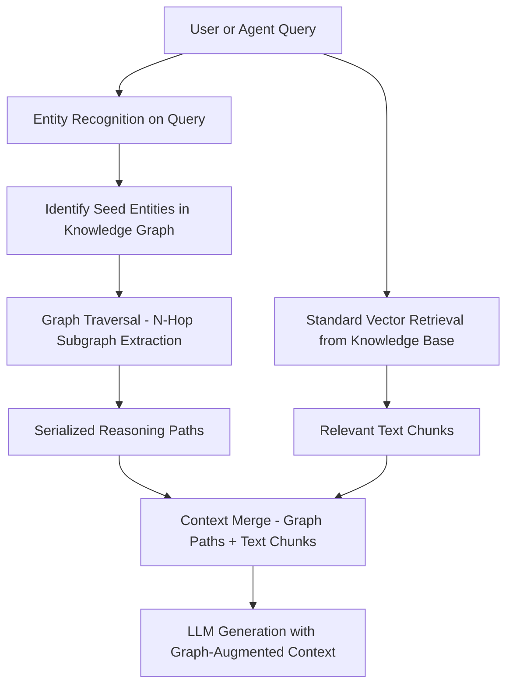

### Graph-RAG Benefits over Standard RAG
- Provides **structured relationship context** that free-text chunk retrieval cannot express.
- Enables **multi-hop contextual grounding** — the LLM receives a reasoning path, not isolated chunks.
- Enables **citation-grounded generation** — every reasoning step is backed by a source document reference.

---

## 21. Knowledge Graph + Event Bus Integration

The Knowledge Graph publishes and subscribes to the Internal Event Bus for asynchronous lifecycle coordination:

**Published Events** (outbound):
- `neuroflow.graph.entities_extracted`: After entity and relation extraction completes for a document.
- `neuroflow.graph.entity_merge_candidate`: When a new entity is a candidate for merging with an existing node (requires human review).
- `neuroflow.graph.entity_deprecated`: After entity nodes are transitioned to `DEPRECATED` state.
- `neuroflow.graph.ontology_deprecated`: When a Core Ontology type is scheduled for retirement.

**Subscribed Events** (inbound):
- `neuroflow.rag.document_ingested`: Triggers entity and relation extraction for the newly indexed document.
- `neuroflow.rag.document_archived`: Triggers entity deprecation for all entities sourced exclusively from the archived document.
- `neuroflow.plugin.loaded`: Registers plugin ontology extensions into the Ontology Registry.
- `neuroflow.system.started`: Triggers Ontology Registry initialization and graph store connectivity validation.

---

## 22. Graph Synchronization Strategy

The Knowledge Graph must stay synchronized with the Knowledge Base document corpus as documents are ingested, updated, and archived:

```
+-----------------------------------------------------------------------------------+
|                      GRAPH SYNCHRONIZATION STRATEGY                               |
+-----------------------------------------------------------------------------------+
|                                                                                   |
|  1. EVENT-DRIVEN INCREMENTAL SYNC (Primary):                                      |
|     Knowledge Graph subscribes to Knowledge Base events on the Event Bus.        |
|     Every document_ingested event triggers incremental entity extraction.         |
|     Incremental: Only entities and relations from the new/updated document        |
|     are extracted and merged — full graph rebuild is never required.              |
|                                                                                   |
|  2. SCHEDULED CONSISTENCY CHECK (Secondary):                                      |
|     A scheduled background process runs nightly.                                 |
|     Validates that every Active entity has at least one Active source document.  |
|     Entities whose source documents have been archived or deleted are             |
|     transitioned to DEPRECATED.                                                  |
|                                                                                   |
|  3. FULL REBUILD (Emergency Only):                                                 |
|     Triggered only on graph corruption, schema migration, or major               |
|     ontology version upgrade.                                                    |
|     Full rebuild re-processes all Active Knowledge Base documents through        |
|     the entity and relation extraction pipelines.                                |
|     This operation is exclusively an administrative operation.                   |
+-----------------------------------------------------------------------------------+
```

### 22.1 Incremental Graph Update Strategy

The primary synchronization mode is **incremental delta ingestion**. Under normal operations, the Knowledge Graph never performs a full rebuild. All updates are applied as targeted, surgical mutations to the graph store.

```
+-----------------------------------------------------------------------------------+
|                   INCREMENTAL GRAPH UPDATE STRATEGY                               |
+-----------------------------------------------------------------------------------+
|                                                                                   |
|  On Document Update (Delta Ingestion):                                            |
|                                                                                   |
|  1. CHANGED ENTITY DETECTION:                                                     |
|     - Re-extract entities from updated document chunks.                          |
|     - Compare new entity attribute payload against existing entity attributes.   |
|     - Unchanged entities: skip re-write.                                         |
|     - Changed entities: upsert with version increment.                           |
|                                                                                   |
|  2. CHANGED RELATIONSHIP DETECTION:                                               |
|     - Re-extract relations from updated document chunks.                         |
|     - Compare new relation confidence, weight, and attributes.                   |
|     - Unchanged relations: skip re-write.                                        |
|     - Changed relations: upsert with version increment.                          |
|                                                                                   |
|  3. REMOVED ENTITY DETECTION:                                                     |
|     - Identify entities exclusively sourced from the updated document and no     |
|       longer present in the updated version.                                     |
|     - Transition these entities to DEPRECATED; retain for audit trail.           |
|                                                                                   |
|  4. NEW ENTITY INSERTION:                                                         |
|     - Net-new entities not previously in the graph are processed through the     |
|       full Entity Resolution pipeline before insertion.                          |
|                                                                                   |
|  RESULT: Graph mutations are proportional to document delta, not total           |
|  document size. Full graph rebuilds are avoided entirely.                        |
+-----------------------------------------------------------------------------------+
```

---

## 23. Graph Store Abstraction

The Knowledge Graph never couples directly to a specific graph database vendor. All graph storage operations are delegated through the `IGraphStore` port:

```
+-----------------------------------------------------------------------------------+
|                           GRAPH STORE ABSTRACTION                                 |
+-----------------------------------------------------------------------------------+
|  Knowledge Graph Engine                                                           |
|           |                                                                       |
|           v                                                                       |
|  [ IGraphStore Port ] (core/ports/graph.py)                                       |
|           |                                                                       |
|  +--------+--------+----------+                                                   |
|  |                 |          |                                                   |
|  v                 v          v                                                   |
| [Neo4j Adapter] [Amazon   [In-Memory                                              |
|                  Neptune]  Graph Adapter - Testing]                               |
+-----------------------------------------------------------------------------------+
```

All operations via `IGraphStore`: `upsert_entity`, `upsert_relation`, `traverse`, `find_shortest_path`, `extract_subgraph`, `deprecate_entity`, `delete_entity`.

---

## 24. Graph Validation Pipeline

All entity and relationship candidates must pass a **Graph Validation Pipeline** before being committed to the graph store. This pipeline ensures structural and semantic integrity of the graph at write time.

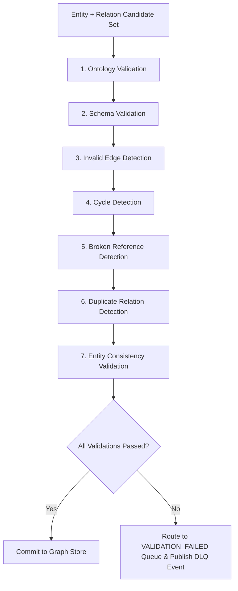

### Validation Stage Definitions

1. **Ontology Validation**: Verifies that every entity type and relation type in the candidate set is registered in the Ontology Registry. Unknown types are rejected unless the ingesting plugin has registered a domain extension for them.
2. **Schema Validation**: Validates that every entity carries all mandatory attribute fields defined by its ontology type schema. Missing required attributes are flagged as validation failures.
3. **Invalid Edge Detection**: Verifies that every relation candidate connects entity types that are permitted by the ontology relation type definition (e.g., `GENERATES_ALARM` can only connect `NetworkElement → NetworkAlarm`).
4. **Cycle Detection**: Detects circular dependency chains in `PART_OF`, `DEPENDS_ON`, and `IS_A` relation types where cycles are semantically invalid. Detected cycles are surfaced to the human review queue.
5. **Broken Reference Detection**: Verifies that every entity referenced in a relation candidate exists in the graph store or is present in the current extraction candidate set. Dangling relation edges are rejected.
6. **Duplicate Relation Detection**: Checks for existing relations of the same type between the same source and target entity pair. Duplicates are merged by updating weight and confidence scores rather than creating a second edge.
7. **Entity Consistency Validation**: Validates that entity attribute values are internally consistent (e.g., `status: ACTIVE` with a past `valid_until` timestamp is flagged as inconsistent).

---

## 25. Temporal Knowledge Graph

Enterprise systems do not operate in a static present. Network topologies change, security vulnerabilities are patched, clinical conditions evolve, and organizational structures are restructured. The Knowledge Graph must model **time** as a first-class dimension.

### 25.1 Why Temporal Graphs are Required in Enterprise Systems

Without temporal awareness:
- A decommissioned network element remains indistinguishable from an active element.
- A patched vulnerability cannot be distinguished from an unpatched one at a given point in time.
- Historical reasoning over clinical trial outcomes is impossible.
- Compliance auditors cannot reconstruct the state of knowledge at a specific regulatory reporting date.

### 25.2 Temporal Metadata Fields

Every entity and relationship carries temporal metadata:

| Field | Type | Description |
| :--- | :--- | :--- |
| `valid_from` | ISO 8601 Timestamp | The point in time from which this entity or relation became valid. |
| `valid_until` | ISO 8601 Timestamp or `null` | The point in time at which this entity or relation ceased to be valid. `null` = currently valid. |
| `recorded_at` | ISO 8601 Timestamp | The timestamp at which this fact was ingested into the graph (system time). |
| `temporal_precision` | Enum | `DAY`, `MONTH`, `YEAR` — the precision of the temporal claim from the source document. |

### 25.3 Historical Entities and Relationships

Historical entities retain their node record in the graph store with `valid_until` set to the cessation timestamp. They are excluded from standard traversal results but are accessible via **time-travel queries**:

- **Standard Query**: Returns only entities where `valid_until IS NULL OR valid_until > NOW()`.
- **Time-Travel Query**: Returns entities and relations that were valid at a specified `as_of` timestamp.

### 25.4 Time-Aware Traversal

The Traversal Engine supports **time-bounded traversal** via the `GraphQuerySpec` temporal filter:

```
GraphQuerySpec:
  entity_types: ["NetworkElement"]
  relation_types: ["GENERATES_ALARM"]
  strategy: BFS
  temporal_filter:
    as_of: "2025-06-01T00:00:00.000Z"
```

### 25.5 Historical Reasoning with Temporal Confidence Decay

The Reasoning Engine extends confidence propagation to include **temporal decay** — reasoning paths assembled from older evidence receive a reduced confidence score:

$$C_{\text{temporal}} = C_{\text{path}} \times e^{-\lambda \Delta t}$$

Where $\Delta t$ is the age of the oldest evidence in days and $\lambda$ is the configurable decay rate (default: 0.001 per day). Evidence older than 365 days that has not been reinforced by newer documents receives a meaningful confidence reduction.

---

## 26. Graph Cache Architecture

To minimize repeated graph store traversal queries and reduce reasoning latency, the Knowledge Graph maintains a **four-tier Graph Cache Layer** backed by Redis.

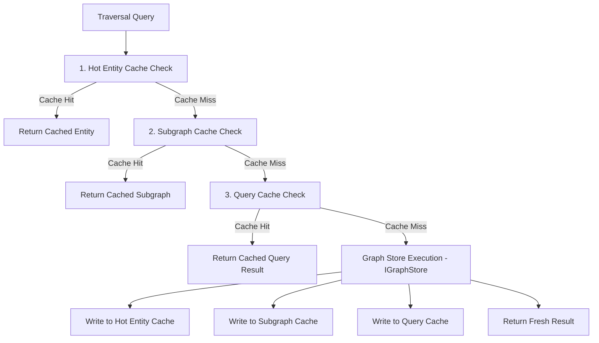

### Cache Tier Definitions

| Cache Tier | Description | Redis Key Pattern | Default TTL |
| :--- | :--- | :--- | :--- |
| **Hot Entity Cache** | Caches individual entity node attribute payloads for frequently accessed entities. | `kg:entity:{tenant_id}:{entity_id}` | 30 minutes |
| **Traversal Cache** | Caches BFS/DFS traversal result sets keyed by seed entity + relation types + depth. | `kg:traversal:{tenant_id}:{spec_hash}` | 15 minutes |
| **Subgraph Cache** | Caches full ego-network subgraphs for high-frequency reasoning queries. | `kg:subgraph:{tenant_id}:{entity_id}:{depth}` | 10 minutes |
| **Query Cache** | Caches raw `GraphQuerySpec` result sets keyed by spec hash. | `kg:query:{tenant_id}:{query_hash}` | 5 minutes |

### Cache Invalidation Policy

| Trigger | Action |
| :--- | :--- |
| Entity node `upsert` | Flush `kg:entity:{tenant_id}:{entity_id}` and all associated subgraph cache keys. |
| Relation `upsert` or `deprecate` | Flush traversal and subgraph cache keys for source and target entity IDs. |
| Entity `DEPRECATED` transition | Immediately flush all cache entries for the deprecated entity. |
| Graph Validation Pipeline failure | No cache write. Validation failures are never cached. |

### Cache Warming

On platform startup, the Graph Cache Layer executes a **cache warming routine**: identifies top-K most frequently queried entities over the prior 7 days and pre-populates Hot Entity Cache and Subgraph Cache. Warming runs asynchronously and does not block platform startup.

---

## 27. Knowledge Graph Governance

Enterprise Knowledge Graphs require rigorous governance to ensure entity and relationship claims are accurate, compliant, and properly stewarded.

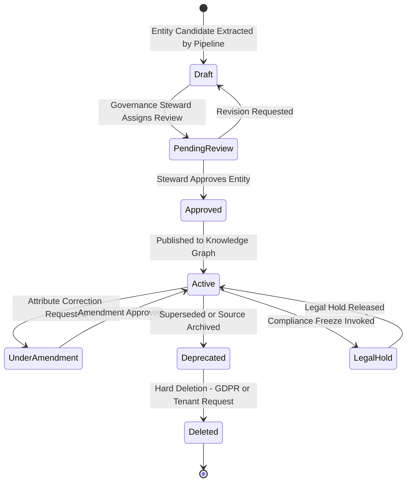

### 27.1 Entity Approval Workflow

| Condition | Action |
| :--- | :--- |
| Entity confidence ≥ 0.90 | Auto-approved to `Active`. Audit record created. |
| Entity confidence 0.70–0.89 | Routed to steward review queue; held in `PendingReview`. |
| Entity confidence < 0.70 | Rejected; `neuroflow.graph.entity_rejected` event published. |

### 27.2 Relationship Approval Workflow

Relationships follow the same confidence-based promotion logic. If either the source or target entity is in `PendingReview` state, the relationship is held until both entity endpoints are `Active`.

### 27.3 Ontology Governance

All Core Ontology changes require: an approved ADR documenting the change rationale, a migration strategy per Section 13.4, and Lead Architect sign-off before deployment. All ontology changes are audit-logged.

### 27.4 Stewardship Roles

| Role | Responsibilities |
| :--- | :--- |
| **Platform Ontology Steward** | Owns Core Ontology. Approves all MAJOR ontology version changes. |
| **Domain Steward** | Owns Domain Ontology for an assigned plugin namespace. Approves plugin entity type registrations. |
| **Tenant Data Steward** | Governs entity accuracy within a specific tenant. Approves entity corrections. |
| **Compliance Officer** | Manages Legal Hold state. Approves hard-deletion requests against compliance obligations. |

### 27.5 Audit Trail

Every governance state transition is recorded as an immutable audit log entry:

```json
{
  "audit_event_id": "audit-uuid-8812",
  "entity_id": "entity-uuid-4a2b-11ef",
  "transition": "PendingReview → Approved",
  "actor": "user-steward-09",
  "timestamp": "2026-08-02T09:15:00.000Z",
  "justification": "Entity verified against 3GPP TS 28.552 Section 5.3.",
  "correlation_id": "corr-review-4456"
}
```

---

## 28. Distributed Graph Scaling Architecture

As the Knowledge Graph scales to hundreds of millions of entity nodes and billions of relationship edges across large enterprise tenants, a single graph database instance becomes a scaling bottleneck.

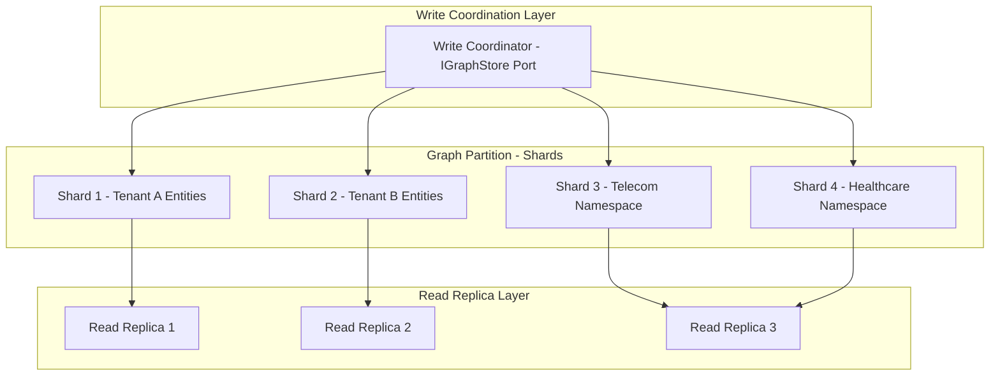

### 28.1 Graph Partitioning Strategy

| Partition Dimension | Scheme | Rationale |
| :--- | :--- | :--- |
| **Tenant Partition** | Each tenant receives a dedicated shard or shard group. | Enforces hard multi-tenant data isolation at storage layer. |
| **Namespace Partition** | High-volume domain namespaces receive dedicated shards within the tenant partition. | Reduces cross-namespace query fan-out. |

### 28.2 Horizontal Scaling

New shards are added horizontally as tenant data volumes grow, with automatic rebalancing coordinated by the Write Coordinator.

### 28.3 Read Replicas

All traversal and reasoning queries are directed to read replicas. Primary shards handle writes only. This read/write separation ensures that high-volume Graph-RAG traversal queries do not contend with batch entity extraction writes.

### 28.4 Write Coordination

The Write Coordinator manages routing entity writes to the correct tenant shard, cross-shard consistency for entity merge operations, and distributed transaction coordination for operations that must be atomic across shard boundaries.

### 28.5 Distributed Traversal

For multi-hop traversal queries that cross shard boundaries, the Traversal Engine executes a **distributed traversal**: identifies the starting shard, executes local traversal, fans out sub-queries to target shards for cross-namespace edges, and merges and re-ranks sub-query results before returning the unified result set.

### 28.6 Large Graph Optimization

| Technique | Description |
| :--- | :--- |
| **Traversal Depth Limiting** | Hard cap on `max_depth` per tenant (default: 5 hops). |
| **Result Set Limiting** | Hard cap on intermediate result set size per step (default: 10,000 nodes) before pruning. |
| **Index-Backed Property Filters** | All high-cardinality entity attributes are indexed in the graph store. |
| **Subgraph Pre-computation** | Ego-network subgraphs for top-K queried entities are pre-computed in Subgraph Cache. |

---

## 29. Knowledge Graph Quality Metrics

| Metric Name | Type | Description |
| :--- | :--- | :--- |
| `neuroflow_kg_entity_precision` | Gauge | Fraction of extracted entities confirmed correct by steward review. |
| `neuroflow_kg_entity_recall` | Gauge | Fraction of real-world entities captured in the graph vs. estimated total in source documents. |
| `neuroflow_kg_relation_precision` | Gauge | Fraction of extracted relations confirmed correct by steward review. |
| `neuroflow_kg_relation_recall` | Gauge | Fraction of real-world relations captured in the graph vs. estimated total. |
| `neuroflow_kg_graph_density` | Gauge | Average number of edges per node. $D = \frac{\text{Total Edges}}{\text{Total Nodes}}$ |
| `neuroflow_kg_canonical_merge_rate` | Gauge | Fraction of new entity candidates merged into existing canonical nodes vs. creating new nodes. |
| `neuroflow_kg_ontology_coverage` | Gauge | Fraction of ontology-registered entity types actively represented in the graph. |
| `neuroflow_kg_traversal_success_rate` | Gauge | Fraction of traversal queries returning at least one result. |
| `neuroflow_kg_graph_freshness_hours` | Gauge | Average age (hours) of the most recent evidence for Active entity nodes. |
| `neuroflow_kg_avg_traversal_depth` | Gauge | Mean hop depth of reasoning paths returned by the Reasoning Engine. |

---

## 30. Multi-Tenant Isolation

The Knowledge Graph enforces the same hard multi-tenant isolation model as the Knowledge Base:

1. **Graph Partition Isolation**: Every tenant's entity nodes and relationship edges are tagged with `tenant_id`. All traversal queries are automatically filtered with `WHERE tenant_id = :current_tenant`.
2. **Ontology Namespace Isolation**: Plugin-registered entity types and relation types are namespaced. A Cybersecurity plugin entity cannot appear in a Telecom plugin traversal result without explicit cross-namespace permission.
3. **Traversal Access Control Gate**: Every traversal request passes through the Access Control Gate validating tenant context, entity confidentiality level, and requester role.

---

## 31. Access Control

Entity and relationship visibility is governed by an RBAC model extended with confidentiality levels:

| Access Level | Description |
| :--- | :--- |
| `PUBLIC_READ` | Readable by all authenticated users within the tenant. |
| `ROLE_RESTRICTED` | Traversal permitted only to users with specific role assignments. |
| `PLUGIN_PRIVATE` | Entity visible only to the plugin that extracted it. |
| `ADMIN_ONLY` | Visible only to platform administrators. |

---

## 32. Failure Handling

| Failure Type | Detection | Recovery |
| :--- | :--- | :--- |
| **NER Extraction Failure** | Model exception or zero-entity output. | Move chunk to `EXTRACTION_FAILED` state; publish DLQ event; retain for manual re-trigger. |
| **Relation Extraction Low Confidence** | All relation candidates below confidence threshold. | Write zero-relation result; log warning metric; allow manual relation assertion via admin API. |
| **Entity Resolution Ambiguity** | Multiple merge candidates in similarity band 0.85–0.95. | Publish `neuroflow.graph.entity_merge_candidate`; hold entity in `PENDING`; route to human review queue. |
| **Graph Validation Failure** | Pipeline stage rejects entity or relation candidate. | Route to `VALIDATION_FAILED` queue; publish DLQ event; notify responsible steward. |
| **Graph Store Write Failure** | IGraphStore adapter write exception. | Retry with exponential backoff (3 attempts); persist extraction result to staging queue for deferred write. |
| **Cache Invalidation Failure** | Redis write exception on entity update. | Log warning; allow TTL expiry as eventual fallback. |
| **Ontology Conflict on Plugin Load** | Plugin registers entity type conflicting with core ontology. | Reject plugin registration; publish error event. |
| **Graph Sync Divergence** | Scheduled consistency check detects orphaned entities. | Auto-transition orphaned entities to `DEPRECATED`; alert platform administrator. |
| **Distributed Traversal Timeout** | Cross-shard sub-query exceeds timeout. | Return partial result with `partial: true` flag; log timeout metric; alert if frequency exceeds SLO. |

---

## 33. Observability & Operational Metrics

The Knowledge Graph exports OpenTelemetry-compatible operational metrics:

| Metric Name | Type | Description |
| :--- | :--- | :--- |
| `neuroflow_kg_entities_total` | Counter | Total entity nodes per tenant per namespace. |
| `neuroflow_kg_relations_total` | Counter | Total relation edges per tenant per namespace. |
| `neuroflow_kg_extraction_duration_seconds` | Histogram | End-to-end entity + relation extraction duration per document. |
| `neuroflow_kg_entity_resolution_merges_total` | Counter | Total successful entity merges. |
| `neuroflow_kg_entity_resolution_pending_total` | Gauge | Entity candidates awaiting human review. |
| `neuroflow_kg_traversal_latency_ms` | Histogram | Graph traversal query duration. |
| `neuroflow_kg_reasoning_path_depth` | Histogram | Distribution of reasoning path hop depths returned. |
| `neuroflow_kg_sync_lag_seconds` | Gauge | Delay between KB document indexed and graph extraction complete. |
| `neuroflow_kg_cache_hit_ratio` | Gauge | Fraction of traversal queries served from Graph Cache Layer. |
| `neuroflow_kg_validation_failures_total` | Counter | Total entity/relation candidates rejected by Graph Validation Pipeline. |
| `neuroflow_kg_governance_pending_total` | Gauge | Total entity candidates in `PendingReview` governance state. |
| `neuroflow_kg_shard_write_latency_ms` | Histogram | Write latency per graph store shard. |

See Section 29 for Knowledge Graph Quality Metrics.

---

## 34. Repository Placement

```
+-----------------------------------------------------------------------------------+
|                        REPOSITORY PLACEMENT STRATEGY                              |
+-----------------------------------------------------------------------------------+
|  Layer 0 — Core Domain Model (backend/core/)                                      |
|    backend/core/ports/graph.py                                                   |
|      - IGraphStore: Graph DB port (upsert, traverse, deprecate, delete).         |
|      - IGraphQuery: Vendor-neutral query abstraction port.                       |
|      - IEntityExtractor: Entity extraction model port.                           |
|      - IRelationExtractor: Relation extraction model port.                       |
|      - IReasoningEngine: Reasoning path serialization port.                      |
|      - IOntologyRegistry: Ontology type and rule registry port.                  |
|                                                                                   |
|  Layer 1 — Technical Infrastructure (backend/infrastructure/)                    |
|    backend/infrastructure/graph/                                                  |
|      - neo4j_adapter.py: Neo4j IGraphStore + IGraphQuery adapter.                |
|      - neptune_adapter.py: Amazon Neptune IGraphStore + IGraphQuery adapter.     |
|      - in_memory_adapter.py: In-memory adapter (testing only).                   |
|    backend/infrastructure/graph/cache/                                            |
|      - redis_graph_cache.py: Redis-backed Graph Cache Layer adapter.             |
|                                                                                   |
|  Layer 3 — Platform Runtime (backend/knowledge_graph/)                           |
|    backend/knowledge_graph/                                                       |
|      - ingestion/         Graph ingestion worker, event subscriber.              |
|      - extraction/        Entity + Relation extraction pipelines.                |
|      - resolution/        Entity resolution and deduplication engine.            |
|      - validation/        Graph Validation Pipeline.                             |
|      - ontology/          Ontology registry, extension manager.                  |
|      - traversal/         Traversal engine, query builder.                       |
|      - query/             Graph Query Engine, transpiler, optimizer.             |
|      - reasoning/         Reasoning path serialization, confidence propagation.  |
|      - temporal/          Temporal entity management, time-travel query support. |
|      - lifecycle/         Entity/relation lifecycle + governance state machine.  |
|      - provenance/        Provenance record writer and reader.                   |
|      - cache/             Graph Cache Layer management, warming, invalidation.   |
|      - governance/        Governance workflow, steward review queue, audit log.  |
|      - scaling/           Distributed traversal coordinator, shard router.      |
+-----------------------------------------------------------------------------------+
```

---

## 35. Clean Architecture Dependency Diagram

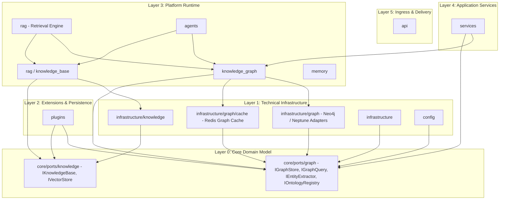

---

## 36. Platform Ecosystem Architecture Diagram

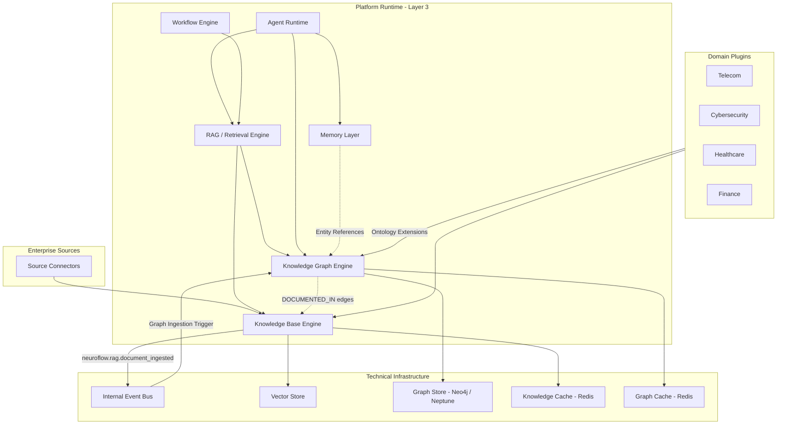

---

## 37. Repository Impact Assessment

### Physical Repository Structure Strategy

| Location | Layer | Contents |
| :--- | :--- | :--- |
| `backend/core/ports/graph.py` | Layer 0 | `IGraphStore`, `IGraphQuery`, `IEntityExtractor`, `IRelationExtractor`, `IReasoningEngine`, `IOntologyRegistry` abstract ports. |
| `backend/infrastructure/graph/` | Layer 1 | Neo4j adapter, Neptune adapter, in-memory adapter. |
| `backend/infrastructure/graph/cache/` | Layer 1 | Redis Graph Cache Layer adapter. |
| `backend/knowledge_graph/` | Layer 3 | Full Knowledge Graph engine — 14 sub-modules. |

### Module Summary

| Module Path | Purpose |
| :--- | :--- |
| `backend/knowledge_graph/ingestion/` | Event Bus subscriber; orchestrates document processing. |
| `backend/knowledge_graph/extraction/` | Entity extraction (NER, coreference, ontology alignment) and relation extraction (RE model, rules engine). |
| `backend/knowledge_graph/resolution/` | Entity resolution: exact match, alias, fuzzy, embedding, attribute cross-validation. |
| `backend/knowledge_graph/validation/` | Graph Validation Pipeline: ontology, schema, edge, cycle, broken reference, duplicate, consistency. |
| `backend/knowledge_graph/ontology/` | Ontology registry; manages Core, Domain, and Tenant ontology layers and versioning. |
| `backend/knowledge_graph/traversal/` | Traversal engine; BFS, DFS, shortest path, subgraph extraction, property path, time-aware traversal. |
| `backend/knowledge_graph/query/` | Graph Query Engine; `GraphQuerySpec` DSL; query transpiler (Cypher/Gremlin/GQL); query optimizer. |
| `backend/knowledge_graph/reasoning/` | Reasoning path serialization; confidence propagation; hop decay; Graph-RAG context assembly. |
| `backend/knowledge_graph/temporal/` | Temporal entity management; `valid_from`/`valid_until` enforcement; time-travel query support; historical reasoning. |
| `backend/knowledge_graph/lifecycle/` | Entity and relation lifecycle state machine management. |
| `backend/knowledge_graph/provenance/` | Provenance record writer and reader. |
| `backend/knowledge_graph/cache/` | Graph Cache Layer: hot entity, traversal, subgraph, query caches; warming; invalidation. |
| `backend/knowledge_graph/governance/` | Governance workflow; steward review queue; entity approval pipeline; audit log writer. |
| `backend/knowledge_graph/scaling/` | Distributed traversal coordinator; shard router; cross-shard merge; write coordinator. |

---

## 38. ADR Recommendation

This specification establishes **ADR-007: Knowledge Graph Architecture** in the project record.

### ADR Summary
- **Title**: ADR-007: Knowledge Graph Architecture — Semantic Reasoning Layer
- **Status**: Approved
- **Deciders**: Principal Software Architect, Lead Architect
- **Key Decision**: Introduce a domain-agnostic Knowledge Graph as the platform's semantic reasoning layer, co-located within **Platform Runtime (Layer 3)** at `backend/knowledge_graph/`, with abstract graph storage and query ports at `backend/core/ports/graph.py`, graph database adapters at `backend/infrastructure/graph/`, and Graph Cache Layer at `backend/infrastructure/graph/cache/`. The Knowledge Graph is built on top of the Knowledge Base and is not a replacement for it.

---

**End of Knowledge Graph Architecture Specification**
