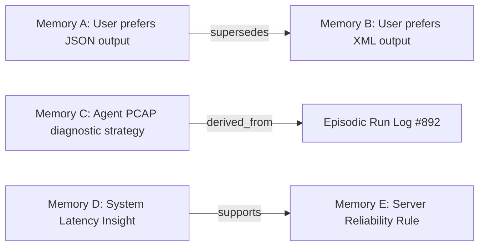
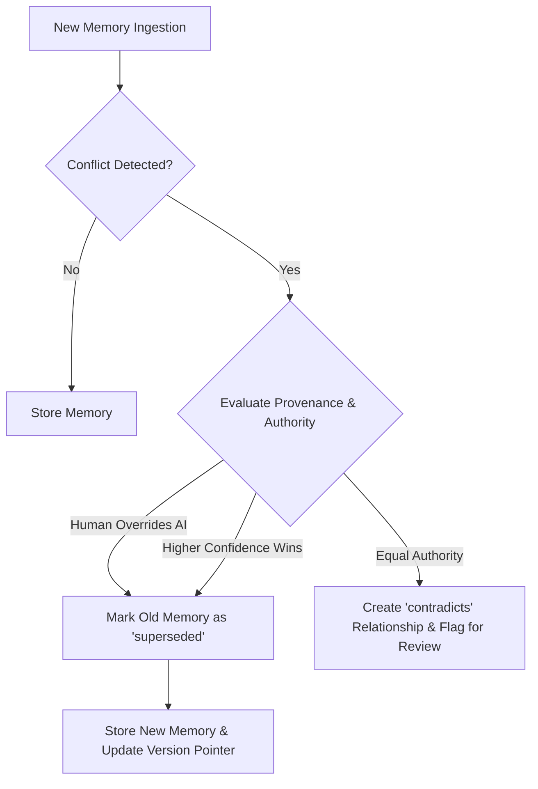
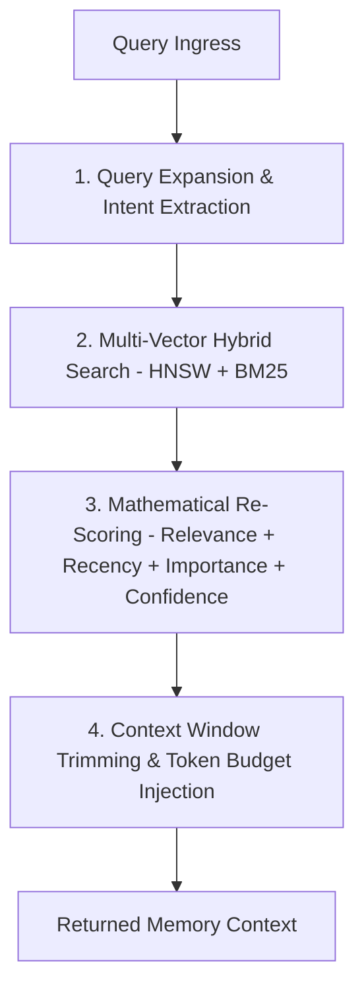
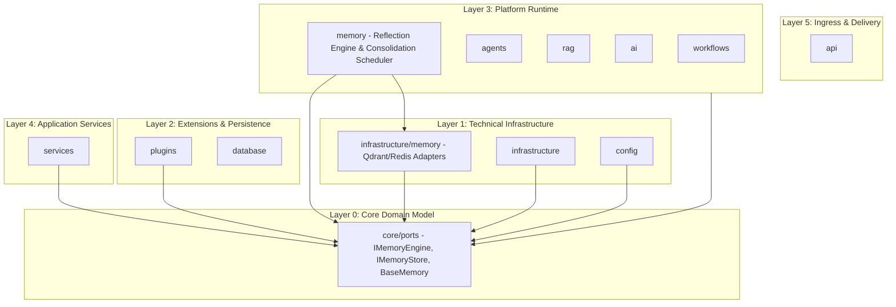

# NeuroFlow AI — AI Memory Architecture Specification

**Document Version:** 6.0.0 (Approved Architecture Specification)  
**Status:** Approved Architecture Specification  
**Target Audience:** Lead Architects, Principal Engineers, AI Engineers, Security Lead  
**Classification:** Core Platform Capability Architecture  

---

## 1. Executive Summary

In current state-of-the-art AI systems, Large Language Models (LLMs) operate as stateless function approximators. Statelessness severely constrains long-horizon multi-step reasoning, cross-session user personalization, agent learning, procedural skill retention, and multi-agent collaboration.

Standard chatbot "conversation history" (passing prior user/assistant messages in context) is an inadequate naive mechanism. It suffers from context window overflow, high token cost, attention degradation (middle-loss phenomenon), and zero cross-session persistence.

This specification introduces the **NeuroFlow AI Platform Memory Architecture**.

The Memory Layer is a **domain-agnostic, multi-tiered cognitive memory substrate** residing inside the **Platform Runtime** (Layer 3). It provides unified memory services to Autonomous Agents, DAG Workflows, RAG engines, Multi-Agent Supervisors, and external domain plugins (Telecom, Cybersecurity, Cloud, Finance) while remaining strictly decoupled from specific business logic.

Key architectural pillars of the Memory Layer include:
1. **Dedicated Reflection Engine**: Abstracting raw experiences into higher-order semantic facts and procedural skills.
2. **Asynchronous Memory Consolidation Scheduler**: Out-of-band background workers managing decay, compression, and reflection.
3. **Graph-Ready Memory Relationships**: Semantic linking (`related_to`, `derived_from`, `supports`, `contradicts`, `depends_on`, `supersedes`) preparing for Knowledge Graph integration.
4. **Multi-Factor Confidence Scoring**: Confidence metrics ($0.0 - 1.0$) influencing retrieval ranking and decay rates.
5. **Full Source Attribution & Provenance**: Immutable origin tracking for auditability and explainability.
6. **Robust Conflict Resolution Strategy**: Automated detection and policies for handling contradictory memories and preference updates.
7. **Scoped Shared Memory Spaces**: Multi-level privacy scopes from Private and Agent memory to Shared Team and Global Platform memory.
8. **Granular Memory Access Control**: Attribute-based permission models for multi-tenant and plugin isolation.
9. **Operational Memory Health Metrics**: OpenTelemetry indicators measuring hit rates, reflection efficiency, and memory quality.
10. **Immutable Memory Versioning**: Append-only audit trails tracking memory evolution and preventing accidental overwrites.

---

## 2. Distinction Between Memory Concepts

To prevent architectural confusion, the table below defines the exact boundaries between related platform concepts:

| Concept | Scope | Lifespan | Primary Storage | Primary Purpose |
| :--- | :--- | :--- | :--- | :--- |
| **Chat History** | Raw message turn log (User / Assistant messages). | Session-only (Transient). | In-memory buffer / Redis cache. | Local conversational context continuity. |
| **Session State** | Transient execution state (vars, active step, flags). | Request or workflow execution instance. | Key-value store (Redis). | Maintaining step execution state within a task. |
| **AI Memory** *(This Layer)* | Experiential, semantic, and procedural knowledge extracted over time. | Cross-session / Permanent. | Vector DB + Relational Store + Event Log. | Cognitive learning, reflection, skill reuse, and personalization. |
| **Knowledge Base (RAG)** | Unstructured enterprise reference documents (PDFs, manuals). | Static / Admin managed. | Vector Database (Qdrant/Milvus). | External factual reference lookups. |
| **Knowledge Graph** | Explicit entity-relation graph (Nodes: Entities, Edges: Relations). | Durable / Schema driven. | Graph Database (Neo4j / NetworkX). | Structural reasoning and multi-hop link analysis. |

---

## 3. Five-Tier Memory Taxonomy

The Memory Layer categorizes memory into five distinct, specialized cognitive tiers:

```
+-----------------------------------------------------------------------------------+
|                        FIVE-TIER PLATFORM MEMORY TAXONOMY                         |
+-----------------------------------------------------------------------------------+
|  1. Working Memory     : Active scratchpad & context window buffer (Transient)    |
|  2. Episodic Memory    : Temporal logs of past experiences & event sequences      |
|  3. Semantic Memory    : Distilled facts, user preferences & domain concepts       |
|  4. Procedural Memory  : Execution plans, workflow routines & tool strategies     |
|  5. Long-Term Memory   : Unified durable store consolidating Episodic/Semantic/Proc|
+-----------------------------------------------------------------------------------+
```

### 3.1 Working Memory (Short-Term Scratchpad)
- **Definition**: The immediate context window buffer containing active task goals, current step observations, temporary tool outputs, and reasoning state.
- **Lifespan**: Execution duration of a single agent step or API request.
- **Storage**: Fast, in-memory volatile data structure.

### 3.2 Episodic Memory (Experiential History)
- **Definition**: Chronological logs of specific past agent experiences, user interactions, and workflow executions. Preserves temporal and causal context ("What happened when Agent A attempted Tool X on Task Y").
- **Lifespan**: Days to Months (Subject to decay and consolidation).
- **Storage**: Time-indexed vector embeddings + append-only event store.

### 3.3 Semantic Memory (Distilled Knowledge & Preferences)
- **Definition**: Abstracted, generalized facts, user preferences, entity concepts, and domain rules extracted from multiple episodic memories through reflection.
- **Lifespan**: Permanent (Updated incrementally).
- **Storage**: Semantic vector store + Key-Value feature store.

### 3.4 Procedural Memory (Execution Skills & Strategies)
- **Definition**: Rules, workflow templates, tool execution sequences, and decision strategies that proved successful in past task runs ("How to solve a Telecom PCAP anomaly").
- **Lifespan**: Permanent.
- **Storage**: Structured plan registry + similarity index.

### 3.5 Long-Term Memory (Unified Persistence Layer)
- **Definition**: The overarching persistent storage substrate that manages the storage, indexing, retrieval, and consolidation of Episodic, Semantic, and Procedural memories across sessions and tenants.
- **Lifespan**: Permanent / Tenant-managed lifecycle.
- **Storage**: Multi-tenant Vector DB + Relational Persistence + Cache.

---

## 4. Responsibilities of Each Memory Tier

| Memory Tier | Primary Purpose | Indexing Method | Access Latency | Update Frequency |
| :--- | :--- | :--- | :--- | :--- |
| **Working** | Current execution scratchpad. | Direct RAM reference. | $< 1\text{ ms}$ | Per reasoning step. |
| **Episodic** | Event history lookup & experience search. | Temporal + HNSW Dense Vector. | $5 - 20\text{ ms}$ | Post-task execution. |
| **Semantic** | User preference & concept retrieval. | Hybrid Vector + BM25 Keyword. | $10 - 30\text{ ms}$ | Periodic consolidation. |
| **Procedural** | Reusable tool plan & strategy match. | Graph Topology + Vector Match. | $10 - 25\text{ ms}$ | On task success/reflection.|
| **Long-Term** | Durable persistence & archival. | Multi-index hybrid cluster. | $15 - 50\text{ ms}$ | Asynchronous background.|

---

## 5. Reflection Engine Architecture

Persisting 100% of raw episodic interactions into long-term memory leads to storage bloat, noise pollution, high token costs, and context degradation. The **Reflection Engine** solves this by acting as the cognitive summarizer and pattern extractor of the platform.

```
+-----------------------------------------------------------------------------------+
|                             REFLECTION ENGINE ARCHITECTURE                        |
+-----------------------------------------------------------------------------------+
|  Raw Episodic Memories (Logs, Tool Results, Messages)                             |
|                           |                                                       |
|                           v                                                       |
|           +-------------------------------+                                       |
|           |       REFLECTION ENGINE       |                                       |
|           |  - Experience Summarization   |                                       |
|           |  - Pattern & Entity Extraction|                                       |
|           |  - Noise & Duplicate Removal  |                                       |
|           |  - Insight Generation         |                                       |
|           +---------------+---------------+                                       |
|                           |                                                       |
|             +-------------+-------------+                                         |
|             |                           |                                         |
|             v                           v                                         |
|  [ Distilled Semantic Facts ]   [ Procedural Tool Routines ]                      |
|  ("User prefers JSON format")   ("PCAP anomaly -> Run Step X")                    |
+-----------------------------------------------------------------------------------+
```

### 5.1 Responsibilities of the Reflection Engine
- **Experience Summarization**: Compresses multi-turn conversation logs and step executions into concise, factual summaries.
- **Pattern & Insight Extraction**: Detects recurring user preferences, frequent agent tool failure modes, and optimal execution paths across past runs.
- **Semantic Abstraction**: Transforms specific episodic events (*"Agent ran tool ping_server 5 times and failed"*) into abstract semantic knowledge (*"Server X has unstable latency during peak hours"*).
- **Deduplication & Noise Reduction**: Identifies redundant or trivial memory entries, merging similar records and pruning low-value noise.

---

## 6. Background Memory Consolidation Scheduler

Memory processing (reflection, decay calculation, archiving) is computationally intensive. Executing memory consolidation synchronously during user request processing would block API threads and degrade performance. 

The **Memory Consolidation Scheduler** runs asynchronously as a background task.

```
+-----------------------------------------------------------------------------------+
|                    BACKGROUND MEMORY CONSOLIDATION SCHEDULER                      |
+-----------------------------------------------------------------------------------+
|  Background Cron / Asynchronous Workers (e.g., Nightly / Idle Period Jobs)        |
|                           |                                                       |
|         +-----------------+-----------------+-----------------+                   |
|         |                                   |                 |                   |
|         v                                   v                 v                   |
|  [ Scheduled Reflection ]          [ Decay & Pruning ]     [ Compression ]        |
|  Executes Reflection Engine        Applies Ebbinghaus      Soft-deletes old       |
|  across new episodic memories.     forgetting math.        unaccessed memories.   |
+-----------------------------------------------------------------------------------+
```

### 6.1 Consolidation Job Types
- **Nightly Reflection Job**: Scans unprocessed episodic memories, invoking the Reflection Engine to generate semantic facts.
- **Decay & Recalculation Job**: Re-evaluates importance scores and applies decay factors across all active memory records.
- **Compression & Archival Job**: Moves memories with retention scores below threshold ($S_{\text{retention}} < 0.15$) to cold storage or soft-deletes them.

---

## 7. Memory Relationships & Knowledge Graph Alignment

Memory items do not exist in isolation. The Memory Layer introduces explicit directional **Memory Relationships**, turning the memory store into a lightweight, graph-aware network that aligns with the future Knowledge Graph engine.



### 7.1 Official Relationship Types
- **`related_to`**: Symmetric link indicating topical association between two memory records.
- **`derived_from`**: Points from a distilled Semantic/Procedural memory to the raw Episodic memories from which it was abstracted.
- **`supports`**: Indicates that Memory A provides corroborating evidence for Memory B.
- **`contradicts`**: Flags conflicting facts between two memory records (triggers Conflict Resolution).
- **`depends_on`**: Declares that Procedural Memory A requires the context of Memory B to execute correctly.
- **`supersedes`**: Indicates that a newer memory record replaces an obsolete version.

---

## 8. Multi-Factor Memory Confidence Scoring

Every memory object maintains a strongly-typed **Confidence Score** ($0.0$ to $1.0$) reflecting its factual certainty and trustworthiness.

### 8.1 Confidence Sources
- **Human Confirmed (`1.0`)**: Memory directly entered or explicitly approved by a human operator.
- **Plugin/API Generated (`0.85 - 0.95`)**: Memory generated by verified domain plugins or deterministic system APIs.
- **AI Reflected (`0.60 - 0.85`)**: Semantic knowledge synthesized autonomously by the Reflection Engine.
- **Speculative (`< 0.60`)**: Single-observation episodic memories pending further verification.

### 8.2 Dynamic Confidence Adjustment
- **Reinforcement**: Confidence increases by $+0.05$ whenever a memory is successfully retrieved and validated in a subsequent task.
- **Contradiction Penalty**: Confidence decreases by $-0.20$ if a newer memory record contradicts it.

---

## 9. Full Source Attribution & Provenance

For explainability, security auditing, and debugging, every memory record MUST contain explicit provenance tracking:

```json
{
  "source_attribution": {
    "source_type": "PLUGIN",
    "source_id": "com.neuroflow.plugin.telecom",
    "actor_id": "user-operator-44",
    "provenance_chain": [
      "event-ingest-8899",
      "reflection-job-102"
    ]
  }
}
```

### Source Types
- `USER`: Directly supplied by end-user input.
- `AGENT`: Generated during autonomous agent reasoning.
- `WORKFLOW`: Emitted by DAG workflow step execution.
- `PLUGIN`: Originated from an external domain plugin.
- `HUMAN_REVIEW`: Created by administrative override.
- `EVENT_BUS`: Auto-consolidated from background platform events.

---

## 10. Memory Conflict Resolution Strategy

When new memory records contradict existing stored facts (e.g., a user updates their output format preference from XML to JSON), the platform executes a deterministic **Conflict Resolution Strategy**:



### Resolution Policies
1. **Human Authority Rule**: Human-confirmed memories (`source_type: USER` or `HUMAN_REVIEW`) unconditionally override AI-reflected memories.
2. **Supersedes Pattern**: Obsolete memories are NEVER deleted directly; their status is set to `SUPERSEDES`, and a `supersedes` relationship link points to the active record.
3. **Merge Strategy**: Partial preference updates are merged into an updated composite record with an incremented version number.

---

## 11. Scoped Shared Memory Spaces

To support multi-tenant security and future collaborative multi-agent teams, memory records are partitioned into logical **Memory Scopes**:

```
+-----------------------------------------------------------------------------------+
|                            SCOPED SHARED MEMORY SPACES                            |
+-----------------------------------------------------------------------------------+
|  1. PRIVATE_MEMORY     : Accessible ONLY to the specific user/entity.             |
|  2. AGENT_MEMORY       : Private scratchpad & experience log of a specific Agent.|
|  3. WORKFLOW_MEMORY    : Scoped to a specific workflow execution DAG tree.         |
|  4. TEAM_MEMORY        : Shared across agents/users within a designated team.     |
|  5. ORGANIZATION_MEMORY: Shared across all users in a tenant organization.       |
|  6. GLOBAL_PLATFORM    : Domain-agnostic public rules (Read-only for plugins).    |
+-----------------------------------------------------------------------------------+
```

---

## 12. Granular Memory Access Control & Security

Access to memory records is governed by an **Attribute-Based Access Control (ABAC)** enforcement gate:

```json
{
  "access_policy": {
    "tenant_id": "tenant-enterprise-01",
    "allowed_scopes": ["TEAM_MEMORY", "ORGANIZATION_MEMORY"],
    "required_permissions": ["memory:read"],
    "allowed_plugins": ["com.neuroflow.plugin.telecom"]
  }
}
```

### Security Enforcement Rules
- **Tenant Boundary**: Queries automatically include `WHERE tenant_id = :current_tenant`; cross-tenant memory reading is impossible.
- **Plugin Sandbox**: Plugins can only query memories belonging to their scope or explicitly granted by tenant settings.
- **PII Scrubbing**: PII redaction filters automatically scrub credit card numbers, passwords, and private keys prior to vector indexing.

---

## 13. Operational Memory Health & Quality Metrics

The Memory Layer exports standardized OpenTelemetry and Prometheus metrics for operational health monitoring:

| Metric Name | Type | Description |
| :--- | :--- | :--- |
| `neuroflow_memory_total_count` | Counter | Total active memory records by tier and tenant. |
| `neuroflow_memory_hit_ratio` | Gauge | Percentage of memory queries returning relevant hits ($>0.75$ similarity). |
| `neuroflow_memory_retrieval_latency_ms` | Histogram | End-to-end memory retrieval duration. |
| `neuroflow_memory_consolidation_duration_seconds` | Histogram | Time taken by background reflection jobs. |
| `neuroflow_memory_decay_pruned_total` | Counter | Total number of expired memories pruned/archived. |
| `neuroflow_memory_confidence_avg` | Gauge | Mean confidence score across active semantic memories. |

---

## 14. Immutable Memory Versioning

Memories represent an evolving graph of knowledge. To support audit trails, time-travel debugging, and rollback capabilities, memories are strictly **immutable and versioned**:

```json
{
  "memory_id": "mem-uuid-9876",
  "version": 2,
  "previous_version_id": "mem-uuid-9876-v1",
  "is_current": true,
  "mutation_type": "UPDATED_CONFIDENCE",
  "changed_at": "2026-08-01T18:00:00.000Z"
}
```

- Direct inplace `UPDATE` statements are forbidden.
- Mutations produce a new version record while preserving the historical version in append-only storage.

---

## 15. Standardized Memory Record Envelope Specification

Every memory item stored in the platform adheres to this unified JSON schema envelope:

```json
{
  "header": {
    "memory_id": "mem-uuid-9876-4321",
    "version": 1,
    "tenant_id": "tenant-enterprise-01",
    "scope": "TEAM_MEMORY",
    "memory_type": "SEMANTIC",
    "created_at": "2026-08-01T17:50:00.000Z",
    "last_accessed_at": "2026-08-01T17:50:00.000Z"
  },
  "content": {
    "text": "User prefers concise Markdown summaries for network anomaly reports.",
    "structured_data": {
      "preferred_format": "MARKDOWN",
      "detail_level": "CONCISE"
    }
  },
  "scoring": {
    "importance_score": 0.85,
    "confidence_score": 0.95,
    "decay_factor": 0.05,
    "access_count": 1
  },
  "provenance": {
    "source_type": "USER",
    "source_id": "user-operator-44",
    "causation_event_id": "event-9988-7766"
  },
  "relationships": [
    {
      "target_memory_id": "mem-uuid-1122",
      "relationship_type": "supersedes"
    }
  ]
}
```

---

## 16. Multi-Stage Memory Retrieval Pipeline

Retrieval uses a four-stage pipeline balancing semantic relevance, recency, confidence, and importance:



### 16.1 Mathematical Re-Scoring Formula
The final score $S_{\text{final}}$ of a retrieved memory item $m$ given query $q$ is calculated as:

$$S_{\text{final}}(m, q) = w_1 \cdot \text{Sim}(v_q, v_m) + w_2 \cdot R(t) + w_3 \cdot I(m) + w_4 \cdot C(m)$$

Where:
- $\text{Sim}(v_q, v_m)$: Cosine similarity between query vector $v_q$ and memory embedding $v_m$.
- $R(t) = e^{-\lambda (t_{\text{current}} - t_{\text{last\_accessed}})}$: Recency decay factor.
- $I(m)$: Importance score ($0.0$ to $1.0$).
- $C(m)$: Confidence score ($0.0$ to $1.0$).
- $w_1, w_2, w_3, w_4$: Weight hyperparameters (Default: $w_1=0.4, w_2=0.2, w_3=0.2, w_4=0.2$).

---

## 17. Clean Architecture Dependency Diagram

The Mermaid diagram below illustrates where Memory Layer abstractions and implementations reside across the Clean Architecture layers:



---

## 18. Repository & ADR Impact Assessment

### Physical Repository Structure Strategy
- **Core Interfaces (Layer 0)**: Abstract interfaces (`IMemoryEngine`, `IMemoryStore`, `IReflectionEngine`, `BaseMemory`) reside in `backend/core/ports/memory.py`.
- **Infrastructure Adapters (Layer 1)**: Vector storage, Redis memory caches, and relational memory repositories reside in `backend/infrastructure/memory/`.
- **Platform Engine (Layer 3)**: High-level memory retrieval, reflection engines, decay schedulers, and conflict resolution logic reside in `backend/ai/memory/` or `backend/memory/` (Logical Platform Runtime layer).

---

## 19. ADR Impact Assessment

This specification establishes **ADR-005: Formalization of AI Memory Layer Architecture** in the project record.

### ADR Summary
- **Title**: ADR-005: AI Memory Layer Architecture
- **Status**: Approved
- **Deciders**: Principal Software Architect, Lead Architect, Security Lead
- **Key Decision**: Adopt a 5-tier multi-tenant cognitive memory architecture with Reflection Engine and Asynchronous Consolidation Scheduler in Platform Runtime (Layer 3), exposing abstract interfaces via `core/ports/memory.py`.

---

**End of AI Memory Architecture Specification**
