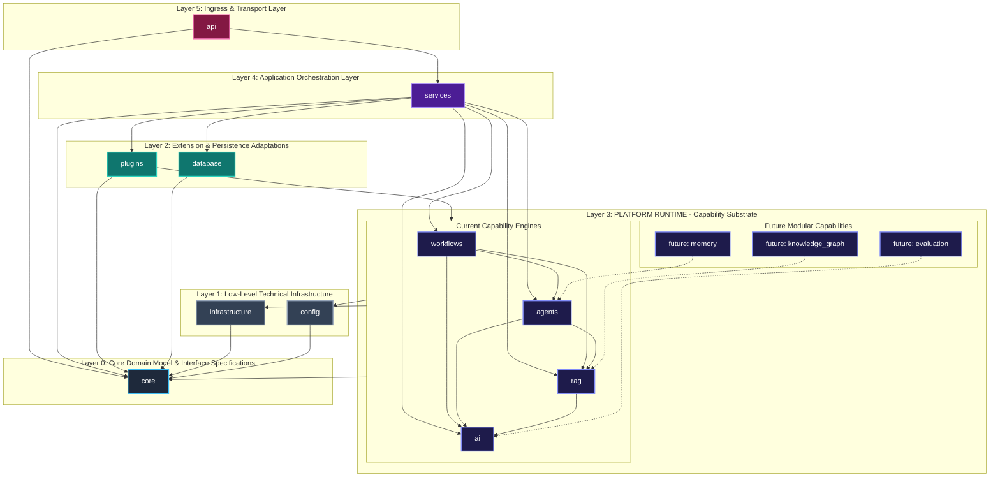

# NeuroFlow AI — Platform Runtime Architecture Specification

**Document Version:** 2.0.0  
**Status:** Approved Architecture Specification  
**Target Audience:** Lead Architects, Principal Engineers, Development Teams  
**Classification:** Architecture Documentation  

---

## 1. Executive Summary

During the architectural review of the NeuroFlow AI backend, a critical structural refinement was identified regarding the classification of core AI capabilities. 

In standard Clean Architecture patterns, modules like `ai` (LLM connectors), `rag` (semantic retrieval), `agents` (reasoning loops), and `workflows` (DAG execution) are often incorrectly misclassified either as **Infrastructure** (due to third-party SDK calls) or scattered across **Application Services** (due to task orchestration).

However, `ai`, `rag`, `agents`, and `workflows` are **NOT low-level infrastructure**, nor are they domain-specific application services. They represent **reusable, domain-agnostic platform intelligence capabilities**. 

To resolve this ambiguity, this specification formally defines the **Platform Runtime** layer.

---

## 2. Why Platform Runtime Must Exist

### 2.1 The Architectural Misclassification Dilemma

```
+-------------------------------------------------------------------------------+
|                             NAIVE CLEAN ARCHITECTURE                          |
+-------------------------------------------------------------------------------+
|  Application Services                                                         |
|  ---------------------------------------------------------------------------  |
|  Infrastructure (MISCLASSIFIED REGION):                                        |
|    - Redis Driver, Kafka, S3  <--- (True Low-Level Technical Infrastructure) |
|    - LLM Provider, Vector RAG, Agent Loops, DAG Workflows  <--- (NOT Infra!)  |
|  ---------------------------------------------------------------------------  |
|  Core Domain                                                                  |
+-------------------------------------------------------------------------------+
```

Treating AI, RAG, Agents, and Workflows as "Infrastructure" creates several severe design flaws:
1. **Infrastructure Pollution**: Low-level technical drivers (Redis client, Postgres pool, S3 connector) become intermingled with high-level cognitive algorithms (ReAct reasoning loops, semantic chunking, graph topology execution).
2. **Coupling to Vendors**: AI engines become tightly bound to specific cloud vendor APIs instead of being treated as platform execution runtimes.
3. **Application Service Overload**: If application services directly orchestrate raw LLM streams or vector index searches, use-case code becomes bloated with non-domain execution mechanics.

### 2.2 The Platform Runtime Solution

The **Platform Runtime** layer acts as the **Intelligence Execution Substrate** of NeuroFlow AI. 

```
+-------------------------------------------------------------------------------+
|                          REFINED ARCHITECTURE                                 |
+-------------------------------------------------------------------------------+
|  Layer 5: Delivery & Ingress (api)                                            |
|  Layer 4: Application Services (services)                                     |
|                                                                               |
|  Layer 3: PLATFORM RUNTIME (ai, rag, agents, workflows) <--- [LOGICAL LAYER]   |
|          "Domain-Agnostic Intelligence Execution Substrate"                  |
|                                                                               |
|  Layer 2: Data & Plugin Adaptations (database, plugins)                       |
|  Layer 1: Technical Infrastructure & Config (infrastructure, config)          |
|  Layer 0: Core Domain Contracts (core)                                        |
+-------------------------------------------------------------------------------+
```

By isolating these engines into Platform Runtime:
- The platform establishes a formal, reusable capability boundary for both application services and external domain plugins.
- Technical infrastructure is strictly confined to low-level I/O, network, and storage drivers.
- Application services focus purely on business orchestrations, delegating execution to standard runtime capability APIs.

---

## 3. Platform Runtime Responsibilities

The Platform Runtime layer is responsible for providing high-performance, domain-agnostic execution environments for all AI and workflow workloads.

### Primary Responsibilities
1. **Domain-Agnostic Capability Execution**: Executing LLM completions, vector embeddings, semantic retrieval, agentic reasoning loops, and DAG graph steps without any awareness of specific business domains (e.g., telecom, finance, cybersecurity).
2. **Execution Lifecycle Management**: Managing context window limits, token budgets, conversation memory buffers, workflow node state transitions, and step retries.
3. **Capability API Standardization**: Exposing uniform, contract-driven interfaces (`ILLMEngine`, `IRAGEngine`, `IAgentRuntime`, `IWorkflowEngine`) consumed by higher-level application services and plugin SDKs.
4. **Safety, Guardrails & Policy Enforcement**: Enforcing execution timeouts, rate limits, structured JSON schema validations, tool safety boundaries, and circuit breakers across all intelligence runtimes.

---

## 4. Modules Included in Platform Runtime

Platform Runtime encompasses all domain-agnostic capability engines, including existing backend modules and planned future extensions.

```
+-----------------------------------------------------------------------------------+
|                              PLATFORM RUNTIME LAYER                               |
+-----------------------------------------------------------------------------------+
|  CURRENT ENGINE MODULES                                                           |
|  - ai          : LLM provider unification, model routing, prompt renderer         |
|  - rag         : Semantic chunking, vector indexing, hybrid retrieval, re-ranking|
|  - agents      : Autonomous agent runtimes (ReAct, Plan-Solve), goal planners     |
|  - workflows   : DAG graph parser, state machine engine, async task runners       |
|                                                                                   |
|  FUTURE MODULAR EXTENSIONS                                                        |
|  - memory          : Stateful episodic & semantic memory, cross-session context   |
|  - knowledge_graph : Graph-RAG engine, entity-relation extractor, graph traversal |
|  - evaluation      : AI quality benchmarks, RAG triad metrics, hallucination tests|
+-----------------------------------------------------------------------------------+
```

### 4.1 Current Backend Modules

1. **`ai` (Model Unification Engine)**:
   - Manages connections to multi-provider LLMs (OpenAI, Anthropic, Ollama, vLLM).
   - Handles tokenization, cost/latency model routing, prompt template rendering, and structured JSON output parsing.

2. **`rag` (Knowledge Retrieval Engine)**:
   - Manages unstructured document parsing, semantic text chunking, and embedding generation.
   - Executes hybrid vector retrieval (BM25 + dense vector) and cross-encoder context re-ranking.

3. **`agents` (Autonomous Reasoning Engine)**:
   - Manages multi-step agent reasoning loops (ReAct, Plan-and-Solve, Reflection).
   - Handles short-term context memory, goal completion evaluation, and dynamic tool binding.

4. **`workflows` (DAG Graph Engine)**:
   - Parses, validates, and executes Directed Acyclic Graph (DAG) workflow schemas.
   - Manages step state persistence, conditional branching, retries, and asynchronous background execution.

### 4.2 Future Modular Extensions

5. **`memory` (Stateful Memory Substrate)**:
   - *Future Capability*: Long-term episodic memory, user preference memory, and cross-session entity memory persistence.

6. **`knowledge_graph` (Graph-RAG Engine)**:
   - *Future Capability*: Entity-relation extraction, ontology reasoning, and Graph-RAG retrieval combining structured graph nodes with dense vector search.

7. **`evaluation` (AI Quality & Benchmarking)**:
   - *Future Capability*: Automated evaluation of RAG retrieval triad (faithfulness, answer relevance, context relevance) and agent goal completion benchmarks.

---

## 5. Architectural Layer Distinction

To eliminate design ambiguity, the table below defines how **Platform Runtime** differs from all adjacent architectural layers:

| Layer | Primary Role | What It Contains | What It MUST NEVER Contain |
| :--- | :--- | :--- | :--- |
| **`api`** | Transport & Delivery | HTTP/gRPC routes, DTO request/response schemas, CORS/auth middleware. | Business rules, AI execution algorithms, database queries. |
| **`services`** | Application Use-Case Orchestration | End-user use cases (`ExecuteTelecomDiagnosticUseCase`), transaction boundaries, tenant security. | Transport headers, raw LLM provider calls, low-level vector math. |
| **Platform Runtime** | Domain-Agnostic Capability Engines | LLM model routers, RAG chunking/re-ranking, agent reasoning loops, DAG graph runners. | HTTP endpoints, end-user business rules, low-level socket/driver code. |
| **`infrastructure`** | Technical Systems I/O | Redis client wrappers, RabbitMQ event buses, S3 object storage clients, OpenTelemetry exporters. | AI reasoning loops, prompt templates, DAG step state machines. |
| **`core`** | Domain Model & Interface Specs | Pure entity invariants, abstract repository ports, base plugin SDK contracts, platform exceptions. | Concrete SDK calls, framework imports, execution algorithms. |

---

## 6. Layered Dependency Architecture Diagram

The Mermaid diagram below illustrates the refined architecture, positioning **Platform Runtime** as Layer 3 between Application Services and Infrastructure/Core.



---

## 7. Dependency Flow Rules

1. **Strict Downward & Inward Flow**: Dependencies MUST only point from higher-level layers to lower-level layers.
   - `services` $\rightarrow$ `Platform Runtime` (`workflows`, `agents`, `rag`, `ai`) $\rightarrow$ `infrastructure` / `core`.
2. **Platform Runtime Isolation**:
   - Engine components inside Platform Runtime (`ai`, `rag`, `agents`, `workflows`) MUST NEVER import `services` or `api`.
3. **Core Decoupling**:
   - Engine modules in Platform Runtime implement or consume abstract ports defined in `core`. They interact with external technical systems (Redis, S3, vector DBs) via adapters defined in `infrastructure` or `core` interfaces.
4. **Plugin Access Boundary**:
   - External domain plugins interact with Platform Runtime engines strictly through `plugins/sdk` and `core` interface contracts, ensuring plugins cannot bypass security guardrails or mutate engine internal state.

---

## 8. Scalability & Architectural Superiority

### 8.1 Why This Refined Architecture Is Superior

1. **Eliminates Architectural Ambiguity**: Provides a clear, unambiguous classification for AI capabilities that previously fit poorly into pure "Infrastructure" or "Services".
2. **Unmatched Modularity & Testability**: Platform Runtime engines can be unit-tested independently of web transport (`api`), business use cases (`services`), or specific database drivers (`database`).
3. **Unified Capability Substrate for Plugins**: Plugins gain a standardized, production-ready AI runtime substrate. A plugin author building "Telecom Intelligence" simply invokes `Platform Runtime` capabilities (e.g., semantic search, agent reasoning loops) without re-implementing LLM parsing or vector retrieval.

### 8.2 Future Scalability Roadmap

- **Independent Microservice Extraction**:
  - Because `Platform Runtime` engines communicate via clean `core` interfaces, any engine (`rag`, `ai`, `workflows`) can be extracted into an independent microservice or dedicated GPU cluster (e.g., `ai-inference-service`, `rag-retrieval-service`) without changing code in `services` or `core`.
- **Compute Heterogeneity**:
  - GPU-intensive workloads (`ai` inference), RAM-intensive workloads (`rag` vector search), and CPU/IO-intensive workloads (`workflows` task graphs) can be deployed onto specialized, independently autoscaled compute pools.

---

## 9. Repository Implementation Guidance

### 9.1 Are Any Repository Changes Required Today?

**NO PHYSICAL REPOSITORY CHANGES ARE REQUIRED TODAY.**

The current physical directory layout under `backend/`:
```
backend/
    api/
    core/
    services/
    config/
    infrastructure/
    database/
    ai/
    rag/
    agents/
    workflows/
    plugins/
    tests/
```
is already logically sound, flat, and highly developer-friendly.

### 9.2 Logical Layer vs. Physical Folder Recommendation

> [!TIP]
> **Architectural Recommendation**: Maintain **Platform Runtime as a LOGICAL ARCHITECTURAL LAYER** today while keeping the existing flat physical top-level folders (`backend/ai`, `backend/rag`, `backend/agents`, `backend/workflows`).

#### Rationale for Recommendation
1. **Prevents Import Path Churn**: Keeping flat physical top-level imports (`from backend.ai import ...`) avoids deeply nested import paths (e.g., `from backend.platform_runtime.ai.engine import ...`) during early development.
2. **Maintains Clear Conceptual Boundaries**: Architectural linters (e.g., `import-linter` rules configured in `tests/`) can enforce the **Platform Runtime** layer rules virtually without requiring physical directory restructuring.
3. **Future-Proof Reorganization**: If the platform grows significantly, physical consolidation into `backend/platform_runtime/` or independent microservice repositories can be performed seamlessly because logical boundaries are strictly established from day one.
