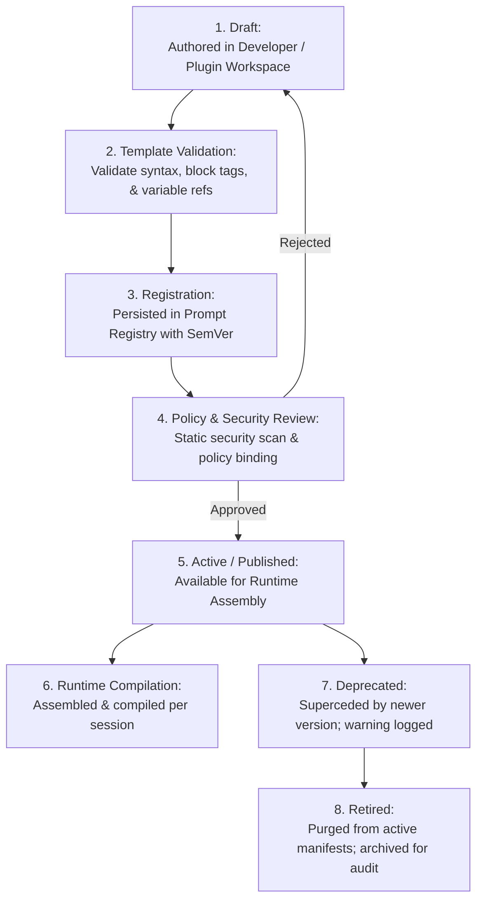
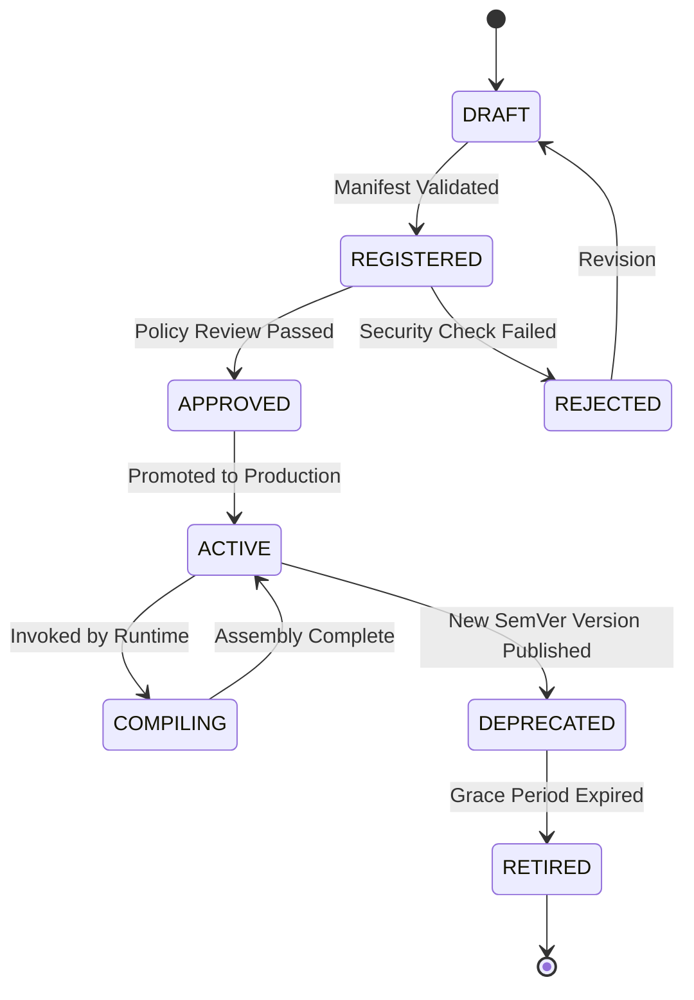
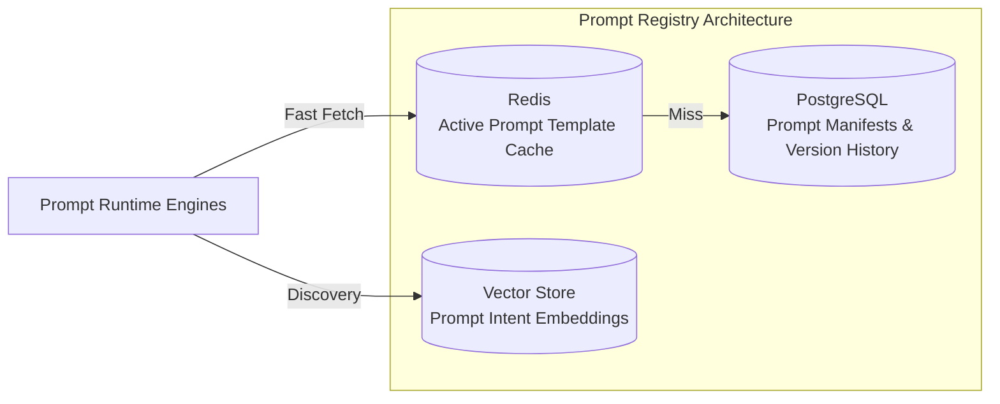
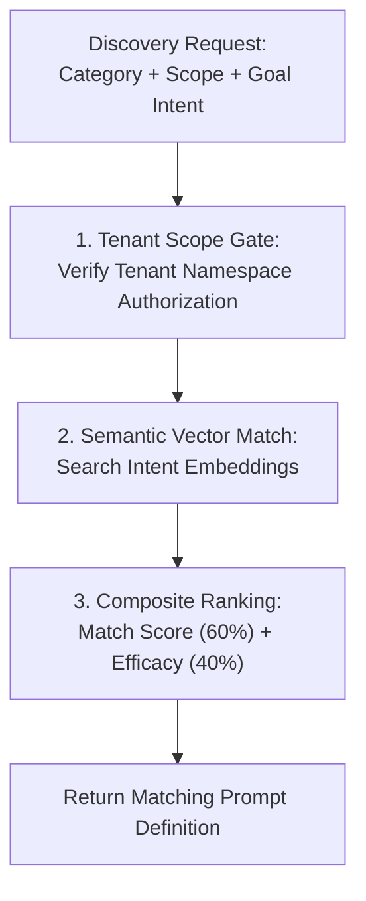
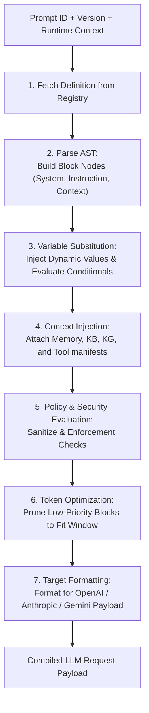
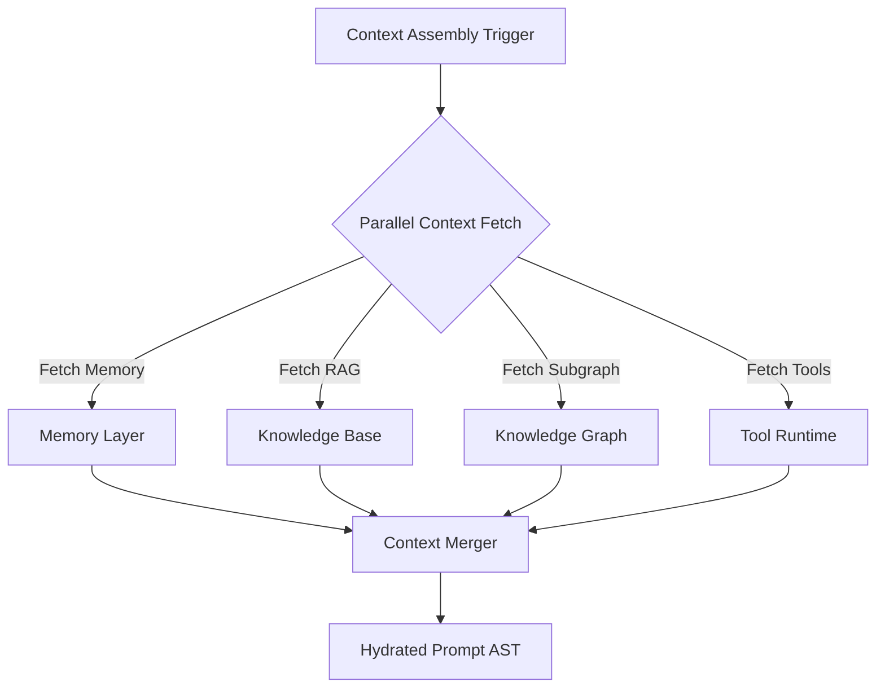
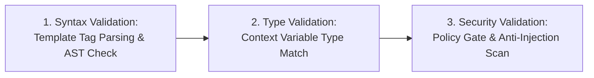
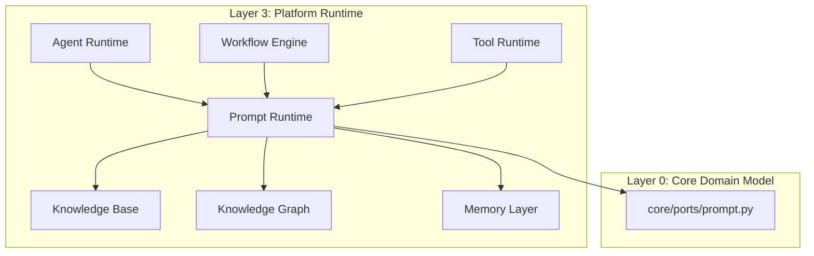
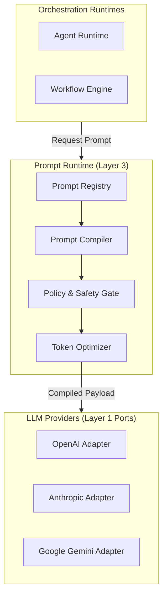

# NeuroFlow AI — Prompt Runtime Architecture Specification

**Document Version:** 1.0.0 (Approved Architecture Specification)  
**Status:** Approved Architecture Specification  
**Target Audience:** Lead Architects, Principal Engineers, AI Engineers, Prompt Engineers, Domain Plugin Authors  
**Classification:** Core Platform Capability Architecture  

---

## 1. Why a Prompt Runtime is Required

NeuroFlow AI is a production-grade modular AI Operating Platform. As the platform matured with the addition of the Agent Runtime, Tool Runtime, Knowledge Base, Knowledge Graph, and Memory Layer, a critical architectural challenge emerged at the prompt layer.

Prompts are the **cognitive programming language** of an AI Operating System. In an enterprise platform powering heterogeneous domain plugins (Telecom, Cybersecurity, Healthcare, Finance, Cloud, Enterprise AI), prompts cannot be treated as static strings, ad-hoc templates, or inline strings embedded in Python files.

Prior to the Prompt Runtime, the platform faced severe architectural risks:

- **Prompt Fragmentation & Duplication**: Prompts were hard-coded inside agent loops, tool executors, and workflow task implementations, leading to inconsistent system instructions, prompt drift, and duplicated engineering effort.
- **Missing Token Budget & Context Window Governance**: Callers manually constructed prompts without systematic token budget enforcement, causing context window overflows, unexpected truncation, or costly LLM token waste.
- **Ungoverned Security & Prompt Injection Surface**: Raw user inputs, tool outputs, and retrieved knowledge chunks were injected into prompts without standardized sanitization, opening severe prompt injection, jailbreak, and data exfiltration attack vectors.
- **No Prompt Versioning or Lineage**: Changing a prompt instruction lacked semantic versioning, rollback capabilities, approval workflows, or audit lineage. Small prompt edits silently broke downstream reasoning pipelines.
- **Decoupled Memory & Knowledge Assembly**: Context from the Memory Layer, Knowledge Base (RAG), and Knowledge Graph was concatenated haphazardly into prompt strings, lacking standardized section formatting, token prioritization, or dynamic compression.
- **No Observability or A/B Testing**: The platform could not trace which exact prompt version generated a specific LLM response, evaluate prompt efficacy, or run A/B prompt experiments across tenants.

The **Prompt Runtime** is NeuroFlow AI's production-grade prompt orchestration subsystem. Co-located in **Platform Runtime (Layer 3)**, it acts as the authoritative engine responsible for prompt registration, versioning, multi-stage compilation, dynamic context assembly, token budget optimization, safety policy enforcement, caching, and lineage tracking across all cognitive runtimes.

Every prompt executed within NeuroFlow AI must pass through the Prompt Runtime.

### Core Capabilities Unlocked by the Prompt Runtime

| Capability | Without Prompt Runtime | With Prompt Runtime |
| :--- | :--- | :--- |
| **Prompt Orchestration** | Inline strings scattered across codebase. | Centralized, versioned Prompt Registry with declarative definitions. |
| **Context Assembly** | Manual string concatenation of RAG/Memory. | Multi-block structured Assembly Pipeline with priority token budgeting. |
| **Token Budgeting** | Hard crashes on context window overflow. | Dynamic token allocation, sliding window compression, and AST pruning. |
| **Security & Safety** | Vulnerable to prompt injection & leakages. | Mandatory Prompt Policy Pipeline: sanitization, jailbreak guard, PII masking. |
| **Lineage & Audit** | No record of compiled prompt string. | Cryptographic prompt hash, version lineage tracking, and immutable audit logs. |
| **Multi-LLM Adaptation** | Hand-crafted prompts per LLM provider. | Compiler target adapters compiling abstract prompts to provider formats. |

---

## 2. Distinction Between Related Platform Concepts

To maintain strict Clean Architecture boundaries, key concepts are explicitly defined:

```
+-----------------------------------------------------------------------------------+
|  PROMPT                                 PROMPT RUNTIME                            |
|  - The conceptual cognitive directive   - Platform Runtime subsystem (Layer 3).   |
|    sent to an LLM to perform a task.    - Governs compilation, assembly, token   |
|  - Represented by a Prompt Definition.   budgeting, policy, & observability.      |
+-----------------------------------------------------------------------------------+

+-----------------------------------------------------------------------------------+
|  PROMPT TEMPLATE                        PROMPT REGISTRY                           |
|  - Parameterized layout spec containing  - Authoritative catalog storing versioned |
|    blocks, variables, & logic tags.       prompt templates & policy bindings.     |
+-----------------------------------------------------------------------------------+

+-----------------------------------------------------------------------------------+
|  PROMPT COMPILER                        PROMPT CONTEXT                            |
|  - Pipeline compiling templates, state,  - Aggregated runtime state (Variables,   |
|    memory, & RAG into an AST & payload.   Memory, Knowledge, Tools, User ID).    |
+-----------------------------------------------------------------------------------+

+-----------------------------------------------------------------------------------+
|  PROMPT POLICY                          LLM REQUEST                               |
|  - Governance rule (Safety, PII, Scope) - Final wire payload submitted via        |
|    enforced during compilation/assembly.  `ILLMProvider` port to LLM engines.     |
+-----------------------------------------------------------------------------------+
```

### Concept Taxonomy Matrix

| Concept | Layer / Placement | Primary Responsibility |
| :--- | :--- | :--- |
| **Prompt** | Domain Artifact | Abstract intent and cognitive contract specifying how an LLM should behave. |
| **Prompt Runtime** | Platform Runtime (Layer 3) | Subsystem governing prompt lifecycle, compilation, assembly, safety, and delivery. |
| **Prompt Template** | Registry Asset | Parameterized structural layout (System, Instruction, Few-Shot, Context blocks). |
| **Prompt Registry** | Layer 3 Registry | Persistent versioned repository of all approved prompt definitions and templates. |
| **Prompt Compiler** | Runtime Subsystem | Transforms abstract Prompt Templates + Context into target LLM payload structures. |
| **Prompt Context** | Runtime Context | Unified data bucket containing session memory, KB chunks, KG graphs, and variables. |
| **Prompt Policy** | Security Subsystem | Rules enforcing safety, jailbreak prevention, system instruction protection, & PII masking. |
| **LLM Request** | Layer 0 Port Payload | Fully compiled, validated payload passed to `ILLMProvider` for execution. |

---

## 3. High-Level Prompt Runtime Architecture

The Prompt Runtime is co-located in **Platform Runtime (Layer 3)**, serving as the central prompt compiler and assembly engine between higher-level orchestrators (Agent Runtime, Workflow Engine) and low-level LLM execution engines.

```
+-----------------------------------------------------------------------------------+
|                     PROMPT RUNTIME ARCHITECTURE OVERVIEW                          |
+-----------------------------------------------------------------------------------+
|                                                                                   |
|  Callers: Agent Runtime | Workflow Engine | Tool Runtime | Plugin Engines          |
|              |                                                                    |
|              v                                                                    |
|  +---------------------------+                                                    |
|  |  1. PROMPT REGISTRY       |   Versioned Store, Catalog, Template Manifests     |
|  +-----------+---------------+                                                    |
|              |                                                                    |
|              v                                                                    |
|  +---------------------------+                                                    |
|  |  2. PROMPT DISCOVERY      |   Category Lookup, Capability Search, Scope Gate   |
|  +-----------+---------------+                                                    |
|              |                                                                    |
|              v                                                                    |
|  +---------------------------+                                                    |
|  |  3. CONTEXT AGGREGATOR    |   Fetches Variables, Memory, KB, KG, Tools, User  |
|  +-----------+---------------+                                                    |
|              |                                                                    |
|              v                                                                    |
|  +---------------------------+                                                    |
|  |  4. PROMPT COMPILER       |   AST Builder, Template Engine, Block Merger      |
|  +-----------+---------------+                                                    |
|              |                                                                    |
|              v                                                                    |
|  +---------------------------+                                                    |
|  |  5. SAFETY & POLICY GATE  |   Injection Scan, Jailbreak Detector, PII Masker   |
|  +-----------+---------------+                                                    |
|              |                                                                    |
|              v                                                                    |
|  +---------------------------+                                                    |
|  |  6. TOKEN OPTIMIZER       |   Budget Allocation, AST Pruning, Compression      |
|  +-----------+---------------+                                                    |
|              |                                                                    |
|              v                                                                    |
|  +---------------------------+                                                    |
|  |  7. PROMPT CACHE          |   Compiled Prompt Payload & AST Caching            |
|  +-----------+---------------+                                                    |
|              |                                                                    |
|              v                                                                    |
|  +---------------------------+                                                    |
|  |  8. LLM TARGET ADAPTER    |   Formats for OpenAI, Anthropic, Gemini, Llama     |
|  +-----------+---------------+                                                    |
|              |                                                                    |
|              v                                                                    |
|  +---------------------------+                                                    |
|  |  9. AUDIT & LINEAGE       |   Hash Calculation, Lineage Graph, OTel Traces     |
|  +---------------------------+                                                    |
|              |                                                                    |
|              v                                                                    |
|  Dispatched to LLM Engine via `ILLMProvider` Port                                 |
+-----------------------------------------------------------------------------------+
```

---

## 4. Prompt Lifecycle

Every prompt follows a controlled lifecycle from initial authoring to formal retirement:



---

## 5. Prompt State Machine



---

## 6. Prompt Definition Model

A **Prompt Definition** is the formal declarative schema representing a prompt asset in the Registry.

```
+-----------------------------------------------------------------------------------+
|                        PROMPT DEFINITION MODEL                                    |
+-----------------------------------------------------------------------------------+
|                                                                                   |
|  HEADER & IDENTIFICATION                                                          |
|  {                                                                                |
|    "prompt_id":        string,       // Unique key: "telecom.network_diagnosis"   |
|    "name":             string,       // Human-readable title                      |
|    "version":          SemVer,       // "1.2.0"                                   |
|    "namespace":        string,       // "telecom" | "cybersecurity" | "platform"   |
|    "category":         CategoryEnum, // REASONING | SYSTEM | RAG | EXTRACTION | etc|
|    "author":           string,                                                    |
|    "description":      string                                                     |
|  }                                                                                |
|                                                                                   |
|  TEMPLATE BLOCK SPECIFICATION                                                     |
|  {                                                                                |
|    "system_block":     TemplateBlock, // Core persona, rules, and guardrails      |
|    "instruction_block":TemplateBlock, // Active task instructions                 |
|    "few_shot_block":   TemplateBlock?,// Example input/output pairs               |
|    "context_schema":   JSONSchema,   // Expected variables & context types        |
|    "output_format":    OutputSpec    // Free text, JSON Schema, Structured Tools    |
|  }                                                                                |
|                                                                                   |
|  GOVERNANCE & TOKEN BUDGET                                                        |
|  {                                                                                |
|    "max_token_budget":  integer,     // Hard limit for total assembled prompt     |
|    "priority_weights":  Map<Block, int>, // Prioritization for context pruning   |
|    "required_policies": [string],    // Policy IDs enforced during assembly       |
|    "target_models":     [string]     // Compatible LLM architectures              |
|  }                                                                                |
+-----------------------------------------------------------------------------------+
```

---

## 7. Prompt Metadata Model

Dynamic metadata collected during runtime assembly and evaluation:

```
{
  "total_assemblies":     int64,
  "avg_compilation_ms":   float,
  "avg_tokens_used":      integer,
  "cache_hit_ratio":      float,
  "last_invoked_at":      ISO8601,
  "security_violations":  integer,
  "feedback_score_avg":   float
}
```

---

## 8. Prompt Registry

The **Prompt Registry** stores, indexes, and manages all prompt definitions across platform namespaces.



---

## 9. Prompt Discovery

Prompt Discovery provides dynamic, goal-driven lookup of prompt templates using category filters, scope checks, and semantic embedding matching.



---

## 10. Prompt Categories

Prompts are categorized by cognitive function:

| Category | Description | Primary Consumer |
| :--- | :--- | :--- |
| **SYSTEM_PERSONA** | Defines AI persona, behavioral boundaries, and safety constraints. | Agent Runtime |
| **REASONING_CHAIN** | Multi-step reasoning templates (ReAct, Chain-of-Thought, Tree-of-Thought).| Agent Runtime |
| **TASK_INSTRUCTION**| Specific single-turn execution prompts. | Workflow Engine |
| **RAG_GROUNDING** | Template for formatting retrieved KB chunks and source citations. | Knowledge Base |
| **GRAPH_REASONING** | Template for formatting Knowledge Graph subgraphs and entity triples. | Knowledge Graph |
| **TOOL_FORMATTER** | Instructs LLM on tool selection and argument generation. | Tool Runtime |
| **SUMMARY_COMPRESS**| Summarizes long conversation histories or document chunks. | Memory Layer |
| **EXTRACTION_PARSER**| Enforces structured JSON/YAML extraction schemas. | Workflow / Plugins |

---

## 11. Prompt Versioning

Prompts strictly adhere to **Semantic Versioning (SemVer)**:
- **MAJOR (`2.0.0`)**: Breaking change in system instructions, context schema, or output format.
- **MINOR (`1.3.0`)**: Backward-compatible addition of optional blocks, context variables, or performance tuning.
- **PATCH (`1.2.4`)**: Typos, wording tweaks, or minor example updates with identical semantics.

---

## 12. Prompt Compilation Pipeline

The **Prompt Compiler** converts abstract definitions, templates, and runtime context into a validated AST (Abstract Syntax Tree).



---

## 13. Prompt Assembly Pipeline

Prompt Assembly is the multi-block orchestration mechanism that structures the final prompt string/payload into distinct logical blocks:

```
+-----------------------------------------------------------------------------------+
|                        PROMPT ASSEMBLY BLOCK STRUCTURE                            |
+-----------------------------------------------------------------------------------+
|  [BLOCK 1: SYSTEM & PERSONA]      Core role, platform policies, & safety rules    |
|  [BLOCK 2: USER & TENANT CONTEXT] Tenant ID, User Roles, Scope Restrictions       |
|  [BLOCK 3: MEMORY CONTEXT]        Episodic & Procedural Memory Summaries          |
|  [BLOCK 4: KNOWLEDGE BASE (RAG)]  Retrieved Document Chunks + Source Citations     |
|  [BLOCK 5: KNOWLEDGE GRAPH]       Entity Subgraph Triples & Relationship Maps     |
|  [BLOCK 6: TOOL MANIFEST]         Available Tool Definitions & JSON Schemas       |
|  [BLOCK 7: CONVERSATION HISTORY]  Sliding Window Turns & Prior Tool Observations  |
|  [BLOCK 8: ACTIVE INSTRUCTION]    Current User Query & Step Sub-Goal              |
+-----------------------------------------------------------------------------------+
```

---

## 14. Variable Resolution

Variables within templates (e.g., `{{ user.name }}`, `{{ session.id }}`) are resolved against a strictly typed `PromptContext` object.

- **Strict Type Checking**: Values must conform to `context_schema` (JSON Schema).
- **Default Fallbacks**: Unresolved optional variables fall back to declared defaults.
- **Missing Variable Policy**: Unresolved required variables halt compilation with a `PromptVariableException`.

---

## 15. Context Injection

Context Injection dynamically hydrates assembled prompt blocks from platform subsystems via non-blocking parallel fetches.



---

## 16. Memory Injection

Injects relevant items from the **AI Memory Layer**:
- **Working Memory**: Active scratchpad state.
- **Episodic Memory**: Summaries of recent user/agent interactions.
- **Procedural Memory**: High-efficacy reasoning strategies for the current goal.

---

## 17. Knowledge Base Injection

Injects retrieved document chunks from the **Knowledge Base**:
- Formats chunks into standard markdown reference blocks.
- Attaches source document IDs, chunk IDs, and confidence scores.
- Enforces RAG attribution instructions to prevent hallucinations.

---

## 18. Knowledge Graph Injection

Injects extracted entity-relationship subgraphs from the **Knowledge Graph**:
- Formats triples: `(Subject: EntityA) -[RELATION]-> (Object: EntityB)`.
- Includes entity property maps and semantic type definitions.

---

## 19. Tool Context Injection

Injects tool manifests from the **Tool Runtime**:
- Formats active tool names, descriptions, and JSON Schemas into OpenAI/Anthropic native tool calling format.
- Injects tool execution history and recent tool observations.

---

## 20. Workflow Context Injection

Injects workflow execution state from the **Workflow Engine**:
- Current workflow ID, active task ID, pipeline inputs, and parent workflow parameters.

---

## 21. Plugin Context Injection

Injects domain-specific parameters registered by active **Domain Plugins** (e.g., Telecom cell tower IDs, Healthcare ICD-10 codes).

---

## 22. User Context Injection

Injects caller identity details: `user_id`, `tenant_id`, granted scopes, and localized user preferences.

---

## 23. Conversation Context

Manages multi-turn conversation history within Block 7:
- Applies sliding token windowing to prevent history from consuming system instruction budget.
- Summarizes turns older than $N$ steps using background compression.

---

## 24. Prompt Policies

Prompt Policies are mandatory governance rules enforced by the Security Pipeline:

1. **Jailbreak Prevention Policy**: Scans for pattern overrides (`ignore previous instructions`).
2. **System Instruction Protection Policy**: Prevents prompt leak attacks.
3. **PII Masking Policy**: Automatically redacts emails, credit cards, and SSNs in user inputs before prompt assembly.
4. **Safety Policy**: Blocks hate speech, toxicity, or policy-violating instructions.

---

## 25. Prompt Validation

Validation occurs in three distinct stages:



---

## 26. Prompt Optimization

The Optimization Engine maximizes reasoning efficacy while minimizing LLM token consumption.

---

## 27. Token Budget Optimization

Every prompt compilation operates under a strict **Token Budget Allocation**:

```
+-----------------------------------------------------------------------------------+
|                        TOKEN BUDGET ALLOCATION MATRIX                             |
+-----------------------------------------------------------------------------------+
|  Total Context Window Limit: 8,192 Tokens                                         |
|                                                                                   |
|  [Priority 1 - FIXED]    System & Persona Block         : 1,024 Tokens (Reserved) |
|  [Priority 2 - HIGH]     Active Instruction & Query     : 1,024 Tokens (Reserved) |
|  [Priority 3 - MEDIUM]   Knowledge Base & Graph Context : 3,072 Tokens (Dynamic)  |
|  [Priority 4 - MEDIUM]   Tool Definitions & Schemas     : 1,536 Tokens (Dynamic)  |
|  [Priority 5 - LOW]      Conversation History & Memory  :   536 Tokens (Truncated)|
+-----------------------------------------------------------------------------------+
```

---

## 28. Context Window Management

When total context exceeds token budget limits, the Prompt Runtime applies **Priority AST Pruning**:
1. Truncate low-priority conversation history turns first.
2. Reduce low-relevance RAG chunks next.
3. Prune optional tool definitions.
4. System instructions and core user queries are **never** pruned.

---

## 29. Prompt Compression

Applies structural semantic compression to prompt blocks (removing redundant whitespace, compressing JSON representations, summarizing old history) to reclaim token capacity without losing semantic meaning.

---

## 30. Prompt Caching

Compiled prompt segments (e.g., static system instructions, tool manifests) are cached in Redis (`IPromptCache`) using cryptographic hashes of their constituent templates and static variables.

---

## 31. Prompt Lineage

Every compiled prompt generates a deterministic **Prompt Lineage Record**:

```
Prompt Lineage Hash = SHA256(prompt_id + ":" + version + ":" + template_hash + ":" + context_hash)
```

This lineage hash is attached to every downstream LLM trace, enabling complete auditability from LLM output back to the exact prompt template and context inputs.

---

## 32. Prompt Governance

Prompt Governance governs the promotion lifecycle:
- Requires peer approval for changes to `SYSTEM_PERSONA` prompts.
- Enforces regression testing against evaluation datasets before promoting templates to `ACTIVE`.

---

## 33. Prompt Security

Implements Zero Trust principles at the prompt boundary:
- Inputs treated as untrusted data.
- System instructions strictly isolated from user data blocks using clear boundary markers (e.g., XML tags `<user_input>`).

---

## 34. Prompt Audit Trail

Every prompt compilation event writes an immutable record to the Audit Log:

```
{
  "timestamp":        ISO8601,
  "lineage_hash":     string,
  "prompt_id":        string,
  "version":          string,
  "tenant_id":        string,
  "user_id":          string,
  "tokens_compiled":  integer,
  "policies_passed":  [string]
}
```

---

## 35. Prompt Observability

Full observability integrated with OpenTelemetry.

---

## 36. Prompt Metrics

Exports 16 OpenTelemetry metrics:
- `neuroflow_prompt_compilations_total`
- `neuroflow_prompt_compilation_duration_seconds`
- `neuroflow_prompt_token_count`
- `neuroflow_prompt_policy_violations_total`
- `neuroflow_prompt_cache_hits_total`
- `neuroflow_prompt_pruning_events_total`

---

## 37. Prompt Logging

Structured JSON logging at all compilation steps containing `trace_id`, `prompt_id`, `version`, and `tenant_id`.

---

## 38. Prompt Tracing

Distributed traces record full span hierarchies for template fetching, context hydration, policy gates, token pruning, and provider formatting.

---

## 39. Agent Runtime Integration

The Agent Runtime invokes the Prompt Runtime during the **THINK** phase of reasoning loops to compile dynamic prompts grounded in memory, KB, KG, and tool manifests.

---

## 40. Workflow Engine Integration

Workflow Engine tasks request pre-compiled prompt templates for structured LLM execution tasks (`LLM_TASK`).

---

## 41. Tool Runtime Integration

Tool Runtime uses Prompt Runtime to format tool manifests into provider-specific schemas (e.g., OpenAI Tool Specs).

---

## 42. Integration Runtime Integration

Prompt Runtime delegates outbound prompt calls to `ILLMProvider` ports managed alongside Integration Runtime adapters.

---

## 43. Memory Layer Integration

Direct read/write interfaces to pull Working, Episodic, and Procedural memory for Block 3 context injection.

---

## 44. Knowledge Base Integration

Direct integration to format retrieved RAG chunks into Block 4 context structures.

---

## 45. Knowledge Graph Integration

Direct integration to format entity-relationship subgraphs into Block 5 context structures.

---

## 46. Event Bus Integration

Publishes prompt lifecycle events (`neuroflow.prompt.registered`, `neuroflow.prompt.policy_violation`).

---

## 47. Repository Placement

The Prompt Runtime is placed within **Platform Runtime (Layer 3)**:

```
backend/
├── core/
│   └── ports/
│       └── prompt.py                # Layer 0: Core Abstract Interfaces
├── infrastructure/
│   └── prompt/                      # Layer 1: Prompt Cache & Storage Adapters
└── prompt_runtime/                  # Layer 3: Platform Prompt Runtime Subsystem
    ├── registry/                    # Prompt Registry & Manifest Manager
    ├── compiler/                    # AST Compiler & Template Engine
    ├── assembly/                    # Multi-Block Assembly Pipeline
    ├── context/                     # Context Aggregator (Memory, RAG, KG)
    ├── policy/                      # Safety, Security, & PII Gate
    ├── optimizer/                   # Token Budget & Context Window Optimizer
    ├── cache/                       # Redis Prompt Caching
    ├── lineage/                     # Lineage Tracker & Hash Engine
    └── observability/               # Metrics, Traces, & Audit Emitter
```

---

## 48. Clean Architecture Dependency Diagram



---

## 49. Platform Ecosystem Diagram



---

## 50. Repository Impact Assessment

### Summary of New Files To Be Created (Implementation Phase)

- `backend/core/ports/prompt.py`: Core Layer 0 contracts (`IPromptRuntime`, `IPromptRegistry`, `IPromptCompiler`, `IPromptPolicy`).
- `backend/infrastructure/prompt/`: Redis prompt caching and PostgreSQL manifest adapters.
- `backend/prompt_runtime/`: 9 functional modules implementing the specification.
- `docs/architecture/prompt-runtime.md`: This approved specification.
- `docs/adr/ADR-012-prompt-runtime.md`: Accompanying Decision Record.

---

## 51. Future Evolution

The Prompt Runtime is architected to support future capabilities:

- **Prompt Marketplace**: Enterprise catalog for sharing approved domain prompts.
- **Prompt Packs**: Versioned domain bundles (e.g., `TelecomPromptPack-v2.0`).
- **Prompt SDK**: Tooling for authoring, testing, and debugging prompt ASTs locally.
- **Prompt Certification**: Automated CI/CD security and quality certification for prompts.
- **Community Prompt Packages**: Open-source prompt packages with cryptographic verification.
- **AI-Assisted Prompt Optimization**: Automated prompt tuning using feedback loops.
- **Automatic Prompt Evaluation**: Continuous evaluation of prompt efficacy against test suites.
- **Multi-LLM Prompt Adaptation**: Automatic translation of prompts optimized for specific model architectures.
- **Prompt A/B Testing**: Traffic splitting between prompt template versions to evaluate real-world efficacy.
- **Prompt Experimentation Framework**: Managed environment for running prompt experiments.

---

## 52. ADR Recommendation

It is recommended to adopt **ADR-012: Prompt Runtime Architecture**, establishing the Prompt Runtime as the frozen platform subsystem for prompt orchestration.

### Suggested Commit Message
`docs(architecture): add Prompt Runtime architecture specification and ADR-012`

---

**End of Prompt Runtime Architecture Specification (v1.0.0)**
