# NeuroFlow AI — RAG Runtime Architecture Specification

**Document Version:** 1.0.0 (Approved Architecture Specification)  
**Status:** Approved Architecture Specification  
**Target Audience:** Lead Architects, Principal Engineers, AI Engineers, Search Engineers, Domain Plugin Authors  
**Classification:** Core Platform Capability Architecture  

---

## 1. Why a RAG Runtime is Required

NeuroFlow AI is a production-grade modular AI Operating Platform serving enterprise domain plugins (Telecom, Cybersecurity, Healthcare, Finance, Cloud Infrastructure, Enterprise AI). To ground LLM reasoning and eliminate hallucinations, the platform must continuously retrieve facts, documents, entity subgraphs, conversation memories, and external data sources.

Before the introduction of the RAG Runtime, retrieval operations were fragmented across platform layers:
- The **Knowledge Base** ingested and chunked documents, providing vector search APIs.
- The **Knowledge Graph** managed graph traversals and entity relationships.
- The **Memory Layer** stored episodic and semantic memories.
- The **Integration Runtime** handled external API and database calls.

However, the platform lacked an **orchestration engine for retrieval intelligence**. Individual subsystems performed isolated, naive searches without query intent classification, multi-source fusion, cross-encoder re-ranking, token budget compression, or verifiable citation generation.

Without a RAG Runtime, the platform experienced severe retrieval failure modes:
- **Low Precision & Recall**: Naive vector similarity searches returned irrelevant chunks while missing critical domain facts.
- **Single-Source Myopia**: Searches executed against either a vector store OR a knowledge graph, failing to combine dense semantic vectors, sparse keywords, graph topologies, and memory context into a unified answer context.
- **Hallucinated Citations**: Prompts received raw unvalidated context without verifiable source provenance or chunk-level attribution hashes.
- **Context Window Pollution**: Unfiltered retrieval results flooded the prompt window, exceeding token budgets and degrading LLM reasoning performance.
- **Uncoordinated Multi-Tenant Retrieval**: Outbound search queries could not enforce multi-tenant isolation, data freshness validation, or source credibility boundaries across heterogeneous enterprise systems.

The **RAG Runtime** is NeuroFlow AI's production-grade retrieval intelligence subsystem. Co-located in **Platform Runtime (Layer 3)**, it serves as the single authoritative engine responsible for query analysis, multi-source hybrid retrieval planning, cross-source fusion, re-ranking, source credibility scoring, citation generation, and context packaging for the Prompt Runtime and Agent Runtime.

All retrieval operations within NeuroFlow AI must pass through the RAG Runtime.

### Core Capabilities Unlocked by the RAG Runtime

| Capability | Without RAG Runtime | With RAG Runtime |
| :--- | :--- | :--- |
| **Retrieval Orchestration** | Isolated calls to vector stores or memory APIs. | Unified multi-source Retrieval Planning Engine with execution DAGs. |
| **Query Intelligence** | Raw user queries executed directly. | Query Intent Classification, Expansion (HyDE/Synonyms), & Rewriting. |
| **Multi-Source Hybrid Search**| Single-index vector search. | Reciprocal Rank Fusion (RRF) merging Vector, Keyword, Graph, & Memory. |
| **Re-ranking & Precision** | Top-K by cosine similarity only. | Cross-Encoder re-ranking, freshness scoring, & source credibility gate. |
| **Citation Lineage** | Unverified or missing source links. | Cryptographically verifiable Chunk Attributions & Citation Generation. |
| **Context Packaging** | Raw chunk concatenation. | Token budget-aware AST Context Assembly & Semantic Compression. |

---

## 2. Distinction Between Related Platform Concepts

To maintain Clean Architecture precision, core retrieval concepts are explicitly demarcated:

```
+-----------------------------------------------------------------------------------+
|  RAG (Concept)                          RAG RUNTIME                               |
|  - The general pattern of augmenting    - Platform Runtime subsystem (Layer 3).   |
|    LLMs with retrieved context.         - Governs query analysis, hybrid plan,    |
|                                           fusion, re-ranking, & citations.        |
+-----------------------------------------------------------------------------------+

+-----------------------------------------------------------------------------------+
|  KNOWLEDGE BASE                         VECTOR STORE                              |
|  - Platform storage subsystem (Layer 3) - Low-level vector database engine        |
|    managing document lifecycles & RAG.    (Qdrant, pgvector) indexing embeddings. |
+-----------------------------------------------------------------------------------+

+-----------------------------------------------------------------------------------+
|  EMBEDDING MODEL                        RETRIEVER                                 |
|  - Neural encoder converting text/data  - Specific retrieval strategy module      |
|    into dense vector representations.     (Vector, Keyword, Graph, Memory).       |
+-----------------------------------------------------------------------------------+

+-----------------------------------------------------------------------------------+
|  RE-RANKER                              CONTEXT BUILDER                           |
|  - Cross-encoder model re-scoring       - Final assembly engine packaging         |
|    candidate chunks for relevance.        ranked chunks into structured prompts.  |
+-----------------------------------------------------------------------------------+
```

### Concept Taxonomy Matrix

| Concept | Layer / Placement | Primary Responsibility |
| :--- | :--- | :--- |
| **RAG** | Cognitive Pattern | Retrieval-Augmented Generation architectural paradigm. |
| **RAG Runtime** | Platform Runtime (Layer 3) | Subsystem orchestrating the end-to-end retrieval, fusion, re-ranking, and citation pipeline. |
| **Knowledge Base** | Platform Subsystem (Layer 3)| Asset lifecycle management for enterprise documents, ingestion, and chunk storage. |
| **Vector Store** | Infrastructure (Layer 1) | High-performance ANN indexing engine (Qdrant, pgvector). |
| **Embedding Model** | Infrastructure / Model Port | Text/multimodal embedding provider (OpenAI Text-Embedding-3, Cohere, BGE). |
| **Retriever** | RAG Runtime Module | Specialized search worker executing queries against a specific storage fabric. |
| **Re-ranker** | RAG Runtime Module | Secondary neural scoring engine (Cohere Rerank, BGE-Reranker) refining candidate sets. |
| **Context Builder** | RAG Runtime Module | Packages validated, cited, and compressed context for Prompt Runtime. |

---

## 3. High-Level RAG Runtime Architecture

The RAG Runtime is co-located in **Platform Runtime (Layer 3)**, acting as the retrieval intelligence fabric between cognitive orchestrators (Agent Runtime, Prompt Runtime) and storage subsystems (Knowledge Base, Knowledge Graph, Memory Layer, Integration Runtime).

```
+-----------------------------------------------------------------------------------+
|                       RAG RUNTIME ARCHITECTURE OVERVIEW                           |
+-----------------------------------------------------------------------------------+
|                                                                                   |
|  Callers: Prompt Runtime | Agent Runtime | Workflow Engine | Tool Runtime          |
|              |                                                                    |
|              v                                                                    |
|  +---------------------------+                                                    |
|  |  1. QUERY ANALYZER        |   Intent Classifier, Query Rewriter, Expansion     |
|  +-----------+---------------+                                                    |
|              |                                                                    |
|              v                                                                    |
|  +---------------------------+                                                    |
|  |  2. RETRIEVAL PLANNER     |   Multi-Source Execution Plan & DAG Construction   |
|  +-----------+---------------+                                                    |
|              |                                                                    |
|              v                                                                    |
|  +---------------------------+                                                    |
|  |  3. RETRIEVER REGISTRY    |   Vector, Keyword, Graph, Memory, External Workers |
|  +-----------+---------------+                                                    |
|              |                                                                    |
|              +-------------------+--------------------+                           |
|              |                   |                    |                           |
|              v                   v                    v                           |
|      +---------------+   +---------------+    +---------------+                   |
|      | Vector Search |   | Keyword Search|    | Graph Traversal|                  |
|      | (KB / Qdrant) |   | (BM25 / ES)   |    | (Graph Engine)|                   |
|      +-------+-------+   +-------+-------+    +-------+-------+                   |
|              |                   |                    |                           |
|              +-------------------+--------------------+                           |
|                                  |                                                |
|                                  v                                                |
|                      +-----------------------+                                    |
|                      |  4. HYBRID FUSION     |   RRF / Weighted Score Merger       |
|                      +-----------+-----------+                                    |
|                                  |                                                |
|                                  v                                                |
|                      +-----------------------+                                    |
|                      |  5. DEDUPLICATION     |   Exact SHA & Semantic MinHash Dedup   |
|                      +-----------+-----------+                                    |
|                                  |                                                |
|                                  v                                                |
|                      +-----------------------+                                    |
|                      |  6. RE-RANKING ENGINE |   Cross-Encoder Neural Re-scoring  |
|                      +-----------+-----------+                                    |
|                                  |                                                |
|                                  v                                                |
|                      +-----------------------+                                    |
|                      |  7. VALIDATION GATE   |   Freshness & Source Credibility   |
|                      +-----------+-----------+                                    |
|                                  |                                                |
|                                  v                                                |
|                      +-----------------------+                                    |
|                      |  8. CITATION GEN      |   Verifiable Source & Chunk Hashes |
|                      +-----------+-----------+                                    |
|                                  |                                                |
|                                  v                                                |
|                      +-----------------------+                                    |
|                      |  9. CONTEXT PACKAGER  |   Token Budget Compression & AST   |
|                      +-----------------------+                                    |
|                                  |                                                |
|                                  v                                                |
|  Output: Formatted, Cited Context Payload to Prompt Runtime                       |
+-----------------------------------------------------------------------------------+
```

---

## 4. Retrieval Lifecycle

Every retrieval execution progresses through a deterministic multi-stage pipeline:

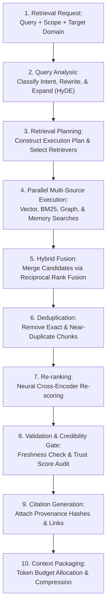

---

## 5. Retrieval State Machine

The RAG Runtime executes retrieval plans using a strict state machine:

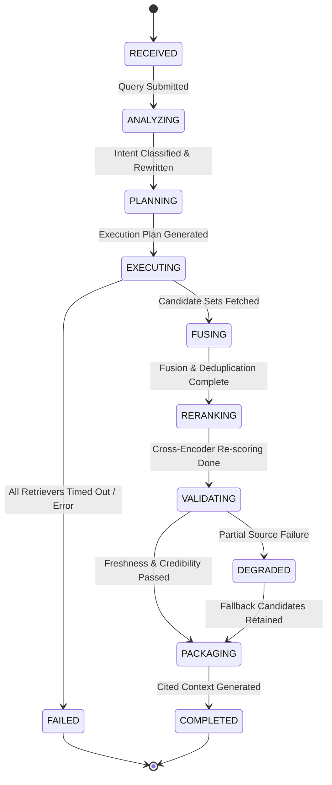

---

## 6. Query Analysis Pipeline

The Query Analysis Pipeline transforms raw user or agent queries into optimized search vectors and filters.

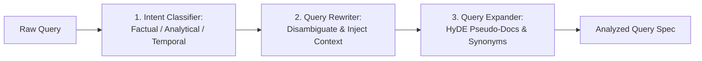

---

## 7. Query Classification

Queries are categorized into five intent classes to drive retriever selection:

| Intent Class | Description | Primary Target Retrievers |
| :--- | :--- | :--- |
| **FACTUAL_LOOKUP** | Direct lookup of specific facts or attributes. | Keyword (BM25) + Knowledge Graph |
| **SEMANTIC_SEARCH**| Broad conceptual or semantic inquiries. | Vector (Dense HNSW) + Knowledge Base |
| **RELATIONAL_PATH**| Complex entity relationship queries. | Knowledge Graph (Graph Traversal) |
| **TEMPORAL_HIST** | Time-series, recent events, or logs. | Memory (Episodic) + Knowledge Base |
| **HYBRID_COMPOSITE**| Open-ended analytical questions. | Full Multi-Source Hybrid Search |

---

## 8. Query Rewriting

Rephrases ambiguous queries by injecting session history, active agent sub-goals, and resolving co-references (e.g., converting *"What was its uptime?"* to *"What was the uptime of Node-B-Telecom-Router in Session 41?"*).

---

## 9. Query Expansion

Generates search variations to maximize recall:
- **Hypothetical Document Embeddings (HyDE)**: Generates a synthetic response using a fast LLM, then embeds the synthetic response to search vector space.
- **Synonym Expansion**: Expands domain-specific jargon and acronyms.

---

## 10. Retrieval Planning

The Retrieval Planner builds a parallel execution DAG specifying:
- Target storage fabrics (KB, KG, Memory, Integration connectors).
- Top-$K$ candidate limits per retriever.
- Hard timeouts per retriever execution step.

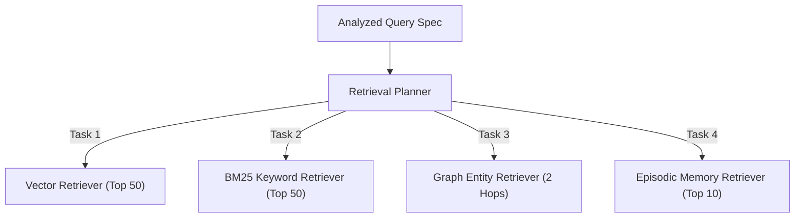

---

## 11. Hybrid Retrieval Architecture

The Hybrid Retrieval Architecture combines the strengths of dense vector search, sparse keyword search, graph traversals, and memory lookups into a unified pipeline.

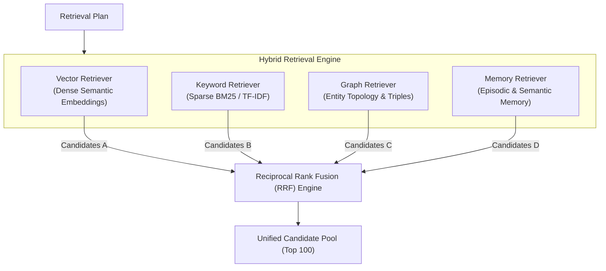

---

## 12. Vector Retrieval

Executes dense vector similarity search against the **Knowledge Base** vector index:
- Uses Approximate Nearest Neighbor (ANN) search via HNSW indices.
- Embeds queries using the active `IEmbeddingProvider` port.
- Applies metadata filtering (`tenant_id`, `namespace`, `document_type`).

---

## 13. Keyword Retrieval

Executes full-text keyword search using BM25 / inverted indices to catch exact matching terms, serial numbers, codes, and identifiers missed by vector embeddings.

---

## 14. Knowledge Graph Retrieval

Executes subgraph extraction via the **Knowledge Graph**:
- Identifies seed entities in the query.
- Traverses $N$-hop relationships to extract triples and property graphs.
- Formats entities into structured context representations.

---

## 15. Knowledge Base Retrieval

Interacts directly with `IKnowledgeBase` to fetch validated document chunks, metadata, and ingestion versioning info.

---

## 16. Memory Retrieval

Queries the **AI Memory Layer** (`IMemoryRetriever`) to retrieve episodic conversation history, user preferences, and procedural reasoning strategies relevant to the current query.

---

## 17. External Retrieval via Integration Runtime

Invokes external enterprise systems (SaaS APIs, remote SQL databases, SharePoint) via the **Integration Runtime** when local indices lack sufficient freshness or coverage.

---

## 18. Retriever Registry

The **Retriever Registry** manages active retriever worker modules, their supported data categories, health status, and execution configurations.

---

## 19. Retriever Selection Strategy

Selection logic dynamically chooses retrievers based on Query Intent, Tenant Permissions, and Target Subsystem Availability.

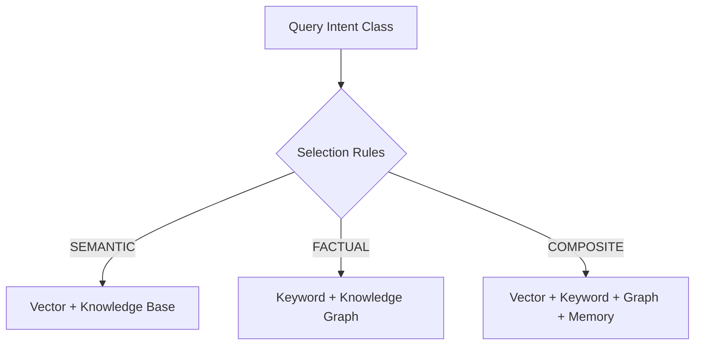

---

## 20. Embedding Provider Abstraction

Decouples vector search from embedding model providers via the `IEmbeddingProvider` port:
- Supports OpenAI, Cohere, HuggingFace BGE, and local ONNX embedding models.
- Handles embedding vector normalization, batching, and dimensional alignment.

---

## 21. Vector Store Abstraction

Abstracts low-level vector engines via the `IVectorStore` port:
- Supports Qdrant, pgvector, Milvus, and Pinecone.
- Standardizes vector upsert, ANN search, and payload filtering syntax.

---

## 22. Retrieval Fusion

Fuses candidate result sets from multiple retrievers using **Reciprocal Rank Fusion (RRF)**:

$$\text{RRF Score}(d) = \sum_{m \in M} \frac{1}{k + r_m(d)}$$

Where:
- $M$ is the set of retrievers.
- $r_m(d)$ is the rank of document $d$ in retriever $m$.
- $k$ is a constant smoothing parameter (default: 60).

---

## 23. Result Deduplication

Removes redundant candidate chunks in two passes:
1. **Exact Deduplication**: SHA-256 hash match on chunk content.
2. **Semantic Deduplication**: MinHash / Cosine similarity thresholding ($>0.95$ similarity) to purge near-duplicate passages.

---

## 24. Re-ranking Pipeline

Refines the top candidate pool (e.g., Top 100) using a high-precision **Cross-Encoder Neural Re-ranker** (`IReRanker` port):
- Computes joint query-document attention scores.
- Re-scores and sorts candidates to produce the final top-$N$ candidate set (e.g., Top 15).

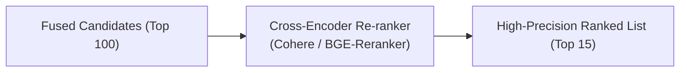

---

## 25. Freshness Validation

Verifies chunk freshness against document modification timestamps and TTL policies. Outdated chunks are flagged or discarded.

---

## 26. Source Credibility Assessment

Scores candidate chunks based on source trustworthiness metadata:
- Official enterprise policy documents receive high credibility weight ($1.0$).
- User scratchpads or unverified external web scrapes receive lower credibility weight ($0.4$).

---

## 27. Citation Generation

Attaches verifiable citation metadata to every accepted context chunk:

```
Citation Object:
{
  "citation_id":     "cite_9f8a3c",
  "document_id":     "doc_telecom_sop_401",
  "chunk_id":        "chunk_128",
  "chunk_hash":      "sha256_e3b0c44298fc...",
  "source_name":     "Telecom Network Sop v4",
  "source_uri":      "https://sharepoint.telecom.internal/sop401.pdf",
  "relevance_score": 0.942,
  "trust_score":     0.98
}
```

---

## 28. Context Assembly

Assembles validated, re-ranked, cited chunks into a structured AST payload for consumption by the Prompt Runtime.

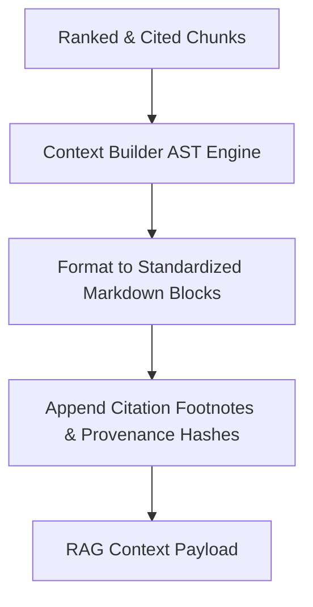

---

## 29. Context Compression

Applies extractive and abstractive compression to remove filler sentences within retrieved chunks, maximizing information density per token.

---

## 30. Token Budget Optimization

Adjusts chunk payload volume to strictly conform to the token budget allocated by the Prompt Runtime:
- High-relevance chunks are preserved in full.
- Lower-relevance chunks are truncated or compressed to fit remaining budget slots.

---

## 31. Retrieval Policies

Enforces platform governance policies:
- **Max Chunks Policy**: Hard limit on total chunks returned per query.
- **Redaction Policy**: Automatically redacts sensitive fields matching PII patterns.
- **Access Scope Policy**: Restricts retrieval to authorized namespace tags.

---

## 32. Multi-Tenant Isolation

Multi-tenant data isolation is strictly enforced across all retrieval stages:
- Vector indices, keyword indexes, and graph queries execute with mandatory `tenant_id` payload filters.
- Cross-tenant data leakage is prevented at the storage driver layer.

---

## 33. Plugin Integration Model

Domain plugins register custom retrievers and domain-specific re-rankers at load time:

```
context.rag_runtime.register_retriever(
    retriever_id="telecom.gis_topology_retriever",
    retriever_class=GISTopologyRetriever
)
```

---

## 34. Prompt Runtime Integration

The RAG Runtime delivers assembled, cited context payloads directly to the Prompt Runtime's Block 4 (RAG Context) during prompt compilation.

---

## 35. Agent Runtime Integration

The Agent Runtime invokes the RAG Runtime during the **OBSERVE** and **THINK** phases of reasoning loops to fetch grounding evidence for sub-goals.

---

## 36. Tool Runtime Integration

Tools (e.g., `kb_search`, `hybrid_search`) execute retrieval operations by delegating calls to `IRagRuntime.retrieve()`.

---

## 37. Integration Runtime Integration

RAG Runtime uses Integration Runtime connectors to execute federated searches against external enterprise data sources.

---

## 38. Knowledge Base Integration

Primary retrieval engine for vector and keyword chunk indices managed by the Knowledge Base.

---

## 39. Knowledge Graph Integration

Primary retrieval engine for structured graph entity and triple context.

---

## 40. Memory Layer Integration

Primary retrieval engine for episodic and semantic memory records.

---

## 41. Event Bus Integration

Publishes retrieval lifecycle events (`neuroflow.rag.retrieval_completed`, `neuroflow.rag.source_unreachable`).

---

## 42. Observability

Full distributed observability integrated with OpenTelemetry.

---

## 43. Metrics

Exports 18 OpenTelemetry metrics:
- `neuroflow_rag_requests_total`
- `neuroflow_rag_latency_seconds`
- `neuroflow_rag_retriever_latency_seconds`
- `neuroflow_rag_rrf_fusion_duration_seconds`
- `neuroflow_rag_rerank_duration_seconds`
- `neuroflow_rag_chunks_retrieved_total`
- `neuroflow_rag_citations_generated_total`
- `neuroflow_rag_freshness_violations_total`

---

## 44. Logging

Structured JSON logs containing `trace_id`, `query_id`, `tenant_id`, `retrieval_plan`, and `relevance_scores`.

---

## 45. Distributed Tracing

OpenTelemetry traces record span hierarchies for query analysis, parallel retriever execution, fusion, re-ranking, and context packaging.

---

## 46. Failure Recovery

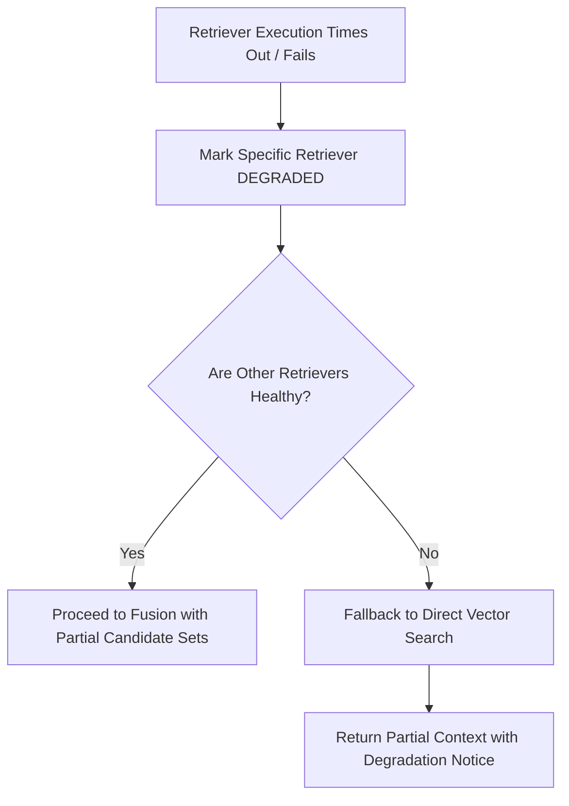

---

## 47. Repository Placement

The RAG Runtime is located within **Platform Runtime (Layer 3)**:

```
backend/
├── core/
│   └── ports/
│       └── rag.py                   # Layer 0: Core Abstract Interfaces
├── infrastructure/
│   └── rag/                         # Layer 1: Vector & Re-ranker Adapters
└── rag_runtime/                     # Layer 3: Platform RAG Runtime Subsystem
    ├── query_analysis/              # Intent Classifier, Rewriter, HyDE
    ├── planner/                     # Retrieval Planning Engine & DAG Builder
    ├── registry/                    # Retriever Registry
    ├── retrievers/                  # Vector, Keyword, Graph, Memory Retrievers
    ├── fusion/                      # Reciprocal Rank Fusion (RRF) & Dedup
    ├── reranking/                   # Cross-Encoder Re-ranker Engine
    ├── validation/                  # Freshness & Source Credibility Gate
    ├── citation/                    # Citation & Provenance Generator
    ├── context_builder/             # Token Budget Packaging & Compression
    └── observability/               # Metrics, Traces, & Audit Emitter
```

---

## 48. Clean Architecture Dependency Diagram

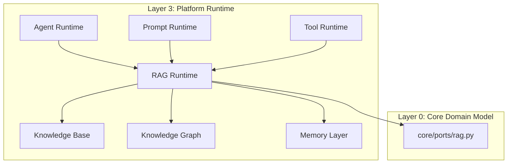

---

## 49. Platform Ecosystem Diagram

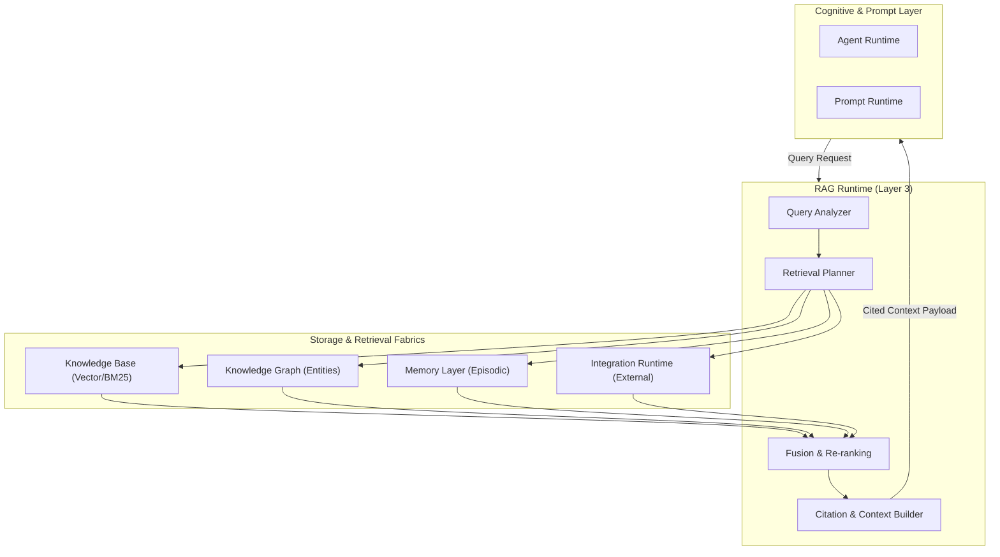

---

## 50. Repository Impact Assessment

### Summary of New Files To Be Created (Implementation Phase)

- `backend/core/ports/rag.py`: Core Layer 0 contracts (`IRagRuntime`, `IRetriever`, `IReRanker`, `IEmbeddingProvider`).
- `backend/infrastructure/rag/`: Vector store adapters, embedding provider clients, and cross-encoder adapters.
- `backend/rag_runtime/`: 10 functional modules implementing the specification.
- `docs/architecture/rag-runtime.md`: This approved specification.
- `docs/adr/ADR-013-rag-runtime.md`: Accompanying Decision Record.

---

## 51. Future Evolution

The RAG Runtime is architected to support future evolutionary paradigms:

- **Multi-modal RAG**: Native retrieval of images, audio clips, and video keyframes using multimodal embeddings (CLIP/ALIGN).
- **Graph-RAG Evolution**: Deep integration of graph neural networks (GNNs) for reasoning over large-scale knowledge graphs.
- **Agentic Retrieval**: Autonomous sub-agents executing iterative, multi-hop search queries to resolve complex goals.
- **Retrieval Benchmarking**: Automated evaluation of retrieval precision and recall using RAGAS and ROUGE metrics.
- **Adaptive Retrieval**: Dynamic switching between sparse, dense, and graph retrieval based on real-time SLA metrics.
- **Active Learning**: Incorporating explicit user feedback to continuously fine-tune re-ranking models.
- **Federated Retrieval**: Cross-organization zero-trust retrieval across multi-cloud enterprise boundaries.
- **Enterprise Search Integration**: Native connectors for enterprise search platforms (Elasticsearch, Coveo, Azure Cognitive Search).
- **Personalized Retrieval**: Tailoring candidate re-ranking weights based on user profile and historical preferences.
- **Cross-Plugin Retrieval**: Secure, policy-governed retrieval sharing across distinct domain plugin namespaces.

---

## 52. ADR Recommendation

It is recommended to adopt **ADR-013: RAG Runtime Architecture**, establishing the RAG Runtime as the frozen platform subsystem for retrieval intelligence.

### Suggested Commit Message
`docs(architecture): add RAG Runtime architecture specification and ADR-013`

---

**End of RAG Runtime Architecture Specification (v1.0.0)**
