# NeuroFlow AI — Tool Runtime Architecture Specification

**Document Version:** 1.0.0 (Approved Architecture Specification)  
**Status:** Approved Architecture Specification  
**Target Audience:** Lead Architects, Principal Engineers, AI Engineers, Domain Plugin Authors  
**Classification:** Core Platform Capability Architecture  

---

## 1. Why a Tool Runtime is Required

NeuroFlow AI is a production-grade modular AI Operating Platform. Its domain plugins — Telecom Intelligence, Cybersecurity, Healthcare, Finance, Cloud Infrastructure, Enterprise AI, Research Assistants, and Autonomous AI Agents — each require the ability to act upon the world: query external systems, compute over structured data, read and write to platform services, communicate with third-party APIs, execute domain-specific operations, and interact with the Knowledge Base, Knowledge Graph, and Memory Layer.

Every one of these actions is a **tool invocation**. The Agent Runtime selects tools through reasoning. The Workflow Engine invokes tools through declared task types. Domain plugins contribute domain-specific tools. But the mechanism that **actually executes** those tools — that validates them, authorizes them, sandboxes them, monitors them, retries them, rates them, and makes them observable across the entire platform — does not exist in the Agent Runtime or the Workflow Engine. It must exist as a separate, reusable, production-grade subsystem.

Without a Tool Runtime, the platform faces:

- **No unified execution contract** — tool invocation logic is duplicated across the Agent Runtime, Workflow Engine, and every domain plugin, producing inconsistent behavior, divergent error semantics, and untestable execution paths.
- **No platform-wide authorization** — each consumer enforces its own permission rules, producing gaps where a plugin tool can be invoked outside its declared scope without detection.
- **No input/output validation** — argument validation and result normalization are repeated ad hoc in every tool caller, making LLM-generated tool arguments a direct injection surface.
- **No sandboxing or isolation** — external tool executors run with unconstrained access to the host process, the file system, and platform services. A misbehaving plugin tool can affect the stability of the entire platform.
- **No unified retry and timeout policy** — each tool caller implements its own retry logic, producing inconsistent resilience behavior and silent swallowing of transient failures.
- **No multi-tenant resource governance** — there is no mechanism to prevent a single tenant's aggressive tool usage from starving other tenants of execution capacity.
- **No tool-level observability** — tool latency, failure rates, cost, and usage patterns are invisible to the platform's monitoring infrastructure.
- **No tool versioning or compatibility management** — tool schema changes silently break all callers. There is no compatibility matrix between tool versions and their registered consumers.
- **No capability discovery** — agents and workflows cannot ask the platform "which tools are available to me right now for this goal?" in a structured, authoritative way.
- **No streaming execution model** — tools that produce incremental results cannot stream those results progressively to the caller; they must buffer and return a complete response, degrading real-time responsiveness.
- **No long-running tool management** — tools that take minutes to complete block the calling agent's reasoning loop and consume resources without lifecycle management.

The **Tool Runtime** is NeuroFlow AI's production-grade tool execution environment. It is the single authoritative subsystem responsible for discovery, registration, validation, authorization, sandboxing, orchestration, execution, lifecycle management, observability, and governance of every tool invoked on the platform. Every tool call — regardless of its origin (Agent Runtime, Workflow Engine, or direct API invocation) — executes through the Tool Runtime.

### Core Capabilities Unlocked by the Tool Runtime

| Capability | Without Tool Runtime | With Tool Runtime |
| :--- | :--- | :--- |
| **Unified execution contract** | Duplicated, inconsistent per-caller logic. | Single `IToolExecutor` port; one execution path for all tools. |
| **Platform-wide authorization** | Ad-hoc per-caller permission checks. | Mandatory 6-stage Authorization Pipeline before every execution. |
| **Input/output validation** | Ad-hoc argument parsing; injection risk. | JSON Schema validation with strict type enforcement at every call boundary. |
| **Sandboxing** | Tools run with unconstrained host access. | Isolation boundaries enforced per executor class and safety level. |
| **Retry & timeout governance** | Inconsistent per-caller retry logic. | Unified retry engine with exponential backoff + jitter and fallback chains. |
| **Multi-tenant resource governance** | No isolation between tenants. | Per-tenant rate limits, execution quotas, and concurrency caps. |
| **Tool-level observability** | No unified metrics or traces. | OpenTelemetry spans per tool call with 18 exported metrics. |
| **Tool versioning** | Silent schema drift breaks callers. | Semantic versioning with compatibility matrix and deprecation lifecycle. |
| **Capability discovery** | No structured discovery API. | Capability Query Engine with goal-aligned tool ranking. |
| **Streaming execution** | Blocking buffered responses only. | First-class streaming tool execution via SSE and gRPC streaming. |
| **Long-running tool management** | Blocks calling agent; no lifecycle. | Async polling model with heartbeat, cancellation, and checkpoint support. |

---

## 2. Distinction Between Related Platform Concepts

Precise concept boundaries prevent architectural confusion across all teams building on NeuroFlow AI.

| Concept | Nature | Scope | Primary Role |
| :--- | :--- | :--- | :--- |
| **Tool** | A discrete, typed, named capability with a defined input schema and output schema. | Per-invocation. | Represents a single executable action: query a database, call an API, search the KB, etc. |
| **Tool Runtime** *(This Layer)* | The production-grade execution environment for all tool invocations. | Platform-level, domain-agnostic. | Governs the complete tool lifecycle: registration, discovery, validation, authorization, sandboxing, execution, retry, streaming, observability, and governance. |
| **Tool Registry** | The authoritative catalog of all tools registered on the platform. | Platform-wide, persistent. | Stores tool definitions, schemas, versions, executor bindings, and availability status. It is a subsystem of the Tool Runtime. |
| **Tool Provider** | An entity (platform or plugin) that contributes one or more tool definitions and their executor implementations to the Tool Registry. | Per-namespace. | A domain plugin is a Tool Provider when it calls `context.tool_runtime.register_tool(...)` at load time. |
| **Plugin Tool** | A tool contributed by a domain plugin with a domain-specific executor and plugin-scoped permission requirements. | Per-plugin namespace. | Extends the platform's tool catalog with domain intelligence (e.g., `telecom.alarm_severity_lookup`). |
| **External Service** | A third-party system (API, database, SaaS platform) that a tool executor communicates with to fulfill a tool invocation. | Per-tool. | The `http_get` tool's executor calls an external REST API; the external API is the External Service. The Tool Runtime governs the invocation; the external service just processes the request. |
| **Workflow Task** | A declared step within a Workflow DSL definition of a specific task type (e.g., `KB_RETRIEVAL`, `AGENT_EXECUTION`). | Per-workflow-definition. | The Workflow Engine dispatches `Workflow Tasks` to their registered executors. Some task types (e.g., `TOOL_EXECUTION`) route directly to the Tool Runtime. |

### Critical Distinctions

```
+-----------------------------------------------------------------------------------+
|  TOOL                                   TOOL RUNTIME                              |
|  - A callable specification.            - The engine that executes tools.         |
|  - Defined by schema, not behavior.     - Governs behavior, safety, observability.|
|  - Like a function signature.           - Like the OS process executor.           |
+-----------------------------------------------------------------------------------+

+-----------------------------------------------------------------------------------+
|  TOOL RUNTIME                           AGENT RUNTIME                             |
|  - Executes tools.                      - Selects tools via reasoning.            |
|  - Governs HOW a tool runs.             - Decides WHICH tool to invoke and WHEN.  |
|  - Authorization, sandbox, retry.       - Planning, reflection, context assembly. |
|  - Invoked BY the Agent Runtime.        - Invokes the Tool Runtime for execution. |
+-----------------------------------------------------------------------------------+

+-----------------------------------------------------------------------------------+
|  TOOL REGISTRY                          TOOL RUNTIME                              |
|  - Persistent catalog of definitions.  - Execution environment.                  |
|  - Stores schemas, versions, scopes.   - Uses Registry as its source of truth.   |
|  - A subsystem within Tool Runtime.    - Contains and manages the Registry.      |
+-----------------------------------------------------------------------------------+

+-----------------------------------------------------------------------------------+
|  PLUGIN TOOL                            PLATFORM TOOL                             |
|  - Contributed by a domain plugin.     - Built into the platform at Layer 3.     |
|  - Namespace-scoped (e.g., "telecom"). - Namespace: "platform" or "core".        |
|  - Executor is plugin code (Layer 2).  - Executor is platform code (Layer 3).    |
|  - Registered at plugin load time.     - Registered at platform startup.         |
+-----------------------------------------------------------------------------------+

+-----------------------------------------------------------------------------------+
|  EXTERNAL SERVICE                       TOOL EXECUTOR                             |
|  - Third-party API or database.        - The code that calls the external service.|
|  - No awareness of NeuroFlow.          - Adapts external API to ToolResult schema.|
|  - May fail, rate-limit, or timeout.   - Applies retry, timeout, and circuit     |
|                                        |  breaking before returning to caller.   |
+-----------------------------------------------------------------------------------+

+-----------------------------------------------------------------------------------+
|  WORKFLOW TASK                          TOOL INVOCATION                           |
|  - Declared step in a workflow graph.  - Runtime action in a reasoning loop.     |
|  - Typed (KB_RETRIEVAL, AGENT_EXEC...) - Named (kb_search, graph_query...)       |
|  - Orchestrated by Workflow Engine.    - Orchestrated by Agent Runtime / CLI.    |
|  - Some types route to Tool Runtime.   - All routes execute via Tool Runtime.    |
+-----------------------------------------------------------------------------------+
```

---

## 3. High-Level Tool Runtime Architecture

The Tool Runtime operates as a seventeen-subsystem platform capability within **Platform Runtime (Layer 3)**, co-located with the Agent Runtime, Workflow Engine, Knowledge Base, Knowledge Graph, and Memory Layer:

```
+-----------------------------------------------------------------------------------+
|                       TOOL RUNTIME ARCHITECTURE OVERVIEW                          |
+-----------------------------------------------------------------------------------+
|                                                                                   |
|  Callers: Agent Runtime | Workflow Engine | Direct API | Scheduler                |
|              |                                                                    |
|              v                                                                    |
|  +---------------------------+                                                    |
|  |  1. TOOL REGISTRY         |   Definition Catalog + Version Mgmt + Manifests   |
|  +-----------+---------------+                                                    |
|              |                                                                    |
|              v                                                                    |
|  +---------------------------+                                                    |
|  |  2. CAPABILITY DISCOVERY  |   Goal-Aligned Discovery + Semantic Ranking       |
|  +-----------+---------------+                                                    |
|              |                                                                    |
|              v                                                                    |
|  +---------------------------+                                                    |
|  |  3. TOOL SELECTION PIPE   |   Category Filter + Scope Match + Rank + Select   |
|  +-----------+---------------+                                                    |
|              |                                                                    |
|              v                                                                    |
|  +---------------------------+                                                    |
|  |  4. AUTHORIZATION PIPE    |   Identity + Scope + RBAC + Safety Gate           |
|  +-----------+---------------+                                                    |
|              |                                                                    |
|              v                                                                    |
|  +---------------------------+                                                    |
|  |  5. INPUT VALIDATOR       |   JSON Schema + Constraint + Sanitization         |
|  +-----------+---------------+                                                    |
|              |                                                                    |
|              v                                                                    |
|  +---------------------------+                                                    |
|  |  6. EXECUTION CONTEXT     |   Tenant + Session + Trace + Budget Binding       |
|  +-----------+---------------+                                                    |
|              |                                                                    |
|              v                                                                    |
|  +---------------------------+                                                    |
|  |  7. EXECUTION ENGINE      |   Dispatch + Timeout + Concurrency + Scheduling   |
|  +-----------+---------------+                                                    |
|              |                                                                    |
|              v                                                                    |
|  +---------------------------+                                                    |
|  |  8. SANDBOX CONTROLLER    |   Isolation + Resource Limits + Security Boundary |
|  +-----------+---------------+                                                    |
|              |                                                                    |
|              v                                                                    |
|  +---------------------------+                                                    |
|  |  9. EXECUTOR POOL         |   IToolExecutor Implementations (Platform+Plugin) |
|  +-----------+---------------+                                                    |
|              |                                                                    |
|              v                                                                    |
|  +---------------------------+                                                    |
|  | 10. RETRY ENGINE          |   Backoff + Jitter + Fallback Chain               |
|  +-----------+---------------+                                                    |
|              |                                                                    |
|              v                                                                    |
|  +---------------------------+                                                    |
|  | 11. OUTPUT VALIDATOR      |   JSON Schema + Safety Filter + Normalization     |
|  +-----------+---------------+                                                    |
|              |                                                                    |
|              v                                                                    |
|  +---------------------------+                                                    |
|  | 12. RESULT ASSEMBLER      |   ToolResult Construction + Cost Attribution      |
|  +-----------+---------------+                                                    |
|              |                                                                    |
|              v                                                                    |
|  +---------------------------+                                                    |
|  | 13. STREAMING COORDINATOR |   SSE / gRPC Streaming + Back-Pressure Control   |
|  +-----------+---------------+                                                    |
|              |                                                                    |
|              v                                                                    |
|  +---------------------------+                                                    |
|  | 14. RATE LIMITER          |   Per-Tenant + Per-Tool + Global Throttling       |
|  +-----------+---------------+                                                    |
|              |                                                                    |
|              v                                                                    |
|  +---------------------------+                                                    |
|  | 15. TOOL CACHE            |   Deterministic Result Caching + TTL + Eviction   |
|  +-----------+---------------+                                                    |
|              |                                                                    |
|              v                                                                    |
|  +---------------------------+                                                    |
|  | 16. EVENT BUS INTEGRATOR  |   Tool Lifecycle Event Publishing                 |
|  +-----------+---------------+                                                    |
|              |                                                                    |
|              v                                                                    |
|  +---------------------------+                                                    |
|  | 17. OBSERVABILITY ENGINE  |   OTel Traces + 18 Metrics + Structured Logs      |
|  +---------------------------+                                                    |
|                                                                                   |
|  Output: ToolResult { output, status, latency_ms, cost_usd, trace_id, cached }   |
+-----------------------------------------------------------------------------------+
```

---

## 4. Tool Lifecycle

Every tool on NeuroFlow AI progresses through a deterministic lifecycle from authoring through deprecation:

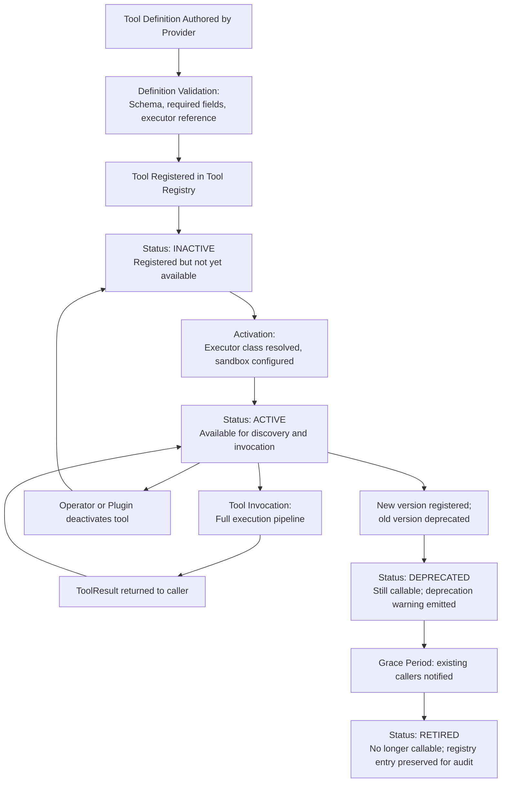
```mermaid
flowchart TD
    DRAFT["Tool Definition Authored by Provider"] --> VALIDATE_DEF["Definition Validation:\nSchema, required fields, executor reference"]
    VALIDATE_DEF --> REGISTER["Tool Registered in Tool Registry"]
    REGISTER --> INACTIVE["Status: INACTIVE\nRegistered but not yet available"]
    INACTIVE --> ACTIVATE["Activation:\nExecutor class resolved, sandbox configured"]
    ACTIVATE --> ACTIVE["Status: ACTIVE\nAvailable for discovery and invocation"]
    ACTIVE --> INVOKE["Tool Invocation:\nFull execution pipeline"]
    INVOKE --> RESULT["ToolResult returned to caller"]
    RESULT --> ACTIVE
    ACTIVE --> DEACTIVATE["Operator or Plugin deactivates tool"]
    DEACTIVATE --> INACTIVE
    ACTIVE --> DEPRECATE["New version registered;\nold version deprecated"]
    DEPRECATE --> DEPRECATED["Status: DEPRECATED\nStill callable; deprecation warning emitted"]
    DEPRECATED --> GRACE["Grace Period: existing callers notified"]
    GRACE --> RETIRED["Status: RETIRED\nNo longer callable; registry entry preserved for audit"]
```

### Lifecycle Stage Definitions

| Stage | Description |
| :--- | :--- |
| **DRAFT** | A tool definition is authored by a plugin or platform team. Not yet registered. Validated against the Tool Definition Schema locally. |
| **INACTIVE** | The tool definition has been registered in the Tool Registry but the executor class has not been resolved and the tool is not yet available for invocation. |
| **ACTIVE** | The executor class is resolved, the sandbox is configured, and the tool is available for discovery, manifest inclusion, and invocation. |
| **DEPRECATED** | A newer version of the tool has been registered and made active. The deprecated version remains callable. All invocations emit `DEPRECATION_WARNING` events. Callers are notified via the Event Bus. |
| **RETIRED** | The tool is no longer callable. Invocation attempts return `TOOL_RETIRED` error. The registry entry is preserved indefinitely for audit purposes. |

---

## 5. Tool State Machine

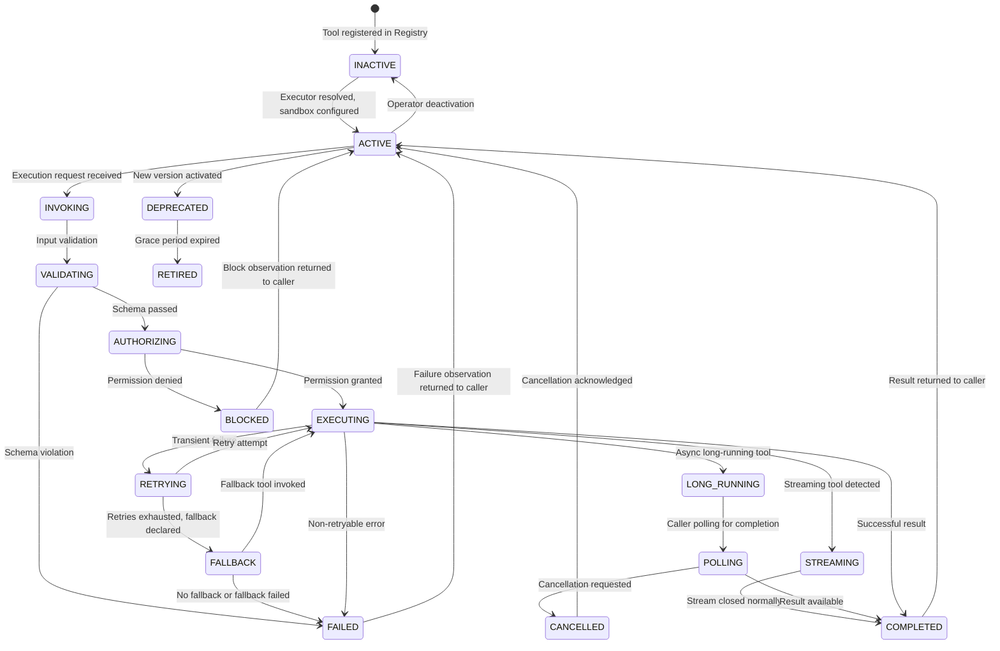
```mermaid
stateDiagram-v2
    [*] --> INACTIVE: Tool registered in Registry
    INACTIVE --> ACTIVE: Executor resolved, sandbox configured
    ACTIVE --> INVOKING: Execution request received
    INVOKING --> VALIDATING: Input validation
    VALIDATING --> AUTHORIZING: Schema passed
    VALIDATING --> FAILED: Schema violation
    AUTHORIZING --> EXECUTING: Permission granted
    AUTHORIZING --> BLOCKED: Permission denied
    EXECUTING --> STREAMING: Streaming tool detected
    EXECUTING --> LONG_RUNNING: Async long-running tool
    EXECUTING --> RETRYING: Transient failure
    STREAMING --> COMPLETED: Stream closed normally
    LONG_RUNNING --> POLLING: Caller polling for completion
    POLLING --> COMPLETED: Result available
    POLLING --> CANCELLED: Cancellation requested
    RETRYING --> EXECUTING: Retry attempt
    RETRYING --> FALLBACK: Retries exhausted, fallback declared
    FALLBACK --> EXECUTING: Fallback tool invoked
    FALLBACK --> FAILED: No fallback or fallback failed
    EXECUTING --> COMPLETED: Successful result
    EXECUTING --> FAILED: Non-retryable error
    COMPLETED --> ACTIVE: Result returned to caller
    FAILED --> ACTIVE: Failure observation returned to caller
    BLOCKED --> ACTIVE: Block observation returned to caller
    CANCELLED --> ACTIVE: Cancellation acknowledged
    ACTIVE --> INACTIVE: Operator deactivation
    ACTIVE --> DEPRECATED: New version activated
    DEPRECATED --> RETIRED: Grace period expired
```

### Invalid Transition Rules

- `COMPLETED → EXECUTING`: Forbidden. Each invocation is an independent lifecycle; a new invocation creates a new execution context.
- `RETIRED → ACTIVE`: Forbidden. A retired tool cannot be re-activated. A new tool version must be registered.
- `LONG_RUNNING → STREAMING`: Forbidden. A tool is classified as either asynchronous long-running or synchronous streaming at registration time; runtime reclassification is not permitted.
- `FAILED → RETRYING`: Forbidden. The Retry Engine operates within the `EXECUTING` state; failure is only raised after the retry budget is exhausted.

---

## 6. Tool Definition Model

The Tool Definition is the complete specification of a tool at registration time. It is the authoritative source of truth for every aspect of tool behavior on the platform.

```
+-----------------------------------------------------------------------------------+
|                        TOOL DEFINITION MODEL                                      |
+-----------------------------------------------------------------------------------+
|                                                                                   |
|  IDENTITY                                                                         |
|  {                                                                                |
|    "tool_id":           string,       // Globally unique: "namespace.tool_name"  |
|    "name":              string,       // Short identifier used in LLM manifests  |
|    "display_name":      string,       // Human-readable name for UI/dashboards    |
|    "description":       string,       // Precise LLM-targeted description        |
|    "namespace":         string,       // "platform" | "telecom" | "cyber" | etc  |
|    "version":           SemVer,       // MAJOR.MINOR.PATCH                        |
|    "category":          ToolCategory, // See Section 11 for full taxonomy         |
|    "provider":          string,       // "platform" | plugin_id                   |
|    "tags":              [string]      // Searchable semantic tags                 |
|  }                                                                                |
|                                                                                   |
|  SCHEMA CONTRACTS                                                                 |
|  {                                                                                |
|    "input_schema":      JSON Schema,  // Typed, required-field-marked input spec  |
|    "output_schema":     JSON Schema,  // Typed output result specification        |
|    "error_schema":      JSON Schema   // Typed error payload specification        |
|  }                                                                                |
|                                                                                   |
|  EXECUTION CONFIGURATION                                                          |
|  {                                                                                |
|    "executor_class":    string,       // Fully qualified IToolExecutor reference  |
|    "execution_mode":    enum,         // SYNC | ASYNC_POLL | STREAMING            |
|    "timeout_seconds":   integer,      // Hard timeout enforced by the Runtime     |
|    "retry_config":      RetryConfig,  // Tool-level retry policy (see Section 21) |
|    "fallback_tool_id":  string?,      // Optional fallback on exhausted retries   |
|    "is_idempotent":     boolean,      // Safe for retry without side-effect risk  |
|    "is_cacheable":      boolean,      // Whether results may be cached            |
|    "cache_ttl_seconds": integer?      // Cache TTL if is_cacheable = true         |
|  }                                                                                |
|                                                                                   |
|  AUTHORIZATION & SAFETY                                                           |
|  {                                                                                |
|    "required_scopes":   [string],     // Permission scopes caller must hold       |
|    "safety_level":      enum,         // LOW | MEDIUM | HIGH | CRITICAL           |
|    "requires_hitl":     boolean,      // Always require human approval?           |
|    "consequence_level": enum,         // NONE | REVERSIBLE | IRREVERSIBLE         |
|    "sandbox_profile":   string        // sandbox config key (see Section 36)      |
|  }                                                                                |
|                                                                                   |
|  RESOURCE GOVERNANCE                                                              |
|  {                                                                                |
|    "cost_per_call":     decimal?,     // Estimated USD cost per invocation        |
|    "memory_limit_mb":   integer?,     // Max memory for sandbox execution         |
|    "cpu_limit_cores":   decimal?,     // Max CPU fraction for execution           |
|    "network_egress":    boolean       // Whether tool makes outbound network calls|
|  }                                                                                |
|                                                                                   |
|  DEPENDENCIES                                                                     |
|  {                                                                                |
|    "platform_deps":     [string],     // Platform capabilities required at runtime|
|    "external_deps":     [ExternalDep],// External services with health checks     |
|    "tool_deps":         [string]      // Other tool_ids this tool may invoke      |
|  }                                                                                |
|                                                                                   |
|  LIFECYCLE                                                                        |
|  {                                                                                |
|    "status":            ToolStatus,   // INACTIVE | ACTIVE | DEPRECATED | RETIRED|
|    "registered_at":     ISO8601,                                                  |
|    "activated_at":      ISO8601?,                                                 |
|    "deprecated_at":     ISO8601?,                                                 |
|    "retired_at":        ISO8601?,                                                 |
|    "successor_tool_id": string?       // Tool to use after deprecation            |
|  }                                                                                |
+-----------------------------------------------------------------------------------+
```

---

## 7. Tool Metadata Model

The Tool Metadata Model captures runtime operational data that accumulates over the tool's lifetime and is used for capability discovery ranking, performance monitoring, and cost reporting.

```
+-----------------------------------------------------------------------------------+
|                         TOOL METADATA MODEL                                       |
+-----------------------------------------------------------------------------------+
|                                                                                   |
|  OPERATIONAL STATISTICS (updated in real-time)                                    |
|  {                                                                                |
|    "total_invocations":      integer,  // All-time invocation count               |
|    "successful_invocations": integer,  // Invocations with SUCCEEDED status       |
|    "failed_invocations":     integer,  // Invocations with FAILED status          |
|    "success_rate_7d":        decimal,  // 7-day rolling success rate (0.0–1.0)    |
|    "p50_latency_ms":         integer,  // Median execution latency                |
|    "p95_latency_ms":         integer,  // 95th percentile latency                 |
|    "p99_latency_ms":         integer,  // 99th percentile latency                 |
|    "avg_cost_usd":           decimal,  // Average cost per invocation             |
|    "total_cost_usd":         decimal   // All-time total cost                     |
|  }                                                                                |
|                                                                                   |
|  DISCOVERY SIGNALS (used by Capability Discovery ranking)                        |
|  {                                                                                |
|    "usefulness_score":       decimal,  // Agent-reported utility (0.0–1.0)        |
|    "last_invoked_at":        ISO8601,  // Recency signal for ranking              |
|    "embedding_vector":       float[],  // Tool description embedding for semantic |
|                                        // similarity matching during discovery    |
|    "usage_rank_7d":          integer   // Relative usage rank in past 7 days      |
|  }                                                                                |
|                                                                                   |
|  HEALTH STATUS                                                                    |
|  {                                                                                |
|    "health_status":          enum,     // HEALTHY | DEGRADED | UNHEALTHY | UNKNOWN|
|    "last_health_check_at":   ISO8601,                                             |
|    "circuit_breaker_state":  enum,     // CLOSED | OPEN | HALF_OPEN               |
|    "circuit_opened_at":      ISO8601?,                                            |
|    "dependency_health":      map       // Per-external-dep health status          |
|  }                                                                                |
|                                                                                   |
|  AUDIT TRAIL                                                                      |
|  {                                                                                |
|    "registered_by":          string,                                              |
|    "last_modified_by":       string,                                              |
|    "version_history":        [VersionRecord],                                     |
|    "activation_log":         [StateTransitionRecord]                              |
|  }                                                                                |
+-----------------------------------------------------------------------------------+
```

---

## 8. Tool Registration Architecture

The Tool Registration flow is the authoritative process by which a tool definition moves from authoring to ACTIVE status in the platform.

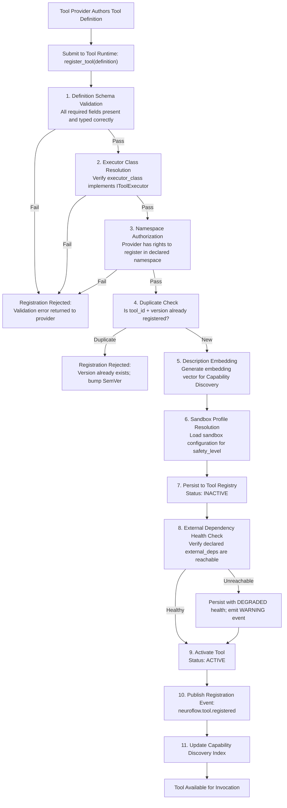
```mermaid
flowchart TD
    AUTHOR["Tool Provider Authors Tool Definition"] --> SUBMIT["Submit to Tool Runtime: register_tool(definition)"]
    SUBMIT --> SCHEMA_VAL["1. Definition Schema Validation\nAll required fields present and typed correctly"]
    SCHEMA_VAL -- Fail --> REG_REJECT["Registration Rejected:\nValidation error returned to provider"]
    SCHEMA_VAL -- Pass --> EXEC_RESOLVE["2. Executor Class Resolution\nVerify executor_class implements IToolExecutor"]
    EXEC_RESOLVE -- Fail --> REG_REJECT
    EXEC_RESOLVE -- Pass --> NS_CHECK["3. Namespace Authorization\nProvider has rights to register in declared namespace"]
    NS_CHECK -- Fail --> REG_REJECT
    NS_CHECK -- Pass --> DUP_CHECK["4. Duplicate Check\nIs tool_id + version already registered?"]
    DUP_CHECK -- Duplicate --> DUP_ERR["Registration Rejected:\nVersion already exists; bump SemVer"]
    DUP_CHECK -- New --> EMBED["5. Description Embedding\nGenerate embedding vector for Capability Discovery"]
    EMBED --> SANDBOX_CFG["6. Sandbox Profile Resolution\nLoad sandbox configuration for safety_level"]
    SANDBOX_CFG --> PERSIST["7. Persist to Tool Registry\nStatus: INACTIVE"]
    PERSIST --> HEALTH_CHECK["8. External Dependency Health Check\nVerify declared external_deps are reachable"]
    HEALTH_CHECK -- Unreachable --> WARN["Persist with DEGRADED health; emit WARNING event"]
    HEALTH_CHECK -- Healthy --> ACTIVATE["9. Activate Tool\nStatus: ACTIVE"]
    WARN --> ACTIVATE
    ACTIVATE --> EVENT["10. Publish Registration Event:\nneuroflow.tool.registered"]
    EVENT --> DISCOVERY_IDX["11. Update Capability Discovery Index"]
    DISCOVERY_IDX --> DONE["Tool Available for Invocation"]
```

### Registration Contract

| Field | Validation Rule |
| :--- | :--- |
| `tool_id` | Must match pattern `^[a-z][a-z0-9_]*\.[a-z][a-z0-9_]*$`. Globally unique across all versions. |
| `version` | Must be valid SemVer (`MAJOR.MINOR.PATCH`). `MAJOR` bump required on breaking input/output schema changes. |
| `executor_class` | Must be a resolvable class that implements `IToolExecutor`. Verified by the Tool Runtime at registration time. |
| `input_schema` | Must be valid JSON Schema (Draft 7 minimum). All required fields must be explicitly declared. |
| `output_schema` | Must be valid JSON Schema. The `status` field (`SUCCEEDED | FAILED | PARTIAL`) must always be present. |
| `namespace` | Must match the registering provider's declared namespace. Prevents cross-namespace tool injection. |
| `safety_level` | Must be one of: `LOW | MEDIUM | HIGH | CRITICAL`. Determines sandbox profile and HITL requirement. |

---

## 9. Tool Registry

The Tool Registry is the authoritative, persistent catalog of all tools registered on the NeuroFlow AI platform. It is a dedicated subsystem within the Tool Runtime — not a simple in-memory map.

```
+-----------------------------------------------------------------------------------+
|                         TOOL REGISTRY ARCHITECTURE                                |
+-----------------------------------------------------------------------------------+
|                                                                                   |
|  REGISTRY STORAGE LAYERS:                                                         |
|                                                                                   |
|  1. PRIMARY STORE (PostgreSQL via IToolRegistryStore port)                        |
|     - Full tool definitions for all registered tools.                            |
|     - Version history and lifecycle audit trail.                                  |
|     - Executor class bindings and sandbox profile mappings.                       |
|                                                                                   |
|  2. IN-MEMORY ACTIVE INDEX (Redis via IToolIndexStore port)                      |
|     - Active tool metadata for O(1) lookup by tool_id.                           |
|     - Per-namespace and per-category active tool lists.                           |
|     - Refreshed from PRIMARY STORE on startup and on registration events.        |
|                                                                                   |
|  3. CAPABILITY DISCOVERY INDEX (Vector store via IToolVectorStore port)           |
|     - Tool description embedding vectors.                                         |
|     - Supports ANN similarity search during Capability Discovery.                |
|                                                                                   |
|  REGISTRY OPERATIONS:                                                             |
|  - register_tool(definition)           → ToolRegistrationResult                  |
|  - activate_tool(tool_id, version)     → void                                    |
|  - deactivate_tool(tool_id, version)   → void                                    |
|  - deprecate_tool(tool_id, version, successor_tool_id)  → void                  |
|  - retire_tool(tool_id, version)       → void                                    |
|  - get_tool(tool_id, version?)         → ToolDefinition                           |
|  - get_active_tool(tool_id)            → ToolDefinition                           |
|  - list_tools(namespace?, category?, status?) → [ToolDefinition]                 |
|  - build_tool_manifest(scope)          → ToolManifest                            |
|  - search_tools_by_embedding(vector, top_k) → [ScoredTool]                      |
|  - get_tool_metadata(tool_id)          → ToolMetadata                            |
|  - update_tool_metadata(tool_id, updates) → void                                 |
|                                                                                   |
|  CONSISTENCY GUARANTEES:                                                          |
|  - Writes are always committed to PRIMARY STORE first.                           |
|  - In-memory Active Index is updated after successful PRIMARY STORE write.       |
|  - On platform restart, Active Index is fully reconstructed from PRIMARY STORE.  |
|  - Tool deactivation takes effect within 1 full registry sync cycle (default:    |
|    30 seconds) across all running worker processes.                               |
+-----------------------------------------------------------------------------------+
```

---

## 10. Capability Discovery

Capability Discovery is the subsystem through which callers — primarily the Agent Runtime's Planning Engine — can ask the platform "which tools are available to me for this goal?" and receive a structured, ranked, filtered response.

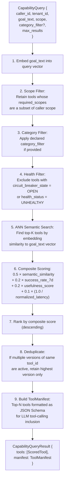
```mermaid
flowchart TD
    QUERY["CapabilityQuery {\n  caller_id, tenant_id,\n  goal_text, scope,\n  category_filter?,\n  max_results\n}"] --> EMBED_Q["1. Embed goal_text into query vector"]
    EMBED_Q --> SCOPE_FILTER["2. Scope Filter:\nRetain tools whose required_scopes\nare a subset of caller scope"]
    SCOPE_FILTER --> CAT_FILTER["3. Category Filter:\nApply declared category_filter\nif provided"]
    CAT_FILTER --> HEALTH_FILTER["4. Health Filter:\nExclude tools with circuit_breaker_state = OPEN\nor health_status = UNHEALTHY"]
    HEALTH_FILTER --> ANN_SEARCH["5. ANN Semantic Search:\nFind top-K tools by embedding\nsimilarity to goal_text vector"]
    ANN_SEARCH --> SCORE["6. Composite Scoring:\n  0.5 × semantic_similarity\n+ 0.2 × success_rate_7d\n+ 0.2 × usefulness_score\n+ 0.1 × (1.0 / normalized_latency)"]
    SCORE --> RANK["7. Rank by composite score\n(descending)"]
    RANK --> DEDUP["8. Deduplicate:\nIf multiple versions of same tool_id\nare active, retain highest version only"]
    DEDUP --> MANIFEST["9. Build ToolManifest:\nTop-N tools formatted as JSON Schema\nfor LLM tool-calling inclusion"]
    MANIFEST --> RETURN["CapabilityQueryResult {\n  tools: [ScoredTool],\n  manifest: ToolManifest\n}"]
```

### Discovery Query Modes

| Mode | Description | Primary Caller |
| :--- | :--- | :--- |
| **Goal-Aligned Discovery** | Semantic similarity search against goal text embedding. Returns a ranked list of semantically relevant tools. | Agent Runtime Planning Engine. |
| **Category Enumeration** | List all active tools in a specific category for a given caller scope. | Workflow Engine task type loader. |
| **Namespace Enumeration** | List all active tools in a specific plugin namespace. | Plugin health dashboard. |
| **Direct Lookup** | Fetch a specific tool by `tool_id` and optional `version`. | Tool Execution Engine; direct callers. |
| **Manifest Build** | Build a complete `ToolManifest` (JSON Schema) for all tools in caller scope. Formatted for LLM inclusion. | Prompt Assembler (Agent Runtime). |

---

## 11. Tool Categories

The Tool Category taxonomy classifies every tool by its functional domain. Categories govern discovery filtering, sandbox profile defaults, and observability grouping.

| Category | Description | Examples |
| :--- | :--- | :--- |
| **KNOWLEDGE_BASE** | Tools that interact with the platform Knowledge Base. | `kb_search`, `kb_retrieve_document`, `kb_list_namespaces`, `kb_ingest_document` |
| **KNOWLEDGE_GRAPH** | Tools that query or mutate the platform Knowledge Graph. | `graph_entity_search`, `graph_subgraph_extract`, `graph_shortest_path`, `graph_add_entity` |
| **MEMORY** | Tools that read or write the platform Memory Layer. | `memory_read_episodic`, `memory_read_semantic`, `memory_write_fact`, `memory_search` |
| **WORKFLOW** | Tools that interact with the Workflow Engine. | `workflow_trigger`, `workflow_get_status`, `workflow_cancel`, `workflow_list` |
| **COMPUTATION** | Tools that perform stateless computation without external network calls. | `parse_json`, `evaluate_expression`, `calculate_statistics`, `transform_data`, `format_output` |
| **COMMUNICATION** | Tools that send messages to humans or external systems. | `send_notification`, `send_email`, `post_webhook`, `send_sms`, `post_slack_message` |
| **EXTERNAL_API** | Tools that make outbound HTTP/gRPC calls to external APIs. | `http_get`, `http_post`, `graphql_query`, `grpc_call` |
| **DATABASE** | Tools that execute queries against relational or NoSQL databases. | `query_sql`, `query_nosql`, `execute_stored_procedure`, `stream_query_results` |
| **FILE_SYSTEM** | Tools that read from or write to controlled file storage. | `read_file`, `write_file`, `list_directory`, `upload_artifact` |
| **CODE_EXECUTION** | Tools that execute sandboxed code snippets in a controlled runtime. | `run_python_snippet`, `run_javascript_snippet`, `run_sql_query` |
| **AGENT** | Tools that invoke sub-agents via the Agent Runtime. | `invoke_agent`, `get_agent_result`, `list_agents` |
| **PLUGIN** | Domain-specific tools contributed by domain plugins. | `telecom.alarm_lookup`, `cyber.threat_scan`, `health.drug_interaction`, `finance.risk_score` |
| **PLATFORM_ADMIN** | Privileged tools for platform administration. CRITICAL safety level. | `update_tool_status`, `flush_tool_cache`, `get_platform_health` |

---

## 12. Tool Selection Pipeline

The Tool Selection Pipeline is the sequence of stages that transforms an agent's reasoning intent into a validated, authorized, executable tool invocation request.

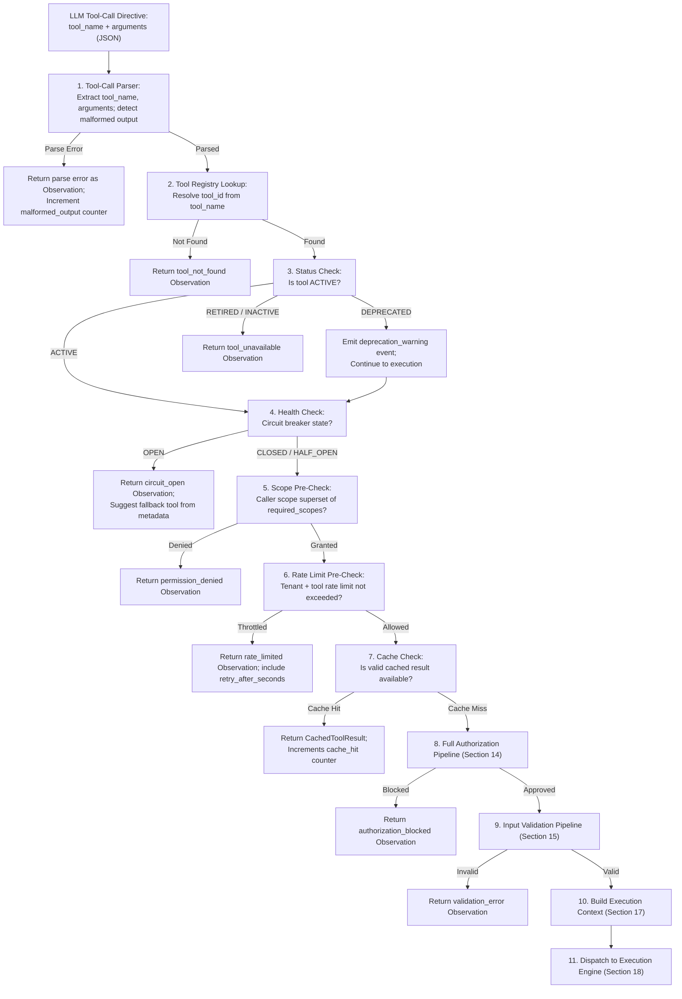
```mermaid
flowchart TD
    LLM_OUT["LLM Tool-Call Directive:\ntool_name + arguments (JSON)"] --> PARSE["1. Tool-Call Parser:\nExtract tool_name, arguments; detect malformed output"]
    PARSE -- "Parse Error" --> PARSE_ERR["Return parse error as Observation;\nIncrement malformed_output counter"]
    PARSE -- "Parsed" --> REGISTRY_LOOKUP["2. Tool Registry Lookup:\nResolve tool_id from tool_name"]
    REGISTRY_LOOKUP -- "Not Found" --> LOOKUP_ERR["Return tool_not_found Observation"]
    REGISTRY_LOOKUP -- "Found" --> STATUS_CHECK["3. Status Check:\nIs tool ACTIVE?"]
    STATUS_CHECK -- "DEPRECATED" --> DEPRECATION_WARN["Emit deprecation_warning event;\nContinue to execution"]
    STATUS_CHECK -- "RETIRED / INACTIVE" --> STATUS_ERR["Return tool_unavailable Observation"]
    STATUS_CHECK -- "ACTIVE" --> HEALTH_CHECK["4. Health Check:\nCircuit breaker state?"]
    DEPRECATION_WARN --> HEALTH_CHECK
    HEALTH_CHECK -- "OPEN" --> CIRCUIT_BLOCK["Return circuit_open Observation;\nSuggest fallback tool from metadata"]
    HEALTH_CHECK -- "CLOSED / HALF_OPEN" --> SCOPE_CHECK["5. Scope Pre-Check:\nCaller scope superset of required_scopes?"]
    SCOPE_CHECK -- "Denied" --> SCOPE_ERR["Return permission_denied Observation"]
    SCOPE_CHECK -- "Granted" --> RATE_CHECK["6. Rate Limit Pre-Check:\nTenant + tool rate limit not exceeded?"]
    RATE_CHECK -- "Throttled" --> RATE_ERR["Return rate_limited Observation; include retry_after_seconds"]
    RATE_CHECK -- "Allowed" --> CACHE_CHECK["7. Cache Check:\nIs valid cached result available?"]
    CACHE_CHECK -- "Cache Hit" --> CACHED_RESULT["Return CachedToolResult;\nIncrements cache_hit counter"]
    CACHE_CHECK -- "Cache Miss" --> AUTH_PIPE["8. Full Authorization Pipeline (Section 14)"]
    AUTH_PIPE -- "Blocked" --> AUTH_ERR["Return authorization_blocked Observation"]
    AUTH_PIPE -- "Approved" --> INPUT_VAL["9. Input Validation Pipeline (Section 15)"]
    INPUT_VAL -- "Invalid" --> VAL_ERR["Return validation_error Observation"]
    INPUT_VAL -- "Valid" --> EXEC_CTX["10. Build Execution Context (Section 17)"]
    EXEC_CTX --> DISPATCH["11. Dispatch to Execution Engine (Section 18)"]
```

---

## 13. Permission & Capability Model

Every tool invocation is governed by a Permission & Capability Model that maps caller identity to the set of tool scopes they are authorized to exercise.

```
+-----------------------------------------------------------------------------------+
|                   PERMISSION & CAPABILITY MODEL                                   |
+-----------------------------------------------------------------------------------+
|                                                                                   |
|  CALLER IDENTITY RECORD:                                                          |
|  {                                                                                |
|    "caller_id":        string,   // agent_session_id | workflow_instance_id       |
|    "caller_type":      enum,     // AGENT | WORKFLOW | SYSTEM | DIRECT            |
|    "tenant_id":        string,                                                    |
|    "agent_id":         string?,  // If caller_type = AGENT                        |
|    "plugin_id":        string?,  // Plugin context if invoked via plugin agent    |
|    "tool_scopes":      [string], // Granted tool permission scopes                |
|    "namespace_scopes": [string], // Granted namespace access scopes               |
|    "is_admin":         boolean   // Admin callers may invoke PLATFORM_ADMIN tools  |
|  }                                                                                |
|                                                                                   |
|  TOOL SCOPE TAXONOMY:                                                             |
|  Platform Scopes:                                                                 |
|    KB_READ             - May invoke Knowledge Base read tools.                   |
|    KB_WRITE            - May invoke Knowledge Base write tools.                   |
|    GRAPH_READ          - May invoke Knowledge Graph read tools.                   |
|    GRAPH_WRITE         - May invoke Knowledge Graph write tools.                  |
|    MEMORY_READ         - May invoke Memory Layer read tools.                     |
|    MEMORY_WRITE        - May invoke Memory Layer write tools.                    |
|    WORKFLOW_READ       - May invoke Workflow status / list tools.                |
|    WORKFLOW_TRIGGER    - May invoke Workflow trigger tools.                       |
|    COMPUTATION         - May invoke stateless computation tools.                 |
|    COMMUNICATION       - May invoke communication (email, webhook) tools.        |
|    EXTERNAL_API        - May invoke external HTTP/gRPC API tools.               |
|    DATABASE_READ       - May invoke database read tools.                         |
|    DATABASE_WRITE      - May invoke database write tools.                        |
|    CODE_EXECUTE        - May invoke sandboxed code execution tools.              |
|    AGENT_INVOKE        - May invoke sub-agent tools.                             |
|    PLATFORM_ADMIN      - May invoke privileged platform admin tools.             |
|                                                                                   |
|  Plugin Scopes (declared by plugin at registration):                             |
|    TELECOM_READ        - May invoke Telecom plugin read tools.                   |
|    TELECOM_WRITE       - May invoke Telecom plugin write tools.                   |
|    CYBER_READ          - May invoke Cybersecurity plugin read tools.             |
|    HEALTHCARE_READ     - May invoke Healthcare plugin read tools.                |
|    FINANCE_READ        - May invoke Finance plugin read tools.                   |
|    ... (one READ + one WRITE per plugin namespace, minimum)                      |
|                                                                                   |
|  SCOPE ENFORCEMENT RULE:                                                          |
|  tool.required_scopes must be a strict subset of caller.tool_scopes.             |
|  If even one required scope is absent, the invocation is BLOCKED.                |
+-----------------------------------------------------------------------------------+
```

---

## 14. Authorization Pipeline

The Authorization Pipeline is a mandatory 6-stage gate applied before every tool execution. It executes within the Tool Selection Pipeline after input cache check.

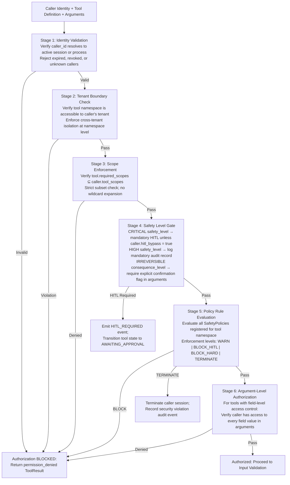
```mermaid
flowchart TD
    IN["Caller Identity + Tool Definition + Arguments"] --> S1["Stage 1: Identity Validation\nVerify caller_id resolves to active session or process\nReject expired, revoked, or unknown callers"]
    S1 -- "Invalid" --> BLOCK
    S1 -- "Valid" --> S2["Stage 2: Tenant Boundary Check\nVerify tool namespace is accessible to caller's tenant\nEnforce cross-tenant isolation at namespace level"]
    S2 -- "Violation" --> BLOCK
    S2 -- "Pass" --> S3["Stage 3: Scope Enforcement\nVerify tool.required_scopes ⊆ caller.tool_scopes\nStrict subset check; no wildcard expansion"]
    S3 -- "Denied" --> BLOCK
    S3 -- "Pass" --> S4["Stage 4: Safety Level Gate\nCRITICAL safety_level → mandatory HITL unless caller.hitl_bypass = true\nHIGH safety_level → log mandatory audit record\nIRREVERSIBLE consequence_level → require explicit confirmation flag in arguments"]
    S4 -- "HITL Required" --> HITL["Emit HITL_REQUIRED event;\nTransition tool state to AWAITING_APPROVAL"]
    S4 -- "Pass" --> S5["Stage 5: Policy Rule Evaluation\nEvaluate all SafetyPolicies registered for tool namespace\nEnforcement levels: WARN | BLOCK_HITL | BLOCK_HARD | TERMINATE"]
    S5 -- "BLOCK" --> BLOCK
    S5 -- "TERMINATE" --> TERMINATE["Terminate caller session;\nRecord security violation audit event"]
    S5 -- "Pass" --> S6["Stage 6: Argument-Level Authorization\nFor tools with field-level access control:\nVerify caller has access to every field value in arguments"]
    S6 -- "Denied" --> BLOCK
    S6 -- "Pass" --> AUTHORIZED["Authorized: Proceed to Input Validation"]
    BLOCK["Authorization BLOCKED:\nReturn permission_denied ToolResult"]
```

---

## 15. Input Validation

Input Validation is applied to every set of tool arguments before execution. It protects the tool executor from malformed, malicious, or out-of-contract inputs.

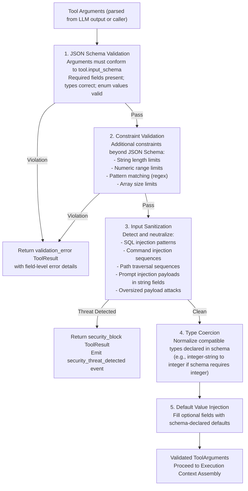
```mermaid
flowchart TD
    ARGS["Tool Arguments (parsed from LLM output or caller)"] --> JSON_VAL["1. JSON Schema Validation\nArguments must conform to tool.input_schema\nRequired fields present; types correct; enum values valid"]
    JSON_VAL -- "Violation" --> SCHEMA_ERR["Return validation_error ToolResult\nwith field-level error details"]
    JSON_VAL -- "Pass" --> CONSTRAINT["2. Constraint Validation\nAdditional constraints beyond JSON Schema:\n- String length limits\n- Numeric range limits\n- Pattern matching (regex)\n- Array size limits"]
    CONSTRAINT -- "Violation" --> SCHEMA_ERR
    CONSTRAINT -- "Pass" --> SANITIZE["3. Input Sanitization\nDetect and neutralize:\n- SQL injection patterns\n- Command injection sequences\n- Path traversal sequences\n- Prompt injection payloads in string fields\n- Oversized payload attacks"]
    SANITIZE -- "Threat Detected" --> SECURITY_BLOCK["Return security_block ToolResult\nEmit security_threat_detected event"]
    SANITIZE -- "Clean" --> TYPE_COERCE["4. Type Coercion\nNormalize compatible types declared in schema\n(e.g., integer-string to integer if schema requires integer)"]
    TYPE_COERCE --> DEFAULT_FILL["5. Default Value Injection\nFill optional fields with schema-declared defaults"]
    DEFAULT_FILL --> VALIDATED["Validated ToolArguments\nProceed to Execution Context Assembly"]
```

---

## 16. Output Validation

Output Validation is applied to every tool result before it is returned to the caller. It prevents schema-violating, toxic, or sensitive data from being injected into the agent's reasoning context.

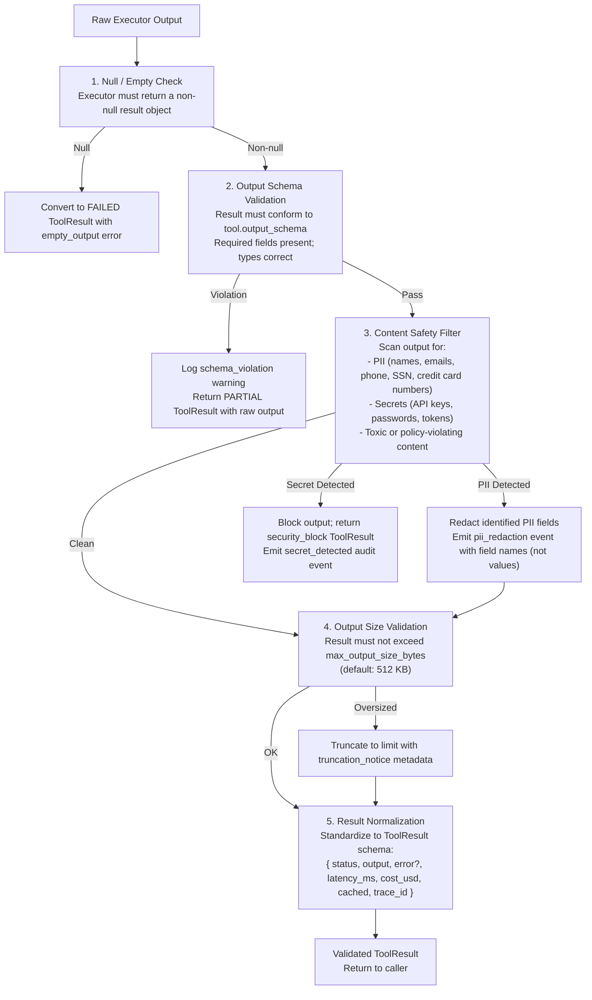
```mermaid
flowchart TD
    RAW["Raw Executor Output"] --> NULL_CHECK["1. Null / Empty Check\nExecutor must return a non-null result object"]
    NULL_CHECK -- "Null" --> NULL_ERR["Convert to FAILED ToolResult with empty_output error"]
    NULL_CHECK -- "Non-null" --> SCHEMA_VAL["2. Output Schema Validation\nResult must conform to tool.output_schema\nRequired fields present; types correct"]
    SCHEMA_VAL -- "Violation" --> SCHEMA_WARN["Log schema_violation warning\nReturn PARTIAL ToolResult with raw output"]
    SCHEMA_VAL -- "Pass" --> CONTENT_FILTER["3. Content Safety Filter\nScan output for:\n- PII (names, emails, phone, SSN, credit card numbers)\n- Secrets (API keys, passwords, tokens)\n- Toxic or policy-violating content"]
    CONTENT_FILTER -- "PII Detected" --> PII_REDACT["Redact identified PII fields\nEmit pii_redaction event with field names (not values)"]
    CONTENT_FILTER -- "Secret Detected" --> SECRET_BLOCK["Block output; return security_block ToolResult\nEmit secret_detected audit event"]
    CONTENT_FILTER -- "Clean" --> SIZE_CHECK["4. Output Size Validation\nResult must not exceed max_output_size_bytes\n(default: 512 KB)"]
    PII_REDACT --> SIZE_CHECK
    SIZE_CHECK -- "Oversized" --> TRUNCATE["Truncate to limit with truncation_notice metadata"]
    SIZE_CHECK -- "OK" --> NORMALIZE["5. Result Normalization\nStandardize to ToolResult schema:\n{ status, output, error?, latency_ms, cost_usd, cached, trace_id }"]
    TRUNCATE --> NORMALIZE
    NORMALIZE --> VALIDATED_OUT["Validated ToolResult\nReturn to caller"]
```

---

## 17. Execution Context

The Execution Context is the complete runtime environment assembled before each tool execution. It carries all information required by the executor, sandbox, and observability subsystems.

```
+-----------------------------------------------------------------------------------+
|                         EXECUTION CONTEXT MODEL                                   |
+-----------------------------------------------------------------------------------+
|                                                                                   |
|  INVOCATION IDENTITY                                                              |
|  {                                                                                |
|    "invocation_id":     UUID,        // Unique per tool call                      |
|    "tool_id":           string,      // Resolved from Tool Registry               |
|    "tool_version":      SemVer,      // Active version at invocation time         |
|    "caller_id":         string,      // agent_session_id or workflow_instance_id  |
|    "caller_type":       enum,        // AGENT | WORKFLOW | SYSTEM | DIRECT        |
|    "tenant_id":         string,                                                   |
|    "session_id":        string?,     // Parent agent session if applicable        |
|    "workflow_id":       string?      // Parent workflow instance if applicable    |
|  }                                                                                |
|                                                                                   |
|  OBSERVABILITY CONTEXT                                                            |
|  {                                                                                |
|    "trace_id":          string,      // Propagated from parent caller span        |
|    "span_id":           string,      // This tool invocation's OTel span          |
|    "parent_span_id":    string,      // Caller's span for trace hierarchy         |
|    "baggage":           map          // OTel baggage for cross-service correlation|
|  }                                                                                |
|                                                                                   |
|  RUNTIME LIMITS                                                                   |
|  {                                                                                |
|    "timeout_deadline":  timestamp,   // Absolute deadline (now + timeout_seconds) |
|    "budget_remaining":  decimal?,    // Cost budget remaining in caller session   |
|    "retry_attempt":     integer,     // Current retry attempt (0 = first attempt) |
|    "max_retries":       integer                                                   |
|  }                                                                                |
|                                                                                   |
|  VALIDATED INPUTS                                                                 |
|  {                                                                                |
|    "arguments":         map,         // Validated, sanitized, default-filled args |
|    "caller_scope":      [string]     // Active permission scopes for this call    |
|  }                                                                                |
|                                                                                   |
|  PLATFORM SERVICE HANDLES (injected by Tool Runtime; read-only for executors)    |
|  {                                                                                |
|    "kb_client":         IKnowledgeBaseClient?,                                    |
|    "graph_client":      IGraphClient?,                                            |
|    "memory_client":     IMemoryClient?,                                           |
|    "http_client":       IHttpClient?,    // Pre-configured with tenant auth       |
|    "db_client":         IDbClient?       // Tenant-scoped connection              |
|  }                                                                                |
+-----------------------------------------------------------------------------------+
```

---

## 18. Tool Execution Pipeline

The Tool Execution Pipeline is the core operational path that runs from a validated, authorized invocation request to a final `ToolResult`.

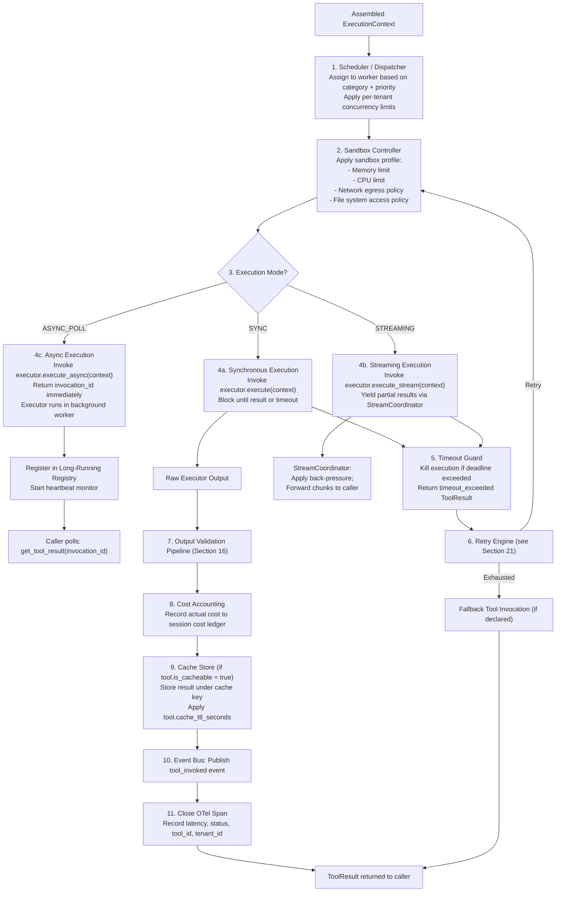
```mermaid
flowchart TD
    CTX["Assembled ExecutionContext"] --> SCHED["1. Scheduler / Dispatcher\nAssign to worker based on category + priority\nApply per-tenant concurrency limits"]
    SCHED --> SANDBOX["2. Sandbox Controller\nApply sandbox profile:\n- Memory limit\n- CPU limit\n- Network egress policy\n- File system access policy"]
    SANDBOX --> EXEC_MODE{"3. Execution Mode?"}
    EXEC_MODE -- "SYNC" --> SYNC_EXEC["4a. Synchronous Execution\nInvoke executor.execute(context)\nBlock until result or timeout"]
    EXEC_MODE -- "STREAMING" --> STREAM_EXEC["4b. Streaming Execution\nInvoke executor.execute_stream(context)\nYield partial results via StreamCoordinator"]
    EXEC_MODE -- "ASYNC_POLL" --> ASYNC_EXEC["4c. Async Execution\nInvoke executor.execute_async(context)\nReturn invocation_id immediately\nExecutor runs in background worker"]

    SYNC_EXEC --> TIMEOUT_GUARD["5. Timeout Guard\nKill execution if deadline exceeded\nReturn timeout_exceeded ToolResult"]
    SYNC_EXEC --> RESULT_RAW["Raw Executor Output"]

    STREAM_EXEC --> STREAM_COORD["StreamCoordinator:\nApply back-pressure;\nForward chunks to caller"]
    STREAM_EXEC --> TIMEOUT_GUARD

    ASYNC_EXEC --> POLL_REG["Register in Long-Running Registry\nStart heartbeat monitor"]
    POLL_REG --> POLL_STATE["Caller polls: get_tool_result(invocation_id)"]

    TIMEOUT_GUARD --> RETRY_ENG["6. Retry Engine (see Section 21)"]
    RESULT_RAW --> OUT_VAL["7. Output Validation Pipeline (Section 16)"]
    OUT_VAL --> COST_ACCT["8. Cost Accounting\nRecord actual cost to session cost ledger"]
    COST_ACCT --> CACHE_STORE["9. Cache Store (if tool.is_cacheable = true)\nStore result under cache key\nApply tool.cache_ttl_seconds"]
    CACHE_STORE --> EVENT_PUB["10. Event Bus: Publish tool_invoked event"]
    EVENT_PUB --> OTEL_SPAN["11. Close OTel Span\nRecord latency, status, tool_id, tenant_id"]
    OTEL_SPAN --> RESULT["ToolResult returned to caller"]
    RETRY_ENG -- "Exhausted" --> FALLBACK["Fallback Tool Invocation (if declared)"]
    FALLBACK --> RESULT
    RETRY_ENG -- "Retry" --> SANDBOX
```

---

## 19. Tool Scheduling

The Tool Scheduler governs how tool execution requests are queued and dispatched to worker processes, ensuring fair execution across tenants and tool categories.

```
+-----------------------------------------------------------------------------------+
|                        TOOL SCHEDULING ARCHITECTURE                               |
+-----------------------------------------------------------------------------------+
|                                                                                   |
|  SCHEDULING QUEUES:                                                               |
|  Each tenant receives an isolated scheduling queue per tool category.             |
|  Queue depth and concurrency are governed by the tenant's resource quota.         |
|                                                                                   |
|  Queue Priority Levels (highest to lowest):                                       |
|  1. CRITICAL  - Safety pipeline blocks, HITL resolutions, cancellation signals.  |
|  2. HIGH      - Agent Runtime reasoning loop tool calls (real-time user request). |
|  3. NORMAL    - Workflow Engine task tool calls.                                  |
|  4. LOW       - Scheduled tool invocations, background platform maintenance.     |
|                                                                                   |
|  DISPATCH ALGORITHM:                                                              |
|  1. Inbound ToolExecutionRequest is classified by priority.                      |
|  2. Request is enqueued in the tenant's category queue at the assigned priority.  |
|  3. Dispatcher polls all tenant queues using weighted fair queuing (WFQ):         |
|     - No single tenant's queue drains at the expense of others.                  |
|     - HIGH priority requests from any tenant preempt NORMAL and LOW requests.    |
|  4. A free worker thread picks up the next request from its assigned queue.      |
|  5. If all workers for a tenant's quota are busy, the request waits in queue.    |
|     Queue wait time is tracked as the metric neuroflow_tool_queue_wait_seconds.  |
|                                                                                   |
|  WORKER POOL CONFIGURATION:                                                       |
|  {                                                                                |
|    "global_max_workers":     integer,   // Platform-wide worker ceiling           |
|    "per_tenant_max_workers": integer,   // Max concurrent executions per tenant   |
|    "per_category_workers":   map,       // Category-specific worker pool sizes    |
|    "queue_max_depth":        integer,   // Max queued requests before rejection   |
|    "queue_wait_timeout_ms":  integer    // Max time to wait in queue before error |
|  }                                                                                |
+-----------------------------------------------------------------------------------+
```

---

## 20. Tool Timeout Strategy

Every tool execution operates under a hard timeout. The timeout strategy is layered to ensure that different failure modes are handled at the right level.

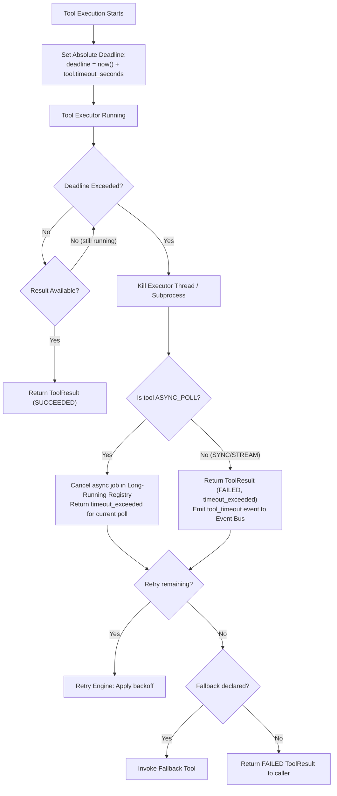
```mermaid
flowchart TD
    INVOKE["Tool Execution Starts"] --> SET_DL["Set Absolute Deadline:\ndeadline = now() + tool.timeout_seconds"]
    SET_DL --> EXEC["Tool Executor Running"]
    EXEC --> CHECK{"Deadline Exceeded?"}
    CHECK -- "No" --> RESULT{"Result Available?"}
    RESULT -- "Yes" --> SUCCESS["Return ToolResult (SUCCEEDED)"]
    RESULT -- "No (still running)" --> CHECK
    CHECK -- "Yes" --> KILL["Kill Executor Thread / Subprocess"]
    KILL --> TIMEOUT_CLASS{"Is tool ASYNC_POLL?"}
    TIMEOUT_CLASS -- "Yes" --> ASYNC_CANCEL["Cancel async job in Long-Running Registry\nReturn timeout_exceeded for current poll"]
    TIMEOUT_CLASS -- "No (SYNC/STREAM)" --> SYNC_TIMEOUT["Return ToolResult (FAILED, timeout_exceeded)\nEmit tool_timeout event to Event Bus"]
    ASYNC_CANCEL --> RETRY_CHECK{"Retry remaining?"}
    SYNC_TIMEOUT --> RETRY_CHECK
    RETRY_CHECK -- "Yes" --> RETRY["Retry Engine: Apply backoff"]
    RETRY_CHECK -- "No" --> FALLBACK{"Fallback declared?"}
    FALLBACK -- "Yes" --> FALLBACK_INVOKE["Invoke Fallback Tool"]
    FALLBACK -- "No" --> FAILED["Return FAILED ToolResult to caller"]
```

### Timeout Configuration Hierarchy

| Level | Precedence | Description |
| :--- | :--- | :--- |
| **Tool Definition** | Highest | `tool.timeout_seconds` — the tool author's declared maximum. |
| **Caller Override** | Second | Callers may specify a shorter timeout in the `ExecutionContext`. They may never specify a longer timeout than the tool definition allows. |
| **Category Default** | Third | Default timeout per tool category (e.g., `COMPUTATION`: 10s; `EXTERNAL_API`: 30s; `LONG_RUNNING`: 3600s). |
| **Platform Default** | Lowest | 60 seconds for all tools without a declared timeout. |

---

## 21. Retry Strategy

The Retry Strategy governs how the Tool Runtime handles transient failures at the tool execution level.

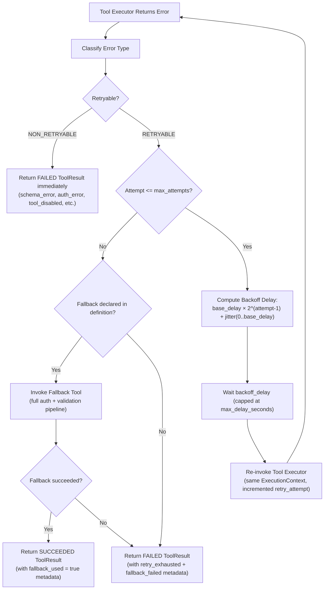
```mermaid
flowchart TD
    EXEC_FAIL["Tool Executor Returns Error"] --> CLASSIFY["Classify Error Type"]
    CLASSIFY --> RETRYABLE{"Retryable?"}
    RETRYABLE -- "NON_RETRYABLE" --> NON_RETRY_FAIL["Return FAILED ToolResult immediately\n(schema_error, auth_error, tool_disabled, etc.)"]
    RETRYABLE -- "RETRYABLE" --> ATTEMPT{"Attempt <= max_attempts?"}
    ATTEMPT -- "No" --> FALLBACK{"Fallback declared in definition?"}
    FALLBACK -- "Yes" --> FALLBACK_INVOKE["Invoke Fallback Tool\n(full auth + validation pipeline)"]
    FALLBACK_INVOKE --> FALLBACK_RESULT{"Fallback succeeded?"}
    FALLBACK_RESULT -- "Yes" --> SUCCESS["Return SUCCEEDED ToolResult\n(with fallback_used = true metadata)"]
    FALLBACK_RESULT -- "No" --> FINAL_FAIL["Return FAILED ToolResult\n(with retry_exhausted + fallback_failed metadata)"]
    FALLBACK -- "No" --> FINAL_FAIL
    ATTEMPT -- "Yes" --> BACKOFF["Compute Backoff Delay:\nbase_delay × 2^(attempt-1) + jitter(0..base_delay)"]
    BACKOFF --> WAIT["Wait backoff_delay (capped at max_delay_seconds)"]
    WAIT --> RE_EXEC["Re-invoke Tool Executor\n(same ExecutionContext, incremented retry_attempt)"]
    RE_EXEC --> EXEC_FAIL
```

### Retry Configuration Schema

```
RetryConfig {
  max_attempts:         integer  // Total attempts including first. Default: 3.
  backoff_strategy:     enum     // FIXED | EXPONENTIAL | EXPONENTIAL_JITTER
  initial_delay_ms:     integer  // Delay before first retry. Default: 500.
  max_delay_ms:         integer  // Backoff cap. Default: 30000.
  jitter_factor:        decimal  // Fraction of delay added as random jitter. Default: 0.25.
  retryable_error_types: [enum]  // TRANSIENT | TIMEOUT | RATE_LIMITED | SERVER_ERROR
}
```

### Non-Retryable Error Types

| Error Type | Reason Not Retried |
| :--- | :--- |
| `SCHEMA_VALIDATION_ERROR` | Arguments are structurally invalid. Retrying with the same arguments will always fail. |
| `AUTHORIZATION_ERROR` | Caller does not have the required scope. Retrying will not grant new permissions. |
| `TOOL_DISABLED` / `TOOL_RETIRED` | Tool is administratively unavailable. Not a transient condition. |
| `BUSINESS_RULE_VIOLATION` | Plugin-defined rule explicitly rejected the invocation. |
| `SAFETY_BLOCK_HARD` | Safety Pipeline issued a hard block. Retrying may constitute a circumvention attempt. |
| `BUDGET_EXHAUSTED` | Caller's cost or token budget is depleted. Retrying would breach the limit further. |

---

## 22. Cancellation Strategy

The Tool Runtime supports structured cancellation at three levels: caller-initiated, timeout-initiated, and platform-initiated.

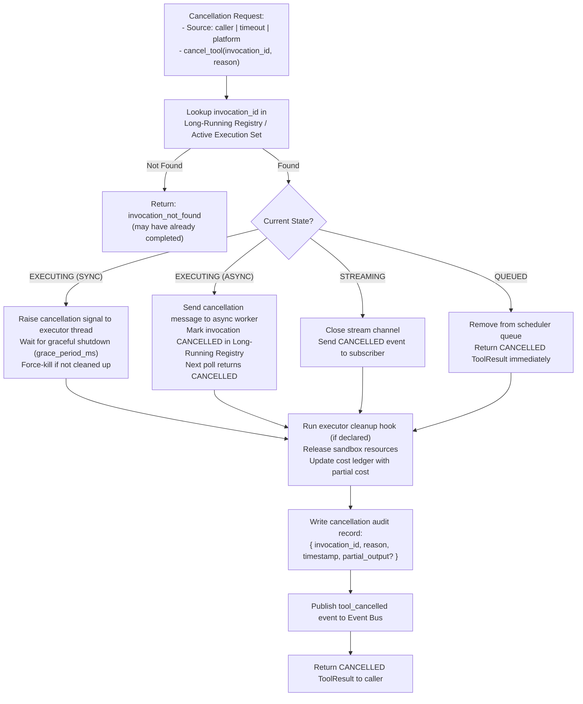
```mermaid
flowchart TD
    CANCEL_REQ["Cancellation Request:\n- Source: caller | timeout | platform\n- cancel_tool(invocation_id, reason)"] --> LOOKUP["Lookup invocation_id in\nLong-Running Registry / Active Execution Set"]
    LOOKUP -- "Not Found" --> NOT_FOUND["Return: invocation_not_found\n(may have already completed)"]
    LOOKUP -- "Found" --> STATE_CHECK{"Current State?"}
    STATE_CHECK -- "QUEUED" --> DEQUEUE["Remove from scheduler queue\nReturn CANCELLED ToolResult immediately"]
    STATE_CHECK -- "EXECUTING (SYNC)" --> INTERRUPT["Raise cancellation signal to executor thread\nWait for graceful shutdown (grace_period_ms)\nForce-kill if not cleaned up"]
    STATE_CHECK -- "EXECUTING (ASYNC)" --> ASYNC_CANCEL["Send cancellation message to async worker\nMark invocation CANCELLED in Long-Running Registry\nNext poll returns CANCELLED"]
    STATE_CHECK -- "STREAMING" --> STREAM_CLOSE["Close stream channel\nSend CANCELLED event to subscriber"]
    INTERRUPT --> CLEANUP["Run executor cleanup hook (if declared)\nRelease sandbox resources\nUpdate cost ledger with partial cost"]
    ASYNC_CANCEL --> CLEANUP
    STREAM_CLOSE --> CLEANUP
    DEQUEUE --> CLEANUP
    CLEANUP --> AUDIT["Write cancellation audit record:\n{ invocation_id, reason, timestamp, partial_output? }"]
    AUDIT --> EVENT["Publish tool_cancelled event to Event Bus"]
    EVENT --> RETURN["Return CANCELLED ToolResult to caller"]
```

---

## 23. Streaming Tool Execution

Streaming tool execution enables tools that produce incremental, progressive results to deliver them to the caller in real time rather than buffering a complete response.

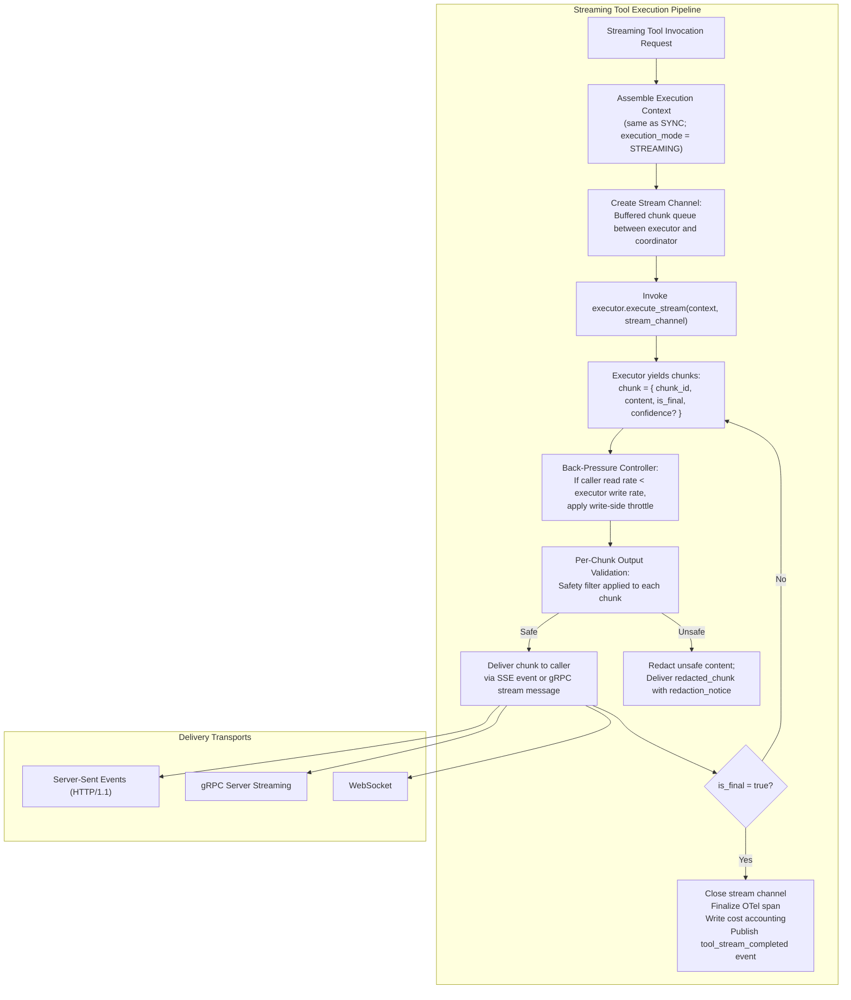
```mermaid
flowchart TD
    subgraph StreamExecution ["Streaming Tool Execution Pipeline"]
        STREAM_INVOKE["Streaming Tool Invocation Request"] --> STREAM_CTX["Assemble Execution Context\n(same as SYNC; execution_mode = STREAMING)"]
        STREAM_CTX --> STREAM_CHAN["Create Stream Channel:\nBuffered chunk queue between executor and coordinator"]
        STREAM_CHAN --> EXEC_START["Invoke executor.execute_stream(context, stream_channel)"]
        EXEC_START --> EXECUTOR["Executor yields chunks:\nchunk = { chunk_id, content, is_final, confidence? }"]
        EXECUTOR --> BACK_PRESSURE["Back-Pressure Controller:\nIf caller read rate < executor write rate,\napply write-side throttle"]
        BACK_PRESSURE --> CHUNK_VALIDATE["Per-Chunk Output Validation:\nSafety filter applied to each chunk"]
        CHUNK_VALIDATE -- "Safe" --> DELIVER["Deliver chunk to caller\nvia SSE event or gRPC stream message"]
        CHUNK_VALIDATE -- "Unsafe" --> REDACT_CHUNK["Redact unsafe content;\nDeliver redacted_chunk with redaction_notice"]
        DELIVER --> FINAL_CHECK{"is_final = true?"}
        FINAL_CHECK -- "No" --> EXECUTOR
        FINAL_CHECK -- "Yes" --> STREAM_CLOSE["Close stream channel\nFinalize OTel span\nWrite cost accounting\nPublish tool_stream_completed event"]
    end

    subgraph StreamDelivery ["Delivery Transports"]
        SSE["Server-Sent Events (HTTP/1.1)"]
        GRPC_S["gRPC Server Streaming"]
        WS["WebSocket"]
    end

    DELIVER --> SSE
    DELIVER --> GRPC_S
    DELIVER --> WS
```

### Streaming Tool Chunk Schema

```
StreamChunk {
  invocation_id:  UUID
  chunk_id:       integer    // Sequential, 1-indexed
  tool_id:        string
  content:        object     // Partial output conforming to a chunk sub-schema
  is_final:       boolean    // True only on the last chunk
  confidence:     decimal?   // Per-chunk confidence (for AI-generated streaming outputs)
  timestamp:      ISO8601
  trace_id:       string
}
```

---

## 24. Long-Running Tool Execution

Long-running tools are tools whose execution takes longer than the caller's synchronous wait budget — typically minutes to hours. They use the `ASYNC_POLL` execution mode.

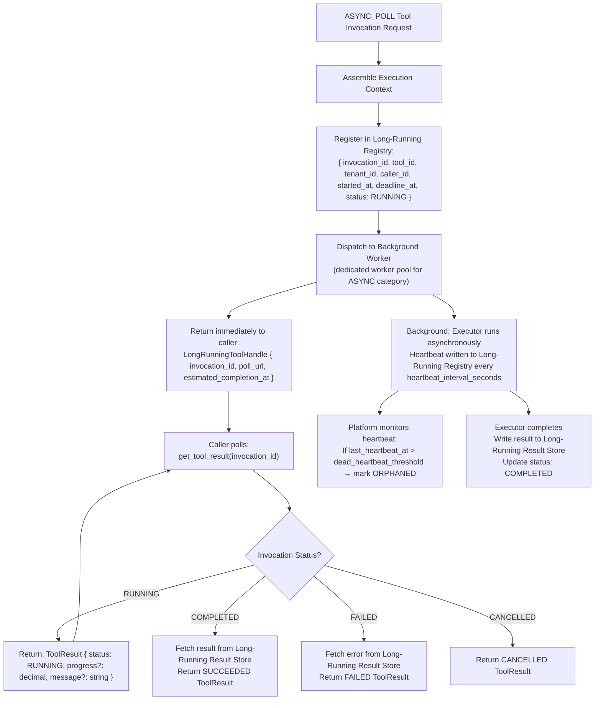
```mermaid
flowchart TD
    ASYNC_INVOKE["ASYNC_POLL Tool Invocation Request"] --> CTX["Assemble Execution Context"]
    CTX --> REGISTER["Register in Long-Running Registry:\n{ invocation_id, tool_id, tenant_id, caller_id, started_at, deadline_at, status: RUNNING }"]
    REGISTER --> DISPATCH["Dispatch to Background Worker\n(dedicated worker pool for ASYNC category)"]
    DISPATCH --> INSTANT_RETURN["Return immediately to caller:\nLongRunningToolHandle { invocation_id, poll_url, estimated_completion_at }"]
    DISPATCH --> BACKGROUND["Background: Executor runs asynchronously\nHeartbeat written to Long-Running Registry every heartbeat_interval_seconds"]

    INSTANT_RETURN --> POLL["Caller polls:\nget_tool_result(invocation_id)"]
    POLL --> STATUS_CHECK{"Invocation Status?"}
    STATUS_CHECK -- "RUNNING" --> POLL_RESULT["Return: ToolResult { status: RUNNING, progress?: decimal, message?: string }"]
    STATUS_CHECK -- "COMPLETED" --> FETCH_RESULT["Fetch result from Long-Running Result Store\nReturn SUCCEEDED ToolResult"]
    STATUS_CHECK -- "FAILED" --> FETCH_ERR["Fetch error from Long-Running Result Store\nReturn FAILED ToolResult"]
    STATUS_CHECK -- "CANCELLED" --> CANCELLED_RES["Return CANCELLED ToolResult"]

    BACKGROUND --> HEARTBEAT_CHECK["Platform monitors heartbeat:\nIf last_heartbeat_at > dead_heartbeat_threshold → mark ORPHANED"]
    BACKGROUND --> COMPLETE["Executor completes\nWrite result to Long-Running Result Store\nUpdate status: COMPLETED"]

    POLL_RESULT --> POLL
```

### Long-Running Registry Schema

```
LongRunningInvocation {
  invocation_id:          UUID
  tool_id:                string
  tenant_id:              string
  caller_id:              string
  status:                 RUNNING | COMPLETED | FAILED | CANCELLED | ORPHANED
  started_at:             ISO8601
  deadline_at:            ISO8601
  last_heartbeat_at:      ISO8601
  progress:               decimal?    // 0.0–1.0
  estimated_completion_at: ISO8601?
  result_key:             string?     // Storage key when status = COMPLETED | FAILED
}
```

---

## 25. Tool Result Model

The Tool Result is the standardized response returned by the Tool Runtime to every caller, regardless of tool category, execution mode, or success/failure outcome.

```
+-----------------------------------------------------------------------------------+
|                           TOOL RESULT MODEL                                       |
+-----------------------------------------------------------------------------------+
|                                                                                   |
|  CORE RESULT SCHEMA:                                                              |
|  {                                                                                |
|    "invocation_id":    UUID,                                                      |
|    "tool_id":          string,                                                    |
|    "tool_version":     SemVer,                                                    |
|    "status":           enum,    // SUCCEEDED | FAILED | PARTIAL | RUNNING         |
|                                 // | CANCELLED | BLOCKED | TIMEOUT | CACHED       |
|    "output":           object?, // Validated, normalized result (null on FAILED)  |
|    "error":            Error?,  // Structured error (null on SUCCEEDED)           |
|    "latency_ms":       integer, // Wall-clock execution time                      |
|    "cost_usd":         decimal, // Actual cost incurred                           |
|    "cached":           boolean, // True if result served from cache               |
|    "trace_id":         string,  // OpenTelemetry trace ID for this call          |
|    "fallback_used":    boolean, // True if result came from fallback tool         |
|    "retry_count":      integer, // Number of retry attempts made                 |
|    "redactions":       [string] // Names of fields that were PII-redacted         |
|  }                                                                                |
|                                                                                   |
|  ERROR SCHEMA (when status = FAILED):                                             |
|  {                                                                                |
|    "error_type":       enum,    // SCHEMA_ERROR | AUTH_ERROR | TIMEOUT           |
|                                 // | RATE_LIMITED | EXTERNAL_ERROR | INTERNAL     |
|                                 // | SAFETY_BLOCK | BUDGET_EXHAUSTED | CANCELLED  |
|    "error_code":       string,  // Machine-readable error code                   |
|    "message":          string,  // Human-readable error description              |
|    "field":            string?, // For SCHEMA_ERROR: which input field failed     |
|    "retry_after_ms":   integer? // For RATE_LIMITED: backoff hint to caller       |
|  }                                                                                |
|                                                                                   |
|  STATUS SEMANTICS:                                                                |
|  - SUCCEEDED: Full result available in output field.                             |
|  - FAILED:    Execution failed; no usable output. Error field populated.         |
|  - PARTIAL:   Output schema validation failed; raw (unsafe) output in output.    |
|               Callers must treat PARTIAL results with caution.                   |
|  - RUNNING:   ASYNC_POLL tool is still executing. Poll again.                    |
|  - CANCELLED: Execution was cancelled before completion.                         |
|  - BLOCKED:   Authorization pipeline blocked execution.                          |
|  - TIMEOUT:   Execution exceeded the timeout deadline.                           |
|  - CACHED:    Result was served from the Tool Cache; cost_usd = 0.              |
+-----------------------------------------------------------------------------------+
```

---

## 26. Tool Versioning

The Tool Runtime enforces semantic versioning across all tool registrations to guarantee backward compatibility and enable safe schema evolution.

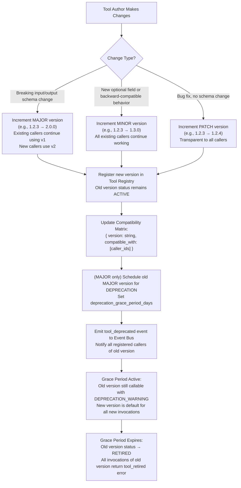
```mermaid
flowchart TD
    CHANGE["Tool Author Makes Changes"] --> CLASSIFY_CHANGE{"Change Type?"}
    CLASSIFY_CHANGE -- "Breaking input/output schema change" --> MAJOR["Increment MAJOR version\n(e.g., 1.2.3 → 2.0.0)\nExisting callers continue using v1\nNew callers use v2"]
    CLASSIFY_CHANGE -- "New optional field or backward-compatible behavior" --> MINOR["Increment MINOR version\n(e.g., 1.2.3 → 1.3.0)\nAll existing callers continue working"]
    CLASSIFY_CHANGE -- "Bug fix, no schema change" --> PATCH["Increment PATCH version\n(e.g., 1.2.3 → 1.2.4)\nTransparent to all callers"]

    MAJOR --> REGISTER_NEW["Register new version in Tool Registry\nOld version status remains ACTIVE"]
    MINOR --> REGISTER_NEW
    PATCH --> REGISTER_NEW

    REGISTER_NEW --> COMPAT_MATRIX["Update Compatibility Matrix:\n{ version: string, compatible_with: [caller_ids] }"]
    COMPAT_MATRIX --> DEPRECATE_OLD["(MAJOR only) Schedule old MAJOR version for DEPRECATION\nSet deprecation_grace_period_days"]
    DEPRECATE_OLD --> NOTIFY["Emit tool_deprecated event to Event Bus\nNotify all registered callers of old version"]
    NOTIFY --> GRACE["Grace Period Active:\nOld version still callable with DEPRECATION_WARNING\nNew version is default for all new invocations"]
    GRACE --> RETIRE["Grace Period Expires:\nOld version status → RETIRED\nAll invocations of old version return tool_retired error"]
```

### Version Resolution Rules

| Scenario | Resolution |
| :--- | :--- |
| Caller requests specific version | Exact version lookup. If `RETIRED`, return `tool_retired` error. |
| Caller requests `latest` | Return highest MAJOR.MINOR.PATCH version with status `ACTIVE`. |
| Caller requests `latest stable` | Return highest version with status `ACTIVE` and MAJOR ≥ 1. |
| Agent Runtime manifest build | Always use `latest` active version per tool. |
| Workflow Engine task declaration | Version pinned in workflow definition at authoring time. |

---

## 27. Tool Dependency Management

Tools may declare dependencies on other tools, on platform services, or on external systems. The Tool Runtime validates and manages these dependencies throughout the tool lifecycle.

```
+-----------------------------------------------------------------------------------+
|                   TOOL DEPENDENCY MANAGEMENT                                      |
+-----------------------------------------------------------------------------------+
|                                                                                   |
|  DEPENDENCY TYPES:                                                                |
|                                                                                   |
|  1. PLATFORM DEPENDENCIES (platform_deps):                                       |
|     Tools declare which platform capabilities they require at runtime.           |
|     Example: a "graph_rag_retrieve" tool declares:                               |
|       platform_deps = ["knowledge_base", "knowledge_graph"]                      |
|     The Tool Runtime verifies both capabilities are AVAILABLE before activation. |
|                                                                                   |
|  2. EXTERNAL DEPENDENCIES (external_deps):                                       |
|     Tools declare external services they call, with health check endpoints.      |
|     {                                                                             |
|       "service_id":       string,                                                |
|       "display_name":     string,                                                |
|       "health_check_url": string,   // HTTP GET endpoint                         |
|       "health_check_interval_seconds": integer,                                  |
|       "failure_action":  "DEGRADE" | "DEACTIVATE"                               |
|     }                                                                             |
|     If failure_action = "DEGRADE": health_status → DEGRADED; still callable.   |
|     If failure_action = "DEACTIVATE": tool deactivated until dependency recovers.|
|                                                                                   |
|  3. TOOL DEPENDENCIES (tool_deps):                                                |
|     Tools that internally invoke other tools declare those dependencies.         |
|     The Tool Runtime validates no circular dependency chain exists at            |
|     registration time. Circular tool_deps are a registration rejection reason.  |
|                                                                                   |
|  4. DEPENDENCY HEALTH PROPAGATION:                                               |
|     If a declared external_dep becomes UNHEALTHY and failure_action = "DEGRADE":|
|       - Tool health_status is set to DEGRADED.                                  |
|       - Circuit breaker may open if error rate rises above circuit_threshold.   |
|     If failure_action = "DEACTIVATE":                                            |
|       - Tool is automatically deactivated.                                       |
|       - Event neuroflow.tool.auto_deactivated published to Event Bus.           |
|       - Tool auto-reactivated when dependency health check passes again.        |
+-----------------------------------------------------------------------------------+
```

---

## 28. Plugin Tool Integration

Domain plugins extend the Tool Runtime's tool catalog by registering plugin-specific tools and executors at plugin load time. The Tool Runtime provides complete isolation between plugin tool code and the platform runtime.


```mermaid
flowchart TD
    subgraph PluginLoad ["Plugin Load Time"]
        PLUGIN_INIT["Plugin Initializer Executes"] --> REG_CALL["context.tool_runtime.register_tool(\n  tool_id, name, description, namespace,\n  input_schema, output_schema,\n  executor_class, safety_level, required_scopes\n)"]
        REG_CALL --> TOOL_RT["Tool Runtime: Full Registration Pipeline\n(Section 8)"]
        TOOL_RT --> ACTIVE["Tool Status: ACTIVE in Registry"]
    end

    subgraph PluginInvocation ["Plugin Tool Invocation (via Agent or Workflow)"]
        CALLER["Agent Runtime or Workflow Engine"] --> IFACE["IToolExecutor.execute(tool_id, args, context)"]
        IFACE --> REGISTRY_RES["Tool Registry: Resolve executor_class\nfor declared tool_id"]
        REGISTRY_RES --> SANDBOX_CTL["Sandbox Controller:\nApply plugin sandbox profile\nResource limits enforced"]
        SANDBOX_CTL --> PLUGIN_EXEC["Plugin Executor Class:\nTelecomAlarmExecutor.execute(args, context)"]
        PLUGIN_EXEC --> RESULT["ToolResult returned to Tool Runtime"]
        RESULT --> OUTPUT_VAL["Output Validation Pipeline"]
        OUTPUT_VAL --> CALLER_RET["Validated ToolResult returned to caller"]
    end
```

### Plugin Tool Isolation Guarantees

| Guarantee | Mechanism |
| :--- | :--- |
| **No platform state mutation** | Plugin executors receive read-only platform service handles. They cannot modify agent session state, workflow state, or tool registry entries. |
| **Tenant scope enforcement** | All service handles injected into the executor context are pre-scoped to the active `tenant_id`. Plugin executors cannot access other tenants' data. |
| **Resource isolation** | Each plugin executor is bound by the sandbox profile assigned to its declared `safety_level`. Memory, CPU, and network egress are capped. |
| **No direct inter-plugin calls** | Plugin executors may only invoke other tools via the `IToolExecutor` interface — they cannot directly call another plugin's executor class. |
| **Error isolation** | Unhandled exceptions in plugin executors are caught by the Tool Runtime's execution wrapper. Plugin failures cannot crash the calling agent session or workflow. |

---

## 29. Workflow Engine Integration

The Tool Runtime is invoked by the Workflow Engine as the execution backend for task types that require tool invocation.

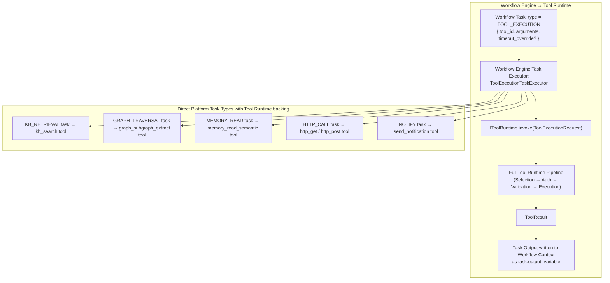
```mermaid
flowchart TD
    subgraph WorkflowToTool ["Workflow Engine → Tool Runtime"]
        WF_STEP["Workflow Task: type = TOOL_EXECUTION\n{ tool_id, arguments, timeout_override? }"] --> WF_EXEC["Workflow Engine Task Executor:\nToolExecutionTaskExecutor"]
        WF_EXEC --> TOOL_RT_INVOKE["IToolRuntime.invoke(ToolExecutionRequest)"]
        TOOL_RT_INVOKE --> FULL_PIPELINE["Full Tool Runtime Pipeline\n(Selection → Auth → Validation → Execution)"]
        FULL_PIPELINE --> TOOL_RESULT["ToolResult"]
        TOOL_RESULT --> WF_TASK_OUT["Task Output written to Workflow Context\nas task.output_variable"]
    end

    subgraph DirectTaskTypes ["Direct Platform Task Types with Tool Runtime backing"]
        KB_TASK["KB_RETRIEVAL task → kb_search tool"]
        GRAPH_TASK["GRAPH_TRAVERSAL task → graph_subgraph_extract tool"]
        MEM_TASK["MEMORY_READ task → memory_read_semantic tool"]
        HTTP_TASK["HTTP_CALL task → http_get / http_post tool"]
        NOTIFY_TASK["NOTIFY task → send_notification tool"]
    end

    WF_EXEC --> KB_TASK
    WF_EXEC --> GRAPH_TASK
    WF_EXEC --> MEM_TASK
    WF_EXEC --> HTTP_TASK
    WF_EXEC --> NOTIFY_TASK
```

---

## 30. Agent Runtime Integration

The Agent Runtime is the primary caller of the Tool Runtime during autonomous reasoning sessions. The Tool Execution Engine within the Agent Runtime delegates all tool invocations to the Tool Runtime via the `IToolRuntime` port.

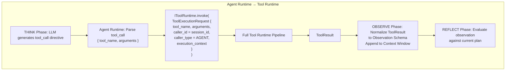
```mermaid
flowchart TD
    subgraph AgentToTool ["Agent Runtime → Tool Runtime"]
        AGENT_THINK["THINK Phase: LLM generates tool_call directive"] --> AGENT_PARSE["Agent Runtime: Parse tool_call\n{ tool_name, arguments }"]
        AGENT_PARSE --> TOOL_RT_CALL["IToolRuntime.invoke(\n  ToolExecutionRequest {\n    tool_name, arguments,\n    caller_id = session_id,\n    caller_type = AGENT,\n    execution_context\n  }\n)"]
        TOOL_RT_CALL --> FULL_PIPELINE["Full Tool Runtime Pipeline"]
        FULL_PIPELINE --> TOOL_RESULT["ToolResult"]
        TOOL_RESULT --> OBSERVE["OBSERVE Phase: Normalize ToolResult\nto Observation Schema\nAppend to Context Window"]
        OBSERVE --> REFLECT["REFLECT Phase: Evaluate observation\nagainst current plan"]
    end
```

### Tool Manifest Assembly for LLM Prompting

The Agent Runtime assembles a **Tool Manifest** before each LLM inference call. This manifest is built by querying the Tool Runtime's Capability Discovery subsystem and requesting a formatted JSON Schema representation of all tools the agent is authorized to invoke:

```
ToolManifest {
  tools: [
    {
      name:        string   // tool.name (short identifier for LLM)
      description: string   // tool.description (precise LLM-targeted description)
      parameters: {         // tool.input_schema formatted as JSON Schema for OpenAI-compatible tool-calling
        type: "object",
        properties: { ... },
        required: [ ... ]
      }
    }
  ]
}
```

---

## 31. Memory Layer Integration

Tools that interact with the platform Memory Layer are categorized as `MEMORY` category tools. Additionally, the Tool Runtime writes tool execution summary records to the Procedural Memory tier after each session as part of the retrospective learning pipeline.

```
+-----------------------------------------------------------------------------------+
|                    MEMORY LAYER INTEGRATION                                       |
+-----------------------------------------------------------------------------------+
|                                                                                   |
|  MEMORY TOOL CATEGORY:                                                            |
|  Tools in the MEMORY category expose the Memory Layer to agents as callable     |
|  tools. All memory access by an agent goes through the Tool Runtime — there is   |
|  no direct agent → Memory Layer path that bypasses the Tool Runtime.             |
|                                                                                   |
|  Platform MEMORY tools:                                                           |
|  - memory_read_episodic(query, tenant_id, agent_id, top_k) → EpisodicResults    |
|  - memory_read_semantic(query, entity_id?, tenant_id, top_k) → SemanticResults  |
|  - memory_read_procedural(query, tool_ids?, tenant_id, top_k) → ProceduralResults|
|  - memory_write_episodic(session_summary, tenant_id, agent_id) → void           |
|  - memory_write_fact(entity_id, fact, confidence, tenant_id) → void             |
|  - memory_write_procedure(strategy, tool_ids, success_score) → void             |
|                                                                                   |
|  RETROSPECTIVE TOOL PERFORMANCE RECORDING:                                       |
|  After each agent session terminates, the Tool Runtime's retrospective emitter   |
|  writes a ToolPerformanceRecord to Procedural Memory for each tool invoked       |
|  during the session:                                                              |
|  {                                                                                |
|    "tool_id":          string,                                                    |
|    "invocation_count": integer,                                                   |
|    "success_rate":     decimal,                                                   |
|    "avg_latency_ms":   integer,                                                   |
|    "usefulness_score": decimal,    // Assigned by Reflection Engine               |
|    "goal_context":     string      // Embedding of the goal this tool served     |
|  }                                                                                |
|  This enables future agent sessions to retrieve procedural memory entries that   |
|  recommend high-usefulness tools for similar goals.                              |
+-----------------------------------------------------------------------------------+
```

---

## 32. Knowledge Base Integration

Tools in the `KNOWLEDGE_BASE` category expose the platform Knowledge Base for agent-driven retrieval. These tools implement the full hybrid retrieval pipeline through the `IKnowledgeBase` port.

| Tool | Description |
| :--- | :--- |
| `kb_search` | Hybrid vector + BM25 keyword search with re-ranking. Returns top-K chunks with source citations. |
| `kb_retrieve_document` | Retrieve all chunks for a specific `doc_id`. Useful for full-document analysis. |
| `kb_list_namespaces` | List all KB namespaces the caller is authorized to access. |
| `kb_ingest_document` | Submit a document for ingestion into a caller-accessible namespace. Requires `KB_WRITE` scope. |
| `kb_get_document_metadata` | Retrieve metadata (source, version, confidence, TTL) for a specific document. |

All KB tool executors receive a tenant-scoped `IKnowledgeBaseClient` handle injected by the Tool Runtime's Execution Context. KB tools cannot access namespaces outside the caller's declared `kb_namespaces` scope.

---

## 33. Knowledge Graph Integration

Tools in the `KNOWLEDGE_GRAPH` category expose the platform Knowledge Graph for structured entity and relationship queries.

| Tool | Description |
| :--- | :--- |
| `graph_entity_search` | Find entities matching a name, alias, or property pattern. |
| `graph_subgraph_extract` | Extract a subgraph of N hops around a seed entity set. Returns triples with confidence scores. |
| `graph_shortest_path` | Find the shortest relationship path between two entities. |
| `graph_add_entity` | Add a new entity to the Knowledge Graph. Requires `GRAPH_WRITE` scope and triggers governance review if confidence < auto-approval threshold. |
| `graph_add_relation` | Add a typed relationship between two existing entities. |
| `graph_get_entity` | Retrieve all properties and relationships for a specific entity node. |

All KG tool executors receive a tenant-scoped `IGraphClient` handle injected by the Execution Context, which enforces namespace access control at the graph store level.

---

## 34. Event Bus Integration

The Tool Runtime publishes lifecycle events to and subscribes configuration events from the Internal Event Bus.

### Published Events (Outbound)

| Event Name | Trigger |
| :--- | :--- |
| `neuroflow.tool.registered` | A tool definition is successfully registered and activated. |
| `neuroflow.tool.activated` | A previously INACTIVE tool is set to ACTIVE. |
| `neuroflow.tool.deactivated` | An ACTIVE tool is set to INACTIVE by operator action or dependency failure. |
| `neuroflow.tool.deprecated` | A tool version is deprecated following activation of a new version. |
| `neuroflow.tool.retired` | A deprecated tool version is retired following grace period expiry. |
| `neuroflow.tool.auto_deactivated` | Tool automatically deactivated due to external dependency failure. |
| `neuroflow.tool.invoked` | A tool invocation has been dispatched (pre-execution). |
| `neuroflow.tool.succeeded` | A tool invocation completed with SUCCEEDED status. |
| `neuroflow.tool.failed` | A tool invocation completed with FAILED status. |
| `neuroflow.tool.timeout` | A tool invocation exceeded its timeout deadline. |
| `neuroflow.tool.cancelled` | A tool invocation was cancelled. |
| `neuroflow.tool.circuit_opened` | A tool's circuit breaker transitioned from CLOSED to OPEN. |
| `neuroflow.tool.circuit_closed` | A tool's circuit breaker recovered from OPEN to HALF_OPEN to CLOSED. |
| `neuroflow.tool.rate_limited` | A caller's invocation was rejected by the rate limiter. |
| `neuroflow.tool.cache_hit` | A tool invocation was served from cache. |

### Subscribed Events (Inbound)

| Event Pattern | Action |
| :--- | :--- |
| `neuroflow.system.started` | Trigger Tool Registry initialization from persistent store; rebuild Active Index. |
| `neuroflow.plugin.loaded` | Register all tool definitions declared by the loaded plugin. |
| `neuroflow.plugin.unloaded` | Deactivate all tools registered under the unloaded plugin's namespace. |
| `neuroflow.config.updated` | Reload rate limit configs, sandbox profiles, and safety policies. |
| `neuroflow.tool.hitl_approved` | Resume AWAITING_APPROVAL tool invocation after operator approval. |
| `neuroflow.tool.hitl_rejected` | Return BLOCKED result for AWAITING_APPROVAL invocation. |

---

## 35. Security Architecture

The Tool Runtime implements a defense-in-depth security model protecting against prompt injection, privilege escalation, data exfiltration, and resource abuse.

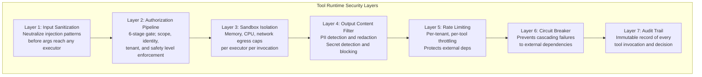
```mermaid
flowchart TD
    subgraph SecurityLayers ["Tool Runtime Security Layers"]
        L1["Layer 1: Input Sanitization\nNeutralize injection patterns\nbefore args reach any executor"]
        L2["Layer 2: Authorization Pipeline\n6-stage gate; scope, identity,\ntenant, and safety level enforcement"]
        L3["Layer 3: Sandbox Isolation\nMemory, CPU, network egress caps\nper executor per invocation"]
        L4["Layer 4: Output Content Filter\nPII detection and redaction\nSecret detection and blocking"]
        L5["Layer 5: Rate Limiting\nPer-tenant, per-tool throttling\nProtects external deps"]
        L6["Layer 6: Circuit Breaker\nPrevents cascading failures\nto external dependencies"]
        L7["Layer 7: Audit Trail\nImmutable record of every\ntool invocation and decision"]

        L1 --> L2 --> L3 --> L4 --> L5 --> L6 --> L7
    end
```

### Security Enforcement Matrix

| Threat | Defense Mechanism | Layer |
| :--- | :--- | :--- |
| Prompt injection via tool arguments | Input Sanitization stage detects and neutralizes injection sequences in string fields. | Input Validation |
| Privilege escalation | Scope enforcement in Authorization Pipeline. No caller can invoke a tool requiring a scope they do not hold. | Authorization |
| Cross-tenant data access | Tenant boundary check in Authorization Pipeline; tenant-scoped service handles in Execution Context. | Authorization + Sandbox |
| Plugin code escaping sandbox | Sandbox Controller enforces resource limits and network egress policy at OS/container level. | Sandbox |
| Secrets in tool output | Output Content Filter detects and hard-blocks results containing secrets (API keys, tokens, passwords). | Output Validation |
| PII exfiltration | Output Content Filter detects and redacts PII before result is returned to caller. | Output Validation |
| External API abuse | Rate Limiter and Circuit Breaker govern all external-facing tool invocations. | Rate Limiting + Circuit Breaker |
| Execution denial-of-service | Per-tenant concurrency caps and resource quotas prevent any tenant from exhausting platform execution capacity. | Scheduling + Quotas |

---

## 36. Sandboxing & Isolation

Every tool execution is bounded by a sandbox profile that constrains the resource footprint and access rights of the executing code.

```
+-----------------------------------------------------------------------------------+
|                      SANDBOXING ARCHITECTURE                                      |
+-----------------------------------------------------------------------------------+
|                                                                                   |
|  SANDBOX PROFILES (mapped by safety_level at registration):                      |
|                                                                                   |
|  LOW (e.g., COMPUTATION, KNOWLEDGE_BASE read tools):                             |
|    memory_limit_mb:      256                                                      |
|    cpu_limit_cores:      0.5                                                      |
|    network_egress:       NONE    // No outbound network calls permitted           |
|    file_system_access:   NONE                                                     |
|    execution_timeout_s:  10                                                       |
|                                                                                   |
|  MEDIUM (e.g., EXTERNAL_API, COMMUNICATION tools):                               |
|    memory_limit_mb:      512                                                      |
|    cpu_limit_cores:      1.0                                                      |
|    network_egress:       ALLOWLIST   // Only to declared external_deps            |
|    file_system_access:   NONE                                                     |
|    execution_timeout_s:  30                                                       |
|                                                                                   |
|  HIGH (e.g., CODE_EXECUTION, DATABASE_WRITE tools):                              |
|    memory_limit_mb:      1024                                                     |
|    cpu_limit_cores:      2.0                                                      |
|    network_egress:       ALLOWLIST                                                |
|    file_system_access:   SCOPED_TEMP   // Isolated temp directory only           |
|    execution_timeout_s:  60                                                       |
|                                                                                   |
|  CRITICAL (e.g., PLATFORM_ADMIN tools):                                          |
|    memory_limit_mb:      2048                                                     |
|    cpu_limit_cores:      2.0                                                      |
|    network_egress:       ALLOWLIST                                                |
|    file_system_access:   SCOPED_TEMP                                              |
|    execution_timeout_s:  120                                                      |
|    requires_hitl:        true      // Always requires human approval              |
|    audit_required:       true      // Every invocation written to audit trail     |
|                                                                                   |
|  ISOLATION MECHANISM:                                                             |
|  In the production deployment, each tool execution above LOW safety_level is     |
|  dispatched to a process-isolated worker via the IsolatedExecutorBridge port.   |
|  The bridge abstracts whether isolation is implemented via:                      |
|    - OS subprocess with resource group (cgroup) limits.                          |
|    - Lightweight container (e.g., gVisor / Firecracker microVM).                |
|    - WebAssembly sandbox (WASM runtime for pure-compute tools).                  |
|  The Tool Runtime does not import or depend on any specific isolation technology; |
|  the IsolatedExecutorBridge port abstracts it completely.                        |
+-----------------------------------------------------------------------------------+
```

---

## 37. Rate Limiting

The Rate Limiter protects the platform and its external dependencies from invocation storms, runaway agents, and tenant misuse.

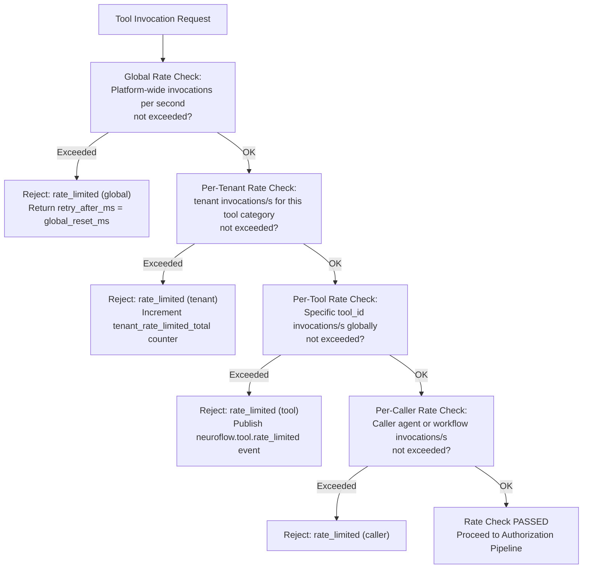
```mermaid
flowchart TD
    REQUEST["Tool Invocation Request"] --> CHECK_GLOBAL["Global Rate Check:\nPlatform-wide invocations per second\nnot exceeded?"]
    CHECK_GLOBAL -- "Exceeded" --> REJECT_GLOBAL["Reject: rate_limited (global)\nReturn retry_after_ms = global_reset_ms"]
    CHECK_GLOBAL -- "OK" --> CHECK_TENANT["Per-Tenant Rate Check:\ntenant invocations/s for this tool category\nnot exceeded?"]
    CHECK_TENANT -- "Exceeded" --> REJECT_TENANT["Reject: rate_limited (tenant)\nIncrement tenant_rate_limited_total counter"]
    CHECK_TENANT -- "OK" --> CHECK_TOOL["Per-Tool Rate Check:\nSpecific tool_id invocations/s globally\nnot exceeded?"]
    CHECK_TOOL -- "Exceeded" --> REJECT_TOOL["Reject: rate_limited (tool)\nPublish neuroflow.tool.rate_limited event"]
    CHECK_TOOL -- "OK" --> CHECK_CALLER["Per-Caller Rate Check:\nCaller agent or workflow invocations/s\nnot exceeded?"]
    CHECK_CALLER -- "Exceeded" --> REJECT_CALLER["Reject: rate_limited (caller)"]
    CHECK_CALLER -- "OK" --> ALLOWED["Rate Check PASSED\nProceed to Authorization Pipeline"]
```

### Rate Limit Configuration

| Limit Level | Scope | Algorithm | Default |
| :--- | :--- | :--- | :--- |
| **Global** | Platform-wide | Token Bucket | 10,000 invocations/s |
| **Per-Tenant** | Tenant + Category | Sliding Window | 100 invocations/s per category |
| **Per-Tool** | Tool globally | Token Bucket | Tool-specific (default: 50/s) |
| **Per-Caller** | Agent session or Workflow instance | Sliding Window | 20 invocations/s per session |

---

## 38. Resource Quotas

Resource Quotas govern the computational resources that each tenant may consume through tool invocations over a given time period.

```
+-----------------------------------------------------------------------------------+
|                       RESOURCE QUOTA ARCHITECTURE                                 |
+-----------------------------------------------------------------------------------+
|                                                                                   |
|  QUOTA DIMENSIONS:                                                                |
|  {                                                                                |
|    "tenant_id":                 string,                                           |
|    "quota_period":              enum,    // HOURLY | DAILY | MONTHLY              |
|    "max_tool_invocations":      integer, // Total invocations in period           |
|    "max_concurrent_executions": integer, // Max parallel tool executions          |
|    "max_cpu_seconds":           decimal, // Total CPU time in period              |
|    "max_memory_gb_seconds":     decimal, // Total memory-time in period           |
|    "max_external_api_calls":    integer, // Cap on EXTERNAL_API category calls    |
|    "max_code_executions":       integer, // Cap on CODE_EXECUTION category calls  |
|    "max_cost_usd":              decimal  // Maximum tool invocation cost in period|
|  }                                                                                |
|                                                                                   |
|  QUOTA ENFORCEMENT:                                                               |
|  1. PRE-INVOCATION CHECK: Before dispatching to execution, verify that the       |
|     tenant has not exhausted any quota dimension for the current period.         |
|  2. POST-INVOCATION ACCOUNTING: After execution, deduct actual resource usage    |
|     from the tenant's quota ledger (PostgreSQL via IQuotaStore port).            |
|  3. SOFT LIMIT (80%): Emit quota_soft_limit_reached event; warn caller.          |
|  4. HARD LIMIT (100%): Reject invocation with quota_exhausted error.             |
|     Return quota_reset_at timestamp in error payload.                            |
|  5. QUOTA RESET: At the end of each quota_period, quotas are reset.              |
|     Partial period resets are not supported; carryover is not permitted.         |
+-----------------------------------------------------------------------------------+
```

---

## 39. Multi-Tenant Isolation

Multi-Tenant Isolation ensures that tool invocations from one tenant cannot observe, affect, or consume the resources of another tenant.

```
+-----------------------------------------------------------------------------------+
|                     MULTI-TENANT ISOLATION ARCHITECTURE                           |
+-----------------------------------------------------------------------------------+
|                                                                                   |
|  ISOLATION BOUNDARIES:                                                            |
|                                                                                   |
|  1. AUTHORIZATION BOUNDARY:                                                       |
|     Every invocation carries tenant_id. The Authorization Pipeline enforces      |
|     the Tenant Boundary Check (Stage 2) before any execution begins.            |
|     Tools registered in namespace "telecom" may only be invoked by callers       |
|     whose tenant has been granted access to the "telecom" namespace.             |
|                                                                                   |
|  2. DATA BOUNDARY:                                                                |
|     All service handles (KB, KG, Memory, DB) injected into the Execution         |
|     Context are pre-scoped to the caller's tenant_id. A plugin executor          |
|     using the injected kb_client can only access KB namespaces belonging to      |
|     the active tenant. No cross-tenant data read is architecturally possible     |
|     through the injected handles.                                                 |
|                                                                                   |
|  3. RESOURCE BOUNDARY:                                                            |
|     Per-tenant resource quotas (Section 38) and per-tenant rate limits          |
|     (Section 37) prevent any tenant from consuming disproportionate execution    |
|     capacity. Tenant queues are isolated in the Scheduler (Section 19).         |
|                                                                                   |
|  4. OBSERVABILITY BOUNDARY:                                                       |
|     All metrics, traces, and logs emitted by the Tool Runtime carry tenant_id   |
|     as a dimension. Tenant-scoped dashboards and alert rules can be configured  |
|     without risk of cross-tenant metric bleed.                                   |
|                                                                                   |
|  5. AUDIT BOUNDARY:                                                               |
|     The immutable audit log stores all tool invocations with tenant_id.          |
|     Tenant-scoped audit queries are enforced by the IAgentAuditStore port.      |
|     No tenant can query another tenant's audit records.                          |
+-----------------------------------------------------------------------------------+
```

---

## 40. Tool Caching

The Tool Cache stores the results of deterministic tool invocations to eliminate redundant executions and reduce latency for repeated queries.

```mermaid
flowchart TD
    subgraph CachePipeline ["Tool Cache Pipeline"]
        INVOKE["Tool Invocation Request"] --> CACHEABLE{"tool.is_cacheable = true?"}
        CACHEABLE -- "No" --> SKIP_CACHE["Skip cache; go to Execution Engine"]
        CACHEABLE -- "Yes" --> CACHE_KEY["Compute Cache Key:\nSHA-256(tool_id + version + normalized_arguments + tenant_id)"]
        CACHE_KEY --> CACHE_LOOKUP["Lookup key in Redis Cache\n(IToolCacheStore port)"]
        CACHE_LOOKUP -- "HIT and not expired" --> CACHE_HIT["Return CachedToolResult\n{ ...result, cached: true, cached_at, ttl_remaining }"]
        CACHE_LOOKUP -- "MISS or expired" --> EXECUTE["Execute via Execution Engine"]
        EXECUTE --> RESULT["ToolResult (SUCCEEDED)"]
        RESULT --> CACHE_WRITE["Write to Redis Cache\nTTL = tool.cache_ttl_seconds\nKey = computed cache key"]
        CACHE_WRITE --> RETURN["Return ToolResult to caller"]

        CACHE_HIT --> METRICS_HIT["Increment cache_hit counter\nLog cache_hit event at DEBUG level"]
        RESULT --> METRICS_MISS["Increment cache_miss counter"]
    end
```

### Cache Invalidation Rules

| Trigger | Action |
| :--- | :--- |
| `tool.cache_ttl_seconds` expires | Redis auto-evicts entry on TTL expiry. |
| Tool version incremented (PATCH or MINOR) | All cache entries for the previous version are evicted by Tool Runtime on activation of new version. |
| Tool version MAJOR bump | Previous version cache cleared on deprecation. New version has empty cache. |
| Tool deactivated | All cache entries for the tool are immediately purged. |
| Operator flush | `platform.flush_tool_cache(tool_id)` admin tool clears all entries for the specified tool. |
| KB / KG mutation | Tools that read from KB or KG that have declared `kb` or `kg` in their `platform_deps` receive invalidation signals when the KB or KG is updated, triggering cache eviction for affected entries. |

**Caching Eligibility Rules**: A tool result is eligible for caching only if:
1. `tool.is_cacheable = true` is declared in the tool definition.
2. The result `status = SUCCEEDED` (failed results are never cached).
3. The tool `is_idempotent = true` (required for correctness: only idempotent tools may have their results cached).
4. No `RANDOMIZED`, `TIME_SENSITIVE`, or `STATEFUL` tags are present in the tool definition.

---

## 41. Observability

The Tool Runtime participates in the NeuroFlow AI distributed observability platform through three pillars: Traces, Metrics, and Logs. Every tool invocation is fully observable from the moment of dispatch through result delivery.

```mermaid
flowchart TD
    subgraph ObsEngine ["Tool Runtime Observability Engine"]
        subgraph Traces ["Distributed Traces — OpenTelemetry"]
            ROOT_SPAN["Parent Span: Caller (Agent Session or Workflow Task)"]
            TOOL_SPAN["Child Span: Tool Invocation\n(tool_id, tenant_id, caller_type, version)"]
            AUTH_SPAN["Grandchild: Authorization Pipeline"]
            VAL_SPAN["Grandchild: Input Validation"]
            EXEC_SPAN["Grandchild: Tool Execution\n(attempt_number, sandbox_profile)"]
            OUT_SPAN["Grandchild: Output Validation"]
            ROOT_SPAN --> TOOL_SPAN
            TOOL_SPAN --> AUTH_SPAN
            TOOL_SPAN --> VAL_SPAN
            TOOL_SPAN --> EXEC_SPAN
            TOOL_SPAN --> OUT_SPAN
        end
    end

    ObsEngine --> OTEL["OpenTelemetry Collector"]
    OTEL --> TEMPO["Trace Backend:\nTempo / Jaeger"]
    OTEL --> PROM["Metrics Backend:\nPrometheus"]
    OTEL --> LOKI["Log Backend:\nLoki / ELK"]
```

---

## 42. Metrics

The Tool Runtime exports 18 OpenTelemetry-compatible metrics:

| Metric Name | Type | Labels | Description |
| :--- | :--- | :--- | :--- |
| `neuroflow_tool_invocations_total` | Counter | `tool_id, tenant_id, status, caller_type` | Total tool invocations by status. |
| `neuroflow_tool_latency_seconds` | Histogram | `tool_id, tenant_id, execution_mode` | End-to-end invocation latency. |
| `neuroflow_tool_execution_seconds` | Histogram | `tool_id, tenant_id` | Executor-only execution time (excludes validation/auth). |
| `neuroflow_tool_failures_total` | Counter | `tool_id, tenant_id, error_type` | Tool invocation failures by error type. |
| `neuroflow_tool_retries_total` | Counter | `tool_id, tenant_id` | Total retry attempts made. |
| `neuroflow_tool_timeouts_total` | Counter | `tool_id, tenant_id` | Total timeout events. |
| `neuroflow_tool_cache_hits_total` | Counter | `tool_id, tenant_id` | Total cache hits. |
| `neuroflow_tool_cache_misses_total` | Counter | `tool_id, tenant_id` | Total cache misses. |
| `neuroflow_tool_cost_usd_total` | Counter | `tool_id, tenant_id, category` | Total invocation cost in USD. |
| `neuroflow_tool_rate_limited_total` | Counter | `tool_id, tenant_id, limit_level` | Total rate-limited rejections by limit level. |
| `neuroflow_tool_auth_blocked_total` | Counter | `tool_id, tenant_id, stage` | Total authorization blocks by pipeline stage. |
| `neuroflow_tool_circuit_open_total` | Counter | `tool_id` | Number of times circuit breaker opened. |
| `neuroflow_tool_active_executions` | Gauge | `tool_id, tenant_id, execution_mode` | Current concurrently executing tools. |
| `neuroflow_tool_queue_depth` | Gauge | `tenant_id, category, priority` | Current items in scheduling queue. |
| `neuroflow_tool_queue_wait_seconds` | Histogram | `tenant_id, category` | Time spent in scheduling queue before dispatch. |
| `neuroflow_tool_registered_total` | Gauge | `namespace, category, status` | Total tools registered by status. |
| `neuroflow_tool_long_running_active` | Gauge | `tool_id, tenant_id` | Current active ASYNC_POLL executions. |
| `neuroflow_tool_pii_redactions_total` | Counter | `tool_id, tenant_id` | Total output records with PII redaction applied. |

---

## 43. Logging

The Tool Runtime emits structured JSON log records at every significant processing boundary. All logs carry `trace_id`, `invocation_id`, `tool_id`, and `tenant_id` for correlation.

### Log Levels and Events

| Level | Events |
| :--- | :--- |
| `INFO` | Tool registered, tool activated, invocation dispatched, invocation succeeded, cache hit. |
| `WARN` | Tool deprecated, retry attempt made, quota soft limit (80%), output schema partial mismatch, PII redaction applied. |
| `ERROR` | Tool invocation failed, timeout exceeded, authorization blocked, circuit breaker opened, quota exhausted. |
| `CRITICAL` | Security threat detected in input, secret detected in output, tool auto-deactivated by dependency failure. |
| `DEBUG` | Full invocation request payload, raw executor output, per-chunk streaming events, cache key computation. |

### Log Record Schema

```
{
  "timestamp":       ISO8601,
  "level":           string,
  "event":           string,
  "trace_id":        string,
  "invocation_id":   UUID,
  "tool_id":         string,
  "tool_version":    string,
  "tenant_id":       string,
  "caller_id":       string,
  "caller_type":     string,
  "status":          string?,
  "latency_ms":      integer?,
  "retry_attempt":   integer?,
  "cost_usd":        decimal?,
  "error_type":      string?,
  "message":         string
}
```

---

## 44. Distributed Tracing

Every tool invocation produces a complete OpenTelemetry distributed trace, enabling end-to-end visibility from the originating agent session or workflow task through the full tool execution lifecycle.

### Trace Span Hierarchy

```
[Span] agent.session  OR  workflow.task_execution
  +-- [Span] tool.invocation (invocation_id, tool_id, tenant_id, caller_type)
        +-- [Span] tool.selection_pipeline (stages_completed, cache_hit)
        +-- [Span] tool.authorization_pipeline (stages_passed, blocked_at?)
        +-- [Span] tool.input_validation (fields_validated, sanitization_applied)
        +-- [Span] tool.execution (execution_mode, attempt_number, sandbox_profile)
        |     +-- [Span] tool.executor (executor_class, latency_ms)
        +-- [Span] tool.output_validation (pii_redacted, truncated)
        +-- [Span] tool.cache_write (cache_key, ttl_seconds)
```

### Trace Propagation Rules

- The `trace_id` from the invoking Agent Runtime reasoning loop span is propagated into the `tool.invocation` root span. This creates a unified trace spanning the full THINK→ACT cycle.
- The `trace_id` from the invoking Workflow Engine task span is propagated into the `tool.invocation` root span for workflow-triggered tool calls.
- For ASYNC_POLL tools, the `trace_id` is stored in the Long-Running Registry and re-attached to the background executor span, maintaining trace continuity across the asynchronous gap.

---

## 45. Failure Recovery

The Tool Runtime employs a layered failure recovery strategy. No single failure at the tool execution level should cause an unrecoverable platform disruption.

```mermaid
flowchart TD
    FAILURE["Tool Execution Failure Detected"] --> CLASSIFY["Classify Failure Type"]
    CLASSIFY --> TRANSIENT["Transient Error\n(network blip, timeout, rate limit)"]
    CLASSIFY --> SCHEMA_ERR["Schema / Validation Error\n(non-retryable)"]
    CLASSIFY --> EXECUTOR_ERR["Executor Internal Error\n(unhandled exception in executor code)"]
    CLASSIFY --> CIRCUIT_ERR["Circuit Breaker OPEN\n(too many failures against external dep)"]
    CLASSIFY --> BUDGET_ERR["Cost / Quota Exhausted"]

    TRANSIENT --> RETRY_ENG["Retry Engine:\nApply exponential backoff + jitter\nUp to max_attempts"]
    RETRY_ENG -- "Retries exhausted" --> FALLBACK["Try Fallback Tool (if declared)"]
    FALLBACK -- "Success" --> SUCCESS["Return SUCCEEDED ToolResult (fallback_used = true)"]
    FALLBACK -- "Fail or none" --> FAIL_OBS["Return FAILED ToolResult to caller\nEmit tool_failed event"]

    SCHEMA_ERR --> IMMEDIATE_FAIL["Return FAILED ToolResult immediately\n(do NOT retry; do NOT fallback)"]

    EXECUTOR_ERR --> LOG_ERR["Log CRITICAL: unexpected executor error\nCapture stack trace in audit log"]
    LOG_ERR --> RETRY_ENG

    CIRCUIT_ERR --> ALT_SUGGEST["Return BLOCKED ToolResult\nSuggest fallback_tool_id from metadata if known\nEmit circuit_open event"]

    BUDGET_ERR --> BUDGET_FAIL["Return FAILED ToolResult (budget_exhausted)\nNotify caller session's cost controller"]
```

### Circuit Breaker Configuration

| Property | Description | Default |
| :--- | :--- | :--- |
| `circuit_threshold` | Error rate that trips the circuit open. | 50% over 10-request rolling window. |
| `open_duration_seconds` | Time the circuit stays OPEN before transitioning to HALF_OPEN. | 60 seconds. |
| `half_open_probe_count` | Number of probe requests allowed in HALF_OPEN state before decision. | 3. |
| `recovery_threshold` | Success rate in HALF_OPEN required to close the circuit. | 100% of probe requests. |

---

## 46. Repository Placement

```
+-----------------------------------------------------------------------------------+
|                       REPOSITORY PLACEMENT STRATEGY                               |
+-----------------------------------------------------------------------------------+
|  Layer 0 — Core Domain Model (backend/core/)                                      |
|    backend/core/ports/tool_runtime.py                                             |
|      - IToolRuntime:           Entry point for all tool invocations.              |
|      - IToolRegistry:          Tool definition catalog contract.                  |
|      - IToolExecutor:          Tool execution contract (implemented per tool).    |
|      - IToolRegistryStore:     Tool definition persistence (PostgreSQL).          |
|      - IToolIndexStore:        Active tool index (Redis).                         |
|      - IToolVectorStore:       Tool embedding store for discovery (vector DB).    |
|      - IToolCacheStore:        Tool result cache (Redis).                         |
|      - IQuotaStore:            Tenant resource quota ledger (PostgreSQL).         |
|      - IToolAuditStore:        Immutable tool invocation audit log.               |
|      - ILongRunningStore:      Long-running invocation registry.                  |
|      - IIsolatedExecutorBridge: Sandbox isolation abstraction.                   |
|      - IRateLimiter:           Rate limiting abstraction.                         |
|                                                                                   |
|  Layer 1 — Technical Infrastructure (backend/infrastructure/)                    |
|    backend/infrastructure/tool_runtime/                                           |
|      - postgres_tool_registry_store.py   IToolRegistryStore PostgreSQL adapter.  |
|      - redis_tool_index_store.py         IToolIndexStore Redis adapter.           |
|      - redis_tool_cache_store.py         IToolCacheStore Redis adapter.           |
|      - postgres_quota_store.py           IQuotaStore PostgreSQL adapter.          |
|      - postgres_tool_audit_store.py      IToolAuditStore PostgreSQL adapter.      |
|      - redis_long_running_store.py       ILongRunningStore Redis adapter.         |
|      - subprocess_executor_bridge.py     IIsolatedExecutorBridge subprocess impl. |
|      - redis_rate_limiter.py             IRateLimiter Redis sliding-window impl.  |
|      - qdrant_tool_vector_store.py       IToolVectorStore Qdrant adapter.         |
|                                                                                   |
|  Layer 3 — Platform Runtime (backend/tool_runtime/)                              |
|    backend/tool_runtime/                                                          |
|      - registry/          Tool Registry: catalog, versioning, active index.      |
|      - discovery/         Capability Discovery Engine: embedding, ANN, ranking.  |
|      - selection/         Tool Selection Pipeline: parse, lookup, health, cache.  |
|      - authorization/     Authorization Pipeline: identity, scope, safety, policy.|
|      - validation/        Input & Output Validation: JSON Schema, sanitization.  |
|      - context/           Execution Context assembly and service handle injection.|
|      - execution/         Execution Engine: sync, streaming, async dispatcher.   |
|      - sandbox/           Sandbox Controller: profile resolution, resource limits.|
|      - executors/         Platform Built-in Tool Executors (KB, Graph, Memory...) |
|      - retry/             Retry Engine: backoff, jitter, fallback chain.         |
|      - streaming/         Stream Coordinator: SSE, gRPC, back-pressure control.  |
|      - long_running/      Long-Running Registry: polling, heartbeat, cancellation.|
|      - cache/             Tool Cache: key computation, Redis read/write, eviction.|
|      - rate_limiter/      Rate Limiter: token bucket, sliding window, quotas.    |
|      - circuit_breaker/   Circuit Breaker: per-tool state machine.               |
|      - scheduler/         Scheduler / Dispatcher: priority queues, WFQ dispatch. |
|      - security/          Security: input sanitization, output content filter.   |
|      - events/            Event Bus integration: publisher + subscriber.         |
|      - observability/     OTel traces, 18 metrics, structured log emitters.      |
|      - audit/             Immutable tool audit logger.                           |
+-----------------------------------------------------------------------------------+
```

---

## 47. Clean Architecture Dependency Diagram

```mermaid
graph TD
    subgraph Layer5 ["Layer 5: Ingress and Delivery"]
        API[api]
    end

    subgraph Layer4 ["Layer 4: Application Services"]
        SERVICES[services]
    end

    subgraph Layer3 ["Layer 3: Platform Runtime"]
        TR[tool_runtime]
        AR[agent_runtime]
        WE[workflow_engine]
        KG[knowledge_graph]
        KB["rag / knowledge_base"]
        MEMORY[memory]
    end

    subgraph Layer2 ["Layer 2: Extensions and Plugins"]
        PLUGINS[plugins]
    end

    subgraph Layer1 ["Layer 1: Technical Infrastructure"]
        TR_INFRA["infrastructure/tool_runtime\nRegistry, Cache, Index, Quota, Audit, Sandbox adapters"]
        AR_INFRA["infrastructure/agent\nSession, Checkpoint adapters"]
        WE_INFRA["infrastructure/workflow\nQueue, State adapters"]
        LLM_INFRA["infrastructure/llm\nOpenAI, Anthropic, Gemini adapters"]
    end

    subgraph Layer0 ["Layer 0: Core Domain Model"]
        CORE_TR["core/ports/tool_runtime\nIToolRuntime, IToolRegistry, IToolExecutor\nIToolCacheStore, IQuotaStore, IIsolatedExecutorBridge\nIRateLimiter, IToolAuditStore, ILongRunningStore"]
        CORE_AR["core/ports/agent\nIAgentExecutor, ILLMProvider, ISafetyPipeline"]
        CORE_WF["core/ports/workflow\nIWorkflowRegistry, ITaskExecutor"]
        CORE_KG["core/ports/graph\nIGraphStore, IGraphQuery"]
        CORE_KB["core/ports/knowledge\nIKnowledgeBase, IVectorStore"]
        CORE_MEM["core/ports/memory\nIMemoryStore, IMemoryRetriever"]
    end

    API --> SERVICES
    SERVICES --> TR
    SERVICES --> AR
    SERVICES --> WE
    AR --> TR
    AR --> KB
    AR --> KG
    AR --> MEMORY
    AR --> WE
    AR --> CORE_AR
    WE --> TR
    WE --> AR
    WE --> KB
    WE --> KG
    WE --> MEMORY
    WE --> CORE_WF
    TR --> KB
    TR --> KG
    TR --> MEMORY
    TR --> CORE_TR
    TR --> TR_INFRA
    PLUGINS --> CORE_TR
    PLUGINS --> CORE_AR
    PLUGINS --> CORE_WF
    PLUGINS --> CORE_KB
    PLUGINS --> CORE_KG
    PLUGINS --> CORE_MEM
    TR_INFRA --> CORE_TR
    AR_INFRA --> CORE_AR
    WE_INFRA --> CORE_WF
    LLM_INFRA --> CORE_AR
```

**Key Dependency Rules:**
- `tool_runtime` **depends on** `core/ports/tool_runtime` — never the reverse.
- `agent_runtime` **depends on** `tool_runtime` via the `IToolRuntime` port — never imports executor classes directly.
- `workflow_engine` **depends on** `tool_runtime` via the `IToolRuntime` port for task types backed by tool execution.
- `plugins` **may only import** Layer 0 core ports to register their tools. Plugins never import `tool_runtime` implementation classes.
- `tool_runtime` **depends on** `knowledge_base`, `knowledge_graph`, and `memory` via their respective Core ports — the service handle injection pattern.

---

## 48. Platform Ecosystem Diagram

```mermaid
graph TD
    subgraph Callers ["Tool Invocation Callers"]
        AR_CALLER["Agent Runtime\n(Reasoning Loop ACT Phase)"]
        WE_CALLER["Workflow Engine\n(TOOL_EXECUTION Task Type)"]
        SCHED_CALLER["Scheduler\n(Scheduled Tool Invocations)"]
        API_CALLER["Direct API Invocation\n(Admin / Testing)"]
    end

    subgraph PlatformRuntime ["Platform Runtime — Layer 3"]
        TR["Tool Runtime"]
        AR_RT["Agent Runtime"]
        WE_RT["Workflow Engine"]
        KB_RT["Knowledge Base"]
        KG_RT["Knowledge Graph"]
        MEM_RT["Memory Layer"]
    end

    subgraph Plugins ["Domain Plugins — Tool Providers"]
        P1["Telecom Intelligence\nTools: alarm_lookup, topology_query..."]
        P2["Cybersecurity\nTools: threat_scan, ioc_lookup..."]
        P3["Healthcare\nTools: drug_interaction, clinical_code_lookup..."]
        P4["Finance\nTools: risk_score, portfolio_analyze..."]
        P5["Cloud Infrastructure\nTools: resource_status, cost_forecast..."]
        P6["Enterprise AI\nTools: document_summarize, entity_extract..."]
    end

    subgraph Infrastructure ["Platform Infrastructure"]
        REG_DB["Tool Registry Store\n(PostgreSQL)"]
        IDX["Tool Active Index\n(Redis)"]
        VEC_STORE["Tool Vector Store\n(Qdrant / pgvector)"]
        CACHE["Tool Result Cache\n(Redis)"]
        QUOTA_DB["Quota Ledger\n(PostgreSQL)"]
        AUDIT_STORE["Tool Audit Store\n(Append-Only)"]
        LR_STORE["Long-Running Registry\n(Redis)"]
        EB["Internal Event Bus"]
        OTEL["OpenTelemetry Collector"]
        NOTIF["Notification Service"]
    end

    Callers -->|"IToolRuntime.invoke()"| TR
    Plugins -->|"Register Tools at Load Time"| TR
    TR -->|"KB tool executors"| KB_RT
    TR -->|"KG tool executors"| KG_RT
    TR -->|"Memory tool executors"| MEM_RT
    TR -->|"Agent tool executors"| AR_RT
    TR -->|"Workflow tool executors"| WE_RT
    TR --> REG_DB
    TR --> IDX
    TR --> VEC_STORE
    TR --> CACHE
    TR --> QUOTA_DB
    TR --> AUDIT_STORE
    TR --> LR_STORE
    TR -->|"Publish lifecycle events"| EB
    EB -->|"Plugin load / Config update events"| TR
    TR -->|"HITL notifications"| NOTIF
    TR -->|"Traces + Metrics + Logs"| OTEL
```

---

## 49. Repository Impact Assessment

### New Files

| Location | Layer | Count | Contents |
| :--- | :--- | :--- | :--- |
| `backend/core/ports/tool_runtime.py` | Layer 0 | 1 | 12 abstract interface contracts. |
| `backend/infrastructure/tool_runtime/` | Layer 1 | 9 adapters | PostgreSQL, Redis, Qdrant infrastructure adapters. |
| `backend/tool_runtime/` | Layer 3 | 20 sub-modules | Full Tool Runtime implementation. |

### Sub-Module Summary

| Module Path | Purpose |
| :--- | :--- |
| `backend/tool_runtime/registry/` | Tool Registry: catalog, versioning, lifecycle management. |
| `backend/tool_runtime/discovery/` | Capability Discovery: embedding, ANN search, composite scoring. |
| `backend/tool_runtime/selection/` | Tool Selection Pipeline: parse, lookup, health, cache, rate check. |
| `backend/tool_runtime/authorization/` | Authorization Pipeline: identity, tenant, scope, safety, policy. |
| `backend/tool_runtime/validation/` | Input & Output Validation: JSON Schema, sanitization, content filter. |
| `backend/tool_runtime/context/` | Execution Context: assembly, service handle injection. |
| `backend/tool_runtime/execution/` | Execution Engine: SYNC, STREAMING, ASYNC_POLL dispatcher. |
| `backend/tool_runtime/sandbox/` | Sandbox Controller: profile resolution, resource limit enforcement. |
| `backend/tool_runtime/executors/` | Platform built-in tool executors (KB, Graph, Memory, Computation, etc.). |
| `backend/tool_runtime/retry/` | Retry Engine: backoff, jitter, fallback chain orchestration. |
| `backend/tool_runtime/streaming/` | Stream Coordinator: chunk delivery, back-pressure, SSE/gRPC adapters. |
| `backend/tool_runtime/long_running/` | Long-Running Registry: polling, heartbeat monitor, cancellation. |
| `backend/tool_runtime/cache/` | Tool Cache: key computation, Redis read/write, invalidation. |
| `backend/tool_runtime/rate_limiter/` | Rate Limiter: token bucket, sliding window, quota enforcement. |
| `backend/tool_runtime/circuit_breaker/` | Circuit Breaker: per-tool state machine, health dependency propagation. |
| `backend/tool_runtime/scheduler/` | Scheduler: priority queues, WFQ dispatch, concurrency management. |
| `backend/tool_runtime/security/` | Security: input sanitization, output content filter, PII redaction. |
| `backend/tool_runtime/events/` | Event Bus: lifecycle event publisher and configuration subscriber. |
| `backend/tool_runtime/observability/` | OTel traces, 18 metrics, structured log emitters. |
| `backend/tool_runtime/audit/` | Immutable tool invocation audit logger. |

### Modified Files in Existing Modules

| File / Module | Change Type | Description |
| :--- | :--- | :--- |
| `backend/core/ports/agent.py` | Modify | Replace `IToolExecutor` direct reference with `IToolRuntime` port integration. |
| `backend/agent_runtime/tools/` | Modify | Tool Execution Engine delegates to `IToolRuntime.invoke()` instead of managing its own execution pipeline. |
| `backend/workflow_engine/tasks/` | Modify | `ToolExecutionTaskExecutor` delegates to `IToolRuntime.invoke()`. KB, Graph, Memory task executors also delegated through Tool Runtime for relevant tool-backed tasks. |
| `backend/plugins/*/` | Modify | Existing plugins update tool registration calls to use the new `IToolRuntime.register_tool()` interface. |

---

## 50. ADR Recommendation

This specification establishes **ADR-010: Tool Runtime Architecture** in the project record.

### ADR Summary

- **Title**: ADR-010: Tool Runtime Architecture — Production-Grade Tool Execution Environment
- **Status**: Accepted
- **Deciders**: Principal Software Architect, Lead Architect
- **Key Decision**: Introduce a domain-agnostic Tool Runtime as the platform's authoritative tool execution environment, co-located within **Platform Runtime (Layer 3)** at `backend/tool_runtime/`, with abstract interface contracts at `backend/core/ports/tool_runtime.py` and infrastructure adapters at `backend/infrastructure/tool_runtime/`. All tool invocations on the platform — regardless of their origin — execute through the Tool Runtime.

The full ADR is maintained at `docs/adr/ADR-010-tool-runtime.md`.

---

### Suggested Git Commit Message

```
docs(architecture): add Tool Runtime architecture specification and ADR-010

Introduces the Tool Runtime Architecture Specification (docs/architecture/tool-runtime.md)
and its corresponding Architecture Decision Record (docs/adr/ADR-010-tool-runtime.md).

The Tool Runtime is the production-grade execution environment for every tool invocation
on the NeuroFlow AI platform. It governs tool discovery, registration, authorization,
validation, sandboxing, execution, retry, streaming, long-running lifecycle management,
rate limiting, resource quotas, multi-tenant isolation, tool caching, and full distributed
observability via OpenTelemetry.

Covers 50 architecture sections including:
- Tool Definition and Metadata Models
- 17-subsystem architecture overview
- Tool Lifecycle and State Machine
- Tool Registry with 3-tier storage architecture
- Capability Discovery with semantic ANN search and composite scoring
- 6-stage Authorization Pipeline
- Input/Output Validation Pipelines
- Sandboxing architecture with 4 safety-level profiles
- Streaming and Long-Running execution models
- Circuit Breaker and Retry Engine
- Multi-Tenant Isolation architecture
- Tool Caching with invalidation rules
- 18 OpenTelemetry metrics
- Clean Architecture dependency diagram
- Platform Ecosystem diagram
- Repository impact assessment for 30+ new files

References: agent-runtime.md, workflow-engine.md, knowledge-graph.md, memory-layer.md
ADR: ADR-010-tool-runtime.md
```

---

**End of Tool Runtime Architecture Specification (v1.0.0)**
