# NeuroFlow AI — Workflow Engine Architecture Specification

**Document Version:** 12.0.0 (Approved Architecture Specification)  
**Status:** Approved Architecture Specification  
**Target Audience:** Lead Architects, Principal Engineers, AI Engineers, Domain Plugin Authors  
**Classification:** Core Platform Capability Architecture  

---

## 1. Why a Workflow Engine is Required

NeuroFlow AI is a production-grade modular AI platform. Its domain plugins — Telecom Intelligence, Cybersecurity, Healthcare, Finance, Cloud Operations, and Enterprise Knowledge — each require the coordinated execution of multiple platform capabilities to produce meaningful AI-driven outcomes.

A typical Telecom Intelligence workflow might require: retrieve knowledge from the Knowledge Base → extract entity relationships from the Knowledge Graph → invoke an AI Agent for root-cause analysis → write findings to the Memory Layer → await human operator approval → publish results to downstream consumers. This is not a single operation. It is a **multi-step, multi-capability orchestration** with branching conditions, failure recovery requirements, and potentially long execution windows spanning minutes to hours.

Without a Workflow Engine, this orchestration logic would be embedded directly inside domain plugins — producing:

- **Fragmented orchestration** — each plugin inventing its own ad-hoc execution coordination.
- **No retry or compensation logic** — transient failures cause data loss or partial execution.
- **No checkpointing** — long-running workflows cannot survive platform restarts.
- **No observability** — no unified view of what is executing, what failed, or what is awaiting input.
- **No multi-tenant execution isolation** — workflows from different tenants share execution context.
- **Vendor lock-in** — plugins coupling directly to third-party orchestration frameworks (Airflow, Temporal, LangGraph).

The **Workflow Engine** is NeuroFlow AI's domain-agnostic orchestration engine. It is the authoritative coordinator of all multi-step AI execution on the platform. It orchestrates calls to the Knowledge Base, Knowledge Graph, Memory Layer, Agent Runtime, and external systems — while remaining completely independent of any specific domain logic.

### Core Capabilities Unlocked by the Workflow Engine

| Capability | Without Workflow Engine | With Workflow Engine |
| :--- | :--- | :--- |
| **Multi-step orchestration** | Ad-hoc plugin logic; no standard model. | Declarative workflow definitions with full lifecycle management. |
| **Failure recovery** | Manual intervention required. | Automatic retry, compensation (Saga), and fallback execution. |
| **Long-running execution** | Process-tied; lost on restart. | Checkpointed; survives restarts and infrastructure failures. |
| **Human-in-the-loop** | Not supported. | First-class approval steps with configurable timeout and escalation. |
| **Observability** | Scattered logs per plugin. | Unified distributed traces, step-level metrics, and execution dashboards. |
| **Multi-tenancy** | No isolation guarantees. | Per-tenant execution queues and resource quotas. |
| **Plugin independence** | Plugins own orchestration. | Plugins declare capabilities; Workflow Engine owns execution. |

---

## 2. Distinction Between Related Platform Concepts

Precise concept boundaries are essential to prevent architectural confusion:

| Concept | Nature | Scope | Primary Role |
| :--- | :--- | :--- | :--- |
| **Workflow Engine** *(This Layer)* | Multi-step execution orchestrator. | Platform-level, domain-agnostic. | Coordinates sequential, parallel, conditional, and compensating execution of tasks across all platform capabilities. |
| **Agent Runtime** | Autonomous reasoning executor. | Per-agent, per-session. | Manages the lifecycle of individual AI agents: reasoning loops, tool selection, memory access, and action execution. |
| **Event Bus** | Asynchronous message delivery backbone. | Platform-wide. | Decouples producers and consumers via publish/subscribe. Does not orchestrate multi-step execution flows. |
| **Scheduler** | Time-based trigger engine. | Platform-level. | Fires workflow triggers on calendar or cron schedules. Does not execute workflows itself. |
| **State Machine** | Finite state transition model. | Component-level. | Models the valid states and transitions of a single entity (e.g., a workflow instance or a task). |
| **DAG Engine** | Directed Acyclic Graph execution planner. | Task-graph level. | Resolves task dependency ordering and executes tasks in topological order. The Workflow Engine uses a DAG as its internal execution plan representation. |

### The Critical Distinction: Workflow Engine vs. Agent Runtime

```
+-----------------------------------------------------------------------------------+
|  AGENT RUNTIME                          WORKFLOW ENGINE                           |
|  - Autonomous reasoning loop.           - Declarative orchestration.              |
|  - Decides what to do next.             - Executes what was declared.             |
|  - Tool-selection driven.               - Task-graph driven.                      |
|  - Single agent lifetime.               - Multi-step workflow lifetime.           |
|  - Scoped to one reasoning session.     - Scoped to one business process.         |
|  - Invoked BY the Workflow Engine.      - Invokes the Agent Runtime as a task.    |
+-----------------------------------------------------------------------------------+
```

---

## 3. High-Level Workflow Engine Architecture

The Workflow Engine operates as an eleven-subsystem platform capability within **Platform Runtime (Layer 3)**:

```
+-----------------------------------------------------------------------------------+
|                     WORKFLOW ENGINE ARCHITECTURE OVERVIEW                         |
+-----------------------------------------------------------------------------------+
|                                                                                   |
|  Input: Workflow Trigger (Event / Schedule / API / Human / Plugin)                |
|              |                                                                    |
|              v                                                                    |
|  +---------------------------+                                                    |
|  |  1. WORKFLOW REGISTRY     |   Workflow Definition Storage + Catalog + Audits   |
|  +-----------+---------------+                                                    |
|              |                                                                    |
|              v                                                                    |
|  +---------------------------+                                                    |
|  |  2. WORKFLOW PLANNER      |   DSL Parsing + DAG Construction + Optimization   |
|  +-----------+---------------+                                                    |
|              |                                                                    |
|              v                                                                    |
|  +---------------------------+                                                    |
|  |  3. VALIDATION PIPELINE   |   7-Stage Pre-Flight Validation Gate              |
|  +-----------+---------------+                                                    |
|              |                                                                    |
|              v                                                                    |
|  +---------------------------+                                                    |
|  |  4. EXECUTION ENGINE      |   Task Dispatch + Sequential / Parallel Control   |
|  +-----------+---------------+                                                    |
|              |                                                                    |
|              v                                                                    |
|  +---------------------------+                                                    |
|  |  5. TASK EXECUTOR POOL    |   Per-Task Type Executors (Agent, KB, Graph, ...) |
|  +-----------+---------------+                                                    |
|              |                                                                    |
|              v                                                                    |
|  +---------------------------+                                                    |
|  |  6. STATE & CONTEXT MGR   |   Workflow/Task State + Runtime Variables + Scope  |
|  +-----------+---------------+                                                    |
|              |                                                                    |
|              v                                                                    |
|  +---------------------------+                                                    |
|  |  7. CHECKPOINT & PERSIST  |   Resumable Snapshots + Definition/State Stores    |
|  +-----------+---------------+                                                    |
|              |                                                                    |
|              v                                                                    |
|  +---------------------------+                                                    |
|  |  8. SCHEDULER             |   Cron + Interval + Event-Triggered Scheduling    |
|  +-----------+---------------+                                                    |
|              |                                                                    |
|              v                                                                    |
|  +---------------------------+                                                    |
|  |  9. COMPENSATION ENGINE   |   Saga Pattern Rollback Orchestration             |
|  +-----------+---------------+                                                    |
|              |                                                                    |
|              v                                                                    |
|  +---------------------------+                                                    |
|  | 10. OBSERVABILITY & AUDIT |   Traces + Metrics + Compliance Audit Trail        |
|  +-----------+---------------+                                                    |
|              |                                                                    |
|              v                                                                    |
|  +---------------------------+                                                    |
|  | 11. SEARCH & DASHBOARD    |   Discovery Index + SLA Monitoring Console         |
|  +---------------------------+                                                    |
|                                                                                   |
+-----------------------------------------------------------------------------------+
```

---

## 4. Workflow Definition Language (Workflow DSL)

The **NeuroFlow Workflow DSL** is a domain-agnostic, declarative language for defining multi-step AI orchestration logic. It supports both YAML and JSON representation, enabling both human authoring and programmatically generated workflow specifications.

### 4.1 YAML DSL Specification Example

```yaml
workflow:
  id: "wf-telecom-rca"
  name: "Telecom Network RCA Workflow"
  version: "2.1.0"
  namespace: "telecom"
  tenant_id: "tenant-enterprise-01"
  description: "Retrieve network alarms, perform Graph-based RCA, and route for approval."

  variables:
    local:
      alarm_severity_threshold: "CRITICAL"
      max_traversal_depth: 3
    output:
      final_rca_report: null
      approval_status: false

  trigger:
    type: "EVENT"
    event_pattern: "neuroflow.rag.document_ingested"
    filter:
      namespace: "telecom"

  inputs:
    network_element_id:
      type: "string"
      required: true
    alarm_window_hours:
      type: "integer"
      default: 24

  tasks:
    - id: "t1"
      type: "KB_RETRIEVAL"
      inputs:
        query: "{{inputs.network_element_id}}"

    - id: "t2"
      type: "GRAPH_TRAVERSAL"
      depends_on: ["t1"]
      inputs:
        seed_entity: "{{t1.output.entity_id}}"
        max_depth: "{{variables.local.max_traversal_depth}}"

    - id: "t3"
      type: "AGENT_EXECUTION"
      depends_on: ["t2"]
      inputs:
        context: "{{t2.output.subgraph}}"
        agent_id: "rca-agent-v2"

    - id: "t4"
      type: "HUMAN_APPROVAL"
      depends_on: ["t3"]
      inputs:
        summary: "{{t3.output.report}}"
      assignee_roles: ["TELECOM_OPERATOR", "NETWORK_LEAD"]
      timeout_minutes: 60
      timeout_action: "ESCALATE"

    - id: "t5"
      type: "EVENT_PUBLISH"
      depends_on: ["t4"]
      condition: "{{t4.output.approved}} == true"
      inputs:
        event_name: "neuroflow.telecom.rca_approved"
        payload: "{{t3.output.report}}"

  retry_policy:
    max_attempts: 3
    backoff: "EXPONENTIAL_BACKOFF_JITTER"
    initial_delay_seconds: 10
    max_delay_seconds: 120

  timeout_minutes: 480
  compensation_enabled: true
```

---

## 5. Workflow Definition Model

A **Workflow Definition** is the compiled internal domain object produced from a Workflow DSL document.

### 5.1 Core Workflow Definition Schema

```json
{
  "workflow_id": "wf-uuid-7a3f-11ef",
  "name": "Telecom Network RCA Workflow",
  "version": "2.1.0",
  "namespace": "telecom",
  "tenant_id": "tenant-enterprise-01",
  "description": "Retrieve network alarms, perform Graph-based root-cause analysis, and route for human approval.",
  "trigger": {
    "type": "EVENT",
    "event_pattern": "neuroflow.rag.document_ingested",
    "filter": { "namespace": "telecom" }
  },
  "variables": {
    "inputs": {
      "network_element_id": { "type": "string", "required": true },
      "alarm_window_hours": { "type": "integer", "default": 24 }
    },
    "local": {
      "alarm_severity_threshold": "CRITICAL",
      "max_traversal_depth": 3
    },
    "outputs": {
      "final_rca_report": null,
      "approval_status": false
    }
  },
  "tasks": [
    { "task_id": "t1", "type": "KB_RETRIEVAL", "inputs": {"query": "{{inputs.network_element_id}}"} },
    { "task_id": "t2", "type": "GRAPH_TRAVERSAL", "depends_on": ["t1"], "inputs": {"seed_entity": "{{t1.output.entity_id}}"} },
    { "task_id": "t3", "type": "AGENT_EXECUTION", "depends_on": ["t2"], "inputs": {"context": "{{t2.output.subgraph}}"} },
    { "task_id": "t4", "type": "HUMAN_APPROVAL", "depends_on": ["t3"], "inputs": {"summary": "{{t3.output.report}}"}, "timeout_minutes": 60 },
    { "task_id": "t5", "type": "EVENT_PUBLISH", "depends_on": ["t4"], "condition": "{{t4.output.approved}} == true" }
  ],
  "retry_policy": { "max_attempts": 3, "backoff": "EXPONENTIAL_BACKOFF_JITTER", "initial_delay_seconds": 10 },
  "timeout_minutes": 480,
  "compensation_enabled": true,
  "metadata": {
    "created_by": "plugin-telecom-v2",
    "schema_version": "2.0"
  }
}
```

### 5.2 Workflow Definition Properties

| Property | Type | Description |
| :--- | :--- | :--- |
| `workflow_id` | UUID | Canonical identifier for this workflow definition. |
| `version` | SemVer | Semantic version of the workflow definition. |
| `namespace` | String | Plugin namespace owner (e.g., `telecom`, `cybersecurity`). |
| `trigger` | Object | How the workflow is initiated (Event, Schedule, API, Manual). |
| `variables` | Object | Typed declaration of input, local, output, and runtime variables. |
| `tasks` | Array | Ordered task definitions forming the execution DAG. |
| `retry_policy` | Object | Global retry configuration applied to all tasks unless overridden. |
| `timeout_minutes` | Integer | Maximum allowed execution duration for the entire workflow. |
| `compensation_enabled` | Boolean | Whether Saga compensation rollback is enabled on failure. |

---

## 6. Workflow Validation Pipeline

Before any workflow definition is registered or compiled into an execution plan, it must pass a rigorous **Seven-Stage Validation Pipeline**.

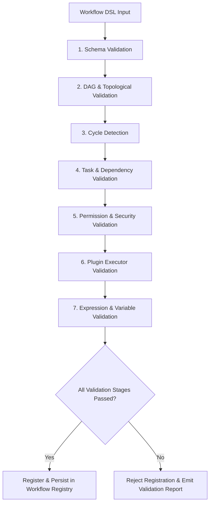

### Validation Stage Summary

1. **Schema Validation**: Ensures YAML/JSON adheres to the Workflow DSL JSON Schema.
2. **DAG & Topological Validation**: Verifies task dependency graph structure and root/leaf node presence.
3. **Cycle Detection**: Applies Tarjan's strongly connected components algorithm to guarantee no circular task dependencies exist.
4. **Task & Dependency Validation**: Confirms every referenced `depends_on` task ID exists in the definition.
5. **Permission & Security Validation**: Verifies that the registering principal has authorization for the specified namespace and task types.
6. **Plugin Executor Validation**: Validates that all custom `PLUGIN_TASK` types are actively registered in the `ITaskExecutor` registry.
7. **Expression & Variable Validation**: Parses all template expressions (`{{...}}`) for syntax validity and scope availability.

---

## 7. Workflow Execution Planner

The **Workflow Execution Planner** compiles validated Workflow Definitions into executable **Execution Plans** represented as optimized Directed Acyclic Graphs (DAGs).

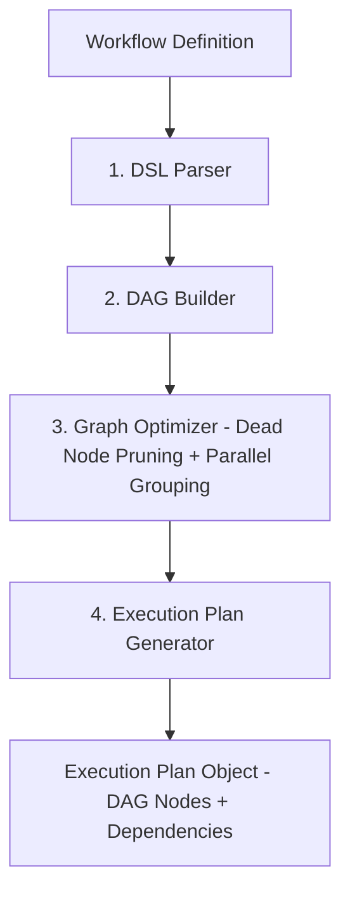

### Planner Responsibilities
- **Dependency Resolution**: Performs topological sorting to establish strict task execution order.
- **Parallel Group Identification**: Group independent task nodes into parallel execution tiers.
- **Expression Pre-Compilation**: Pre-compiles Jinja2/JMESPath runtime variable expressions into executable ASTs.
- **Dead-Node Pruning**: Strips unreachable branches based on static condition analysis.

---

## 8. Workflow Registry Architecture

The **Workflow Registry** is the central catalog and storage authority for all Workflow Definitions across all tenants and domain plugins.

```
+-----------------------------------------------------------------------------------+
|                        WORKFLOW REGISTRY ARCHITECTURE                             |
+-----------------------------------------------------------------------------------+
|  Plugin Registration API / Admin Console / CI/CD Pipeline                         |
|                             |                                                     |
|                             v                                                     |
|  [ IWorkflowRegistry Port ] (core/ports/workflow.py)                             |
|                             |                                                     |
|  +--------------------------+--------------------------+                          |
|  |                          |                          |                          |
|  v                          v                          v                          |
| [Registry Manager]       [Version Catalog]          [Audit History]               |
|  - Registration          - Active version lookup     - Definition change log       |
|  - Activation            - Rollback management      - Approval records            |
|  - Deprecation           - Compatibility matrix                                   |
|                             |                                                     |
|                             v                                                     |
|  [ Definition Store ] (PostgreSQL / Document DB)                                  |
+-----------------------------------------------------------------------------------+
```

---

## 9. Plugin Workflow Registration Lifecycle

Domain plugins register their workflow definitions, task types, triggers, schedules, and compensation handlers during plugin initialization via the `NeuroFlowPluginContext`.

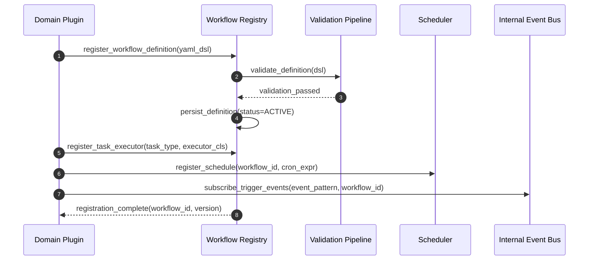

---

## 10. Workflow Versioning Strategy

Workflows evolve over time. NeuroFlow AI enforces a strict, zero-downtime **Workflow Versioning Strategy**.

```
+-----------------------------------------------------------------------------------+
|                     WORKFLOW VERSIONING STRATEGY                                  |
+-----------------------------------------------------------------------------------+
|                                                                                   |
|  1. SEMANTIC VERSIONING:                                                          |
|     Workflow Definitions carry MAJOR.MINOR.PATCH versions.                        |
|     - MAJOR: Breaking task interface or variable schema change.                   |
|     - MINOR: Additive new tasks or optional parameters.                          |
|     - PATCH: Bug fixes or non-structural expression updates.                       |
|                                                                                   |
|  2. RUNNING INSTANCE IMMUTABILITY:                                                |
|     Once a workflow instance is triggered, it locks to the EXACT workflow        |
|     definition version active at instance creation time. System updates never     |
|     mutate running instance DAGs in-flight.                                       |
|                                                                                   |
|  3. ACTIVE VERSION ROUTING:                                                        |
|     The Workflow Registry maintains one ACTIVE version per workflow_id.           |
|     New triggers automatically instantiate the current ACTIVE version.            |
|                                                                                   |
|  4. ROLLBACK & MIGRATION:                                                         |
|     Administrators can instantly switch the ACTIVE version to a prior version.   |
|     In-flight instances continue executing their locked definition to completion.  |
+-----------------------------------------------------------------------------------+
```

---

## 11. Workflow Lifecycle

Every workflow instance progresses through a deterministic lifecycle:

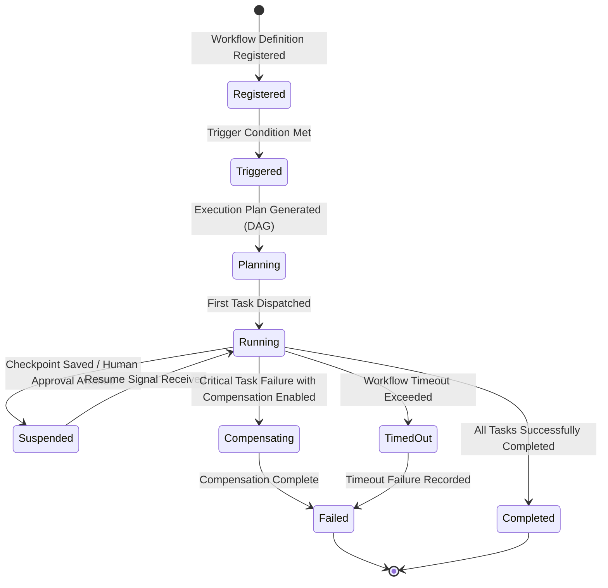

### Lifecycle Stage Definitions

| State | Description |
| :--- | :--- |
| **Registered** | Workflow Definition stored in the Workflow Registry. Not yet executing. |
| **Triggered** | A trigger condition (event, schedule, API call, or manual invocation) has created a new workflow instance. |
| **Planning** | The Workflow Planner constructs the execution DAG and validates all task dependencies and input schemas. |
| **Running** | One or more tasks are actively executing. The Execution Engine is dispatching work. |
| **Suspended** | Execution is paused. Caused by a Human Approval step awaiting input, or a Checkpoint save during a long-running workflow. |
| **Compensating** | A critical task has failed. The Compensation Engine is executing registered rollback tasks in reverse dependency order (Saga pattern). |
| **TimedOut** | The workflow's `timeout_minutes` was exceeded before completion. |
| **Completed** | All tasks have reached a terminal `SUCCEEDED` state. Output artifacts are available. |
| **Failed** | The workflow has reached a terminal failure state after exhausting all retries and compensation steps. |

---

## 12. Workflow State Machine

The Workflow State Machine governs valid state transitions at the **workflow instance level**:

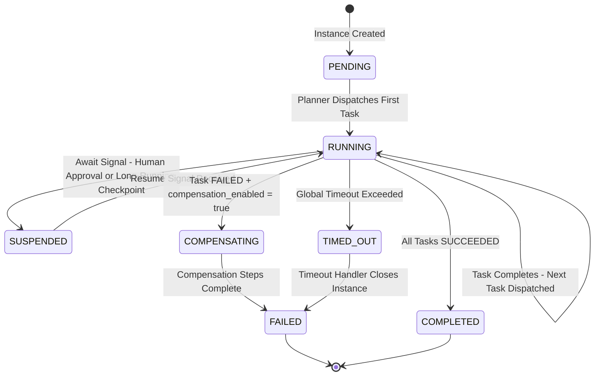

### Invalid Transition Rules

- `COMPLETED → RUNNING`: Forbidden. Completed instances are immutable.
- `FAILED → RUNNING`: Forbidden. A failed instance cannot be resumed. A new instance must be triggered.
- `COMPENSATING → RUNNING`: Forbidden. Compensation always leads to `FAILED`.
- `SUSPENDED → COMPENSATING`: Only possible if the suspension timeout expires and `timeout_action = COMPENSATE`.

---

## 13. Task Abstraction

Every unit of work within a workflow is represented as a **Task**. Tasks are the atomic execution units of the Workflow Engine. Each task has a type, an input/output schema, a lifecycle state, and optional retry and compensation configurations.

### 13.1 Task Schema

```json
{
  "task_id": "t3",
  "workflow_instance_id": "wi-uuid-9b1a-22ef",
  "task_type": "AGENT_EXECUTION",
  "status": "RUNNING",
  "inputs": {
    "context": "<subgraph-payload>",
    "agent_id": "rca-agent-v2"
  },
  "output": null,
  "retry_count": 0,
  "max_retries": 3,
  "started_at": "2026-08-03T10:00:00.000Z",
  "completed_at": null,
  "timeout_seconds": 300,
  "compensation_task_id": "t3_compensate",
  "worker_id": "worker-uuid-4a11"
}
```

### 13.2 Task State Machine

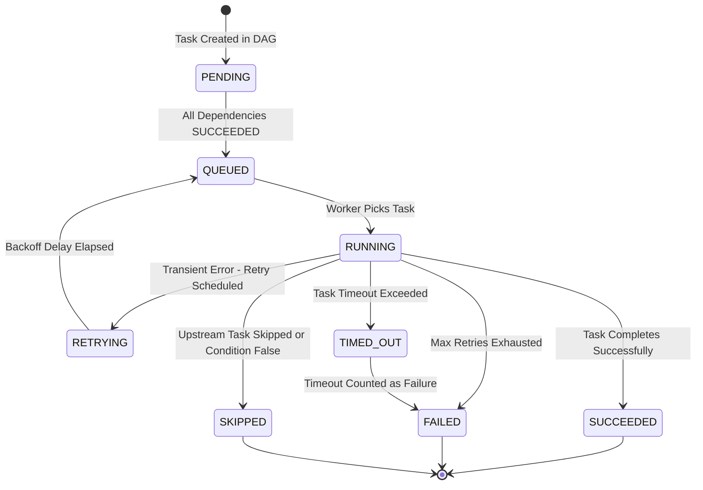

### 13.3 Platform Task Types

| Task Type | Description | Platform Capability Invoked |
| :--- | :--- | :--- |
| `KB_RETRIEVAL` | Retrieve relevant document chunks from the Knowledge Base. | Knowledge Base Retrieval Engine |
| `GRAPH_TRAVERSAL` | Execute an entity traversal query on the Knowledge Graph. | Knowledge Graph Traversal Engine |
| `AGENT_EXECUTION` | Invoke an AI Agent for reasoning, analysis, or action execution. | Agent Runtime |
| `MEMORY_READ` | Read episodic, semantic, procedural, or working memory. | Memory Layer |
| `MEMORY_WRITE` | Persist new memories or update existing memory records. | Memory Layer |
| `EVENT_PUBLISH` | Publish an event to the Internal Event Bus. | Internal Event Bus |
| `HUMAN_APPROVAL` | Suspend workflow and await human operator approval. | Platform Notification Service |
| `CONDITION_BRANCH` | Evaluate a boolean expression to determine execution branch. | Workflow Execution Engine |
| `PARALLEL_JOIN` | Wait for all upstream parallel task branches to complete. | Workflow Execution Engine |
| `PLUGIN_TASK` | Execute a domain-specific task registered by a plugin. | Plugin Executor Registry |
| `HTTP_CALL` | Execute an outbound HTTP request to an external system. | External Adapter |
| `TRANSFORM` | Apply a data transformation function to task output. | Workflow Execution Engine |
| `DELAY` | Introduce a configurable time delay before the next task. | Workflow Scheduler |

---

## 14. Workflow Execution Modes

The Workflow Engine supports six distinct execution modes tailored to enterprise application requirements:

| Execution Mode | Behavior | Use Case |
| :--- | :--- | :--- |
| **Synchronous** | Caller blocks until the entire workflow completes; returns final output payload immediately. | Real-time REST API requests, interactive queries. |
| **Asynchronous** | Immediate receipt returning `instance_id`; execution runs in worker pool; caller polls or awaits event. | Standard multi-step batch background jobs. |
| **Detached** | Fire-and-forget; no result tracked for caller; error events emitted to DLQ on failure. | Asynchronous logging, audit archiving, telemetry ingestion. |
| **Scheduled** | Timer-driven instantiation managed by Workflow Scheduler. | Daily summaries, nightly database maintenance. |
| **Event-Driven** | Initiated automatically by Event Bus pattern matching. | Auto-remediation on network alarm event. |
| **Streaming** | Task outputs emitted progressively as Server-Sent Events (SSE) or WebSocket streams. | Real-time AI agent chain-of-thought progress updates. |

---

## 15. Sequential Execution

Sequential execution is the foundational execution pattern. Tasks are dispatched one after another, where each task receives the output of the preceding task as part of its input context.

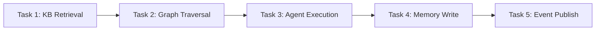

**Execution guarantees:**
- Task N+1 is never dispatched until Task N has reached `SUCCEEDED` state.
- Task N+1 receives the complete output payload of Task N.
- If Task N reaches `FAILED`, Task N+1 transitions directly to `SKIPPED` and the workflow transitions to `COMPENSATING` (if enabled) or `FAILED`.

---

## 16. Parallel Execution

Tasks with no dependency relationship between them are eligible for parallel execution. The Workflow Planner identifies independent task sets in the execution DAG and dispatches them concurrently to the Task Executor Pool.

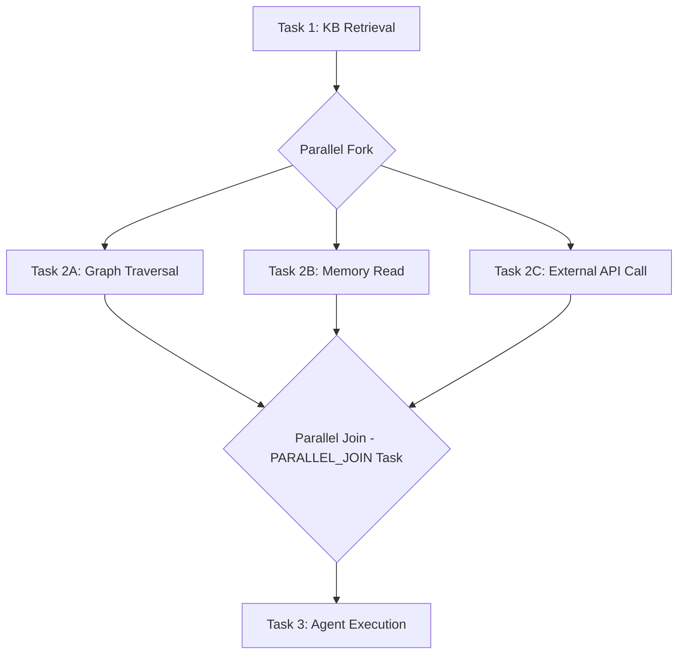

**Parallel execution guarantees:**
- All branches in a parallel fork are dispatched simultaneously.
- The `PARALLEL_JOIN` task does not proceed until **all** upstream parallel tasks have reached `SUCCEEDED` state (configurable: `ALL` or `ANY` join mode).
- If any branch reaches `FAILED` in `ALL` join mode, the entire parallel group is failed and compensation begins.
- In `ANY` join mode, the join proceeds on the first `SUCCEEDED` branch; remaining branches are cancelled.

---

## 17. Conditional Branching

Conditional branching enables the Workflow Engine to select an execution path at runtime based on the output of a preceding task.

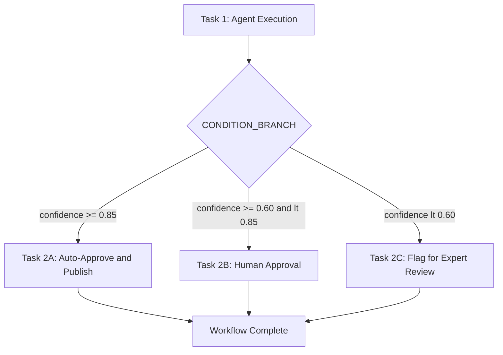

**Condition evaluation rules:**
- Conditions are evaluated by the `CONDITION_BRANCH` task executor immediately upon upstream task completion.
- Exactly one branch path is selected per evaluation. All non-selected branches transition to `SKIPPED`.
- Conditions may reference: task outputs (`{{t1.output.confidence}}`), workflow inputs (`{{inputs.threshold}}`), and system context (`{{context.tenant_id}}`).
- An `else` fallback branch is required in all conditional definitions to prevent undefined execution paths.

---

## 18. Dynamic Workflow Generation

Static workflow definitions cannot anticipate all execution requirements at design time. The Workflow Engine supports **dynamic sub-workflow generation**:

```
+-----------------------------------------------------------------------------------+
|                        DYNAMIC WORKFLOW GENERATION                                |
+-----------------------------------------------------------------------------------+
|                                                                                   |
|  Pattern 1: DYNAMIC TASK FAN-OUT                                                  |
|  - A TRANSFORM task computes the list of items to process at runtime.            |
|  - The Workflow Planner dynamically generates one task per item.                  |
|  - All dynamically generated tasks are executed in parallel.                     |
|  - A PARALLEL_JOIN task collects all results.                                    |
|                                                                                   |
|  Pattern 2: SUB-WORKFLOW INVOCATION                                               |
|  - A parent workflow task invokes a child workflow definition by ID.              |
|  - The parent workflow suspends until the child workflow reaches COMPLETED.       |
|  - The child workflow's output is passed to the parent as the task output.        |
|                                                                                   |
|  Pattern 3: PLUGIN-DEFINED TASK EXPANSION                                         |
|  - A plugin registers a task that, at execution time, expands into multiple       |
|    platform tasks based on its runtime input data.                               |
|  - Example: A Cybersecurity plugin "Threat Hunt" task dynamically generates      |
|    one IOC scan task per unique threat indicator in the input feed.               |
+-----------------------------------------------------------------------------------+
```

---

## 19. Nested Workflows (Parent / Child)

Workflows can invoke other workflows as sub-routines via the `SUB_WORKFLOW` task type.

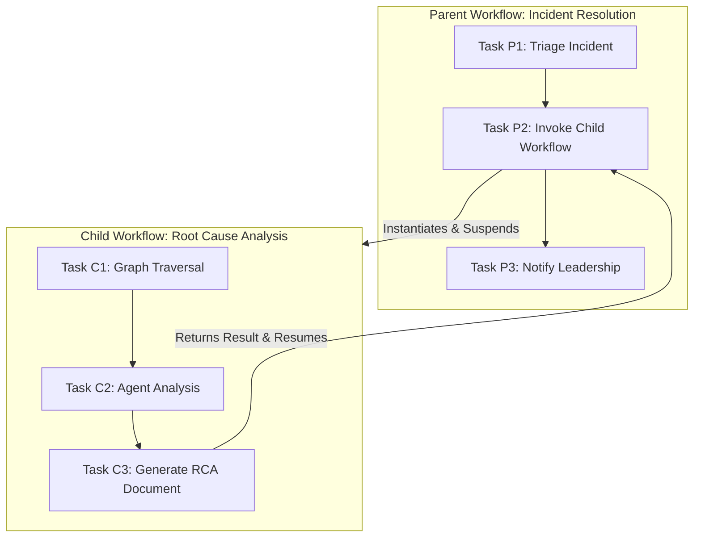

### Nested Workflow Execution Guarantees
- **Parent Suspension**: The parent workflow transitions to `SUSPENDED` while the child workflow runs.
- **Context Inheritance**: Parent inputs/variables can be mapped explicitly into child inputs.
- **Failure Propagation**: If child workflow reaches `FAILED`, the parent task fails, initiating parent-level retries or Saga compensation.
- **Recursion Guard**: Stack depth limit enforced (default max depth: 5) to prevent infinite recursive invocation.

---

## 20. Workflow Templates & Parameterized Instantiation

To promote reuse across plugins, the Workflow Engine supports **Workflow Templates** — parameterized workflow definitions with template variables that are instantiated with concrete bindings at runtime.

```yaml
template:
  id: "tpl-standard-agent-approval"
  name: "Standard AI Agent + Human Approval Template"
  parameters:
    - name: "agent_id"
      type: "string"
    - name: "approval_role"
      type: "string"

  tasks:
    - id: "t1"
      type: "AGENT_EXECUTION"
      inputs:
        agent_id: "${parameters.agent_id}"
    - id: "t2"
      type: "HUMAN_APPROVAL"
      depends_on: ["t1"]
      assignee_roles: ["${parameters.approval_role}"]
```

Plugins inherit from templates via `extends: "tpl-standard-agent-approval"` and supply concrete parameter values, ensuring platform-wide standardization of approval and auditing flows.

---

## 21. Human-in-the-Loop Approval Steps

Enterprise AI workflows frequently require human review before consequential actions are taken. The Workflow Engine provides first-class `HUMAN_APPROVAL` task support.

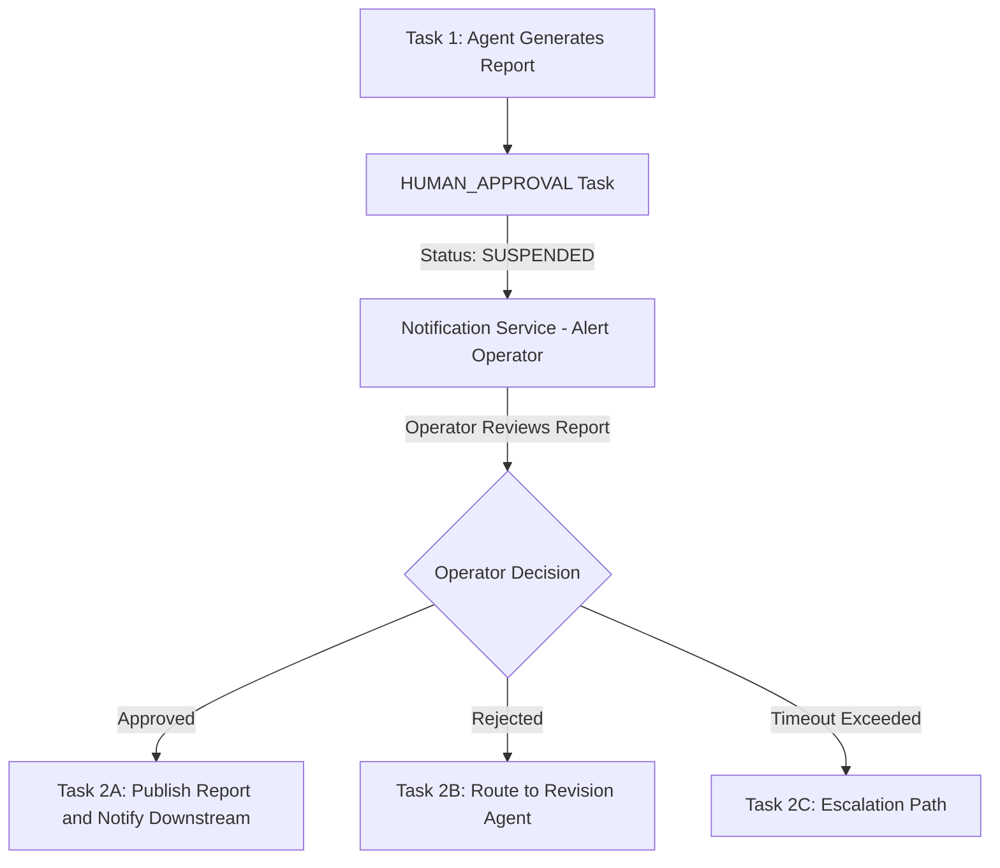

### Human Approval Task Properties

| Property | Description |
| :--- | :--- |
| `assignee_roles` | List of RBAC roles authorized to approve or reject. |
| `notification_channels` | Where to deliver the approval request (email, webhook, platform UI). |
| `timeout_minutes` | Maximum time to wait for a human response before auto-action. |
| `timeout_action` | What to do on timeout: `ESCALATE`, `AUTO_APPROVE`, `AUTO_REJECT`, or `COMPENSATE`. |
| `approval_payload` | The structured data payload presented to the human reviewer. |

---

## 22. Workflow Execution Context & Variable Scoping

The **Workflow Execution Context** is the isolated runtime container that holds tenant, user, trace, security, and variable state for a specific workflow instance.

```
+-----------------------------------------------------------------------------------+
|                        WORKFLOW EXECUTION CONTEXT                                 |
+-----------------------------------------------------------------------------------+
|  1. TENANT & SECURITY CONTEXT                                                     |
|     - tenant_id, organization_id, security_clearance_level, auth_token_scope      |
|                                                                                   |
|  2. TRACE CONTEXT                                                                 |
|     - trace_id, parent_span_id, correlation_id                                   |
|                                                                                   |
|  3. VARIABLE SCOPES                                                               |
|     - Global Variables: System-wide read-only environment variables.              |
|     - Input Variables: Read-only parameters supplied at trigger time.             |
|     - Local Variables: Mutable task-to-task workspace variables.                 |
|     - Output Variables: Published workflow results upon completion.               |
|     - Temporary Variables: Task-scoped scratchpad variables auto-purged on exit.  |
|                                                                                   |
|  4. EXPRESSION EVALUATION ENGINE                                                  |
|     - Evaluates Jinja2 / JMESPath expressions against variable scopes safely.    |
+-----------------------------------------------------------------------------------+
```

---

## 23. Retry Strategies

Transient failures must never require manual operator intervention. The Workflow Engine supports three configurable retry strategies, applicable at both workflow and individual task level.

### 23.1 Retry Strategy Types

| Strategy | Description | Use Case |
| :--- | :--- | :--- |
| **Fixed Interval** | Retry after a fixed delay on every attempt. | Low-latency, low-stakes tasks where simple repetition is sufficient. |
| **Exponential Backoff** | Retry delay doubles on each attempt (e.g., 10s, 20s, 40s, 80s). | Network calls, external API rate limits. |
| **Exponential Backoff + Jitter** | Exponential backoff with randomized jitter per attempt to prevent retry storms when many parallel tasks fail simultaneously. | High-concurrency parallel task sets. |

### 23.2 Retry Configuration Schema

```json
{
  "retry_policy": {
    "max_attempts": 3,
    "backoff": "EXPONENTIAL_BACKOFF_JITTER",
    "initial_delay_seconds": 10,
    "max_delay_seconds": 120,
    "retryable_error_types": ["TRANSIENT_ERROR", "TIMEOUT", "RATE_LIMIT"]
  }
}
```

### 23.3 Non-Retryable Failures

The following failure types are classified as **non-retryable** and immediately transition the task to `FAILED`:
- `SCHEMA_VALIDATION_ERROR` — Task input does not conform to the declared schema.
- `AUTHORIZATION_ERROR` — Task caller lacks required permissions.
- `ONTOLOGY_ERROR` — Graph task references an invalid entity type.
- `BUSINESS_RULE_VIOLATION` — Plugin-defined business rule explicitly rejected the task execution.

---

## 24. Compensation (Saga Pattern)

For workflows that perform a sequence of state-changing operations across multiple platform capabilities, a single task failure may leave the platform in an inconsistent intermediate state. The **Saga Pattern** provides distributed compensation.

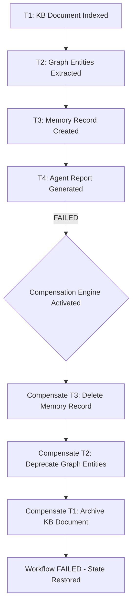

### Compensation Design Rules

1. Every state-changing task that participates in compensation must register a **compensation task** — a corresponding task definition that undoes the original task's effect.
2. Compensation tasks are executed in **reverse dependency order** — the last completed task is compensated first.
3. Read-only tasks (e.g., `KB_RETRIEVAL`, `GRAPH_TRAVERSAL`) do not require compensation tasks.
4. Compensation tasks must be **idempotent** — safe to execute multiple times without additional side effects.
5. If a compensation task itself fails after exhausting retries, a `COMPENSATION_FAILED` alert is published and the operation is routed to the Dead Letter Queue for manual resolution.

---

## 25. Timeout Handling

### 25.1 Task-Level Timeout

Each task carries a `timeout_seconds` property. If a task does not complete within this window, the Workflow Engine signals the executing worker to abort, transitions the task to `TIMED_OUT` → `FAILED`, and applies the task-level retry policy.

### 25.2 Workflow-Level Timeout

Every workflow instance carries a `timeout_minutes` property. If exceeded:
1. All currently `RUNNING` tasks receive abort signals.
2. The workflow transitions to `TIMED_OUT` → `FAILED`.
3. If `compensation_enabled = true`, the Compensation Engine activates for all completed tasks.
4. `neuroflow.workflow.timed_out` is published to the Internal Event Bus.

### 25.3 Human Approval Timeout

`HUMAN_APPROVAL` tasks carry an independent `timeout_minutes` property. On timeout, the configured `timeout_action` is executed:
- `ESCALATE`: Notify a higher-authority role and extend the timeout window.
- `AUTO_APPROVE`: Proceed as if approved (use only where organisational policy permits).
- `AUTO_REJECT`: Proceed as if rejected.
- `COMPENSATE`: Immediately activate the Compensation Engine.

---

## 26. Long-Running Workflows

Long-running workflows span extended time periods — hours, days, or longer — and must survive platform restarts, infrastructure failures, and maintenance windows.

```
+-----------------------------------------------------------------------------------+
|                     LONG-RUNNING WORKFLOW EXECUTION MODEL                         |
+-----------------------------------------------------------------------------------+
|                                                                                   |
|  1. CHECKPOINT ON SUSPEND:                                                        |
|     Before transitioning to SUSPENDED, a complete checkpoint of the workflow      |
|     instance state is written to the Checkpoint Store. This includes: current     |
|     task statuses, all task outputs, workflow context, and DAG position.          |
|                                                                                   |
|  2. DURABLE SUSPENSION:                                                           |
|     A SUSPENDED workflow instance consumes no worker threads or CPU resources.   |
|     Only its state record in the State Manager persists.                         |
|                                                                                   |
|  3. WAKE-UP SIGNAL:                                                               |
|     The workflow resumes only when a resume signal is received:                  |
|     - Human approval decision arrives.                                           |
|     - External system callback webhook is received.                              |
|     - Scheduled timer fires.                                                     |
|     - Event Bus delivers a subscribed event.                                     |
|                                                                                   |
|  4. STATE RESTORATION:                                                            |
|     On resume, the Checkpoint Store is read. The Execution Engine restores the   |
|     workflow to its exact pre-suspension state and continues from the next task.  |
|                                                                                   |
|  5. RESTART RESILIENCE:                                                           |
|     If the platform restarts while workflows are RUNNING, all in-flight          |
|     instances are recovered from the State Manager on startup. Tasks that were   |
|     RUNNING are re-queued for execution.                                         |
+-----------------------------------------------------------------------------------+
```

---

## 27. Scheduling Architecture

The **Scheduler** is a sub-component of the Workflow Engine that manages time-based workflow triggering. It is not an external scheduler — it is a first-class platform capability.

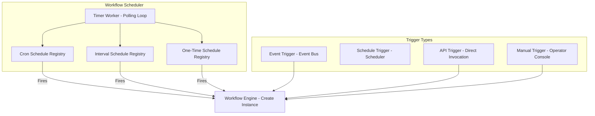

### Schedule Definition Schema

```json
{
  "schedule_id": "sched-uuid-5c2e",
  "workflow_id": "wf-uuid-7a3f-11ef",
  "schedule_type": "CRON",
  "cron_expression": "0 6 * * *",
  "timezone": "Europe/Berlin",
  "input_template": { "alarm_window_hours": 24 },
  "active": true,
  "tenant_id": "tenant-enterprise-01"
}
```

---

## 28. Queue Integration

The Workflow Engine uses a durable **Task Queue** to decouple task dispatch from task execution.

```
+-----------------------------------------------------------------------------------+
|                        TASK QUEUE ARCHITECTURE                                    |
+-----------------------------------------------------------------------------------+
|  Execution Engine                                                                 |
|       |  Task Dispatch                                                            |
|       v                                                                           |
|  [ ITaskQueue Port ] (core/ports/workflow.py)                                     |
|       |                                                                           |
|  +----+------+----------+                                                         |
|  |           |          |                                                         |
|  v           v          v                                                         |
| [Redis      [Kafka    [In-Memory                                                  |
|  Queue]      Queue]    Queue - Testing]                                           |
|       |  Task Consumed                                                            |
|       v                                                                           |
|  Task Executor Pool (Worker Fleet)                                                |
+-----------------------------------------------------------------------------------+
```

---

## 29. Workflow Persistence Architecture

The Workflow Engine relies on five distinct storage abstractions to guarantee state persistence, historical auditability, and crash recovery.

```
+-----------------------------------------------------------------------------------+
|                   WORKFLOW PERSISTENCE ARCHITECTURE                               |
+-----------------------------------------------------------------------------------+
|                                                                                   |
|  1. DEFINITION STORE (PostgreSQL / Document Store):                               |
|     Stores all registered Workflow Definitions, versions, and templates.          |
|                                                                                   |
|  2. EXECUTION STORE (PostgreSQL / Relational DB):                                 |
|     Stores workflow instance records, inputs, status, timing, and outputs.        |
|                                                                                   |
|  3. STATE STORE (Redis / In-Memory Cache):                                        |
|     Fast, transient state storage for active task queues and worker locks.        |
|                                                                                   |
|  4. CHECKPOINT STORE (Redis / Blob Storage / S3):                                 |
|     Durable snapshots of suspended long-running workflow instance contexts.       |
|                                                                                   |
|  5. HISTORY & AUDIT STORE (Append-Only Event Store / Search Index):               |
|     Immutable log of all state transitions, task attempts, and human approvals.   |
+-----------------------------------------------------------------------------------+
```

---

## 30. Event Bus Integration

**Published Events** (outbound):
- `neuroflow.workflow.instance_created`: New workflow instance triggered.
- `neuroflow.workflow.task_succeeded`: A task has completed successfully.
- `neuroflow.workflow.task_failed`: A task has failed after exhausting retries.
- `neuroflow.workflow.instance_completed`: Workflow has reached `COMPLETED` terminal state.
- `neuroflow.workflow.instance_failed`: Workflow has reached `FAILED` terminal state.
- `neuroflow.workflow.timed_out`: Workflow or task timeout was exceeded.
- `neuroflow.workflow.approval_requested`: A `HUMAN_APPROVAL` task is awaiting operator input.
- `neuroflow.workflow.compensation_activated`: Saga compensation has been initiated.

**Subscribed Events** (inbound):
- Any event matching a workflow's `trigger.event_pattern` — triggers a new workflow instance.
- `neuroflow.system.started` — triggers Workflow Registry initialization and schedule loading.
- `neuroflow.plugin.loaded` — registers plugin-defined workflow definitions and task types.

---

## 31. Memory Layer Integration

```
+-----------------------------------------------------------------------------------+
|              WORKFLOW ENGINE & MEMORY LAYER INTEGRATION                           |
+-----------------------------------------------------------------------------------+
|  WORKFLOW → MEMORY WRITE:                                                         |
|  - After successful agent execution, the workflow writes agent output as an      |
|    Episodic memory record.                                                        |
|  - After human approval, the approval decision is written as a Semantic memory   |
|    record for future retrieval.                                                  |
|  - Procedural skills discovered during execution are written to Procedural        |
|    memory for reuse in future agent invocations.                                 |
|                                                                                   |
|  WORKFLOW → MEMORY READ:                                                          |
|  - At workflow start, a MEMORY_READ task retrieves prior episodic context for    |
|    the same entity or domain, enriching agent reasoning context.                 |
|  - Working memory is used as the shared execution context store within a         |
|    running workflow instance, enabling tasks to share intermediate results.       |
+-----------------------------------------------------------------------------------+
```

---

## 32. Knowledge Base Integration

The Workflow Engine integrates with the Knowledge Base through the `KB_RETRIEVAL` task type:

- A `KB_RETRIEVAL` task dispatches a hybrid (vector + keyword) retrieval query to the Knowledge Base and returns the top-K ranked chunks as the task output.
- The retrieved chunks are passed as context to subsequent `AGENT_EXECUTION` tasks.
- The Knowledge Base publishes `neuroflow.rag.document_ingested` events that may trigger workflow instances (event-driven workflow trigger pattern).
- Workflow tasks may trigger document ingestion into the Knowledge Base via `PLUGIN_TASK` types.

---

## 33. Knowledge Graph Integration

The Workflow Engine integrates with the Knowledge Graph through the `GRAPH_TRAVERSAL` task type:

- A `GRAPH_TRAVERSAL` task accepts a `GraphQuerySpec` and returns a serialized subgraph (entities + reasoning paths) as the task output.
- The subgraph result is passed to subsequent `AGENT_EXECUTION` tasks as Graph-RAG context.
- The Knowledge Graph publishes `neuroflow.graph.entities_extracted` events that may serve as workflow triggers.
- Workflow tasks may update the Knowledge Graph (via `PLUGIN_TASK`) after agent analysis produces new entity or relationship evidence.

---

## 34. Agent Runtime Integration

The Workflow Engine integrates with the Agent Runtime through the `AGENT_EXECUTION` task type:

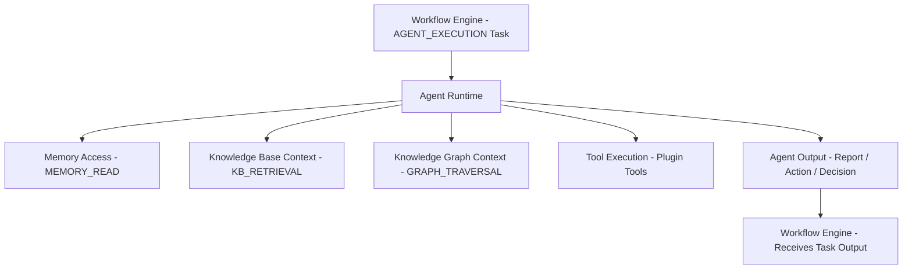

### Agent Execution Task Properties

| Property | Description |
| :--- | :--- |
| `agent_id` | The identifier of the registered agent definition to invoke. |
| `agent_inputs` | Typed input payload passed to the agent's reasoning context. |
| `max_reasoning_steps` | Maximum number of reasoning loop iterations before the agent must return a result. |
| `timeout_seconds` | Maximum execution time for the entire agent reasoning session. |
| `output_schema` | Expected output schema; used for validation before passing result to next task. |

---

## 35. Plugin Execution Model

Domain plugins participate in the Workflow Engine through three integration mechanisms:

```
+-----------------------------------------------------------------------------------+
|                       PLUGIN EXECUTION MODEL                                      |
+-----------------------------------------------------------------------------------+
|  1. WORKFLOW DEFINITION REGISTRATION:                                             |
|     context.workflow.register_definition(workflow_definition)                     |
|                                                                                   |
|  2. TASK TYPE REGISTRATION:                                                       |
|     context.workflow.register_task_type(                                          |
|       type_id       = "TELECOM_ALARM_ANALYSIS",                                   |
|       executor      = TelecomAlarmAnalysisExecutor,                              |
|       namespace     = "telecom",                                                  |
|       input_schema  = AlarmAnalysisInput,                                        |
|       output_schema = AlarmAnalysisOutput                                        |
|     )                                                                             |
|                                                                                   |
|  3. SCHEDULE REGISTRATION:                                                        |
|     context.workflow.register_schedule(                                           |
|       workflow_id     = "wf-alarm-daily-summary",                                |
|       cron_expression = "0 7 * * *",                                             |
|       timezone        = "UTC"                                                    |
|     )                                                                             |
+-----------------------------------------------------------------------------------+
```

Plugin task executors must conform to the `ITaskExecutor` port interface. The Workflow Engine never imports domain plugin code directly, maintaining strict Clean Architecture boundaries.

---

## 36. Checkpointing and Resumability

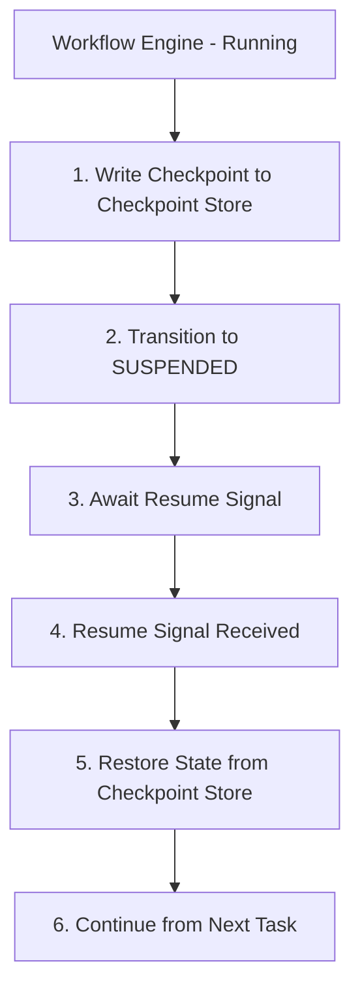

### Checkpoint Record Schema

```json
{
  "checkpoint_id": "cp-uuid-3b7a",
  "workflow_instance_id": "wi-uuid-9b1a-22ef",
  "workflow_id": "wf-uuid-7a3f-11ef",
  "checkpoint_at": "2026-08-03T11:30:00.000Z",
  "dag_state": {
    "t1": "SUCCEEDED",
    "t2": "SUCCEEDED",
    "t3": "RUNNING",
    "t4": "PENDING",
    "t5": "PENDING"
  },
  "task_outputs": {
    "t1": { "entity_id": "entity-uuid-4a2b" },
    "t2": { "subgraph": "<serialized-subgraph>" }
  },
  "workflow_context": {
    "inputs": { "network_element_id": "NE-SITE44" },
    "tenant_id": "tenant-enterprise-01"
  },
  "resume_condition": "HUMAN_APPROVAL_t4"
}
```

---

## 37. Failure Handling and Recovery

| Failure Type | Detection | Recovery |
| :--- | :--- | :--- |
| **Task Transient Error** | Task executor raises `TRANSIENT_ERROR`. | Apply retry policy. |
| **Task Non-Retryable Error** | Task executor raises a non-retryable exception type. | Immediately transition to `FAILED`; trigger compensation if enabled. |
| **Task Timeout** | Execution exceeds `timeout_seconds`. | Transition to `TIMED_OUT` → `FAILED`; apply retry if timeout is retryable. |
| **Worker Crash** | Worker process terminates without task acknowledgement. | Visibility timeout expires; task re-queued automatically by Task Queue. |
| **Workflow Timeout** | Workflow execution exceeds `timeout_minutes`. | Abort all running tasks; trigger compensation; transition to `TIMED_OUT` → `FAILED`. |
| **Compensation Failure** | Compensation task fails after exhausting retries. | Publish `COMPENSATION_FAILED` event; route to DLQ; alert platform administrator. |
| **Checkpoint Write Failure** | Checkpoint Store write exception. | Retry checkpoint write (3 attempts); log warning; do not block workflow execution. |
| **Schedule Drift** | Scheduler timer fires late due to system load. | Log drift metric; fire trigger immediately; do not skip. |
| **Queue Saturation** | Task Queue exceeds configured backpressure threshold. | Apply backpressure; pause new instance creation for the affected tenant; emit alert. |

---

## 38. Multi-Tenant Execution Isolation

1. **Dedicated Task Queues**: Each tenant has its own task queue namespace. A task from one tenant is never dispatched to a worker serving another tenant.
2. **Resource Quotas**: Per-tenant configurable limits on concurrent running workflow instances, concurrent tasks, and queue depth.
3. **Execution Context Isolation**: Every workflow instance carries `tenant_id`. Task executors receive this context and enforce tenant-scoped access to all platform capabilities.
4. **Checkpoint Isolation**: Checkpoint records are encrypted with per-tenant keys. Cross-tenant checkpoint access is architecturally impossible.
5. **Schedule Isolation**: Scheduled workflows are registered per-tenant. The Scheduler enforces tenant quota limits before firing a new trigger.

---

## 39. Workflow Audit Trail & Compliance

To fulfill SOC2, HIPAA, and ISO27001 regulatory compliance, the Workflow Engine writes all execution state changes to an immutable, append-only **Workflow Audit Trail**.

```json
{
  "audit_event_id": "aud-uuid-9901",
  "workflow_instance_id": "wi-uuid-9b1a-22ef",
  "tenant_id": "tenant-enterprise-01",
  "event_type": "HUMAN_APPROVAL_DECISION",
  "actor": "user-operator-44",
  "timestamp": "2026-08-03T11:45:00.000Z",
  "task_id": "t4",
  "details": {
    "decision": "APPROVED",
    "comments": "RCA report verified against network topology."
  },
  "hash_signature": "sha256:e3b0c44298fc1c149afbf4c8996fb92427ae41e4649b934ca495991b7852b855"
}
```

---

## 40. Workflow Search and Discovery

The **Workflow Search Subsystem** indexes workflow definitions, templates, and execution instances into a search engine index to enable instant discovery across tenant administrative consoles.

### Filter Dimensions
- **By Namespace / Plugin**: `namespace = 'telecom'`
- **By Status**: `status IN ('RUNNING', 'SUSPENDED')`
- **By Tags**: `tags CONTAINS 'RCA'`
- **By Time Window**: `started_at >= NOW() - INTERVAL '24 HOURS'`
- **By Tenant**: `tenant_id = 'tenant-enterprise-01'`

---

## 41. Workflow Dashboard Architecture & SLA Monitoring

The **Workflow Operations Console Architecture** provides real-time visibility into execution health and SLA compliance.

```
+-----------------------------------------------------------------------------------+
|                   WORKFLOW DASHBOARD & SLA MONITORING                             |
+-----------------------------------------------------------------------------------+
|                                                                                   |
|  [ Operational Metrics Engine ] --> OpenTelemetry Prometheus Exporter             |
|                                                                                   |
|  Console Widgets:                                                                 |
|  1. Active Instances Overview (Running / Suspended / Failed / Completed counters) |
|  2. Task Queue Health (Per-tenant queue depth, worker pool saturation %)         |
|  3. SLA Breach Radar (Workflows approaching timeout_minutes thresholds)           |
|  4. Human Approval Queue (Pending approvals grouped by assignee role)              |
|  5. Execution Heatmap (Task type duration latency distribution)                  |
+-----------------------------------------------------------------------------------+
```

---

## 42. Observability and Distributed Tracing

Every workflow instance and every task participates in **distributed tracing** using OpenTelemetry standards.

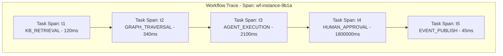

---

## 43. Metrics and Monitoring

The Workflow Engine exports OpenTelemetry-compatible metrics:

| Metric Name | Type | Description |
| :--- | :--- | :--- |
| `neuroflow_workflow_instances_total` | Counter | Total workflow instances created per tenant per workflow ID. |
| `neuroflow_workflow_duration_seconds` | Histogram | End-to-end workflow instance execution duration. |
| `neuroflow_workflow_task_duration_seconds` | Histogram | Per-task-type execution duration. |
| `neuroflow_workflow_task_failures_total` | Counter | Total task failures per task type per tenant. |
| `neuroflow_workflow_retry_total` | Counter | Total task retry attempts. |
| `neuroflow_workflow_compensation_total` | Counter | Total Saga compensation activations. |
| `neuroflow_workflow_queue_depth` | Gauge | Current task queue depth per tenant per priority lane. |
| `neuroflow_workflow_worker_utilization` | Gauge | Fraction of worker pool capacity currently executing tasks. |
| `neuroflow_workflow_approval_pending_total` | Gauge | Total workflow instances awaiting human approval. |
| `neuroflow_workflow_approval_timeout_total` | Counter | Total human approval timeouts. |
| `neuroflow_workflow_schedule_drift_ms` | Histogram | Drift between scheduled trigger time and actual trigger time. |
| `neuroflow_workflow_dlq_depth` | Gauge | Dead Letter Queue depth per tenant. |

---

## 44. Security and Authorization

### 44.1 Workflow Definition Authorization

| Operation | Required Role |
| :--- | :--- |
| Register workflow definition | `WORKFLOW_AUTHOR` |
| Update workflow definition | `WORKFLOW_AUTHOR` |
| Deprecate workflow definition | `WORKFLOW_ADMIN` |
| Delete workflow definition | `PLATFORM_ADMIN` |
| Trigger workflow instance | `WORKFLOW_OPERATOR` or `WORKFLOW_AUTHOR` |

### 44.2 Task Execution Authorization

Every task executed against a platform capability is authorized using the executing workflow instance's **service identity**, not the human user's identity. Workflow service identities are assigned scoped permissions:

| Capability | Permission Required |
| :--- | :--- |
| Knowledge Base retrieval | `KB_READ` scope |
| Knowledge Graph traversal | `GRAPH_READ` scope |
| Memory Layer write | `MEMORY_WRITE` scope |
| Agent Runtime invocation | `AGENT_INVOKE` scope |
| Event Bus publish | `EVENT_PUBLISH` scope |

---

## 45. Repository Placement

```
+-----------------------------------------------------------------------------------+
|                        REPOSITORY PLACEMENT STRATEGY                              |
+-----------------------------------------------------------------------------------+
|  Layer 0 — Core Domain Model (backend/core/)                                      |
|    backend/core/ports/workflow.py                                                 |
|      - IWorkflowRegistry: Workflow definition storage port.                      |
|      - IWorkflowExecutor: Workflow instance execution port.                      |
|      - ITaskExecutor: Task type executor registration port.                      |
|      - ITaskQueue: Task queue abstraction port.                                  |
|      - ICheckpointStore: Checkpoint persistence port.                            |
|      - IWorkflowStateManager: Workflow and task state persistence port.          |
|      - IWorkflowScheduler: Schedule registration and firing port.                |
|                                                                                   |
|  Layer 1 — Technical Infrastructure (backend/infrastructure/)                    |
|    backend/infrastructure/workflow/                                               |
|      - redis_task_queue.py: Redis-backed ITaskQueue adapter.                     |
|      - kafka_task_queue.py: Kafka-backed ITaskQueue adapter.                     |
|      - postgres_state_manager.py: PostgreSQL IWorkflowStateManager adapter.     |
|      - redis_checkpoint_store.py: Redis ICheckpointStore adapter.               |
|      - s3_checkpoint_store.py: S3 ICheckpointStore adapter.                     |
|                                                                                   |
|  Layer 3 — Platform Runtime (backend/workflow_engine/)                           |
|    backend/workflow_engine/                                                       |
|      - dsl/           DSL parsing, schema validation, expression compilation.     |
|      - registry/      Workflow definition storage, versioning, catalog.          |
|      - planner/       DAG construction, dependency resolution, execution plan.   |
|      - validation/    Pre-flight 7-stage validation pipeline.                    |
|      - executor/      Task dispatch, sequential/parallel/conditional logic.      |
|      - scheduler/     Cron/Interval/One-time schedule management.               |
|      - state/         Workflow and task state machine management.               |
|      - context/       Runtime variable evaluation, context isolation.            |
|      - checkpoint/    Checkpoint write, read, and restoration logic.            |
|      - compensation/  Saga pattern rollback orchestration engine.               |
|      - tasks/         Platform task type executors (KB, Graph, Agent, etc.).    |
|      - approval/      Human-in-the-loop approval handler.                       |
|      - audit/         Append-only compliance audit trail logger.                 |
|      - discovery/     Workflow search indexer and query surface.                 |
|      - dashboard/     Operational SLA monitoring metrics exporter.               |
|      - observability/ Distributed trace and metric emission.                    |
+-----------------------------------------------------------------------------------+
```

---

## 46. Clean Architecture Dependency Diagram

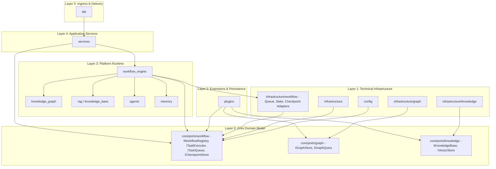

---

## 47. Platform Ecosystem Architecture Diagram

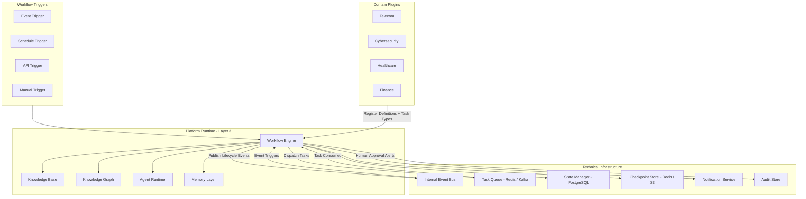

---

## 48. Repository Impact Assessment

### Physical Repository Structure Strategy

| Location | Layer | Contents |
| :--- | :--- | :--- |
| `backend/core/ports/workflow.py` | Layer 0 | Core abstract interface contracts for all workflow components. |
| `backend/infrastructure/workflow/` | Layer 1 | Physical Redis, Kafka, PostgreSQL, S3 storage and queue adapters. |
| `backend/workflow_engine/` | Layer 3 | Full Workflow Engine implementation structured into 16 focused sub-modules. |

### Sub-Module Summary

| Module Path | Purpose |
| :--- | :--- |
| `backend/workflow_engine/dsl/` | Workflow DSL parser, YAML/JSON reader, and Jinja2 expression compiler. |
| `backend/workflow_engine/registry/` | Workflow definition catalog, versioning manager, and registration API. |
| `backend/workflow_engine/planner/` | Execution planner, topological sorter, and DAG optimizer. |
| `backend/workflow_engine/validation/` | 7-Stage Pre-Flight Validation Pipeline. |
| `backend/workflow_engine/executor/` | Task dispatcher, branch evaluator, and sub-workflow orchestrator. |
| `backend/workflow_engine/scheduler/` | Time-based trigger scheduler (cron/interval/one-time). |
| `backend/workflow_engine/state/` | Workflow and task state machines and persistence coordinator. |
| `backend/workflow_engine/context/` | Variable scope isolation, runtime expression evaluation engine. |
| `backend/workflow_engine/checkpoint/` | Checkpoint serializer, resumability reader, state recovery engine. |
| `backend/workflow_engine/compensation/` | Saga pattern rollback orchestrator. |
| `backend/workflow_engine/tasks/` | Built-in platform task type executors (KB, Graph, Agent, Memory, etc.). |
| `backend/workflow_engine/approval/` | Human approval handler, role validation, timeout escalation manager. |
| `backend/workflow_engine/audit/` | Immutable compliance audit logger. |
| `backend/workflow_engine/discovery/` | Workflow search indexer and query provider. |
| `backend/workflow_engine/dashboard/` | Real-time SLA monitoring metrics exporter. |
| `backend/workflow_engine/observability/` | OpenTelemetry distributed trace and metrics emitter. |

---

## 49. ADR Recommendation

This specification establishes **ADR-008: Workflow Engine Architecture** in the project record.

### ADR Summary
- **Title**: ADR-008: Workflow Engine Architecture — Domain-Agnostic Orchestration Engine
- **Status**: Approved
- **Deciders**: Principal Software Architect, Lead Architect
- **Key Decision**: Introduce a domain-agnostic Workflow Engine as the platform's authoritative multi-step execution orchestrator, co-located within **Platform Runtime (Layer 3)** at `backend/workflow_engine/`, with abstract execution and queue ports at `backend/core/ports/workflow.py` and infrastructure adapters at `backend/infrastructure/workflow/`.

---

**End of Workflow Engine Architecture Specification (v12.0.0)**
