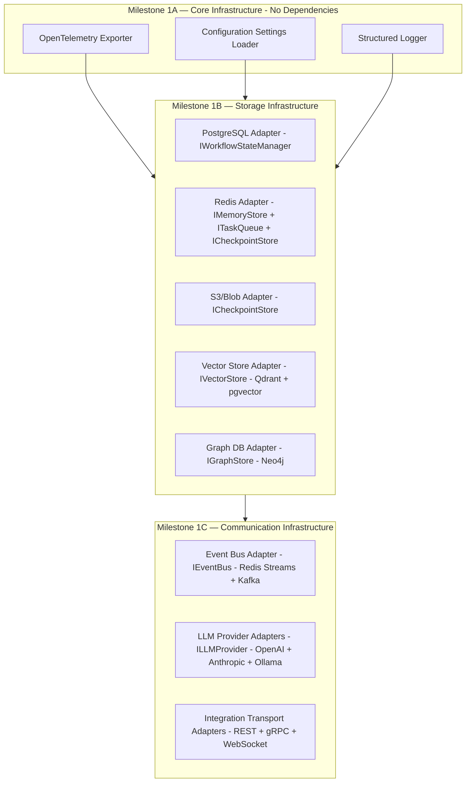
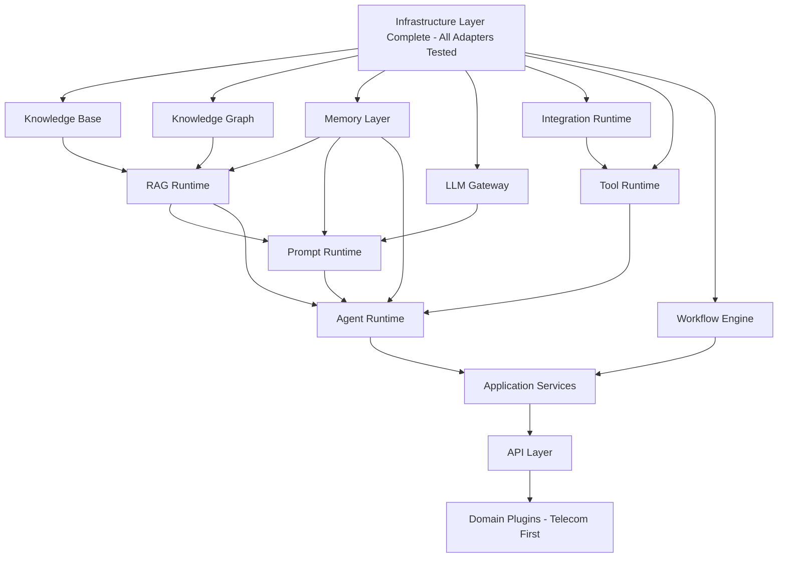
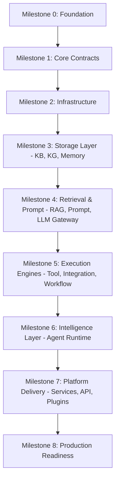
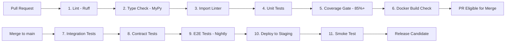
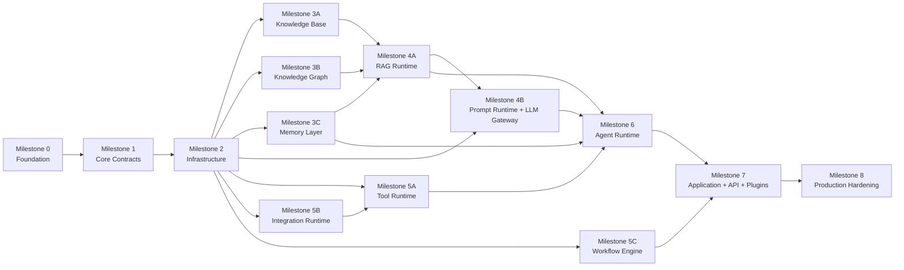
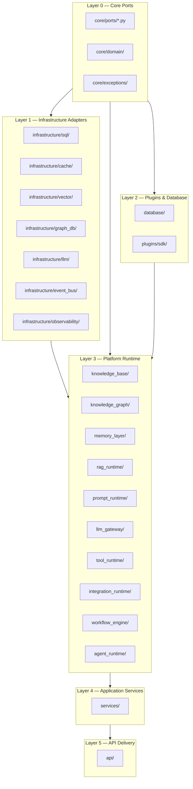

# NeuroFlow AI — Implementation Blueprint

**Document Version:** 1.0.0  
**Status:** Approved Architecture & Engineering Guide  
**Target Audience:** Lead Engineers, Principal Engineers, Backend Engineers, Platform Engineers, DevOps Engineers  
**Classification:** Core Engineering Governance  
**Authored by:** Principal Software Architect  

---

## Executive Summary

This document is the **official Implementation Blueprint** for the NeuroFlow AI platform. It bridges the twelve frozen architecture specifications and the active engineering delivery phase.

The architecture is approved, reviewed (88/100 — GREEN), and implementation-ready with four MUST FIX items that are addressed as the first engineering tasks in this blueprint. This document defines the precise order in which the platform is built, the principles that govern every engineering decision, the testing and operational strategies, and the quality gates that every milestone must pass before the next begins.

NeuroFlow AI is built in **nine implementation milestones (Milestones 0 to 8)** spanning from repository foundation to a full, plugin-extensible AI Operating Platform.

---

## 1. Implementation Philosophy

NeuroFlow AI is built on three governing philosophies that inform every engineering decision:

### 1.1 Interfaces Before Implementations

The **port/adapter contracts** defined at `backend/core/ports/` are the source of truth for all inter-subsystem communication. No Layer 3 runtime module ever imports a concrete infrastructure adapter directly. Every dependency crosses a layer boundary through an abstract interface.

The consequence: the first thing the engineering team builds is not a Redis client or a Postgres query — it is the complete set of `IXxx` port interfaces. Implementations follow, never precede, their contracts.

### 1.2 Build Depth, Not Breadth

At each milestone, the goal is a **fully working vertical slice** of the platform — not a broad horizontal skeleton. Milestone 1 produces a running, tested, linted codebase with core contracts. Milestone 2 produces a running infrastructure layer with tested adapters. Each subsequent milestone adds one complete, production-quality Layer 3 subsystem.

A shallow scaffold across all modules is the fastest path to a platform that works nowhere. The blueprint rejects this approach.

### 1.3 Zero Technical Debt Tolerance in Core Abstractions

The `backend/core/` package is the foundation every other module builds on. Any design compromise at Layer 0 propagates to every consumer. The architectural review's MUST FIX items are resolved before Layer 0 is written. After that, `backend/core/` undergoes Lead Architect review before any implementation module is allowed to import from it.

---

## 2. Development Principles

| Principle | Rule |
| :--- | :--- |
| **Interface-First** | Every module begins with its port definition in `core/`. No implementation file is created before its governing interface. |
| **Dependency Inversion** | Layer 3 runtimes depend on `core/` ports. `infrastructure/` adapters implement `core/` ports. Never the reverse. |
| **Test-First Infrastructure** | Every infrastructure adapter is written with a corresponding integration test using real external services (via Docker Compose). |
| **One Vertical Slice Per Milestone** | Each milestone delivers one complete, production-quality subsystem: port → adapter → runtime module → service → API endpoint → tests. |
| **No Dead Code** | No placeholder implementations, empty stub files, or `# TODO: implement later` in critical paths. |
| **Import Linting from Day 1** | `import-linter` is configured on Day 1 and enforced in CI. Any PR that introduces a layer violation is rejected automatically. |
| **Observability from Day 1** | OpenTelemetry tracing and metrics are wired into the first runtime module and all subsequent modules inherit the pattern. |
| **Feature Flags for Runtime Capabilities** | New Layer 3 subsystems are guarded by feature flags during development. This allows incremental enablement in staging without disrupting the running platform. |
| **Semantic Versioning Enforced** | All public APIs, workflow definitions, tool schemas, prompt templates, and ADRs carry semantic versions from their first commit. |

---

## 3. Repository Bootstrapping Strategy

The very first engineering task resolves the architecture review's MUST FIX #1 (module naming collision) before a single implementation file is created.

### 3.1 Pre-Implementation Governance Tasks (Milestone 0)

These tasks must be completed and approved by the Lead Architect before any Phase 1 engineering begins:

| Task | Owner | Output |
| :--- | :--- | :--- |
| Formal module name resolution (naming ADR) | Principal Architect | `docs/adr/ADR-016-module-naming.md` |
| Formal `IRAGRuntime` and `IPromptRuntime` port confirmation | Principal Architect | Addenda to `docs/architecture/rag-runtime.md`, `docs/architecture/prompt-runtime.md` |
| Agent Runtime → Prompt Runtime delegation clarification | Principal Architect | Addendum to `docs/architecture/agent-runtime.md` |
| Plugin SDK Architecture Specification | Principal Architect | `docs/architecture/plugin-sdk.md` + `docs/adr/ADR-014-plugin-sdk.md` |
| Update Platform Runtime v2.0.0 stale content | Principal Architect | Updated `docs/architecture/platform-runtime.md` |

### 3.2 Canonical Module Names (Resolved)

The following names are formally adopted by this blueprint. All previous references to legacy names are superseded:

| Legacy Name | Canonical Name | Physical Path |
| :--- | :--- | :--- |
| `backend/workflows/` | **`backend/workflow_engine/`** | `backend/workflow_engine/` |
| `backend/agents/` | **`backend/agent_runtime/`** | `backend/agent_runtime/` |
| `backend/rag/` | **`backend/rag_runtime/`** | `backend/rag_runtime/` |
| `backend/ai/` | **`backend/llm_gateway/`** | `backend/llm_gateway/` |

> [!IMPORTANT]
> The existing `backend/workflows/`, `backend/agents/`, `backend/rag/`, and `backend/ai/` directories exist as empty scaffolds in the current repository. They must be renamed before Milestone 1 engineering begins. All README.md content within them must be updated to reflect the canonical names.

### 3.3 Project Tooling Bootstrapping

Before code is written, the following tooling must be configured and committed:

| Tool | Purpose | Configuration File |
| :--- | :--- | :--- |
| **Python 3.12+** | Primary runtime | `pyproject.toml` |
| **UV** | Fast package manager | `pyproject.toml` (UV workspace) |
| **Ruff** | Linting + formatting | `ruff.toml` |
| **MyPy** | Static type checking | `mypy.ini` |
| **import-linter** | Layer boundary enforcement | `.importlinter` |
| **Pytest** | Test runner | `pytest.ini` / `pyproject.toml` |
| **pytest-asyncio** | Async test support | `pyproject.toml` |
| **pytest-cov** | Coverage reporting | `pyproject.toml` |
| **pre-commit** | Git hooks | `.pre-commit-config.yaml` |
| **Docker Compose** | Local infrastructure | `docker/docker-compose.dev.yml` |
| **GitHub Actions** | CI/CD | `.github/workflows/ci.yml` |
| **OpenTelemetry SDK** | Observability | `backend/infrastructure/observability/` |

---

## 4. Folder Creation Order

All folders must be created in the order below. The numbering reflects hard dependencies: a folder at position N may depend on a folder at position < N but never > N.

```
Milestone 0 — Repository Foundation
├── 1.  backend/core/                      ← Layer 0 root
├── 2.  backend/core/ports/                ← All IXxx interface files
├── 3.  backend/core/domain/               ← Domain entities and value objects
├── 4.  backend/core/exceptions/           ← Platform base exceptions
├── 5.  backend/core/events/               ← Domain event types
├── 6.  backend/config/                    ← Configuration settings module
├── 7.  backend/tests/                     ← Test suite root
├── 8.  backend/tests/unit/                ← Unit tests
├── 9.  backend/tests/integration/         ← Integration tests
├── 10. backend/tests/contract/            ← Contract tests
├── 11. backend/tests/e2e/                 ← End-to-end tests
├── 12. backend/tests/fixtures/            ← Shared test fixtures and factories

Milestone 1 — Infrastructure Layer (Layer 1)
├── 13. backend/infrastructure/            ← Infrastructure root
├── 14. backend/infrastructure/event_bus/  ← Event Bus adapters
├── 15. backend/infrastructure/llm/        ← LLM provider adapters
├── 16. backend/infrastructure/vector/     ← Vector store adapters
├── 17. backend/infrastructure/graph_db/   ← Graph database adapters
├── 18. backend/infrastructure/cache/      ← Redis cache adapters
├── 19. backend/infrastructure/storage/    ← S3/Blob storage adapters
├── 20. backend/infrastructure/sql/        ← PostgreSQL adapters
├── 21. backend/infrastructure/workflow/   ← Workflow queue/state adapters
├── 22. backend/infrastructure/observability/ ← OpenTelemetry exporters

Milestone 2 — Data & Plugin Layer (Layer 2)
├── 23. backend/database/                  ← ORM models and migrations
├── 24. backend/plugins/                   ← Plugin root
├── 25. backend/plugins/sdk/               ← Plugin SDK (NeuroFlowPluginContext)
├── 26. backend/plugins/registry/          ← Plugin loader and lifecycle manager

Milestone 3 — Platform Runtime (Layer 3) — Storage Subsystems
├── 27. backend/knowledge_base/            ← Knowledge Base subsystem
├── 28. backend/knowledge_graph/           ← Knowledge Graph subsystem
├── 29. backend/memory_layer/              ← Memory Layer subsystem

Milestone 4 — Platform Runtime (Layer 3) — Retrieval & Prompt
├── 30. backend/rag_runtime/               ← RAG Runtime subsystem
├── 31. backend/prompt_runtime/            ← Prompt Runtime subsystem
├── 32. backend/llm_gateway/               ← LLM model routing subsystem

Milestone 5 — Platform Runtime (Layer 3) — Execution Engines
├── 33. backend/tool_runtime/              ← Tool Runtime subsystem
├── 34. backend/integration_runtime/       ← Integration Runtime subsystem
├── 35. backend/workflow_engine/           ← Workflow Engine subsystem
├── 36. backend/agent_runtime/             ← Agent Runtime subsystem

Milestone 6 — Application & Delivery (Layers 4 & 5)
├── 37. backend/services/                  ← Application use cases
├── 38. backend/api/                       ← FastAPI routes and DTOs
└── 39. backend/plugins/telecom/           ← First domain plugin (reference)
```

---

## 5. Package Creation Order

Each Python package (`__init__.py`) is created in the same order as its folder. The following critical packages carry additional constraints:

| Package | Constraint |
| :--- | :--- |
| `backend.core.ports` | Must be complete and Lead Architect-reviewed before any Layer 3 module imports it. |
| `backend.plugins.sdk` | Must be complete and approved before any domain plugin is written. |
| `backend.infrastructure.*` | Every adapter package must pass integration tests before Layer 3 consumes it. |
| `backend.tests.fixtures` | Must be complete before any integration or e2e tests are written. |

---

## 6. Module Dependency Order

The table below defines the strict module-level dependency graph. A module at row N may only import from modules listed in its "Depends On" column.

| # | Module | Depends On | Must NOT Import |
| :--- | :--- | :--- | :--- |
| 1 | `core.ports` | *(nothing — pure Python ABCs)* | All implementation modules |
| 2 | `core.domain` | `core.ports` | All implementation modules |
| 3 | `core.exceptions` | *(nothing)* | All implementation modules |
| 4 | `core.events` | `core.domain` | All implementation modules |
| 5 | `config` | `core.ports` | `services`, `api`, any runtime |
| 6 | `infrastructure.*` | `core.ports`, `config` | `services`, `api`, any Layer 3 runtime |
| 7 | `database` | `core.ports`, `infrastructure.sql` | `services`, `api`, any Layer 3 runtime |
| 8 | `plugins.sdk` | `core.ports`, `core.domain` | `services`, `api`, any Layer 3 runtime directly |
| 9 | `knowledge_base` | `core.ports`, `infrastructure.vector`, `infrastructure.sql` | `services`, `api`, `agent_runtime` directly |
| 10 | `knowledge_graph` | `core.ports`, `infrastructure.graph_db`, `infrastructure.sql` | `services`, `api`, `agent_runtime` directly |
| 11 | `memory_layer` | `core.ports`, `infrastructure.cache`, `infrastructure.sql` | `services`, `api`, `agent_runtime` directly |
| 12 | `llm_gateway` | `core.ports`, `infrastructure.llm` | `services`, `api` |
| 13 | `rag_runtime` | `core.ports`, `knowledge_base`, `knowledge_graph`, `memory_layer`, `llm_gateway` | `services`, `api`, `agent_runtime` directly |
| 14 | `prompt_runtime` | `core.ports`, `llm_gateway`, `memory_layer`, `rag_runtime` | `services`, `api` |
| 15 | `tool_runtime` | `core.ports`, `integration_runtime`, `infrastructure.*` | `services`, `api`, `agent_runtime` directly |
| 16 | `integration_runtime` | `core.ports`, `infrastructure.*` | `services`, `api`, `agent_runtime` |
| 17 | `workflow_engine` | `core.ports`, `infrastructure.workflow`, `infrastructure.event_bus` | `services`, `api` |
| 18 | `agent_runtime` | `core.ports`, `prompt_runtime`, `tool_runtime`, `rag_runtime`, `memory_layer`, `infrastructure.event_bus` | `services`, `api` |
| 19 | `services` | `core.ports`, all Layer 3 modules via ports | `api` |
| 20 | `api` | `services`, `core.ports`, `config` | All Layer 3 modules directly |
| 21 | `plugins.*` | `plugins.sdk`, `core.ports` | `services`, `api`, Layer 3 directly |

---

## 7. Interface-First Implementation Strategy

Every subsystem is implemented in the following strict order. Skipping any step is a policy violation.

```
Step 1: Write Port Interface
  └── backend/core/ports/<subsystem>.py
      - Abstract class with Python ABCs
      - All method signatures with type annotations
      - Docstrings per method
      - No implementation code

Step 2: Lead Architect Review
  └── PR opened. Interface reviewed before proceeding.

Step 3: Write Domain Entities & Value Objects
  └── backend/core/domain/<subsystem>/
      - Pydantic models or dataclasses
      - Pure domain logic only

Step 4: Write Infrastructure Adapter(s)
  └── backend/infrastructure/<subsystem>/
      - Implements the port interface
      - Concrete technology (Redis, PostgreSQL, etc.)
      - Integration test alongside adapter

Step 5: Write Runtime Module
  └── backend/<runtime_name>/
      - Imports only from core.ports and infrastructure via DI
      - Unit-tested with mocked ports

Step 6: Wire into Dependency Injection Container
  └── backend/config/container.py
      - Register port → adapter binding
      - Feature-flagged if runtime is not yet stable

Step 7: Write Application Service
  └── backend/services/<use_case>.py
      - Uses runtime via injected port only

Step 8: Write API Endpoint
  └── backend/api/v1/<domain>.py
      - FastAPI route calling service
      - OpenAPI schema auto-generated

Step 9: Write E2E Test
  └── backend/tests/e2e/<subsystem>_test.py
      - Full vertical slice from HTTP to storage and back
```

---

## 8. Dependency Injection Strategy

NeuroFlow AI uses a **constructor-injection** model throughout, with a centralized dependency injection (DI) container at `backend/config/container.py`.

### 8.1 DI Container Design

```
+-----------------------------------------------------------------------------------+
|                    DEPENDENCY INJECTION ARCHITECTURE                               |
+-----------------------------------------------------------------------------------+
|  backend/config/container.py                                                       |
|                                                                                   |
|  Container Sections:                                                               |
|  1. INFRASTRUCTURE BINDINGS:                                                       |
|     IVectorStore        → QdrantVectorStoreAdapter | pgvectorAdapter (by env)     |
|     IGraphStore         → Neo4jGraphStoreAdapter                                  |
|     IMemoryStore        → RedisMemoryStoreAdapter                                 |
|     ITaskQueue          → RedisTaskQueueAdapter | KafkaTaskQueueAdapter           |
|     ICheckpointStore    → RedisCheckpointAdapter | S3CheckpointAdapter            |
|     ILLMProvider        → OpenAIAdapter | AnthropicAdapter | OllamaAdapter        |
|     IEventBus           → RedisStreamsEventBusAdapter | KafkaEventBusAdapter      |
|                                                                                   |
|  2. RUNTIME BINDINGS:                                                             |
|     IKnowledgeBase      → KnowledgeBaseService (Layer 3)                          |
|     IKnowledgeGraph     → KnowledgeGraphService (Layer 3)                         |
|     IMemoryLayer        → MemoryLayerService (Layer 3)                            |
|     IRAGRuntime         → RAGRuntimeEngine (Layer 3)                              |
|     IPromptRuntime      → PromptRuntimeEngine (Layer 3)                           |
|     IToolRuntime        → ToolRuntimeEngine (Layer 3)                             |
|     IIntegrationRuntime → IntegrationRuntimeEngine (Layer 3)                     |
|     IWorkflowEngine     → WorkflowEngineService (Layer 3)                        |
|     IAgentRuntime       → AgentRuntimeEngine (Layer 3)                            |
|                                                                                   |
|  3. SERVICE BINDINGS:                                                             |
|     All use-case services receive runtime ports via constructor injection.         |
+-----------------------------------------------------------------------------------+
```

### 8.2 Adapter Selection Policy

All concrete adapter choices are made at application startup through environment variables. No hardcoded adapter names appear in runtime modules.

```
NEUROFLOW_TASK_QUEUE_ADAPTER=redis     → RedisTaskQueueAdapter
NEUROFLOW_VECTOR_STORE_ADAPTER=qdrant  → QdrantVectorStoreAdapter
NEUROFLOW_LLM_PROVIDER=openai          → OpenAILLMProviderAdapter
NEUROFLOW_EVENT_BUS_ADAPTER=kafka      → KafkaEventBusAdapter
```

### 8.3 Test Adapter Strategy

All integration test suites use the `InMemoryXxx` adapter variants. These are production-quality implementations that satisfy the full port contract without external service dependencies.

| Port | Test Adapter |
| :--- | :--- |
| `ITaskQueue` | `InMemoryTaskQueueAdapter` |
| `IEventBus` | `InMemoryEventBusAdapter` |
| `ILLMProvider` | `MockLLMProviderAdapter` (scripted responses) |
| `IVectorStore` | `InMemoryVectorStoreAdapter` |
| `IMemoryStore` | `InMemoryMemoryStoreAdapter` |

---

## 9. Infrastructure Implementation Order

Infrastructure adapters are built in the order of their dependency depth. Adapters with no dependencies on other adapters are built first.



---

## 10. Runtime Implementation Order

Platform Runtime (Layer 3) subsystems are implemented in strict dependency order. No subsystem begins implementation until all its declared dependencies are tested and merged.



---

## 11. Platform Integration Milestones

### Milestone 0 — Repository Foundation
All pre-implementation governance tasks complete. Canonical module names adopted. Tooling bootstrapped. CI pipeline operational. Zero-implementation repository with all structural scaffolding in place.

**Gate**: CI passes on an empty codebase. Import linter rules active. `pytest` runs 0 tests successfully. All tooling installed.

### Milestone 1 — Core Contracts Frozen
All `backend/core/ports/*.py` files written. All domain entities defined. All base exceptions declared. Lead Architect review approved.

**Gate**: MyPy passes with zero errors. All ports have 100% docstring coverage. `import-linter` reports zero violations.

### Milestone 2 — Infrastructure Layer Ready
All infrastructure adapters implemented. Integration tests pass against Docker Compose services. All adapters verified against their port contracts.

**Gate**: Integration tests pass for all adapters. `pytest --integration` shows ≥ 95% pass rate. Docker Compose environment documented.

### Milestone 3 — Storage Subsystems Operational
Knowledge Base, Knowledge Graph, and Memory Layer are fully implemented and passing integration tests against real storage backends.

**Gate**: Can ingest a document, chunk and embed it, retrieve it by query. Can insert an entity, create a relationship, traverse a path. Can write and read all four memory types.

### Milestone 4 — Retrieval & Prompt Layer Complete
RAG Runtime and Prompt Runtime are operational. Hybrid retrieval pipeline produces cited, ranked context. Prompt compiler assembles multi-block prompts and compiles to LLM wire format.

**Gate**: End-to-end retrieval test: given a domain question, RAG Runtime returns top-K cited chunks. Prompt Runtime assembles and compiles a valid LLM request. LLM Gateway routes the request and returns a structured response.

### Milestone 5 — Execution Engines Complete
Tool Runtime, Integration Runtime, and Workflow Engine are operational. A multi-step DAG workflow executes against real infrastructure.

**Gate**: A 5-task workflow (KB Retrieval → Graph Traversal → Agent Execution → Memory Write → Event Publish) completes successfully with full distributed trace.

### Milestone 6 — Agent Runtime Complete
Agent Runtime is operational. A goal-directed agent session executes a multi-turn reasoning loop, selects tools, retrieves context, and writes learnings to memory.

**Gate**: An agent given a domain goal completes 3+ reasoning cycles, calls at least 2 tools, writes an episodic memory record, and returns a structured result.

### Milestone 7 — Platform Integration Complete
Application services and API layer complete. Telecom Intelligence plugin registered and operational. Full platform vertical slice works end-to-end.

**Gate**: A Telecom RCA workflow is triggered via REST API → Workflow Engine orchestrates → Agent Runtime reasons → Tool Runtime executes → result returned with full trace in Jaeger/Grafana.

### Milestone 8 — Production Readiness
Performance baselines established. Security hardening complete. Load tests pass. Deployment automation complete. Documentation complete.

**Gate**: p99 latency < 2s for agent invocations under load (100 concurrent). Zero critical security findings. Deployment succeeds to staging environment.

---

## 12. Incremental Development Roadmap



---

## 13. Testing Strategy

### 13.1 Test Pyramid

```
                        ▲
                       /E2E\          ← 5%  — Full vertical slice tests
                      /─────\
                     / Integ \        ← 25% — Adapter + Runtime integration tests
                    /─────────\
                   /  Contract  \     ← 10% — Port contract conformance tests
                  /─────────────\
                 /     Unit      \    ← 60% — Pure logic, domain, and service tests
                /─────────────────\
```

### 13.2 Unit Testing Strategy

| Target | Scope | Tools | Coverage Target |
| :--- | :--- | :--- | :--- |
| Core domain entities | Pure logic, no I/O | `pytest` | 100% |
| Runtime business logic | With mocked ports | `pytest`, `pytest-mock` | ≥ 90% |
| DAG planner algorithms | Topological sort, cycle detection | `pytest` | 100% |
| Retry and backoff logic | Mathematical correctness | `pytest` | 100% |
| Expression evaluators | Jinja2/JMESPath expression correctness | `pytest` | ≥ 90% |
| State machine transitions | Valid / invalid transition rules | `pytest` | 100% |

**Mocking rule**: Unit tests MUST NOT start external services. All I/O crosses a port boundary and is mocked via `InMemoryXxx` adapters or `pytest-mock`.

### 13.3 Integration Testing Strategy

| Target | Scope | Infrastructure Required |
| :--- | :--- | :--- |
| PostgreSQL adapter | Real PostgreSQL (Docker Compose) | `postgres:16-alpine` |
| Redis adapter | Real Redis (Docker Compose) | `redis:7-alpine` |
| Vector store adapter | Real Qdrant (Docker Compose) | `qdrant/qdrant:latest` |
| Graph DB adapter | Real Neo4j (Docker Compose) | `neo4j:5-community` |
| LLM provider adapter | Real API call (test-gated by flag) | OpenAI/Anthropic API key |
| Event Bus adapter | Real Redis Streams (Docker Compose) | `redis:7-alpine` |

Integration tests live in `backend/tests/integration/` and are tagged `@pytest.mark.integration`. They are excluded from the default `pytest` run and included only via `pytest --integration`.

### 13.4 Contract Testing Strategy

Contract tests verify that every concrete adapter satisfies its port contract completely. This prevents adapter drift — a common failure mode where an adapter implements 80% of a port and breaks consumers of the remaining 20%.

**Pattern**: A shared `BasePortContractTest` class is defined per port. Each adapter test class extends it and runs the full contract suite.

```
backend/tests/contract/
├── base_vector_store_contract.py       ← Shared contract suite for IVectorStore
├── base_event_bus_contract.py          ← Shared contract suite for IEventBus
├── base_task_queue_contract.py         ← Shared contract suite for ITaskQueue
├── adapters/
│   ├── test_redis_task_queue_contract.py
│   ├── test_kafka_task_queue_contract.py
│   ├── test_qdrant_vector_store_contract.py
│   └── test_pgvector_vector_store_contract.py
```

### 13.5 End-to-End Testing Strategy

E2E tests exercise complete vertical slices from API ingress through all runtimes to storage and back.

| E2E Scenario | Runtimes Traversed |
| :--- | :--- |
| Knowledge Base document ingest | KB → Vector Store |
| RAG retrieval query | API → RAG → KB → KG → Memory → Prompt → LLM |
| Workflow execution (5-step) | API → WE → KB + KG + ML + Agent + Event Bus |
| Agent reasoning session | API → Agent → Prompt → LLM + Tools + RAG + Memory |
| Telecom RCA use case | API → WE → Agent → Prompt → LLM + KG + KB |

E2E tests run against a `docker-compose.test.yml` environment with all required services running. They are tagged `@pytest.mark.e2e` and run only in the nightly CI pipeline or pre-merge for release branches.

---

## 14. CI/CD Readiness Strategy

### 14.1 CI Pipeline Stages



### 14.2 Coverage Gates

| Test Suite | Minimum Coverage | Enforced in CI? |
| :--- | :--- | :--- |
| `backend/core/` | 100% | ✅ Yes |
| `backend/infrastructure/` | 90% | ✅ Yes |
| `backend/*_runtime/`, `backend/workflow_engine/` | 85% | ✅ Yes |
| `backend/services/` | 85% | ✅ Yes |
| `backend/api/` | 80% | ✅ Yes |
| `backend/plugins/sdk/` | 95% | ✅ Yes |

### 14.3 import-linter Rules

```
# .importlinter
[importlinter]
root_package = backend

[importlinter:contract:no_upward_imports]
name = Prevent upward imports
type = layers
layers =
    backend.api
    backend.services
    backend.workflow_engine | backend.agent_runtime | backend.tool_runtime | backend.integration_runtime | backend.rag_runtime | backend.prompt_runtime | backend.llm_gateway | backend.knowledge_base | backend.knowledge_graph | backend.memory_layer
    backend.infrastructure | backend.database
    backend.core
```

---

## 15. Branching Strategy

NeuroFlow AI uses a **trunk-based development** model with short-lived feature branches.

```
main                    ← Production-ready code at all times
  └── release/v0.x.y   ← Release stabilization branches (created from main)
  └── feat/<ticket>-<description>  ← Feature branches
  └── fix/<ticket>-<description>   ← Bug fix branches
  └── chore/<description>          ← Tooling, docs, config changes
```

### Branch Rules

| Rule | Detail |
| :--- | :--- |
| **Protected `main`** | Direct pushes prohibited. All changes via PR with 1 Lead Engineer approval. |
| **Short-lived branches** | Feature branches must be merged rapidly. Longer changes are split into smaller PRs. |
| **CI must pass** | No PR may be merged with failing Lint, Type Check, Import Linter, Unit Tests, or Coverage Gate. |
| **Squash-merge** | All PRs are squash-merged into `main`. One commit per feature/fix. |
| **Semantic commit messages** | `feat:`, `fix:`, `docs:`, `chore:`, `refactor:`, `test:` prefixes enforced via `commitlint`. |

---

## 16. Versioning Strategy

### 16.1 Platform Version

NeuroFlow AI uses **Semantic Versioning (SemVer)** for the platform release version.

```
MAJOR.MINOR.PATCH

MAJOR: Breaking API or plugin SDK contract change.
MINOR: New platform capability (new runtime, new plugin hook).
PATCH: Bug fixes, performance improvements, documentation.
```

### 16.2 API Versioning

All REST API endpoints are versioned under `/api/v1/`. Breaking API changes introduce `/api/v2/`. Old versions are deprecated with a 6-month notice period.

### 16.3 Artefact Versioning

| Artefact | Versioning | Storage |
| :--- | :--- | :--- |
| Workflow Definitions | SemVer (MAJOR.MINOR.PATCH) | Workflow Registry |
| Tool Schemas | SemVer | Tool Registry |
| Prompt Templates | SemVer | Prompt Registry |
| Agent Definitions | SemVer | Agent Registry |
| Plugin Manifests | SemVer | Plugin Registry |
| ADRs | Sequential integers (ADR-NNN) | `docs/adr/` |

---

## 17. Feature Flag Strategy

New Layer 3 subsystems are gated behind feature flags during development. This allows safe incremental enablement across environments.

### 17.1 Feature Flag Model

```
backend/config/feature_flags.py

ENABLE_RAG_RUNTIME            = env("FEATURE_RAG_RUNTIME", default=False)
ENABLE_PROMPT_RUNTIME         = env("FEATURE_PROMPT_RUNTIME", default=False)
ENABLE_TOOL_RUNTIME           = env("FEATURE_TOOL_RUNTIME", default=False)
ENABLE_INTEGRATION_RUNTIME    = env("FEATURE_INTEGRATION_RUNTIME", default=False)
ENABLE_WORKFLOW_ENGINE        = env("FEATURE_WORKFLOW_ENGINE", default=False)
ENABLE_AGENT_RUNTIME          = env("FEATURE_AGENT_RUNTIME", default=False)
ENABLE_KNOWLEDGE_GRAPH        = env("FEATURE_KNOWLEDGE_GRAPH", default=False)
ENABLE_MULTI_TENANT_ISOLATION = env("FEATURE_MULTI_TENANT", default=False)
```

### 17.2 Flag Lifecycle

| Stage | Flag State |
| :--- | :--- |
| Development (feat branch) | `False` in all environments. Module only imported if flag is `True`. |
| Integration Testing (CI) | `True` in test environment. |
| Staging | `True`. |
| Production | `True` only after staging milestone gate passed. |

---

## 18. Configuration Strategy

### 18.1 Configuration Layers

```
+-----------------------------------------------------------------------------------+
|                      CONFIGURATION HIERARCHY                                       |
+-----------------------------------------------------------------------------------+
|  Layer 4 — Runtime Overrides:                                                      |
|    Kubernetes ConfigMap / Secret values (highest priority)                        |
|                                                                                   |
|  Layer 3 — Environment Variables:                                                  |
|    .env file (local dev) / Environment-injected variables (CI/Staging/Prod)       |
|                                                                                   |
|  Layer 2 — Defaults:                                                               |
|    backend/config/settings.py — Pydantic Settings class with typed defaults       |
|                                                                                   |
|  Layer 1 — Code Constants:                                                         |
|    backend/core/constants.py — Immutable platform constants (max retry limits,    |
|    default timeouts, reserved namespace names)                                    |
+-----------------------------------------------------------------------------------+
```

### 18.2 Configuration Schema (Settings)

```
backend/config/settings.py (Pydantic BaseSettings)

Database:
  POSTGRES_URL, POSTGRES_POOL_SIZE, POSTGRES_MAX_OVERFLOW

Redis:
  REDIS_URL, REDIS_MAX_CONNECTIONS

Vector Store:
  VECTOR_STORE_ADAPTER, QDRANT_URL, PGVECTOR_TABLE_NAME

Graph Database:
  GRAPH_DB_ADAPTER, NEO4J_URI, NEO4J_USERNAME, NEO4J_PASSWORD

LLM:
  DEFAULT_LLM_PROVIDER, OPENAI_API_KEY, ANTHROPIC_API_KEY, OLLAMA_BASE_URL

Event Bus:
  EVENT_BUS_ADAPTER, KAFKA_BOOTSTRAP_SERVERS, REDIS_STREAMS_URL

Platform:
  PLATFORM_ENV (development|staging|production)
  PLATFORM_TENANT_MODE (single|multi)
  LOG_LEVEL, LOG_FORMAT (json|text)
  OTEL_EXPORTER_ENDPOINT

Feature Flags:
  FEATURE_* (all subsystem feature flags)

Security:
  SECRET_KEY, JWT_ALGORITHM, ALLOWED_HOSTS
  VAULT_ADDR, VAULT_TOKEN (for production secret management)
```

### 18.3 Secrets Management

| Environment | Secrets Backend |
| :--- | :--- |
| Local Development | `.env` file (gitignored) |
| CI | GitHub Actions Secrets |
| Staging | HashiCorp Vault or Kubernetes Secrets |
| Production | HashiCorp Vault with dynamic secret rotation |

---

## 19. Logging Strategy

### 19.1 Structured Logging Model

All log output is **JSON-structured** in non-development environments. Log lines include a standard envelope:

```json
{
  "timestamp": "2026-08-05T10:00:00.000Z",
  "level": "INFO",
  "service": "neuroflow-backend",
  "module": "workflow_engine.executor",
  "trace_id": "trace-uuid-abc",
  "span_id": "span-uuid-def",
  "tenant_id": "tenant-enterprise-01",
  "workflow_instance_id": "wi-uuid-9b1a",
  "message": "Task t3 AGENT_EXECUTION dispatched to worker pool",
  "extra": { "task_type": "AGENT_EXECUTION", "worker_id": "worker-uuid-44" }
}
```

### 19.2 Log Levels

| Level | When to Use |
| :--- | :--- |
| `DEBUG` | Detailed execution tracing. Development environments only. |
| `INFO` | Normal platform operation events (instance created, task succeeded). |
| `WARNING` | Recoverable abnormal conditions (retry attempt, checkpoint write delayed). |
| `ERROR` | Failures requiring attention (task failed after retries, compensation activated). |
| `CRITICAL` | Platform-level failures (Event Bus disconnected, DI container initialization failed). |

### 19.3 Log Correlation

Every log line in a request/workflow/session context must carry `trace_id` and `span_id` from the OpenTelemetry propagation context. This enables log-to-trace correlation in Grafana/Jaeger.

---

## 20. Error Handling Strategy

### 20.1 Exception Hierarchy

```
backend/core/exceptions/

PlatformError (base)
├── ConfigurationError          ← Missing or invalid configuration at startup
├── AuthorizationError          ← Insufficient permissions for operation
├── ValidationError             ← Schema or contract validation failure
│   ├── PortSchemaValidationError
│   └── WorkflowDSLValidationError
├── NotFoundError               ← Registry lookup failure
│   ├── WorkflowNotFoundError
│   ├── ToolNotFoundError
│   └── AgentNotFoundError
├── ExecutionError              ← Runtime execution failure
│   ├── TaskExecutionError
│   ├── ToolExecutionError
│   ├── AgentExecutionError
│   └── CompensationError
├── InfrastructureError         ← External system communication failure
│   ├── VectorStoreError
│   ├── GraphStoreError
│   └── LLMProviderError
├── ResourceExhaustedError      ← Quota or rate limit exceeded
│   ├── TenantQuotaExceededError
│   └── TokenBudgetExceededError
└── CriticalPlatformError       ← Non-recoverable; requires operator intervention
```

### 20.2 Error Handling Rules

1. **Never swallow exceptions silently.** Every `except` block must either re-raise, log at ERROR level, or transform to a typed `PlatformError`.
2. **Infrastructure errors are wrapped.** Raw `redis.ConnectionError` is never propagated above the infrastructure layer. It is caught by the adapter and re-raised as `InfrastructureError`.
3. **All API errors return structured JSON.** A global FastAPI exception handler maps all `PlatformError` subclasses to appropriate HTTP status codes and a standard error response schema.
4. **Retryable vs. non-retryable errors are explicit.** Every `ExecutionError` subclass carries a `retryable: bool` field consumed by the retry engines.

---

## 21. Risk Assessment

| Risk | Probability | Impact | Mitigation |
| :--- | :--- | :--- | :--- |
| **LLM API instability in CI** | High | Medium | All unit and integration tests use `MockLLMProviderAdapter`. Real LLM calls only in optional tagged tests. |
| **Module naming drift during parallel development** | Medium | High | import-linter enforced in CI from Day 1. `ADR-016-module-naming.md` formally canonicalizes all names. |
| **Port interface versioning mismatch** | Medium | High | Core ports require Lead Architect review PRs. Version numbers added to all port interfaces. |
| **Circular import risk (Agent ↔ Workflow Engine)** | Medium | High | Enforced via import-linter contract. Agent triggers workflows via Event Bus only — no direct import. |
| **Scope creep into AI framework coupling** | Low | Very High | Architecture review prohibits direct framework imports (LangChain, LlamaIndex) in Layer 3. DI adapter pattern enforces this. |
| **Test fragility from LLM non-determinism** | High | Medium | Agent reasoning tests use `MockLLMProviderAdapter` with scripted responses. Real LLM tests in separate optional suite. |
| **Plugin development blocking on SDK gap** | High (without fix) | High | ADR-014 Plugin SDK specification must be approved before Phase 3. |
| **Infrastructure cold-start ordering** | Medium | Medium | Platform startup sequence formally defined with health checks and retry logic. |
| **Multi-tenant data isolation bugs** | Low | Critical | Tenant isolation enforced at infrastructure level (queue namespaces, row-level security). Dedicated multi-tenant E2E tests. |
| **Performance regression in RAG pipeline** | Medium | Medium | Baseline benchmarks established at Milestone 4. Performance CI gate added. |

---

## 22. Technical Debt Prevention Strategy

| Strategy | Mechanism |
| :--- | :--- |
| **Architecture Decision Records** | Every significant technical decision is recorded in `docs/adr/`. ADRs must be approved before implementation. |
| **No `# TODO` in core paths** | Ruff lint rule `TD002` enforces that all TODOs carry a ticket number. Core packages (`core/`, `plugins/sdk/`) prohibit TODOs entirely. |
| **Dependency pinning** | All dependencies pinned in `pyproject.toml`. Dependabot configured for automated security updates. |
| **Deprecation notices before removal** | Any port method or API endpoint marked `@deprecated` must remain through one full MINOR version before removal. |
| **Refactoring allocations** | Dedicated refactoring iterations allocated to addressing architectural debt identified in retrospectives. |
| **Import linter enforcement** | Layer boundary violations blocked at CI. Cannot accumulate technical debt in the dependency graph. |
| **No god modules** | Any module exceeding 300 lines triggers a mandatory refactoring review. |
| **Test coverage gates** | Coverage below gate thresholds blocks merge. No production code without tests. |

---

## 23. Implementation Checklist

### Milestone 0 — Foundation (Must be 100% complete before Milestone 1 begins)
- [ ] Module naming ADR written and approved
- [ ] `backend/workflows/` → `backend/workflow_engine/` renamed
- [ ] `backend/agents/` → `backend/agent_runtime/` renamed
- [ ] `backend/rag/` → `backend/rag_runtime/` renamed
- [ ] `backend/ai/` → `backend/llm_gateway/` renamed
- [ ] Plugin SDK Architecture Specification approved
- [ ] `IRAGRuntime` and `IPromptRuntime` port locations formally confirmed
- [ ] Agent Runtime → Prompt Runtime delegation clarification added
- [ ] Platform Runtime spec updated (remove "Future" labels)
- [ ] `pyproject.toml` configured (UV workspace, dependencies)
- [ ] `ruff.toml` configured
- [ ] `mypy.ini` configured with strict mode
- [ ] `.importlinter` configured with all layer contracts
- [ ] `.pre-commit-config.yaml` configured
- [ ] `docker/docker-compose.dev.yml` with all required services
- [ ] `.github/workflows/ci.yml` — PR pipeline operational
- [ ] `.github/workflows/nightly.yml` — Nightly E2E pipeline operational
- [ ] `backend/tests/` structure created with fixtures

### Milestone 1 — Core Contracts
- [ ] All `IXxx` port interfaces written (`core/ports/*.py`)
- [ ] All domain entities written (`core/domain/`)
- [ ] All base exceptions declared (`core/exceptions/`)
- [ ] All domain event types declared (`core/events/`)
- [ ] MyPy passes with zero errors on `core/`
- [ ] 100% docstring coverage on all port interfaces
- [ ] Lead Architect review approved

### Milestone 2 — Infrastructure
- [ ] OpenTelemetry exporter configured and tested
- [ ] Structured logger wired and tested
- [ ] PostgreSQL adapter implemented and integration-tested
- [ ] Redis adapter (cache + queue + streams) implemented and tested
- [ ] S3/Blob storage adapter implemented and tested
- [ ] Qdrant vector store adapter implemented and tested
- [ ] pgvector adapter implemented and tested
- [ ] Neo4j graph DB adapter implemented and tested
- [ ] LLM provider adapters (OpenAI, Anthropic, Ollama) implemented and tested
- [ ] Event Bus adapters (Redis Streams, Kafka) implemented and tested
- [ ] All contract tests passing for all adapters
- [ ] DI container (`config/container.py`) operational
- [ ] Feature flag system operational

### Milestone 3 — Storage Subsystems
- [ ] Knowledge Base: ingestion, chunking, embedding, retrieval operational
- [ ] Knowledge Graph: entity creation, relationship creation, traversal operational
- [ ] Memory Layer: all 4 memory types operational
- [ ] Integration tests for all storage subsystems passing

### Milestone 4 — Retrieval & Prompt Layer
- [ ] RAG Runtime: hybrid retrieval, fusion, re-ranking, citation pipeline operational
- [ ] Prompt Runtime: template compilation, context assembly, safety pipeline operational
- [ ] LLM Gateway: multi-provider routing operational
- [ ] End-to-end retrieval test passing

### Milestone 5 — Execution Engines
- [ ] Tool Runtime: full execution pipeline operational
- [ ] Integration Runtime: REST + gRPC adapters operational
- [ ] Workflow Engine: full DAG execution engine operational
- [ ] 5-step workflow E2E test passing with distributed trace

### Milestone 6 — Intelligence Layer
- [ ] Agent Runtime: full reasoning loop pipeline operational
- [ ] Agent reasoning session E2E test passing
- [ ] Multi-agent delegation tested
- [ ] Safety pipeline tested

### Milestone 7 — Application & Delivery
- [ ] All application services implemented
- [ ] FastAPI application operational with OpenAPI docs
- [ ] Plugin SDK implemented and documented
- [ ] Telecom Intelligence plugin registered and operational
- [ ] Full platform E2E test (Telecom RCA) passing

### Milestone 8 — Production Readiness
- [ ] Security hardening complete (mTLS, secrets rotation, RBAC)
- [ ] Load tests passing (p99 < 2s at 100 concurrent)
- [ ] Deployment automation (Helm charts / Docker Compose production)
- [ ] Monitoring dashboards deployed (Grafana + Jaeger)
- [ ] Runbook written

---

## 24. Completion Criteria for Each Milestone

| Milestone | Quantitative Gate | Qualitative Gate |
| :--- | :--- | :--- |
| **M0 — Foundation** | 0 tests, 0 lint errors, import-linter operational | All governance docs approved |
| **M1 — Core Contracts** | 100% port docstring coverage, 0 MyPy errors | Lead Architect sign-off on all ports |
| **M2 — Infrastructure** | ≥ 95% integration test pass rate, all contract tests pass | Docker Compose environment documented and reproducible |
| **M3 — Storage Layer** | Document ingest, entity traversal, memory R/W all pass | Knowledge Base, KG, Memory Layer independently operable |
| **M4 — Retrieval & Prompt** | End-to-end retrieval returns cited chunks, prompt compiles to LLM format | p95 retrieval latency < 500ms in Docker environment |
| **M5 — Execution Engines** | 5-step workflow completes, Jaeger trace shows all spans | Full compensation rollback demonstrated and tested |
| **M6 — Intelligence Layer** | Agent completes 3+ reasoning cycles with tool calls and memory writes | All safety pipeline guardrails verified by adversarial tests |
| **M7 — Platform** | Telecom RCA workflow completes end-to-end via REST API | Plugin SDK usable by an engineer unfamiliar with platform internals |
| **M8 — Production** | p99 < 2s at 100 concurrent, 0 critical security findings | Staging deployment approved by Lead Architect |

---

## 25. Overall Implementation Roadmap

```mermaid
flowchart TD
    subgraph M0_S [Milestone 0: Governance & Foundation]
        G1[Naming ADR Approved]
        G2[Plugin SDK Spec Approved]
        G3[Tooling & CI Bootstrapped]
    end

    subgraph M1_S [Milestone 1: Core Contracts]
        C1[All IXxx Ports Written]
        C2[Domain Entities]
        C3[Exception Hierarchy]
        C4[Lead Architect Review PASSED]
    end

    subgraph M2_S [Milestone 2: Infrastructure]
        I1[Observability + Config]
        I2[Storage Adapters]
        I3[Event Bus + LLM Adapters]
        I4[All Contract Tests PASS]
    end

    subgraph M3_S [Milestone 3: Storage Layer]
        S1[Knowledge Base]
        S2[Knowledge Graph]
        S3[Memory Layer]
        S4[Storage E2E Tests PASS]
    end

    subgraph M4_S [Milestone 4: Retrieval & Prompt]
        R1[RAG Runtime]
        R2[Prompt Runtime + LLM Gateway]
        R3[Retrieval E2E Test PASS]
    end

    subgraph M5_S [Milestone 5: Execution Engines]
        E1[Tool Runtime]
        E2[Integration Runtime]
        E3[Workflow Engine]
        E4[5-step Workflow PASS]
    end

    subgraph M6_S [Milestone 6: Intelligence Layer]
        A1[Agent Runtime]
        A2[Agent Reasoning E2E PASS]
    end

    subgraph M7_S [Milestone 7: Application & Delivery]
        P1[Application Services]
        P2[API Layer]
        P3[Telecom Plugin]
        P4[Full Platform E2E PASS]
    end

    subgraph M8_S [Milestone 8: Production]
        H1[Security Hardening]
        H2[Load Tests PASS]
        H3[Staging Deployment]
        H4[PLATFORM RELEASED]
    end

    M0_S --> M1_S --> M2_S --> M3_S --> M4_S --> M5_S --> M6_S --> M7_S --> M8_S
```



---

## 26. Suggested Repository Placement

This Implementation Blueprint and its ADR are stored in:

```
docs/
├── implementation/
│   └── implementation-blueprint.md    ← This document
└── adr/
    └── ADR-014-implementation-blueprint.md
```

Supporting tooling configuration files:

```
.importlinter                           ← Layer boundary enforcement rules
.pre-commit-config.yaml                 ← Pre-commit hook configuration
ruff.toml                               ← Ruff linter configuration
mypy.ini                                ← MyPy strict type checking configuration
pyproject.toml                          ← Package manager, test, and build configuration
docker/
├── docker-compose.dev.yml              ← Local development environment
└── docker-compose.test.yml            ← CI integration test environment
.github/
└── workflows/
    ├── ci.yml                          ← PR validation pipeline
    └── nightly.yml                     ← Nightly E2E and integration pipeline
```

---

## 27. Mermaid Implementation Roadmap Diagrams

### 27.1 Phase Dependency Graph



### 27.2 Layer Build Order Diagram



---

## 28. Dependency Diagrams

### 28.1 Runtime Dependency Matrix

```
+-------------------+----+----+----+----+----+----+----+----+----+----+
| Module            | KB | KG | ML | RR | PR |LLM | TR | IR | WE | AR |
+-------------------+----+----+----+----+----+----+----+----+----+----+
| knowledge_base    | —  |    |    |    |    |    |    |    |    |    |
| knowledge_graph   |    | —  |    |    |    |    |    |    |    |    |
| memory_layer      |    |    | —  |    |    |    |    |    |    |    |
| rag_runtime       | ✓  | ✓  | ✓  | —  |    | ✓  |    |    |    |    |
| prompt_runtime    |    |    | ✓  | ✓  | —  | ✓  |    |    |    |    |
| llm_gateway       |    |    |    |    |    | —  |    |    |    |    |
| tool_runtime      |    |    |    |    |    |    | —  | ✓  |    |    |
| integration_runtime|   |    |    |    |    |    |    | —  |    |    |
| workflow_engine   |    |    |    |    |    |    |    |    | —  |    |
| agent_runtime     |    |    | ✓  | ✓  | ✓  |    | ✓  |    |    | —  |
+-------------------+----+----+----+----+----+----+----+----+----+----+
All runtimes depend on: core/ports (Layer 0) and infrastructure adapters (Layer 1)
```

---

## 29. ADR Recommendation

This blueprint formally establishes **ADR-014: Implementation Blueprint & Module Naming Resolution**.

```
ADR-014: Implementation Blueprint & Module Naming Resolution
Status: Accepted
Date: 2026-08-05
Deciders: Principal Software Architect, Lead Architect

Context:
  The platform architecture is frozen. Four MUST FIX items from the architecture
  review must be resolved before implementation begins. The implementation
  sequence, module naming, and engineering governance standards must be
  formally declared to ensure all engineers build on a consistent foundation.

Decision:
  1. Adopt canonical module names: workflow_engine, agent_runtime, rag_runtime, llm_gateway.
  2. Implement in the strict Milestone 0 → Milestone 8 sequence defined in this blueprint.
  3. Enforce interface-first development: ports before adapters, adapters before runtimes.
  4. Enforce import-linter from Day 1.
  5. Treat backend/core/ports/ as a formal review boundary: no changes without Lead Architect review.

Consequences:
  Positive: Zero naming technical debt. Consistent, predictable codebase structure.
  Negative: Milestone 0 governance setup requires completing prerequisite ADRs before code commit.
```

---

## 30. Suggested Filenames

| Document | Path |
| :--- | :--- |
| Implementation Blueprint | `docs/implementation/implementation-blueprint.md` |
| Architecture Decision Record | `docs/adr/ADR-014-implementation-blueprint.md` |

---

## 31. Suggested Git Commit Message

```
docs(implementation): add production-grade implementation blueprint and ADR-014

- Defines 9-milestone implementation sequence from empty repository to full platform
- Resolves four architecture review MUST FIX items:
  - Canonical module names (workflow_engine, agent_runtime, rag_runtime, llm_gateway)
  - Plugin SDK governance
  - IRAGRuntime / IPromptRuntime port confirmations
  - Agent Runtime → Prompt Runtime delegation contract
- Establishes interface-first development strategy
- Defines testing pyramid (unit/integration/contract/e2e)
- Defines branching, versioning, feature flag, configuration, and error handling strategy
- Provides Mermaid roadmap and dependency diagrams
- Provides 24-section implementation checklist
- Establishes milestone completion criteria for all 9 milestones (M0 to M8)
```

---

*This document supersedes all prior implementation planning discussions.*  
*Approved by: Principal Software Architect — 2026-08-05*  
*Status: Active Engineering Reference — Do Not Modify Without Lead Architect Approval*
